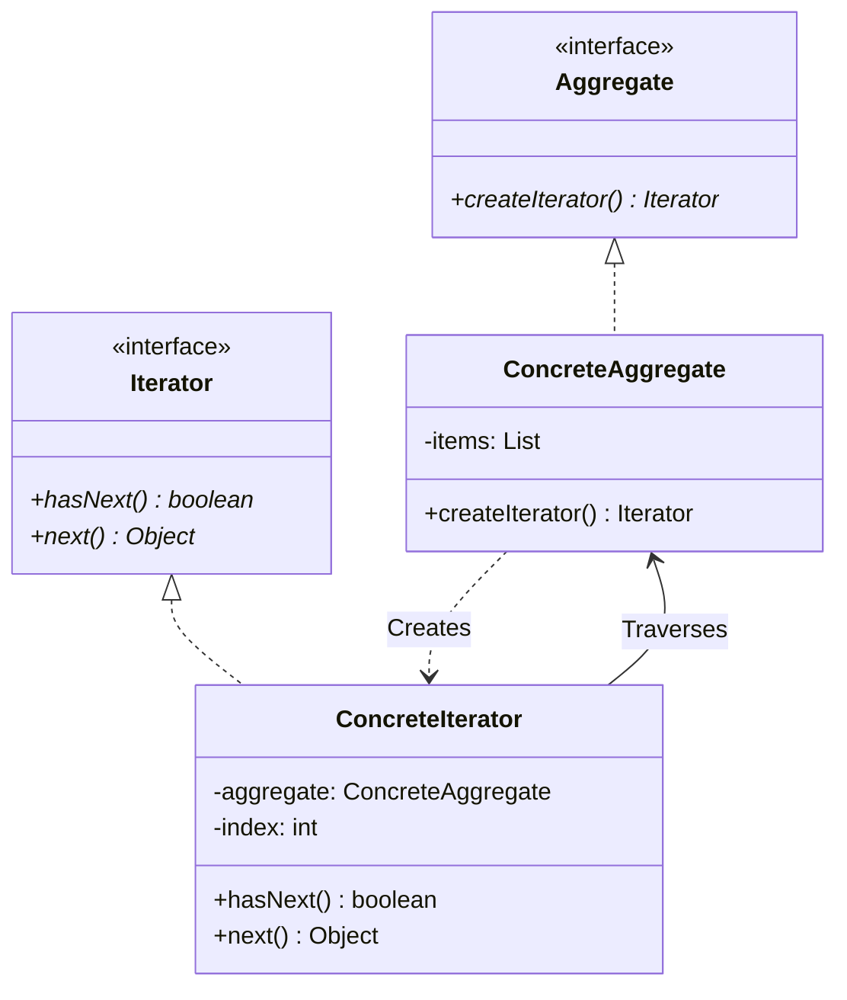
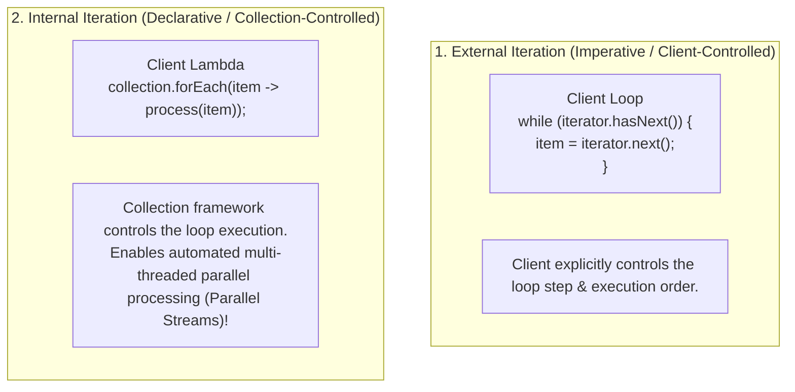
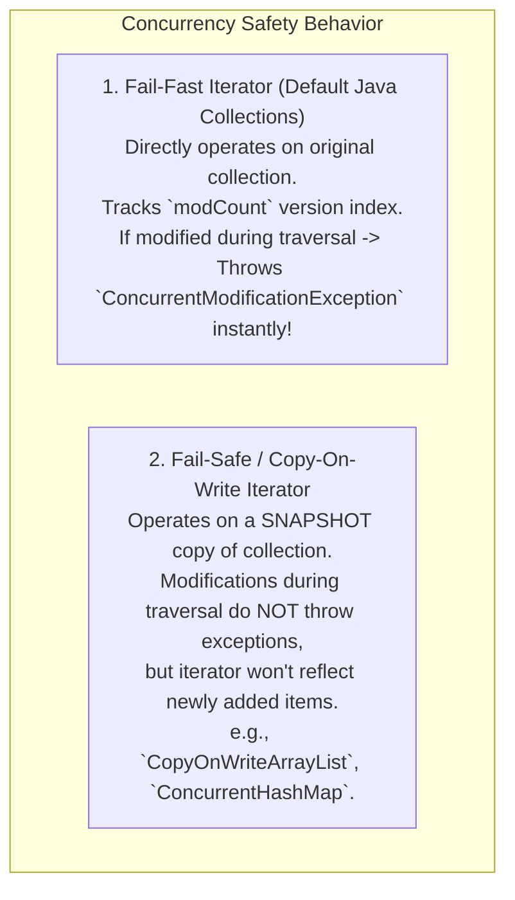

# Iterator Pattern — Custom Collections, External vs. Internal Iteration

## Mental Model

Think of the **Iterator Pattern** as a DVR remote control's `Next Episode` button. 

You are watching a multi-season TV show. The underlying storage structure could be a contiguous disk array, a linked list of cloud video streams, or a complex tree of episode clips (**Collection Storage Details**). 

The `Next Episode` button (**The Iterator**) exposes a simple, uniform interface: `hasNext()` and `next()`. You step through episodes sequentially without knowing or caring how the underlying collection is stored in memory, nor do you expose the raw internal array pointers of the streaming platform.

---

## 1. Intent & Structural Definition

The **Iterator Pattern** provides a way to access the elements of an aggregate object sequentially without exposing its underlying representation.



### Key Intent & Constraints
1. **Encapsulate Traversal:** Hide complex collection internal data structures (Arrays, Trees, Graphs, Hash Tables) behind a standard traversal interface.
2. **Polymorphic Traversal:** Allow client code to traverse different collection structures using identical `while (iterator.hasNext())` loops.
3. **Multiple Concurrent Traversals:** Allow multiple independent iterators to traverse the same collection simultaneously, each tracking its own position index.

---

## 2. External Iteration vs. Internal Iteration

With the introduction of Functional Programming in modern OOP languages (Java 8 Streams, C# LINQ, JavaScript `Array.prototype.forEach`), iteration is divided into **External** and **Internal** models:



### Comparative Analysis Matrix

| Feature | External Iteration (`Iterator<T>`) | Internal Iteration (`Stream<T> / forEach`) |
|---|---|---|
| **Control Authority** | **Client Code** controls step-by-step traversal. | **Collection Framework** controls execution. |
| **Programming Paradigm** | Imperative (`for`, `while` loops). | Declarative / Functional (Lambdas). |
| **Early Termination** | Easy (Call `break` or `return`). | Complex (Requires short-circuit operations like `takeWhile`). |
| **Parallel Execution** | Hard (Requires manual thread synchronization). | **Trivial** (`collection.parallelStream().forEach(...)`). |

---

## 3. Production Code Implementation: Custom Binary Search Tree Iterator

### Scenario:
Implement a custom `BinarySearchTree` collection with a thread-safe, in-order traversal `Iterator` (LDR: Left, Driver, Right), returning values in sorted order.

```java
// ============================================================================
// 1. ITERATOR INTERFACE
// ============================================================================
public interface CustomIterator<T> {
    boolean hasNext();
    T next();
}

// ============================================================================
// 2. AGGREGATE INTERFACE
// ============================================================================
public interface CustomIterable<T> {
    CustomIterator<T> createIterator();
}

// ============================================================================
// 3. CONCRETE AGGREGATE: Binary Search Tree
// ============================================================================
public class BinarySearchTree<T extends Comparable<T>> implements CustomIterable<T> {
    
    // Internal Node Structure (Hidden from Client!)
    public static class Node<T> {
        public T data;
        public Node<T> left;
        public Node<T> right;

        public Node(T data) { this.data = data; }
    }

    private Node<T> root;

    public void insert(T data) {
        root = insertRecursive(root, data);
    }

    private Node<T> insertRecursive(Node<T> current, T data) {
        if (current == null) return new Node<>(data);
        if (data.compareTo(current.data) < 0) current.left = insertRecursive(current.left, data);
        else if (data.compareTo(current.data) > 0) current.right = insertRecursive(current.right, data);
        return current;
    }

    @Override
    public CustomIterator<T> createIterator() {
        return new InOrderBstIterator<>(root); // Factory Method returning Iterator
    }

    // ============================================================================
    // 4. PRIVATE CONCRETE ITERATOR (In-Order BST Traversal using Stack)
    // ============================================================================
    private static class InOrderBstIterator<T> implements CustomIterator<T> {
        private final Deque<Node<T>> stack = new ArrayDeque<>();

        public InOrderBstIterator(Node<T> root) {
            pushLeftmostNodes(root);
        }

        private void pushLeftmostNodes(Node<T> node) {
            while (node != null) {
                stack.push(node);
                node = node.left;
            }
        }

        @Override
        public boolean hasNext() {
            return !stack.isEmpty();
        }

        @Override
        public T next() {
            if (!hasNext()) {
                throw new NoSuchElementException("No more elements in BST traversal!");
            }

            Node<T> current = stack.pop();
            T result = current.data;

            // If right subtree exists, push its leftmost nodes!
            if (current.right != null) {
                pushLeftmostNodes(current.right);
            }

            return result; // Returns elements in SORTED ASCENDING ORDER!
        }
    }
}

// ============================================================================
// 5. CLIENT EXECUTION
// ============================================================================
public class Main {
    public static void main(String[] args) {
        BinarySearchTree<Integer> bst = new BinarySearchTree<>();
        bst.insert(50);
        bst.insert(30);
        bst.insert(70);
        bst.insert(20);
        bst.insert(40);

        // Client Traverses BST without knowing internal Node/Pointer mechanics!
        CustomIterator<Integer> iterator = bst.createIterator();

        System.out.println("BST In-Order Sorted Traversal:");
        while (iterator.hasNext()) {
            System.out.print(iterator.next() + " "); // Output: 20 30 40 50 70
        }
    }
}
```

---

## 4. Fail-Fast vs. Fail-Safe Iterators

In multi-threaded environments, modifying a collection while an iterator is actively traversing it causes race conditions.



---

## 5. Failure Modes and Trade-offs

1. **`ConcurrentModificationException` Crash** — Modifying a collection (`list.add()`) directly inside a `for (Item i : list)` loop. *Mitigation*: Use `iterator.remove()` instead of `list.remove()`, or use `CopyOnWriteArrayList`.
2. **Leaky Memory in Custom Iterators** — Storing strong references to traversed nodes inside a long-lived Iterator object, preventing Garbage Collection of consumed elements. *Mitigation*: Null out node references in `next()` after advancing.
3. **Double `next()` Invocation Error** — Calling `iterator.next()` inside an `if` condition and calling it *again* inside the loop body, advancing the iterator twice per step and causing index out-of-bounds errors.

---

## 6. Active-Recall Prompts

1. **What is the primary intent of the Iterator Pattern, and how does it encapsulate collection representation?**
2. **Compare External Iteration (`while (iterator.hasNext())`) vs. Internal Iteration (`stream().forEach()`).**
3. **What is the difference between a Fail-Fast iterator and a Fail-Safe (Copy-On-Write) iterator?**
4. **How does an In-Order BST iterator use an explicit stack to traverse a tree non-recursively?**

---

## Related Notes

- [[Composite Pattern - Tree Structures, Uniformity vs Type Safety]]
- [[Visitor Pattern - Double Dispatch and Operations over Heterogeneous Trees]]
- [[Factory Method Pattern - Virtual Constructors and Extensible Object Creation]]
- [[Abstraction and Interface-Driven Design]]

> **Interview Style Question:** *"Design a custom thread-safe `GraphIterator` in Java/TypeScript that executes Breadth-First Search (BFS) over a directed web-crawler page graph. Demonstrate how you handle cyclic page links (`Page A -> Page B -> Page A`), implement `hasNext()` and `next()`, and explain how Java's `ConcurrentModificationException` operates via `modCount` version tracking."*

---
