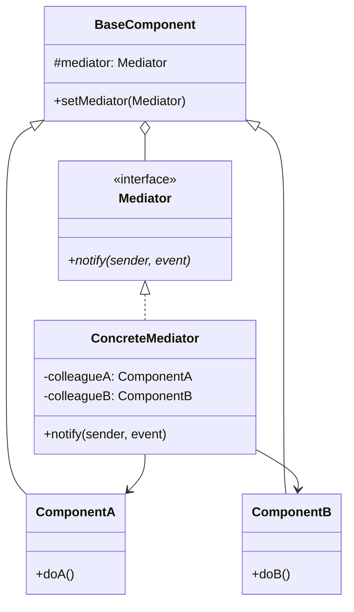
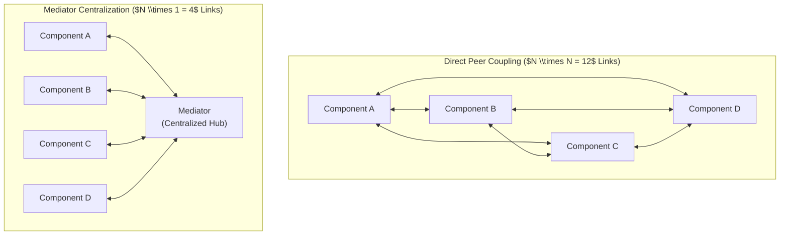
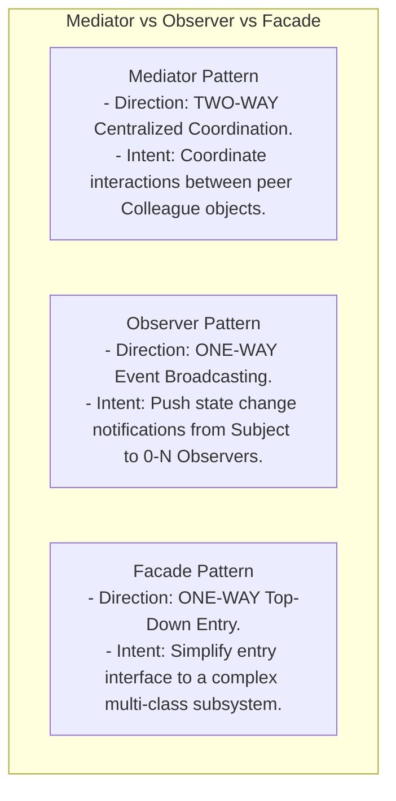

# Mediator Pattern — Decoupling Peer Communication and Centralized Coordination

## Mental Model

Think of the **Mediator Pattern** as an Airport Air Traffic Control (ATC) tower. 

If 50 commercial airplanes flying near an airport tried to communicate directly with each other via radio to coordinate landings (**$N \times N$ Direct Coupling Matrix**), every pilot would need 49 open radio channels to negotiate landing orders, speed adjustments, and runway access with every other plane simultaneously. The communication web would collapse into chaos. 

Instead, every airplane communicates **only** with the central ATC Tower (**The Mediator**). The ATC Tower receives telemetry from all planes, coordinates runway schedules centrally, and issues direct landing orders back to individual planes. The airplanes (**Colleague Objects**) are completely decoupled from each other.

---

## 1. Intent & Structural Definition

The **Mediator Pattern** defines an object that encapsulates how a set of objects interact. Mediator promotes loose coupling by keeping objects from referring to each other explicitly, and it lets you vary their interaction independently.



### Key Intent & Constraints
1. **Eliminate $N \times N$ Connections:** Replace a chaotic web of $N \times N$ direct object-to-object dependencies with an organized $N \times 1$ star-topology relationship.
2. **Centralize Complex Control Logic:** Move interaction workflow logic out of colleague objects into a dedicated Mediator class.
3. **Enhance Reusability:** Colleague components become simpler and highly reusable because they do not contain hardcoded references to peer components.

---

## 2. Reducing $N \times N$ Mesh Complexity to $N \times 1$ Star Topology



---

## 3. Production Code Implementation: UI Dialog Box Coordinator

### Scenario:
A complex User Registration Dialog containing a `Checkbox` ("Is Organization Account?"), a `TextField` ("Tax ID"), a `Button` ("Submit"), and a `Label` ("Help Message"). When the checkbox is toggled, the Tax ID field must enable/disable and the submit button validation state must update dynamically.

```java
// ============================================================================
// 1. MEDIATOR INTERFACE
// ============================================================================
public interface DialogMediator {
    void notify(Component sender, String event);
}

// ============================================================================
// 2. BASE COLLEAGUE COMPONENT
// ============================================================================
public abstract class Component {
    protected DialogMediator mediator;

    public void setMediator(DialogMediator mediator) {
        this.mediator = mediator;
    }

    // Triggers notification to Mediator when internal state changes
    public void changed(String event) {
        if (mediator != null) {
            mediator.notify(this, event);
        }
    }
}

// ============================================================================
// 3. CONCRETE COLLEAGUES (Completely Decoupled from Peer UI Components!)
// ============================================================================
public class Checkbox extends Component {
    private boolean checked = false;

    public void setChecked(boolean checked) {
        this.checked = checked;
        System.out.println("UI Checkbox: Checked state set to " + checked);
        changed("CHECKBOX_TOGGLED"); // Notify Mediator!
    }

    public boolean isChecked() { return checked; }
}

public class TextField extends Component {
    private boolean enabled = true;
    private String text = "";

    public void setEnabled(boolean enabled) {
        this.enabled = enabled;
        System.out.println("UI TextField: Enabled set to " + enabled);
    }

    public void setText(String text) {
        this.text = text;
        changed("TEXT_CHANGED"); // Notify Mediator!
    }

    public boolean isEnabled() { return enabled; }
    public String getText() { return text; }
}

public class Button extends Component {
    private boolean enabled = false;

    public void setEnabled(boolean enabled) {
        this.enabled = enabled;
        System.out.println("UI Button: Enabled set to " + enabled);
    }
}

// ============================================================================
// 4. CONCRETE MEDIATOR (Coordinates All UI Interactions Centrally!)
// ============================================================================
public class RegistrationDialogMediator implements DialogMediator {
    private final Checkbox orgCheckbox;
    private final TextField taxIdField;
    private final Button submitButton;

    public RegistrationDialogMediator(Checkbox orgCheckbox, TextField taxIdField, Button submitButton) {
        this.orgCheckbox = orgCheckbox;
        this.taxIdField = taxIdField;
        this.submitButton = submitButton;

        // Register Mediator pointer with all Colleagues
        this.orgCheckbox.setMediator(this);
        this.taxIdField.setMediator(this);
        this.submitButton.setMediator(this);
    }

    // CENTRALIZED WORKFLOW & STATE COORDINATION LOGIC
    @Override
    public void notify(Component sender, String event) {
        if (event.equals("CHECKBOX_TOGGLED")) {
            if (orgCheckbox.isChecked()) {
                taxIdField.setEnabled(true);
                submitButton.setEnabled(!taxIdField.getText().isEmpty());
            } else {
                taxIdField.setEnabled(false);
                submitButton.setEnabled(true); // Individual accounts don't need Tax ID
            }
        } else if (event.equals("TEXT_CHANGED")) {
            if (orgCheckbox.isChecked()) {
                submitButton.setEnabled(!taxIdField.getText().isEmpty());
            }
        }
    }
}

// ============================================================================
// 5. CLIENT EXECUTION
// ============================================================================
public class Main {
    public static void main(String[] args) {
        Checkbox checkbox = new Checkbox();
        TextField taxId = new TextField();
        Button submit = new Button();

        // Instantiate Mediator to bind all UI components together
        new RegistrationDialogMediator(checkbox, taxId, submit);

        System.out.println("--- Action 1: User Checks 'Organization' ---");
        checkbox.setChecked(true); // TaxId enabled, Submit disabled (Tax ID empty)

        System.out.println("\n--- Action 2: User Types Tax ID ---");
        taxId.setText("TAX-9988-77"); // Submit enabled!
    }
}
```

---

## 4. Mediator vs. Observer vs. Facade

These three patterns are frequently compared in system architecture:



### Pattern Comparison Matrix

| Pattern | Communication Direction | Coupling Focus | Primary Architectural Goal |
|---|---|---|---|
| **Mediator** | **Two-Way (Peer-to-Mediator-to-Peer)** | Dynamic Peer Communication | Replace $N \times N$ mesh with $N \times 1$ star topology. |
| **Observer** | **One-Way (Subject $\to$ Observers)** | Event Subscription | Notify interested listeners of state changes. |
| **Facade** | **One-Way (Client $\to$ Subsystems)** | Subsystem Abstraction | Provide a simplified entry point to a subsystem. |

---

## 5. Failure Modes and Trade-offs

1. **God Mediator Anti-Pattern** — Concentrating too much application logic inside the Mediator class. Over time, the Mediator swells into a 10,000-line monolithic "God Object" that is impossible to maintain. *Mitigation*: Delegate domain logic to specialized business objects; keep the Mediator focused strictly on **workflow routing**.
2. **Infinite Notification Loops** — Component A notifies Mediator $\to$ Mediator notifies Component B $\to$ Component B triggers an event that notifies Mediator $\to$ Mediator notifies Component A. Result: `StackOverflowError`. *Mitigation*: Suppress notification events during programmatic state updates or use recursion guards.
3. **Hardcoded Mediator Dependencies** — Tight coupling between Colleagues and a concrete Mediator implementation instead of an abstract `Mediator` interface.

---

## 6. Active-Recall Prompts

1. **What is the primary intent of the Mediator Pattern, and how does it reduce $N \times N$ mesh connections to an $N \times 1$ star topology?**
2. **Compare Mediator vs. Observer vs. Facade across communication direction and primary architectural focus.**
3. **What is the "God Mediator" anti-pattern, and how do you prevent a Mediator from becoming an unmaintainable monolith?**
4. **How does the Mediator pattern enhance the reusability of Colleague objects like UI components?**

---

## Related Notes

- [[Observer Pattern - Event Buses, Publish-Subscribe, and Reactive Streams]]
- [[Facade Pattern - Simplifying Subsystem Interfaces and Boundary Layering]]
- [[Command Pattern - Encapsulating Requests, Undo-Redo, and Macro Commands]]
- [[Single Responsibility Principle - SRP and Cohesion]]

> **Interview Style Question:** *"You are designing an Air Traffic Control (ATC) simulator where 100 Aircraft objects must coordinate altitude holds, runway landings, and taxiways. Demonstrate how direct aircraft-to-aircraft communication leads to an $N \times N$ coupling disaster, write the complete Mediator pattern in Java/TypeScript with an `AirTrafficControlMediator`, and show how you prevent infinite notification loops during emergency landing overrides."*

---
