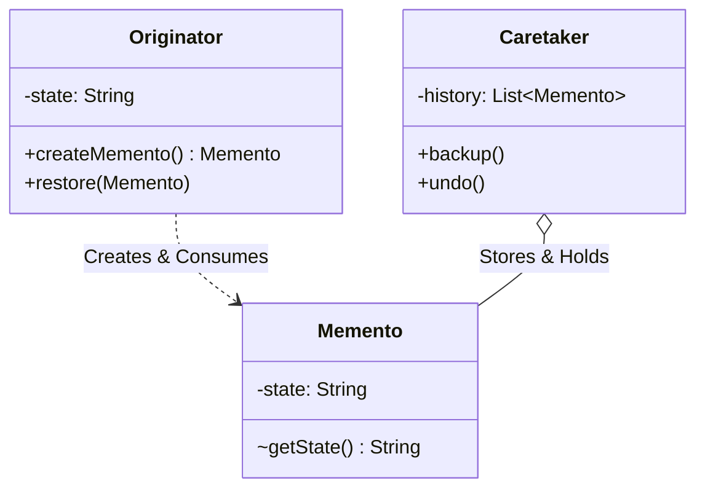
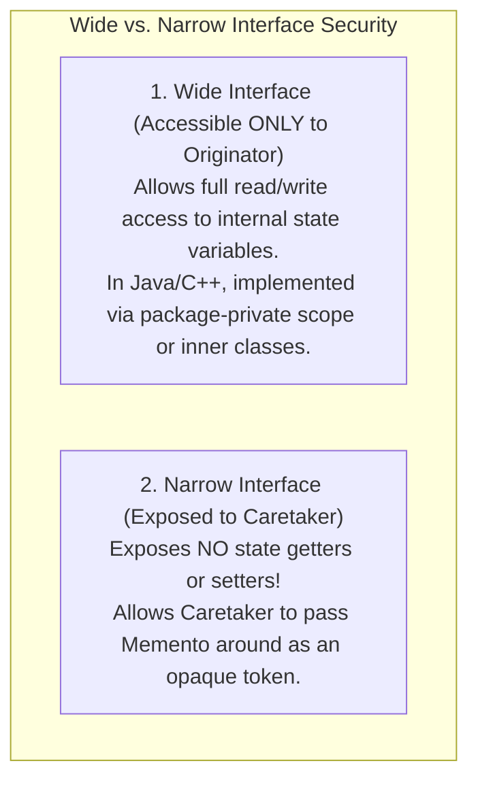
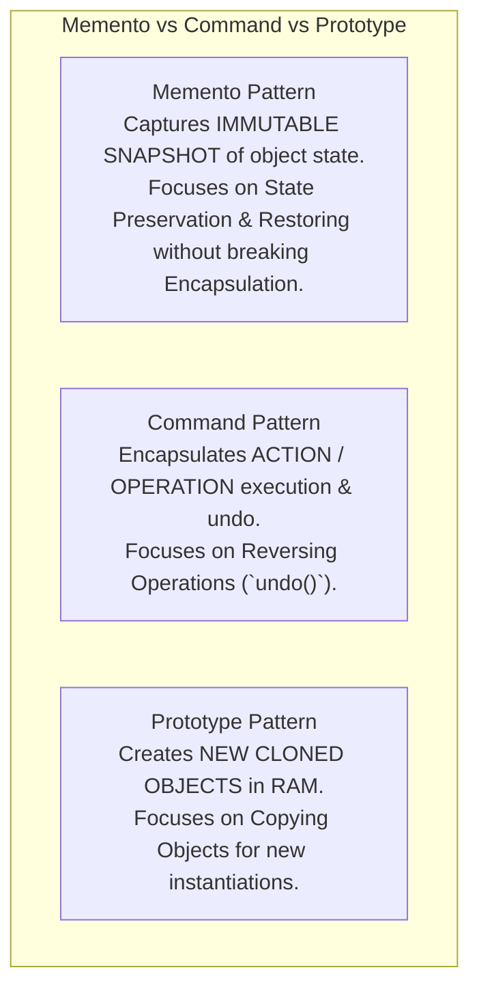

# Memento Pattern — Capturing and Restoring State without Violating Encapsulation

## Mental Model

Think of the **Memento Pattern** as a save point in a video game (e.g., saving before entering a boss battle). 

Your game character's internal state contains dozens of private fields: `health`, `mana`, `inventoryList`, `spellCooldowns`, `positionCoordinates` (**Originator State**). When you save the game, the engine generates an encrypted save file payload (**The Memento Object**). 

The game save file is handed to your hard drive storage manager (**The Caretaker**). The Caretaker holds the save file payload, but **cannot view or modify the private internal fields inside the save file** (**Strict Encapsulation Preservation**). When your character dies, the Caretaker hands the save file back to the game engine, which restores your character to its exact previous state.

---

## 1. Intent & Structural Definition

The **Memento Pattern** without violating encapsulation, captures and externalizes an object's internal state so that the object can be restored to this state later.



### Key Roles & Responsibilities

| Role | Object Name | Primary Responsibility |
|---|---|---|
| **Originator** | `TextEditor`, `GameEngine` | The stateful domain object that creates mementos of its current state and consumes mementos to restore state. |
| **Memento** | `EditorMemento`, `SaveState` | The immutable value object representing a state snapshot. Its internal state is accessible **ONLY to the Originator**. |
| **Caretaker** | `HistoryStack`, `SaveFileManager` | Stores and manages the history of Mementos. It **NEVER inspects or alters** the contents of a Memento. |

---

## 2. Preserving Encapsulation (Wide vs. Narrow Interfaces)

The core technical challenge of the Memento pattern is preventing external caretaker objects from inspecting or mutating the private fields stored inside a Memento.



---

## 3. Production Code Implementation: Text Editor State Snapshot Engine

```java
// ============================================================================
// 1. MEMENTO (Immutable State Snapshot with Package-Private Wide Interface)
// ============================================================================
public final class EditorMemento {
    // Private state fields
    private final String content;
    private final int cursorX;
    private final int cursorY;

    // Package-Private Constructor: ONLY Originator in same package can instantiate!
    /* package-private */ EditorMemento(String content, int cursorX, int cursorY) {
        this.content = content;
        this.cursorX = cursorX;
        this.cursorY = cursorY;
    }

    // Package-Private Getters: ONLY Originator can read internal state!
    /* package-private */ String getContent() { return content; }
    /* package-private */ int getCursorX() { return cursorX; }
    /* package-private */ int getCursorY() { return cursorY; }
}

// ============================================================================
// 2. ORIGINATOR (Stateful Domain Object)
// ============================================================================
public class TextEditor {
    private String content = "";
    private int cursorX = 0;
    private int cursorY = 0;

    public void type(String text) {
        this.content += text;
        this.cursorX += text.length();
    }

    public void setCursor(int x, int y) {
        this.cursorX = x;
        this.cursorY = y;
    }

    // CREATES MEMENTO SNAPSHOT
    public EditorMemento save() {
        return new EditorMemento(content, cursorX, cursorY);
    }

    // RESTORES STATE FROM MEMENTO SNAPSHOT
    public void restore(EditorMemento memento) {
        if (memento != null) {
            this.content = memento.getContent();
            this.cursorX = memento.getCursorX();
            this.cursorY = memento.getCursorY();
        }
    }

    public void printStatus() {
        System.out.println("Editor Content: '" + content + "' | Cursor: (" + cursorX + ", " + cursorY + ")");
    }
}

// ============================================================================
// 3. CARETAKER (Manages History Stack without inspecting Memento internals!)
// ============================================================================
public class HistoryCaretaker {
    private final Deque<EditorMemento> history = new ArrayDeque<>();
    private final TextEditor editor;

    public HistoryCaretaker(TextEditor editor) {
        this.editor = editor;
    }

    public void backup() {
        System.out.println("Caretaker: Saving editor state snapshot...");
        history.push(editor.save()); // Store opaque memento
    }

    public void undo() {
        if (history.isEmpty()) {
            System.out.println("Caretaker: No states to undo!");
            return;
        }
        EditorMemento memento = history.pop();
        System.out.println("Caretaker: Restoring editor state snapshot...");
        editor.restore(memento); // Pass opaque memento back to Originator
    }
}

// ============================================================================
// 4. CLIENT EXECUTION
// ============================================================================
public class Main {
    public static void main(String[] args) {
        TextEditor editor = new TextEditor();
        HistoryCaretaker caretaker = new HistoryCaretaker(editor);

        // Step 1: Type initial text
        editor.type("First Sentence. ");
        editor.setCursor(15, 0);
        editor.printStatus();
        caretaker.backup(); // Save Point 1

        // Step 2: Type second text
        editor.type("Second Sentence. ");
        editor.printStatus();
        caretaker.backup(); // Save Point 2

        // Step 3: Type unwanted text
        editor.type("CORRUPTED DISK PAYLOAD!");
        editor.printStatus();

        System.out.println("\n--- Executing Undo 1 ---");
        caretaker.undo();
        editor.printStatus(); // Restored to Save Point 2!

        System.out.println("\n--- Executing Undo 2 ---");
        caretaker.undo();
        editor.printStatus(); // Restored to Save Point 1!
    }
}
```

---

## 4. Memento vs. Command vs. Prototype



---

## 5. Failure Modes and Trade-offs

1. **RAM Inflation from Large Snapshots** — Creating a 10MB state snapshot in Memento every 2 seconds in a high-frequency loop consumes gigabytes of RAM. *Mitigation*: Store **Delta Differences** (incremental state changes) instead of full state snapshots, or limit caretaker history depth.
2. **Encapsulation Leakage via Public Getters** — Making Memento fields `public` with standard getters/setters. Caretaker code starts reading or modifying Memento internal state, breaking encapsulation. *Mitigation*: Restrict Memento getters to `package-private` (Java), `friend` classes (C++), or inner classes.
3. **Orphaned Mementos (Garbage Collector Overhead)** — Storing 10,000 old Mementos inside an unbounded `List<Memento>` inside the Caretaker, causing memory leaks. *Mitigation*: Use a bounded LIFO stack (`ArrayDeque` with max size limit).

---

## 6. Active-Recall Prompts

1. **What is the primary intent of the Memento Pattern, and how does it preserve strict encapsulation?**
2. **Explain the structural roles of the Originator, Memento, and Caretaker.**
3. **What is the difference between a Wide Interface and a Narrow Interface in Memento design?**
4. **How do Memento and Command collaborate to build complete Undo/Redo engines in enterprise applications?**

---

## Related Notes

- [[Encapsulation, Data Hiding, and Information Hiding]]
- [[Command Pattern - Encapsulating Requests, Undo-Redo, and Macro Commands]]
- [[Prototype Pattern - Deep vs Shallow Copying and Prototype Managers]]
- [[State Pattern - Finite State Machines and State-Driven Behavior]]

> **Interview Style Question:** *"Design a state snapshot and recovery engine for a high-concurrency database transaction engine. Demonstrate how the Memento Pattern captures dirty page state without exposing page headers to external loggers, implement package-private wide/narrow interfaces in Java/C++, and explain how you optimize memory when handling 100,000 undo states per second."*

---
