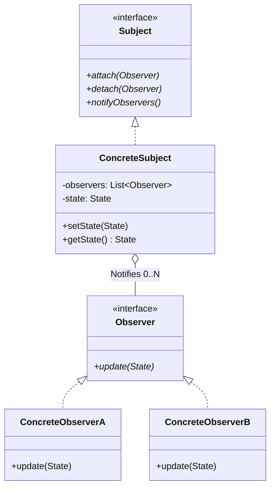
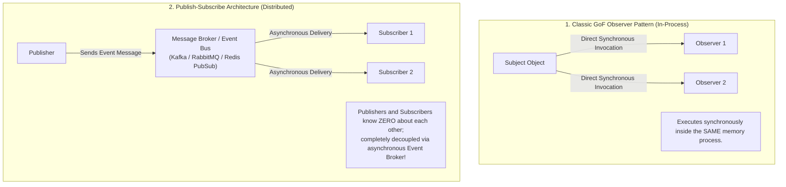

# Observer Pattern — Event Buses, Publish-Subscribe, and Reactive Streams

## Mental Model

Think of the **Observer Pattern** as subscribing to a newspaper or YouTube channel. 

Instead of 100,000 subscribers constantly calling the newspaper printing press every 5 minutes asking: *"Is today's edition published yet?"* (**Polling Anti-Pattern / High CPU Overhead**), subscribers register their email or mailing address once with the publisher (**Registration / Subscription**). 

When a new edition is published, the publisher automatically broadcasts the new edition to all registered subscribers (**Push Notification / Event-Driven Architecture**). Subscribers receive the update instantly, and the publisher remains completely decoupled from individual subscriber behaviors.

---

## 1. Intent & Structural Definition

The **Observer Pattern** defines a one-to-many dependency between objects so that when one object changes state, all its dependents are notified and updated automatically.



### Key Intent & Constraints
1. **One-to-Many Decoupled Broadcasting:** A single publisher (Subject) broadcasts state notifications to 0-N subscribers (Observers) without knowing their concrete classes.
2. **Push vs. Pull Models:** Observers can receive state payloads directly in the notification (`push`), or receive a reference pointer to query the Subject (`pull`).
3. **Dynamic Subscription:** Observers can register (`attach`) or unregister (`detach`) at runtime.

---

## 2. Observer vs. Publish-Subscribe Architecture

While frequently used as synonyms, classic GoF Observer and modern Distributed Pub-Sub differ structurally:



---

## 3. Production Code Implementation: Event Bus Engine

```java
// ============================================================================
// 1. EVENT PAYLOAD DATA OBJECT
// ============================================================================
public final class OrderPlacedEvent {
    private final String orderId;
    private final double amount;
    private final String customerEmail;

    public OrderPlacedEvent(String orderId, double amount, String customerEmail) {
        this.orderId = orderId;
        this.amount = amount;
        this.customerEmail = customerEmail;
    }

    public String getOrderId() { return orderId; }
    public double getAmount() { return amount; }
    public String getCustomerEmail() { return customerEmail; }
}

// ============================================================================
// 2. OBSERVER INTERFACE (EventListener)
// ============================================================================
public interface EventListener<T> {
    void onEvent(T event);
}

// ============================================================================
// 3. SUBJECT / EVENT BUS ENGINE
// ============================================================================
public class EventBus {
    private final Map<Class<?>, List<EventListener<?>>> listeners = new ConcurrentHashMap<>();

    // Subscribe Observer to Event Type
    @SuppressWarnings("unchecked")
    public <T> void subscribe(Class<T> eventType, EventListener<T> listener) {
        listeners.computeIfAbsent(eventType, k -> new CopyOnWriteArrayList<>())
                 .add(listener);
    }

    // Unsubscribe Observer
    public <T> void unsubscribe(Class<T> eventType, EventListener<T> listener) {
        List<EventListener<?>> list = listeners.get(eventType);
        if (list != null) {
            list.remove(listener);
        }
    }

    // Broadcast Event to All Subscribed Observers
    @SuppressWarnings("unchecked")
    public <T> void publish(T event) {
        List<EventListener<?>> list = listeners.get(event.getClass());
        if (list != null) {
            for (EventListener<?> listener : list) {
                ((EventListener<T>) listener).onEvent(event); // Push Model
            }
        }
    }
}

// ============================================================================
// 4. CONCRETE OBSERVERS
// ============================================================================
public class EmailNotificationListener implements EventListener<OrderPlacedEvent> {
    @Override
    public void onEvent(OrderPlacedEvent event) {
        System.out.println("EmailService: Sent receipt email to " + event.getCustomerEmail() + 
                           " for Order #" + event.getOrderId());
    }
}

public class AnalyticsListener implements EventListener<OrderPlacedEvent> {
    @Override
    public void onEvent(OrderPlacedEvent event) {
        System.out.println("AnalyticsService: Tracked revenue event: $" + event.getAmount());
    }
}

// ============================================================================
// 5. CLIENT EXECUTION
// ============================================================================
public class Main {
    public static void main(String[] args) {
        EventBus eventBus = new EventBus();

        EmailNotificationListener emailListener = new EmailNotificationListener();
        AnalyticsListener analyticsListener = new AnalyticsListener();

        // Register Observers with Event Bus
        eventBus.subscribe(OrderPlacedEvent.class, emailListener);
        eventBus.subscribe(OrderPlacedEvent.class, analyticsListener);

        // Publish Event
        System.out.println("--- Publishing OrderPlacedEvent ---");
        OrderPlacedEvent event = new OrderPlacedEvent("ORD-9988", 250.00, "user@example.com");
        eventBus.publish(event); // Both observers receive update!
    }
}
```

---

## 4. Reactive Streams API (Java Flow / RxJava / Project Reactor)

Modern Reactive Streams extend the Observer Pattern to handle asynchronous backpressure streams:

```mermaid
flowchart LR
    Publisher["Reactive Publisher\n(Flow.Publisher)"] -->|1. subscribe(Subscriber)| Subscriber["Reactive Subscriber\n(Flow.Subscriber)"]
    Subscriber -->|2. onSubscribe(Subscription)| Subscription["Subscription\n(Backpressure Control)"]
    Subscriber -->|3. request(N)| Subscription
    Publisher -->|4. onNext(Item)| Subscriber
    Publisher -->|5. onComplete() / onError()| Subscriber
```

### Key Additions in Reactive Observer:
1. **Backpressure (`request(N)`):** Subscriber controls consumption rate, preventing slow consumers from being overwhelmed.
2. **Terminal Signals:** Formal support for `onComplete()` and `onError(Throwable)` completion signals.

---

## 5. Failure Modes and Trade-offs

1. **Lapsed Listener Problem (Memory Leak)** — Registering an observer with a long-lived Subject without ever un-subscribing. The Subject holds a strong reference to the observer, preventing Garbage Collection and causing memory leaks! *Mitigation*: Use `WeakReference` for listener lists or un-subscribe explicitly in lifecycle destruction hooks (`onDestroy()`).
2. **Cascade Exception Corruption** — An observer throws an unhandled `RuntimeException` inside `onEvent()`. The exception bubbles up, terminating the Subject's iteration loop and preventing remaining observers from receiving the event! *Mitigation*: Wrap listener dispatch inside `try-catch` blocks.
3. **Synchronous Thread Blocking** — A Subject calling 50 observers sequentially on the main thread. If one observer performs a 5-second database query, the entire Subject thread stalls. *Mitigation*: Dispatch observer notifications asynchronously using a Thread Pool.

---

## 6. Active-Recall Prompts

1. **What is the primary intent of the Observer Pattern, and how does it replace polling with push notifications?**
2. **Compare Classic GoF Observer (In-Memory) vs. Distributed Publish-Subscribe (Kafka/RabbitMQ Broker).**
3. **What is the Lapsed Listener Problem, and how do `WeakReference` collections prevent memory leaks in event buses?**
4. **How do Reactive Streams (Java Flow API) extend the Observer Pattern to handle backpressure?**

---

## Related Notes

- [[Mediator Pattern - Decoupling Peer Communication and Centralized Coordination]]
- [[State Pattern - Finite State Machines and State-Driven Behavior]]
- [[Producer-Consumer Pattern - Bounded Queues and Condition Variables]]
- [[Single Responsibility Principle - SRP and Cohesion]]

> **Interview Style Question:** *"Design a high-throughput real-time Stock Market Ticker broadcasting stock price changes to 10,000 connected client dashboards. Implement a thread-safe EventBus in Java/TypeScript, demonstrate Push vs. Pull notification models, write code to prevent the Lapsed Listener memory leak using WeakReferences, and explain how Reactive Backpressure prevents slow client dashboards from crashing the server."*

---
