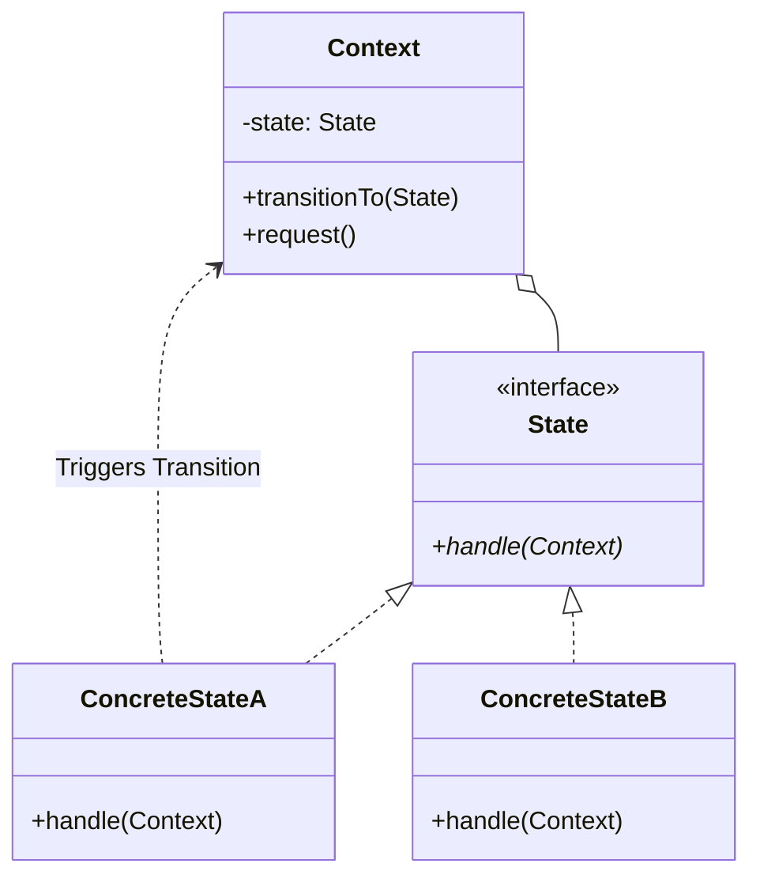
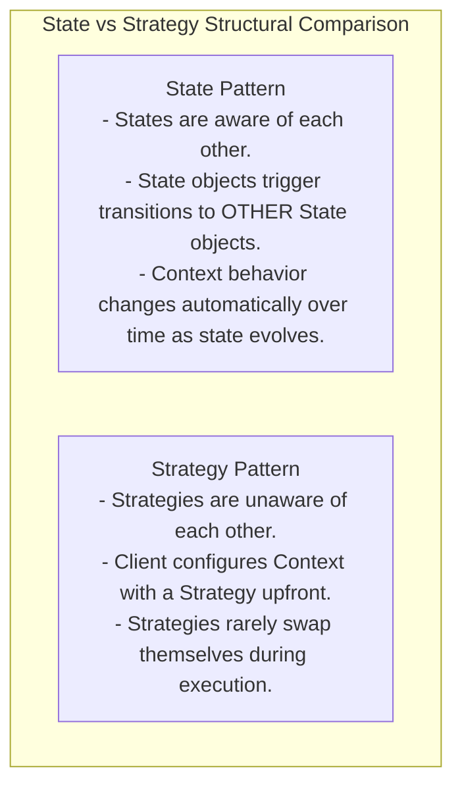
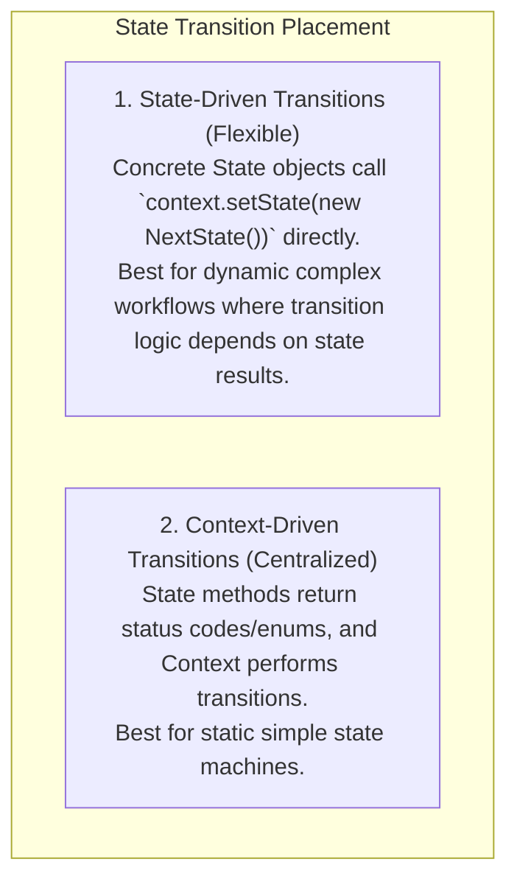

# State Pattern — Finite State Machines and State-Driven Behavior

## Mental Model

Think of the **State Pattern** as a automated Vending Machine or an E-Commerce Order lifecycle (`DRAFT -> PAID -> SHIPPED -> DELIVERED`). 

When a Vending Machine is in the `NoCoinState`, pressing the `Dispense Product` button does nothing except display `"Please insert coin"`. When you insert a quarter, the machine transitions into the `HasCoinState`. Now, pressing the exact same `Dispense Product` button triggers a completely different behavior: releasing the item and transitioning into the `SoldState` (**Dynamic Behavior Polymorphism**). 

Instead of writing massive 500-line `if/else` or `switch` statements checking `if (state == HAS_COIN)` across every single button method, each state is encapsulated in its own standalone state class. The Vending Machine delegates execution to its current state object pointer.

---

## 1. Intent & Structural Definition

The **State Pattern** allows an object to alter its behavior when its internal state changes. The object will appear to change its class.



### Key Intent & Constraints
1. **Encapsulate State Behaviors:** Move state-specific behaviors out of giant conditional blocks into dedicated State classes.
2. **Polymorphic Execution:** The `Context` delegates incoming action calls to the active `State` object via virtual dispatch.
3. **OCP Compliance:** Add new states or transition paths by introducing new `State` classes without modifying existing state handlers.

---

## 2. State vs. Strategy Pattern

The State and Strategy patterns share identical UML class diagrams, but differ fundamentally in intent and state transition control:



### Comparative Analysis Matrix

| Dimension | State Pattern | Strategy Pattern |
|---|---|---|
| **Primary Intent** | Change behavior dynamically as **internal state transitions**. | Select an **interchangeable algorithm or business policy**. |
| **Coupling Between Classes** | State classes often know about and trigger transitions to peer States. | Strategy classes are completely independent and unaware of peers. |
| **Client Interaction** | Client invokes methods on Context; Context transitions states internally. | Client explicitly passes a specific Strategy to Context. |

---

## 3. Production Code Implementation: E-Commerce Order State Machine

```java
// ============================================================================
// 1. CONTEXT CLASS (The Stateful Domain Entity)
// ============================================================================
public class OrderContext {
    private OrderState currentState;
    private final String orderId;

    public OrderContext(String orderId) {
        this.orderId = orderId;
        // Initial State
        this.currentState = new DraftState();
    }

    public void setState(OrderState state) {
        System.out.println("Order [" + orderId + "]: Transitioning from " + 
                           currentState.getClass().getSimpleName() + " -> " + 
                           state.getClass().getSimpleName());
        this.currentState = state;
    }

    // Context methods delegate directly to current active state!
    public void pay() { currentState.pay(this); }
    public void ship() { currentState.ship(this); }
    public void cancel() { currentState.cancel(this); }

    public String getOrderId() { return orderId; }
}

// ============================================================================
// 2. STATE INTERFACE (Defines all valid operations)
// ============================================================================
public interface OrderState {
    void pay(OrderContext context);
    void ship(OrderContext context);
    void cancel(OrderContext context);
}

// ============================================================================
// 3. CONCRETE STATE 1: Draft State
// ============================================================================
public class DraftState implements OrderState {
    @Override
    public void pay(OrderContext context) {
        System.out.println("DraftState: Payment successful.");
        context.setState(new PaidState()); // Trigger Transition!
    }

    @Override
    public void ship(OrderContext context) {
        System.out.println("DraftState: [ERROR] Cannot ship an unpaid draft order!");
    }

    @Override
    public void cancel(OrderContext context) {
        System.out.println("DraftState: Order canceled.");
        context.setState(new CanceledState());
    }
}

// ============================================================================
// 4. CONCRETE STATE 2: Paid State
// ============================================================================
public class PaidState implements OrderState {
    @Override
    public void pay(OrderContext context) {
        System.out.println("PaidState: [ERROR] Order is already paid!");
    }

    @Override
    public void ship(OrderContext context) {
        System.out.println("PaidState: Shipping order package via FedEx.");
        context.setState(new ShippedState()); // Trigger Transition!
    }

    @Override
    public void cancel(OrderContext context) {
        System.out.println("PaidState: Refunding payment and canceling order.");
        context.setState(new CanceledState());
    }
}

// ============================================================================
// 5. CONCRETE STATE 3: Shipped State
// ============================================================================
public class ShippedState implements OrderState {
    @Override
    public void pay(OrderContext context) {
        System.out.println("ShippedState: [ERROR] Order is already paid and shipped!");
    }

    @Override
    public void ship(OrderContext context) {
        System.out.println("ShippedState: [ERROR] Order is already in transit!");
    }

    @Override
    public void cancel(OrderContext context) {
        System.out.println("ShippedState: [ERROR] Cannot cancel an order already in transit!");
    }
}

// ============================================================================
// 6. CONCRETE STATE 4: Canceled Terminal State
// ============================================================================
public class CanceledState implements OrderState {
    @Override public void pay(OrderContext c) { System.out.println("CanceledState: [ERROR] Order is canceled!"); }
    @Override public void ship(OrderContext c) { System.out.println("CanceledState: [ERROR] Order is canceled!"); }
    @Override public void cancel(OrderContext c) { System.out.println("CanceledState: [ERROR] Already canceled!"); }
}

// ============================================================================
// 7. CLIENT EXECUTION
// ============================================================================
public class Main {
    public static void main(String[] args) {
        OrderContext order = new OrderContext("ORD-7744");

        // Attempt 1: Try shipping draft order (Fails!)
        order.ship();

        // Attempt 2: Pay for order (Transitions Draft -> Paid)
        order.pay();

        // Attempt 3: Ship order (Transitions Paid -> Shipped)
        order.ship();

        // Attempt 4: Try canceling shipped order (Fails!)
        order.cancel();
    }
}
```

---

## 4. State Transition Management: Context vs. State Driven

Who should initiate state transitions?



---

## 5. Failure Modes and Trade-offs

1. **State Class Explosion** — Creating 50 separate State classes for a complex machine with 50 states, filling the codebase with single-method boilerplate classes. *Mitigation*: Combine State Pattern with Enum State Machines in Java/C# for simpler FSMs.
2. **Tightly Coupled State Transitions** — ConcreteStateA directly instantiating ConcreteStateB (`new ConcreteStateB()`). Adding a new intermediate state forces modifying ConcreteStateA. *Mitigation*: Pass transition signals or state factories to abstract transition triggers.
3. **Un-handled Invalid State Actions** — Forgetting to define illegal transition behavior in a state class, causing invalid state transitions (e.g., shipping an unpaid order).

---

## 6. Active-Recall Prompts

1. **What is the primary intent of the State Pattern, and how does it replace giant `switch/if-else` blocks?**
2. **Compare the State Pattern vs. the Strategy Pattern across intent and state transition control.**
3. **Differentiate between State-Driven transitions and Context-Driven transitions.**
4. **How does the State Pattern enforce the Open-Closed Principle (OCP) when adding a new state to a lifecycle?**

---

## Related Notes

- [[Strategy Pattern - Algorithmic Interchangeability and Policy Objects]]
- [[Observer Pattern - Event Buses, Publish-Subscribe, and Reactive Streams]]
- [[Command Pattern - Encapsulating Requests, Undo-Redo, and Macro Commands]]
- [[Open-Closed Principle - OCP and Extensibility]]

> **Interview Style Question:** *"Design a Finite State Machine (FSM) for an Automated Teller Machine (ATM) supporting `NoCard`, `HasPin`, `DispensingCash`, and `OutOfCash` states. Implement the complete State Pattern in Java/TypeScript, demonstrate how invalid PIN entries trigger transitions, and compare object-oriented State classes against Java Enum State Machines for performance and memory optimization."*

---
