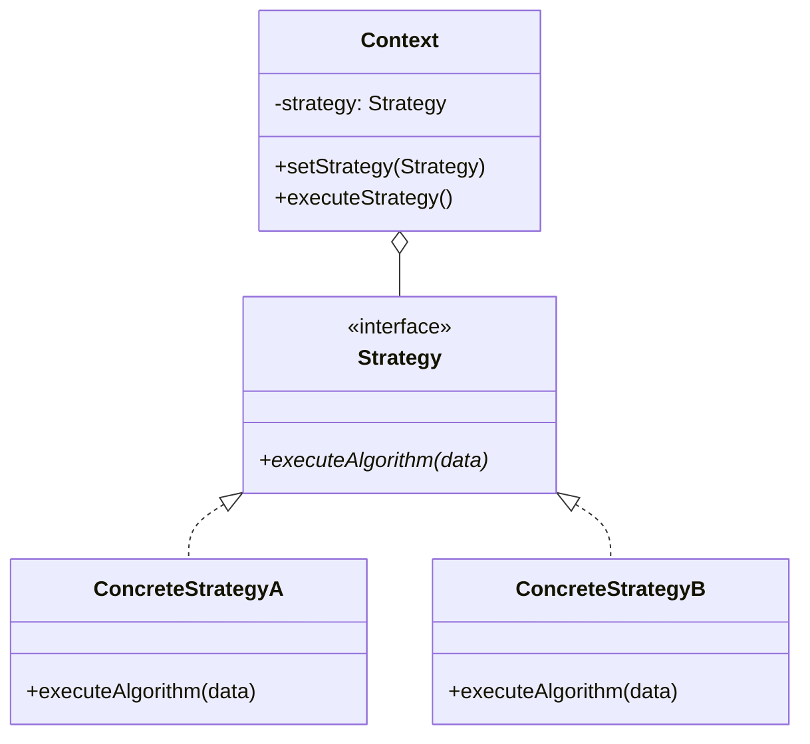
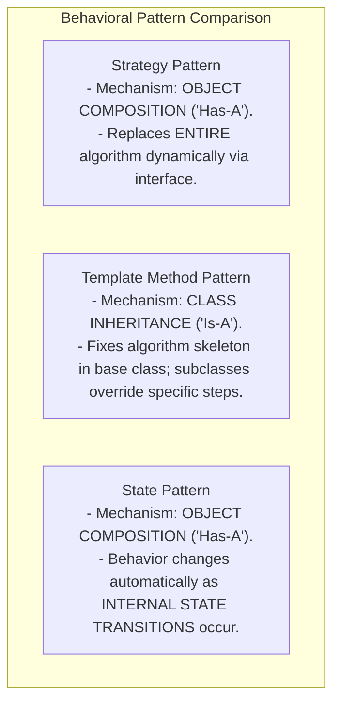

# Strategy Pattern — Algorithmic Interchangeability and Policy Objects

## Mental Model

Think of the **Strategy Pattern** as selecting a route navigation mode on Google Maps. 

You set your destination to the airport. Google Maps presents a unified context screen (`Calculate Route`), but allows you to select your transportation strategy: **Driving**, **Walking**, **Public Transit**, or **Bicycling** (**Interchangeable Algorithms**). 

The core mapping engine does not use a giant 5,000-line `if/else` block checking `if (mode == DRIVING)`. Each transportation mode is encapsulated in its own standalone algorithm class (`DrivingStrategy`, `TransitStrategy`). You can inject or switch strategies dynamically at runtime based on traffic or user preference without altering the core navigation engine.

---

## 1. Intent & Structural Definition

The **Strategy Pattern** defines a family of algorithms, encapsulates each one, and makes them interchangeable. Strategy lets the algorithm vary independently from clients that use it.



### Key Intent & Constraints
1. **Algorithmic Interchangeability:** Encapsulate alternative algorithms (Sorting, Compression, Pricing, Routing) behind a common strategy interface.
2. **Eliminate Conditional Cascades:** Replace growing `if/else` or `switch` statements with polymorphic strategy dispatch.
3. **OCP Compliance:** Add new algorithms by creating a new `Strategy` class without modifying the Context or existing strategy classes.

---

## 2. Production Code Implementation: E-Commerce Pricing & Discount Engine

```java
// ============================================================================
// 1. STRATEGY INTERFACE (Defines the algorithmic contract)
// ============================================================================
public interface DiscountStrategy {
    double applyDiscount(double originalPrice);
}

// ============================================================================
// 2. CONCRETE STRATEGIES (Encapsulate individual business rules)
// ============================================================================

// Strategy A: No Discount
public class NoDiscountStrategy implements DiscountStrategy {
    @Override
    public double applyDiscount(double originalPrice) {
        return originalPrice;
    }
}

// Strategy B: Percentage Discount (e.g., 20% off)
public class PercentageDiscountStrategy implements DiscountStrategy {
    private final double percentage;

    public PercentageDiscountStrategy(double percentage) {
        if (percentage < 0 || percentage > 100) throw new IllegalArgumentException("Invalid percentage");
        this.percentage = percentage;
    }

    @Override
    public double applyDiscount(double originalPrice) {
        return originalPrice * (1.0 - (percentage / 100.0));
    }
}

// Strategy C: Flat Amount Discount (e.g., $15 off if price > $50)
public class FlatAmountDiscountStrategy implements DiscountStrategy {
    private final double discountAmount;

    public FlatAmountDiscountStrategy(double discountAmount) {
        this.discountAmount = discountAmount;
    }

    @Override
    public double applyDiscount(double originalPrice) {
        return Math.max(0.0, originalPrice - discountAmount);
    }
}

// Strategy D: Black Friday Seasonal Special (Complex Dynamic Formula)
public class BlackFridayDiscountStrategy implements DiscountStrategy {
    @Override
    public double applyDiscount(double originalPrice) {
        return originalPrice > 100.0 ? originalPrice * 0.50 : originalPrice * 0.70;
    }
}

// ============================================================================
// 3. CONTEXT CLASS (Uses the Strategy Interface)
// ============================================================================
public class ShoppingCart {
    private double rawTotal = 0.0;
    private DiscountStrategy discountStrategy; // Composition

    public ShoppingCart(DiscountStrategy defaultStrategy) {
        this.discountStrategy = Objects.requireNonNull(defaultStrategy, "Strategy required");
    }

    public void addItem(double price) {
        this.rawTotal += price;
    }

    // Dynamic Strategy Swapping at Runtime!
    public void setDiscountStrategy(DiscountStrategy discountStrategy) {
        this.discountStrategy = Objects.requireNonNull(discountStrategy);
    }

    public double calculateFinalPrice() {
        // Delegates algorithm execution to injected strategy!
        return discountStrategy.applyDiscount(rawTotal);
    }
}

// ============================================================================
// 4. CLIENT EXECUTION
// ============================================================================
public class Main {
    public static void main(String[] args) {
        ShoppingCart cart = new ShoppingCart(new NoDiscountStrategy());
        cart.addItem(100.0);
        cart.addItem(50.0); // Total: $150

        System.out.println("Standard Price (No Discount): $" + cart.calculateFinalPrice()); // $150.00

        // Swap to 20% Percentage Discount Strategy
        cart.setDiscountStrategy(new PercentageDiscountStrategy(20.0));
        System.out.println("20% Off Price:                $" + cart.calculateFinalPrice()); // $120.00

        // Swap to Black Friday Super Sale Strategy
        cart.setDiscountStrategy(new BlackFridayDiscountStrategy());
        System.out.println("Black Friday Sale Price:      $" + cart.calculateFinalPrice()); // $75.00
    }
}
```

---

## 3. Strategy vs. Template Method vs. State



### Pattern Comparison Matrix

| Dimension | Strategy Pattern | Template Method Pattern | State Pattern |
|---|---|---|---|
| **Primary Mechanism** | **Object Composition** (Interface injection). | **Class Inheritance** (Subclass method overriding). | **Object Composition** (Interface injection). |
| **Algorithm Scope** | Replaces **entire algorithm** payload. | Replaces **individual steps** of a fixed algorithm skeleton. | Changes behavior based on **state transitions**. |
| **Binding Time** | Runtime (Dynamic Strategy Swapping). | Compile Time (Fixed via class subclassing). | Runtime (Dynamic State Transitions). |

---

## 4. Modern FP Optimization: Functional Lambdas as Strategies

In modern languages with First-Class Functions (Java 8+, C#, TypeScript, Python), simple strategies do not require dedicated class files!

```java
// Java 8+ Functional Strategy using Lambda Expressions!
ShoppingCart cart = new ShoppingCart(price -> price * 0.85); // 15% Off Lambda Strategy!

// Using Method References as Strategies
List<String> names = Arrays.asList("Charlie", "Alice", "Bob");
names.sort(String::compareToIgnoreCase); // Strategy passed via Method Reference!
```

---

## 5. Failure Modes and Trade-offs

1. **Strategy Proliferation (Over-Abstraction)** — Creating dedicated Strategy class files for 1-line algorithms that never change. Result: Polluting project directory with 30 micro-classes. *Mitigation*: Use Lambda functions or Method References for simple strategies.
2. **Context Parameter Bloat** — Passing massive `Context` state objects into `strategy.execute(context)` methods, exposing internal context fields to strategy implementations (**Violates Encapsulation**). *Mitigation*: Pass only the specific arguments the strategy algorithm actually needs.
3. **Client Strategy Awareness Burden** — Forcing client code to know the intricate internal differences between 15 concrete strategy classes in order to pick the right one. *Mitigation*: Combine Strategy Pattern with a **Factory Method** (`DiscountFactory.getStrategyForUser(user)`).

---

## 6. Active-Recall Prompts

1. **What is the primary intent of the Strategy Pattern, and how does it enforce the Open-Closed Principle (OCP)?**
2. **Compare Strategy vs. Template Method across Composition vs. Inheritance and Binding Time.**
3. **How do Functional Lambdas and Method References simplify the Strategy Pattern in modern OOP languages?**
4. **How do you prevent Context Parameter Bloat when passing data to a strategy algorithm?**

---

## Related Notes

- [[Template Method Pattern - Inversion of Control and Hook Methods]]
- [[State Pattern - Finite State Machines and State-Driven Behavior]]
- [[Open-Closed Principle - OCP and Extensibility]]
- [[Factory Method Pattern - Virtual Constructors and Extensible Object Creation]]

> **Interview Style Question:** *"Design a high-performance Financial Trading Engine supporting 5 execution strategies (Market Order, Limit Order, VWAP, TWAP, Iceberg Order). Write the complete Strategy pattern in Java/TypeScript, demonstrate how strategies are selected at runtime via Dependency Injection, compare Object Composition Strategies against Java 8 Lambdas, and show how you combine Strategy with Factory Method."*

---
