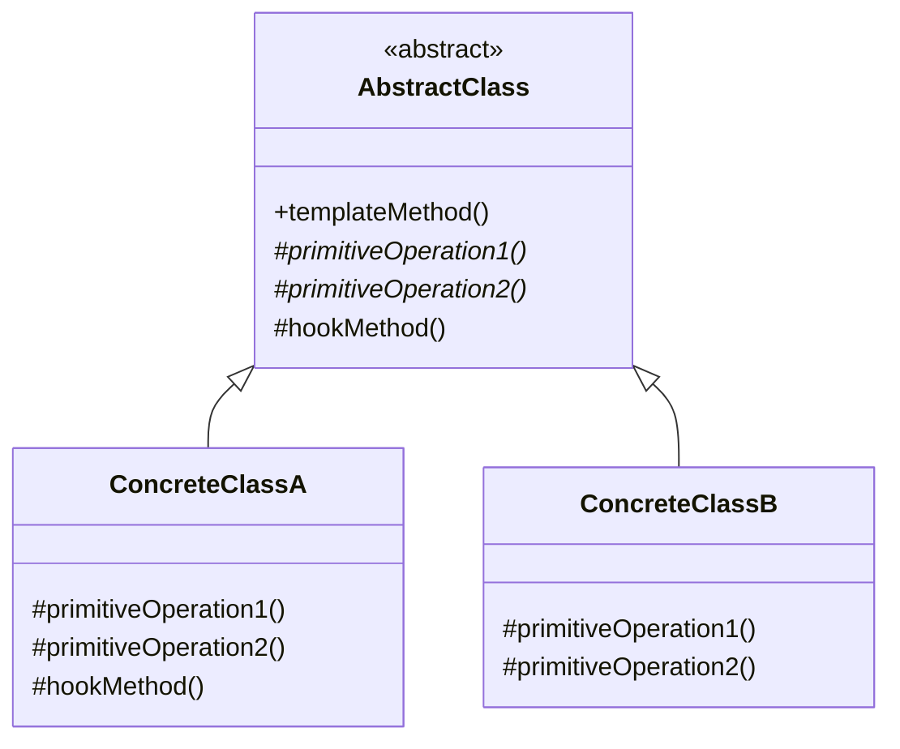
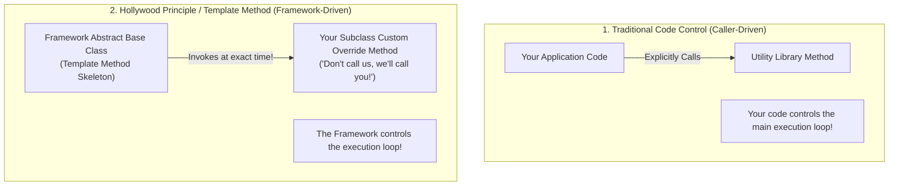
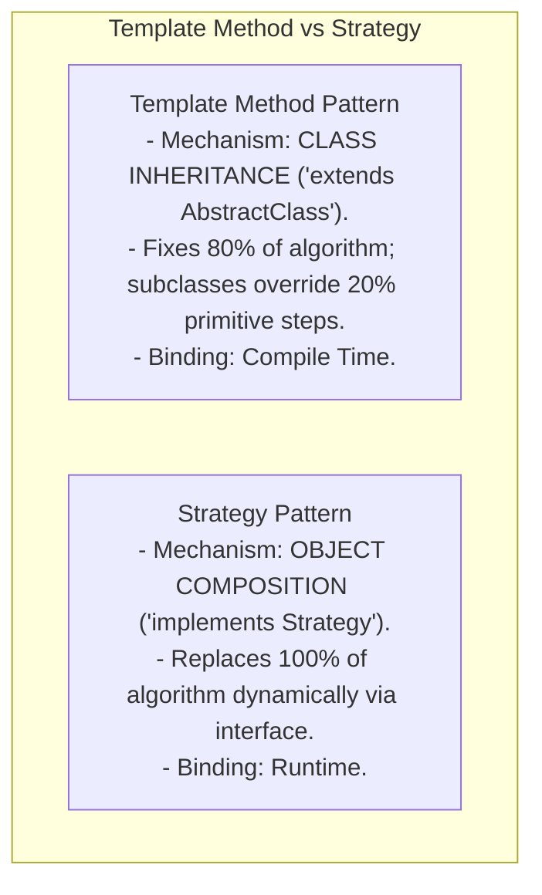

# Template Method Pattern — Inversion of Control and Hook Methods

## Mental Model

Think of the **Template Method Pattern** as a pre-printed government tax return form or a home baking mix box. 

The tax form defines a fixed, immutable sequence of steps: `"1. Enter Income -> 2. Subtract Standard Deduction -> 3. Calculate Tax -> 4. Sign Form"` (**The Invariant Template Skeleton**). 

You cannot alter step 2 or skip step 4 (**Closed for Algorithm Modification**). However, the form leaves blank boxes for you to fill in your specific numbers (**Primitive Abstract Steps**) and provides optional checkbox sections for optional deductions (**Hook Methods**). The framework controls the execution flow, invoking your custom numbers at the exact mandated time (**Hollywood Principle: "Don't call us, we'll call you"**).

---

## 1. Intent & Structural Definition

The **Template Method Pattern** defines the skeleton of an algorithm in an operation, deferring some steps to subclasses. Template Method lets subclasses redefine certain steps of an algorithm without changing the algorithm's structure.



### Key Intent & Constraints
1. **Fix Invariant Algorithm Steps:** Define the high-level algorithm sequence once in a `final` template method in an abstract base class.
2. **Defer Variant Steps to Subclasses:** Declare abstract primitive operations (`abstract void parseData()`) that subclasses must implement.
3. **Hook Methods for Optional Extension:** Provide default or empty implementation methods (`protected boolean shouldLog() { return true; }`) that subclasses can optionally override to alter flow.

---

## 2. The Hollywood Principle: "Don't Call Us, We'll Call You"

The Template Method Pattern is the classic low-level OOP demonstration of **Inversion of Control (IoC)**, governed by the **Hollywood Principle**:



---

## 3. Production Code Implementation: Data Mining ETL Pipeline

### Scenario:
An enterprise ETL (Extract, Transform, Load) pipeline processing different data sources (PDF files, CSV files, Database queries). The overall workflow sequence is fixed: `Open File -> Extract Raw Data -> Transform Data -> Analyze -> Close File`.

```java
// ============================================================================
// 1. ABSTRACT CLASS (Defines Invariant Template Skeleton + Primitive Steps)
// ============================================================================
public abstract class DataMinerETL {

    // THE TEMPLATE METHOD (Marked 'final' so subclasses CANNOT alter algorithm structure!)
    public final void mineData(String filePath) {
        openFile(filePath);
        String rawData = extractData();
        String transformedData = transformData(rawData);
        analyzeData(transformedData);
        
        // HOOK METHOD EVALUATION
        if (shouldSendEmailReport()) {
            sendEmailReport(transformedData);
        }

        closeFile();
    }

    // Fixed Concrete Steps (Common to all subclasses)
    private void openFile(String filePath) {
        System.out.println("ETL: Opening file connection: " + filePath);
    }

    private void closeFile() {
        System.out.println("ETL: Closing file connection.");
    }

    private void analyzeData(String data) {
        System.out.println("ETL: Analyzing payload statistics: " + data.length() + " bytes");
    }

    // Primitive Abstract Operations (MUST be implemented by concrete subclasses!)
    protected abstract String extractData();
    protected abstract String transformData(String rawData);

    // HOOK METHOD (Optional extension point with default behavior)
    protected boolean shouldSendEmailReport() {
        return false; // Default: Do not send email
    }

    protected void sendEmailReport(String data) {
        System.out.println("ETL: Sending email report with data analysis...");
    }
}

// ============================================================================
// 2. CONCRETE SUBCLASS 1: CSV Data Miner
// ============================================================================
public class CsvDataMiner extends DataMinerETL {
    @Override
    protected String extractData() {
        System.out.println("CsvMiner: Parsing comma-separated CSV rows...");
        return "col1,col2,col3\nval1,val2,val3";
    }

    @Override
    protected String transformData(String rawData) {
        System.out.println("CsvMiner: Converting CSV to JSON data objects...");
        return "{ \"csvParsed\": true }";
    }

    // Override Hook Method to enable email reports!
    @Override
    protected boolean shouldSendEmailReport() {
        return true; 
    }
}

// ============================================================================
// 3. CONCRETE SUBCLASS 2: PDF Data Miner
// ============================================================================
public class PdfDataMiner extends DataMinerETL {
    @Override
    protected String extractData() {
        System.out.println("PdfMiner: Extracting text elements using PDFBox...");
        return "PDF Page 1 Content Payload";
    }

    @Override
    protected String transformData(String rawData) {
        System.out.println("PdfMiner: Cleaning font layout artifacts...");
        return "Cleaned PDF Text";
    }
    
    // Uses default false hook for shouldSendEmailReport()
}

// ============================================================================
// 4. CLIENT EXECUTION
// ============================================================================
public class Main {
    public static void main(String[] args) {
        System.out.println("=== Running CSV ETL Pipeline ===");
        DataMinerETL csvMiner = new CsvDataMiner();
        csvMiner.mineData("sales_2026.csv");

        System.out.println("\n=== Running PDF ETL Pipeline ===");
        DataMinerETL pdfMiner = new PdfDataMiner();
        pdfMiner.mineData("annual_report.pdf");
    }
}
```

---

## 4. Template Method vs. Strategy Pattern



### Architectural Comparison Matrix

| Property | Template Method Pattern | Strategy Pattern |
|---|---|---|
| **OOP Mechanism** | **Inheritance ("Is-A"):** Subclassing an Abstract Class. | **Composition ("Has-A"):** Injecting an Interface instance. |
| **Algorithm Modification** | Modifies **specific steps** of a fixed algorithm skeleton. | Replaces the **entire algorithm** payload. |
| **Binding Time** | **Compile Time** (Static class structure). | **Runtime** (Dynamic strategy swapping). |
| **Class Coupling** | Tight (Subclass is bound to Abstract Base Class). | Loose (Context depends only on Interface). |

---

## 5. Failure Modes and Trade-offs

1. **Violating the Liskov Substitution Principle (LSP)** — A subclass overriding a primitive step to throw `UnsupportedOperationException`, breaking the overall template method execution flow. *Mitigation*: Ensure primitive methods have clear contracts and sensible default implementations where possible.
2. **Fragile Base Class Breakage** — Modifying the step order inside the `final` template method breaks subclasses that made implicit assumptions about execution ordering. *Mitigation*: Minimize the number of primitive steps ($3-5$ max) and document execution order clearly.
3. **Forgetting to Mark Template Method `final`** — Leaving the template method non-final, allowing a subclass developer to override `mineData()` completely and bypass primitive step execution! *Mitigation*: Always mark the core template method `final`.

---

## 6. Active-Recall Prompts

1. **What is the primary intent of the Template Method Pattern, and how does it enforce algorithm skeleton immutability?**
2. **What is the Hollywood Principle ("Don't call us, we'll call you"), and how does Template Method demonstrate Inversion of Control (IoC)?**
3. **Differentiate between Primitive Abstract Methods and Hook Methods.**
4. **Compare Template Method vs. Strategy Pattern across Inheritance vs. Composition and Compile Time vs. Runtime binding.**

---

## Related Notes

- [[Strategy Pattern - Algorithmic Interchangeability and Policy Objects]]
- [[Factory Method Pattern - Virtual Constructors and Extensible Object Creation]]
- [[Inheritance, Subtyping, and Composition vs Inheritance]]
- [[Liskov Substitution Principle - LSP and Subtyping Invariants]]

> **Interview Style Question:** *"You are building an automated Deployment Pipeline engine supporting iOS, Android, and Web applications. The deployment sequence is strictly fixed: `Lint -> Compile -> Run Unit Tests -> Package Artifact -> Upload to Store`. Write the complete Template Method pattern implementation in Java/TypeScript, demonstrate how Hook Methods allow Android to trigger custom Play Store security scans, and justify why Strategy is preferred over Template Method when algorithm steps change at runtime."*

---
