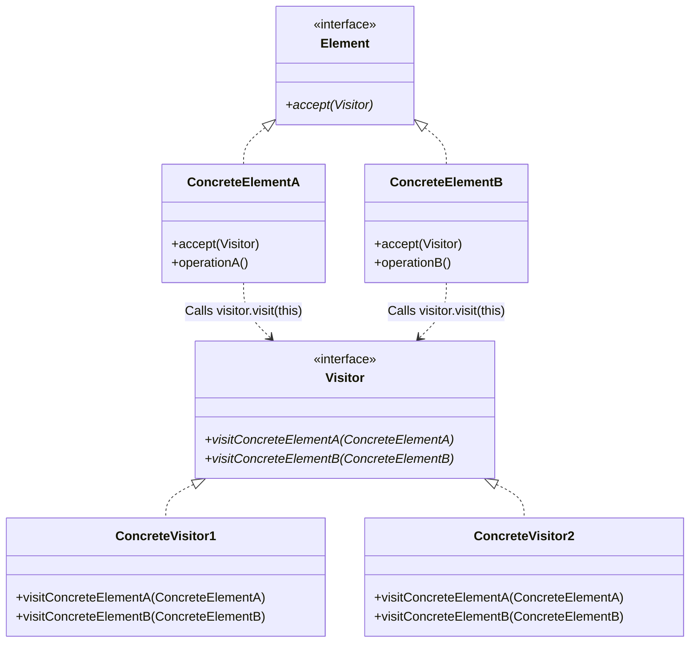
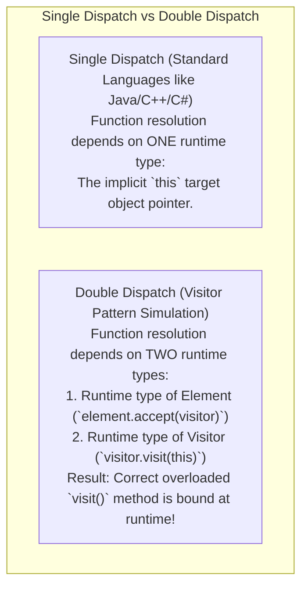

# Visitor Pattern — Double Dispatch and Operations over Heterogeneous Trees

## Mental Model

Think of the **Visitor Pattern** as a specialized tax auditor or health inspector visiting different businesses in a city (*Bakery*, *Bank*, *Gas Station*). 

The businesses (**Heterogeneous Element Objects**) do not rewrite their core operations every time a new tax law or health safety regulation is passed (**Closed for Modification**). 

Instead, each business exposes a single stable entry method: `accept(Inspector inspector)`. When the `TaxAuditor` visits the `Bakery`, it executes `auditor.visit(Bakery)`. When the `HealthInspector` visits the `Bakery`, it executes `inspector.visit(Bakery)`. You can invent infinite new inspectors (**Visitors: Tax Auditor, Fire Inspector, Health Inspector, Insurance Assessor**) and run operations across all businesses without ever altering a single line of business source code!

---

## 1. Intent & Structural Definition

The **Visitor Pattern** represents an operation to be performed on the elements of an object structure. Visitor lets you define a new operation without changing the classes of the elements on which it operates.



### Key Intent & Constraints
1. **Separate Algorithms from Object Structure:** Move operations on heterogeneous object structures (ASTs, Document Trees) into separate Visitor classes.
2. **Double Dispatch Mechanism:** Resolve execution based on **both** the dynamic runtime type of the Element AND the dynamic runtime type of the Visitor.
3. **OCP for Operations:** Easily add new operations by creating new Visitor classes without modifying Element classes.

---

## 2. Single Dispatch vs. Double Dispatch

Understanding **Double Dispatch** is the single most important technical requirement for mastering the Visitor Pattern.



### Why Standard Languages Fail at Double Dispatch Without Visitor

```java
// Standard Single Dispatch Java Problem:
Shape shape = new Circle(); // Runtime type: Circle
Exporter exporter = new XmlExporter(); // Runtime type: XmlExporter

// DANGER: Standard Java performs Single Dispatch!
// Compiler checks static type of 'shape' at compile time (Shape), NOT runtime type (Circle)!
exporter.export(shape); // Calls export(Shape) instead of export(Circle)!
```

#### How the Visitor Pattern Solves This via Double Dispatch:
```java
// Step 1: Dynamic Dispatch on 'shape' (First Dispatch)
shape.accept(exporter); 

// Step 2: Inside Circle.accept(Visitor v):
v.visitCircle(this); // Dynamic Dispatch on 'v' passing 'this' (Second Dispatch)!
```

---

## 3. Production Code Implementation: Document AST Export & Cost Calculation

```java
// ============================================================================
// 1. VISITOR INTERFACE (Must declare visit() method for EVERY concrete element!)
// ============================================================================
public interface DocumentVisitor {
    void visitParagraph(ParagraphParagraph p);
    void visitImage(ImageElement img);
    void visitTable(TableElement tbl);
}

// ============================================================================
// 2. ELEMENT INTERFACE (Exposes accept() method)
// ============================================================================
public interface DocumentElement {
    void accept(DocumentVisitor visitor);
}

// ============================================================================
// 3. CONCRETE ELEMENTS
// ============================================================================
public class ParagraphParagraph implements DocumentElement {
    private final String text;

    public ParagraphParagraph(String text) { this.text = text; }
    public String getText() { return text; }

    @Override
    public void accept(DocumentVisitor visitor) {
        visitor.visitParagraph(this); // DOUBLE DISPATCH STEP 2!
    }
}

public class ImageElement implements DocumentElement {
    private final String imagePath;
    private final int sizeKb;

    public ImageElement(String imagePath, int sizeKb) {
        this.imagePath = imagePath;
        this.sizeKb = sizeKb;
    }
    public String getImagePath() { return imagePath; }
    public int getSizeKb() { return sizeKb; }

    @Override
    public void accept(DocumentVisitor visitor) {
        visitor.visitImage(this); // DOUBLE DISPATCH STEP 2!
    }
}

public class TableElement implements DocumentElement {
    private final int rows;
    private final int cols;

    public TableElement(int rows, int cols) {
        this.rows = rows;
        this.cols = cols;
    }
    public int getRows() { return rows; }
    public int getCols() { return cols; }

    @Override
    public void accept(DocumentVisitor visitor) {
        visitor.visitTable(this); // DOUBLE DISPATCH STEP 2!
    }
}

// ============================================================================
// 4. CONCRETE VISITOR 1: HTML Exporter
// ============================================================================
public class HtmlExporterVisitor implements DocumentVisitor {
    private final StringBuilder html = new StringBuilder();

    @Override
    public void visitParagraph(ParagraphParagraph p) {
        html.append("<p>").append(p.getText()).append("</p>\n");
    }

    @Override
    public void visitImage(ImageElement img) {
        html.append("\n");
    }

    @Override
    public void visitTable(TableElement tbl) {
        html.append("<table rows='").append(tbl.getRows()).append("' cols='").append(tbl.getCols()).append("'></table>\n");
    }

    public String getHtml() { return html.toString(); }
}

// ============================================================================
// 5. CONCRETE VISITOR 2: Rendering Cost Calculator
// ============================================================================
public class RenderCostVisitor implements DocumentVisitor {
    private int totalCostCent = 0;

    @Override public void visitParagraph(ParagraphParagraph p) { totalCostCent += 1; }
    @Override public void visitImage(ImageElement img) { totalCostCent += (img.getSizeKb() * 2); }
    @Override public void visitTable(TableElement tbl) { totalCostCent += (tbl.getRows() * tbl.getCols() * 3); }

    public int getTotalCostCent() { return totalCostCent; }
}

// ============================================================================
// 6. CLIENT EXECUTION (Heterogeneous Tree Traversal)
// ============================================================================
public class Main {
    public static void main(String[] args) {
        List<DocumentElement> document = List.of(
            new ParagraphParagraph("Introduction to Visitor Pattern"),
            new ImageElement("/assets/diagram.png", 250),
            new TableElement(5, 4)
        );

        // Operation 1: Export Document to HTML
        HtmlExporterVisitor htmlVisitor = new HtmlExporterVisitor();
        for (DocumentElement element : document) {
            element.accept(htmlVisitor); // DOUBLE DISPATCH EXECUTION!
        }
        System.out.println("Generated HTML:\n" + htmlVisitor.getHtml());

        // Operation 2: Calculate Render Cost (Zero modification to Element classes!)
        RenderCostVisitor costVisitor = new RenderCostVisitor();
        for (DocumentElement element : document) {
            element.accept(costVisitor);
        }
        System.out.println("Total Render Cost: " + costVisitor.getTotalCostCent() + " cents");
    }
}
```

---

## 4. Architectural Matrix: Adding Elements vs. Adding Visitors

The Visitor Pattern introduces an inverted architectural asymmetry:

| Architectural Change | Ease of Modification | Code Changes Required |
|---|---|---|
| **Adding a NEW Visitor Operation** (e.g., `JsonExporterVisitor`) | **Extremely Easy (100% OCP)** | Create 1 new Visitor class file. **Zero Element classes modified!** |
| **Adding a NEW Element Class** (e.g., `VideoElement`) | **Extremely Hard** | Must modify the `Visitor` interface AND **every single existing Visitor implementation**! |

---

## 5. Failure Modes and Trade-offs

1. **Unstable Element Hierarchy Fragility** — Applying Visitor to an object structure where new Element classes are added daily. Every new Element forces updating dozens of Visitor classes. *Mitigation*: Use Visitor **only** when the Element class hierarchy is stable and static (e.g., AST nodes in compilers).
2. **Encapsulation Breakdown** — Visitors often require private state access to perform operations, forcing Element classes to expose public getter methods for internal fields (**Data Hiding Compromise**).
3. **Loss of Control in Recursive Traversals** — Hand-coded tree traversal in `accept()` methods scattering traversal logic across elements. *Mitigation*: Separate tree traversal logic into an explicit `Iterator` or `Visitor` traversal helper.

---

## 6. Active-Recall Prompts

1. **What is the primary intent of the Visitor Pattern, and how does it separate operations from heterogeneous object structures?**
2. **Explain Double Dispatch. Why do single-dispatch languages like Java require `element.accept(visitor)` to resolve dynamic types?**
3. **What is the structural asymmetry of the Visitor Pattern regarding adding new Visitors vs. adding new Elements?**
4. **Why is the Visitor Pattern universally used in compiler construction for Abstract Syntax Tree (AST) passes?**

---

## Related Notes

- [[Interpreter Pattern - Domain-Specific Languages and Abstract Syntax Trees]]
- [[Composite Pattern - Tree Structures, Uniformity vs Type Safety]]
- [[Iterator Pattern - Custom Collections, External vs Internal Iteration]]
- [[Polymorphism - Dynamic Binding, Virtual Method Tables, Method Overloading vs Overriding]]

> **Interview Style Question:** *"You are designing a production Compiler AST framework with 15 Node types (`BinaryExpr`, `VarDecl`, `IfStmt`, etc.). Demonstrate how single-dispatch type checking fails, implement the Visitor Pattern with Double Dispatch in Java/TypeScript for a `TypeCheckerVisitor` and a `CodeGeneratorVisitor`, analyze the trade-offs when adding a new 16th Node type, and explain why ANTLR uses Visitor for AST evaluation."*

---
