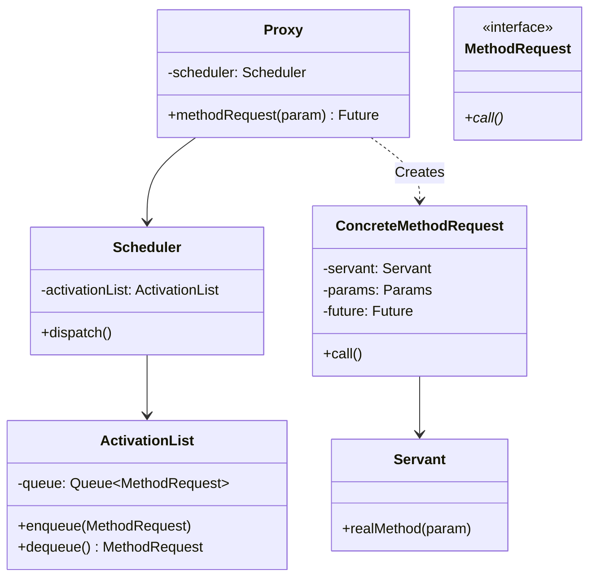
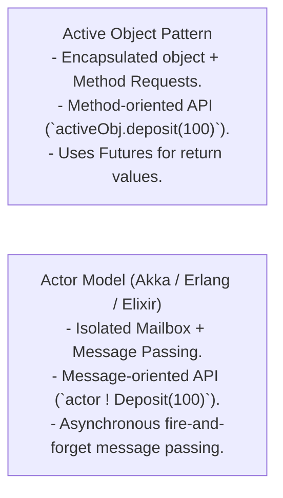

# Active Object Pattern — Decoupling Method Execution from Invocation

## Mental Model

Think of the **Active Object Pattern** as a high-volume drive-thru bank teller window with pneumatic tubes. 

When a driver (**Client Thread**) drives up and requests a deposit or cash withdrawal, they don't climb out of their car, walk inside the bank vault, and wait while the teller manually processes paper accounting ledgers (**Synchronous Direct Execution / Thread Blocking**). 

Instead, the driver drops their request canister into a pneumatic tube (**Proxy / Method Request**). The request lands in an internal inbox container (**Activation List / Message Queue**). A dedicated background bank teller (**Scheduler / Active Object Servant Thread**) processes requests sequentially from the inbox on its own independent thread. The driver receives a transaction receipt tracking number (**Future / Promise**) and immediately drives away to continue their day, polling or awaiting the result asynchronously!

---

## 1. Intent & Structural Definition

The **Active Object Pattern** decouples method execution from method invocation to enhance concurrency and simplify synchronized access to objects that reside in their own threads of control.



### The 6 Key Components

| Component | Role in Active Object Pattern |
|---|---|
| **Proxy** | Public interface exposed to client threads. Converts method calls into `MethodRequest` objects and returns a `Future`. |
| **Method Request** | Encapsulates the method parameters, target `Servant`, and `Future` return placeholder (Command Pattern). |
| **Activation List** | Synchronized queue storing pending `MethodRequest` objects awaiting execution (Producer-Consumer Queue). |
| **Scheduler** | Dedicated background worker thread that dequeues `MethodRequest` objects from the Activation List and executes them. |
| **Servant** | The actual domain object containing business logic. Executes strictly on the Scheduler's private thread (No mutex locking required inside Servant!). |
| **Future / Promise** | Asynchronous placeholder returned immediately to the client thread to retrieve the eventual result. |

---

## 2. Asynchronous Decoupling Architecture

```mermaid
flowchart TD
    subgraph ClientThread["Client Thread Space (Main App)"]
        Client["Client Code"] -->|1. Invokes activeObj.calculate(x, y)| ProxyObj["Proxy"]
        ProxyObj -->|2. Returns Future immediately!| FutureObj["Future Placeholder"]
        Client -->|3. Continues execution asynchronously...| ClientWork["Do Other Work"]
    end

    subgraph ActiveObjectThread["Active Object Private Thread Space"]
        ProxyObj -->|4. Enqueues MethodRequest| Queue["Activation List (Bounded Queue)"]
        SchedulerThread["Scheduler Thread"] -->|5. Dequeues MethodRequest| Queue
        SchedulerThread -->|6. Invokes servant.calculate(x, y)| ServantObj["Servant (Thread-Safe Domain Object)"]
        ServantObj -->|7. Resolves result into Future| FutureObj
    end
```

---

## 3. Production Code Implementation: Active Object Engine

```java
// ============================================================================
// 1. SERVANT (Domain Object - Single-Threaded Logic, NO Locks Needed!)
// ============================================================================
public class BankAccountServant {
    private double balance = 0.0;

    public void deposit(double amount) {
        this.balance += amount;
        System.out.println("Servant: Deposited $" + amount + " | Balance: $" + balance);
    }

    public double getBalance() {
        return this.balance;
    }
}

// ============================================================================
// 2. FUTURE PLACEHOLDER (Async Result Token)
// ============================================================================
public class ActiveFuture<T> {
    private T result;
    private boolean isDone = false;

    public synchronized void set(T result) {
        this.result = result;
        this.isDone = true;
        notifyAll(); // Wake up waiting client threads!
    }

    public synchronized T get() throws InterruptedException {
        while (!isDone) {
            wait(); // Block until result is resolved by Servant!
        }
        return result;
    }

    public synchronized boolean isDone() { return isDone; }
}

// ============================================================================
// 3. METHOD REQUEST INTERFACE (Command Pattern)
// ============================================================================
public interface MethodRequest {
    void call();
}

// Concrete Method Request for Deposit
public class DepositRequest implements MethodRequest {
    private final BankAccountServant servant;
    private final double amount;

    public DepositRequest(BankAccountServant servant, double amount) {
        this.servant = servant;
        this.amount = amount;
    }

    @Override
    public void call() {
        servant.deposit(amount); // Executed on Servant thread
    }
}

// Concrete Method Request for Get Balance
public class GetBalanceRequest implements MethodRequest {
    private final BankAccountServant servant;
    private final ActiveFuture<Double> future;

    public GetBalanceRequest(BankAccountServant servant, ActiveFuture<Double> future) {
        this.servant = servant;
        this.future = future;
    }

    @Override
    public void call() {
        double currentBalance = servant.getBalance();
        future.set(currentBalance); // Resolve Future
    }
}

// ============================================================================
// 4. ACTIVATION LIST & SCHEDULER (Background Worker Thread)
// ============================================================================
public class ActiveObjectScheduler extends Thread {
    private final BlockingQueue<MethodRequest> activationList = new LinkedBlockingQueue<>();

    public void enqueue(MethodRequest request) {
        activationList.add(request);
    }

    @Override
    public void run() {
        while (!isInterrupted()) {
            try {
                // Dequeue and execute requests sequentially on THIS thread!
                MethodRequest request = activationList.take();
                request.call();
            } catch (InterruptedException e) {
                break;
            }
        }
    }
}

// ============================================================================
// 5. PROXY (Client Interface Entry Point)
// ============================================================================
public class BankAccountActiveObject {
    private final BankAccountServant servant = new BankAccountServant();
    private final ActiveObjectScheduler scheduler = new ActiveObjectScheduler();

    public BankAccountActiveObject() {
        scheduler.start(); // Start background worker thread
    }

    public void deposit(double amount) {
        // Asynchronous non-blocking call
        scheduler.enqueue(new DepositRequest(servant, amount));
    }

    public ActiveFuture<Double> getBalance() {
        ActiveFuture<Double> future = new ActiveFuture<>();
        // Enqueue request and return Future IMMEDIATELY to client!
        scheduler.enqueue(new GetBalanceRequest(servant, future));
        return future;
    }

    public void shutdown() {
        scheduler.interrupt();
    }
}

// ============================================================================
// 6. CLIENT EXECUTION
// ============================================================================
public class Main {
    public static void main(String[] args) throws InterruptedException {
        BankAccountActiveObject activeAccount = new BankAccountActiveObject();

        System.out.println("Client: Enqueueing deposits asynchronously...");
        activeAccount.deposit(100.0);
        activeAccount.deposit(250.0);

        // Request Balance (Returns Future immediately!)
        ActiveFuture<Double> balanceFuture = activeAccount.getBalance();
        System.out.println("Client: Received Future object instantly! Doing other work...");

        // Block on Future ONLY when result is needed!
        double finalBalance = balanceFuture.get();
        System.out.println("Client: Retrieved Final Balance from Future: $" + finalBalance);

        activeAccount.shutdown();
    }
}
```

---

## 4. Active Object vs. Actor Model (Akka / Erlang)

The Active Object pattern is the direct object-oriented predecessor to the **Actor Model**:



---

## 5. Failure Modes and Trade-offs

1. **Activation List Memory Overflow** — A client thread enqueues 10,000,000 requests per second while the single Servant thread can process only 1,000 requests per second. The activation list grows until JVM `OutOfMemoryError`. *Mitigation*: Use a bounded blocking activation queue to enforce backpressure.
2. **Deadlock from Synchronous Future Chaining** — A Servant thread making a synchronous `.get()` call on a Future returned by *another* Active Object that is waiting on the first Active Object (`ActiveObj A -> ActiveObj B -> ActiveObj A`). *Mitigation*: Use non-blocking async callbacks (`CompletableFuture.thenAccept()`).
3. **High Context-Switching & Object Allocation Overhead** — Creating a separate `MethodRequest` object and `ActiveFuture` object for every minor getter call adds significant garbage collection and heap allocation overhead.

---

## 6. Active-Recall Prompts

1. **What is the primary intent of the Active Object Pattern, and how does it decouple method invocation from execution?**
2. **List and describe the 6 core components of the Active Object Pattern (Proxy, MethodRequest, ActivationList, Scheduler, Servant, Future).**
3. **Why does the `Servant` class require ZERO synchronized keywords or mutex locks inside its implementation?**
4. **Compare the Active Object Pattern vs. the Actor Model (Akka/Erlang).**

---

## Related Notes

- [[Producer-Consumer Pattern - Bounded Queues and Condition Variables]]
- [[Thread Pool Pattern - Worker Queues, Task Rejection Policies, Work Stealing]]
- [[Reactor and Proactor Patterns - Event-Driven Asynchronous IO Multiplexing]]
- [[Command Pattern - Encapsulating Requests, Undo-Redo, and Macro Commands]]

> **Interview Style Question:** *"Design a thread-safe Async Logging and Database Write Engine using the Active Object Pattern in Java/TypeScript. Demonstrate how the Proxy returns Futures immediately to caller threads, write the complete Activation List and Scheduler loop, justify why the Servant needs no internal lock synchronization, and show how you prevent RAM exhaustion during peak logging traffic."*

---
