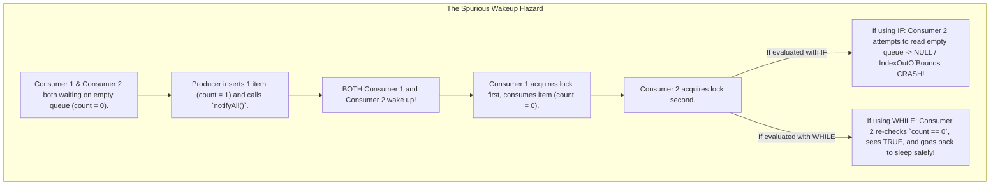

# Producer-Consumer Pattern — Bounded Queues and Condition Variables

## Mental Model

Think of the **Producer-Consumer Pattern** as a busy fast-food restaurant kitchen pass counter. 

The line cooks (**Producers**) prepare burgers and place them onto a bounded heated pass counter that holds at most 10 items (**Bounded Queue / Buffer**). The cashiers (**Consumers**) take burgers from the pass counter to package customer orders. 

If the counter is full (10 items), the line cooks stop cooking and wait (**Condition Variable: `notFull`**). If the counter is empty (0 items), the cashiers stop packaging and wait (**Condition Variable: `notEmpty`**). When a cashier takes a burger, they signal the cooks to resume cooking; when a cook places a burger, they signal the cashiers to resume packaging. Producers and Consumers operate completely asynchronously without direct thread coupling!

---

## 1. Intent & Structural Definition

The **Producer-Consumer Pattern** decouples threads producing data from threads consuming data by inserting a synchronized bounded buffer queue between them.

```mermaid
flowchart LR
    subgraph Producers["Producer Threads (N)"]
        P1["Producer Thread 1"]
        P2["Producer Thread 2"]
    end

    subgraph BoundedBuffer["Synchronized Bounded Queue (Capacity = K)"]
        Queue["[ Task 1 | Task 2 | Task 3 | ... ]\n- ReentrantLock / Mutex\n- Condition notFull\n- Condition notEmpty"]
    end

    subgraph Consumers["Consumer Threads (M)"]
        C1["Consumer Thread 1"]
        C2["Consumer Thread 2"]
    end

    P1 & P2 -->|put() - Blocks if Full| BoundedBuffer
    BoundedBuffer -->|take() - Blocks if Empty| C1 & C2
```

### Key Intent & Constraints
1. **Asynchronous Thread Decoupling:** Producers produce work units at variable speeds without blocking on consumer processing logic.
2. **Backpressure Management:** Bounded capacity limits maximum queue size in RAM, preventing memory exhaustion when production exceeds consumption.
3. **Thread Safety & Condition Synchronization:** Guard queue state using Mutexes/ReentrantLocks and Condition Variables (`wait()`/`notifyAll()`).

---

## 2. Low-Level Implementation: Building a Thread-Safe Bounded Queue

To understand condition variables, we construct a thread-safe `BoundedBlockingQueue` from scratch using Java's `ReentrantLock` and `Condition` variables (simulating C++ `std::condition_variable` and POSIX `pthread_cond_t`).

```java
import java.util.concurrent.locks.Condition;
import java.util.concurrent.locks.ReentrantLock;

public class BoundedBlockingQueue<T> {
    private final Object[] items;
    private int head = 0;
    private int tail = 0;
    private int count = 0;

    // Concurrency Lock & Condition Variables
    private final ReentrantLock lock = new ReentrantLock();
    private final Condition notFull  = lock.newCondition();
    private final Condition notEmpty = lock.newCondition();

    @SuppressWarnings("unchecked")
    public BoundedBlockingQueue(int capacity) {
        if (capacity <= 0) throw new IllegalArgumentException("Capacity must be > 0");
        this.items = new Object[capacity];
    }

    // PRODUCER METHOD: Enqueue item (Blocks if full)
    public void put(T item) throws InterruptedException {
        lock.lockInterruptibly(); // Acquire Mutex Lock
        try {
            // CRITICAL: Always check condition in a WHILE loop to guard against Spurious Wakeups!
            while (count == items.length) {
                System.out.println(Thread.currentThread().getName() + ": Queue FULL! Producer waiting...");
                notFull.await(); // Releases lock and sleeps until notified
            }

            items[tail] = item;
            if (++tail == items.length) tail = 0; // Circular Array Wrap
            count++;

            System.out.println(Thread.currentThread().getName() + ": Produced [" + item + "] (Queue size: " + count + ")");

            // Signal waiting consumer threads that queue is no longer empty!
            notEmpty.signal();
        } finally {
            lock.unlock(); // Release Mutex Lock
        }
    }

    // CONSUMER METHOD: Dequeue item (Blocks if empty)
    @SuppressWarnings("unchecked")
    public T take() throws InterruptedException {
        lock.lockInterruptibly(); // Acquire Mutex Lock
        try {
            // Guard against Spurious Wakeups!
            while (count == 0) {
                System.out.println(Thread.currentThread().getName() + ": Queue EMPTY! Consumer waiting...");
                notEmpty.await(); // Releases lock and sleeps until notified
            }

            T item = (T) items[head];
            items[head] = null; // Prevent memory leak
            if (++head == items.length) head = 0; // Circular Array Wrap
            count--;

            System.out.println(Thread.currentThread().getName() + ": Consumed [" + item + "] (Queue size: " + count + ")");

            // Signal waiting producer threads that queue is no longer full!
            notFull.signal();
            return item;
        } finally {
            lock.unlock(); // Release Mutex Lock
        }
    }
}
```

---

## 3. Spurious Wakeups & Why `while()` Loops are Mandatory

> ⚠️ **CRITICAL CONCURRENCY RULE:** Never write `if (count == 0) wait()`. Always write `while (count == 0) wait()`!



---

## 4. Production Code: Multithreaded Producer-Consumer Engine

```java
public class Main {
    public static void main(String[] args) throws InterruptedException {
        BoundedBlockingQueue<Integer> queue = new BoundedBlockingQueue<>(3); // Small capacity 3

        // Producer Runnable
        Runnable producer = () -> {
            try {
                for (int i = 1; i <= 5; i++) {
                    queue.put(i);
                    Thread.sleep(100); // Simulate work
                }
            } catch (InterruptedException e) {
                Thread.currentThread().interrupt();
            }
        };

        // Consumer Runnable
        Runnable consumer = () -> {
            try {
                for (int i = 1; i <= 5; i++) {
                    Integer item = queue.take();
                    Thread.sleep(300); // Simulate slower processing work
                }
            } catch (InterruptedException e) {
                Thread.currentThread().interrupt();
            }
        };

        // Launch Threads
        Thread pThread = new Thread(producer, "Producer-Thread");
        Thread cThread = new Thread(consumer, "Consumer-Thread");

        pThread.start();
        cThread.start();

        pThread.join();
        cThread.join();
    }
}
```

---

## 5. Architectural Comparison Matrix

| Mechanism | Backpressure Handling | Thread Blocking | Memory Footprint |
|---|---|---|---|
| **Unbounded Queue (`LinkedList`)** | ❌ **None** (OOM Crash risk if producers outpace consumers). | Blocks on Empty only. | Grows infinitely under load. |
| **Bounded Queue (`ArrayBlockingQueue`)** | ✅ **Full Backpressure** (Blocks Producers when full). | Blocks on Full AND Empty. | Fixed pre-allocated memory. |
| **Disruptor Lock-Free Ring Buffer** | ✅ **Full Backpressure** (High-throughput CAS). | Non-blocking spin-locks. | Fixed cache-aligned memory. |

---

## 6. Failure Modes and Trade-offs

1. **Spurious Wakeup State Corruption** — Using `if (!condition) wait()` instead of `while (!condition) wait()`, causing threads to resume execution when condition invariants are false.
2. **Unbounded Memory Exhaustion (OOM)** — Using unbounded queues (`LinkedBlockingQueue` without capacity limit). Under traffic spikes, 10,000,000 tasks accumulate in RAM, triggering JVM `OutOfMemoryError`. *Mitigation*: Always specify bounded queue capacities in production.
3. **Deadlock from Single Condition Variable** — Sharing a single condition variable for both `notFull` and `notEmpty` and calling `signal()` instead of `signalAll()`. A producer signals another producer by mistake, causing all threads to sleep indefinitely (**Deadlock**). *Mitigation*: Use distinct `Condition` variables (`notFull` vs. `notEmpty`).

---

## 7. Active-Recall Prompts

1. **What is the primary intent of the Producer-Consumer Pattern, and how does a Bounded Queue manage backpressure?**
2. **Why MUST condition checks inside multithreaded queues be evaluated in a `while` loop instead of an `if` statement?**
3. **Explain Spurious Wakeups and how mutex locks and condition variables interact during `await()` and `signal()`.**
4. **Why are distinct `notFull` and `notEmpty` condition variables required to prevent deadlock when using single `signal()` calls?**

---

## Related Notes

- [[Thread Pool Pattern - Worker Queues, Task Rejection Policies, Work Stealing]]
- [[Active Object Pattern - Decoupling Method Execution from Invocation]]
- [[Reactor and Proactor Patterns - Event-Driven Asynchronous IO Multiplexing]]
- [[Observer Pattern - Event Buses, Publish-Subscribe, and Reactive Streams]]

> **Interview Style Question:** *"Implement a lock-free or condition-variable Bounded Blocking Queue in Java/C++ supporting $N$ Producers and $M$ Consumers. Trace the exact mutex lock acquisition, condition wait, and signal execution sequence, explain how spurious wakeups occur at the OS kernel level, and show how bounded queue capacity prevents Out-Of-Memory crashes during production traffic spikes."*

---
