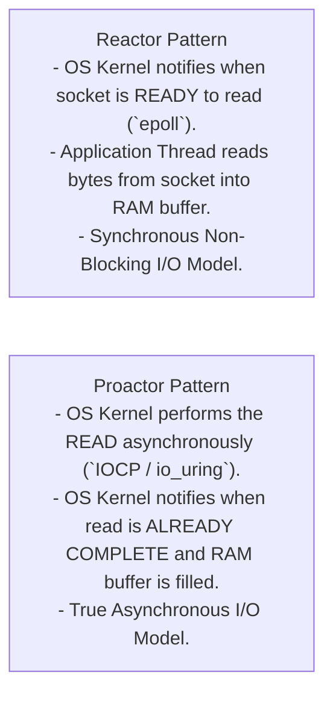
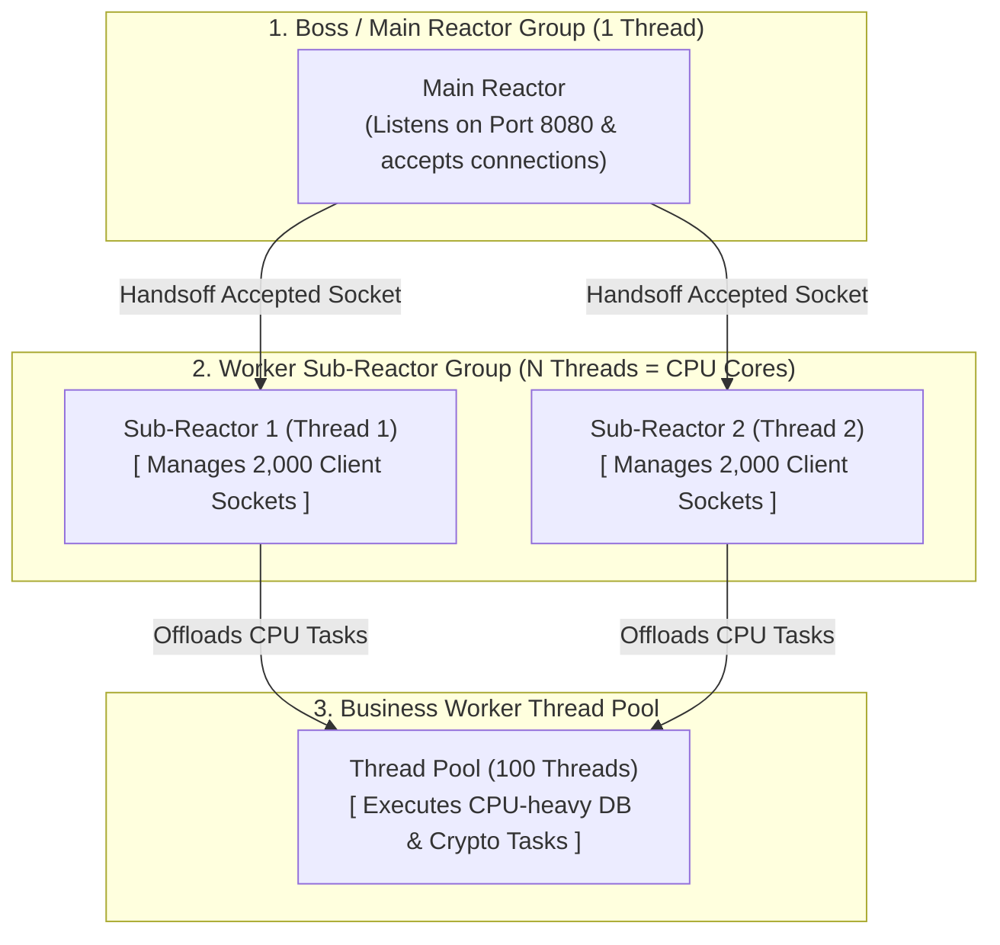

# Reactor and Proactor Patterns — Event-Driven Asynchronous I/O Multiplexing

## Mental Model

Think of **I/O Handling** at a busy restaurant with 100 tables:

- **Thread-per-Connection Model (Blocking I/O):** Hire 100 waiters (**100 OS Threads**). Each waiter stands at a single table, staring at the customers, doing nothing while customers read the menu for 30 minutes (**Thread Blocking / Memory Waste**).
- **Reactor Pattern (Synchronous I/O Multiplexing - Node.js / Netty / `epoll`):** Hire **1 Waiter** (**1 Thread / Event Loop**). The waiter asks all 100 tables: *"Raise your hand when your order is ready!"* The OS kernel notifies the waiter (`epoll_wait`). The waiter walks only to tables with raised hands, takes the order, and dispatches it to the kitchen (**Synchronous Dispatch on Read-Ready Event**).
- **Proactor Pattern (Asynchronous Completion - Windows IOCP / io_uring):** The customers write their orders on paper, place them in a motorized pneumatic conveyor, and the kitchen automatically delivers cooked food to the table (**Async I/O Completion by OS Kernel**). The waiter is notified *after* the food has already been delivered!

---

## 1. Intent & Structural Definition

Both Reactor and Proactor handle service requests delivered concurrently to an application by one or more inputs, using event-driven architectures to process thousands of connections concurrently without thread-per-connection overhead.

```mermaid
flowchart TD
    subgraph ReactorArchitecture["1. Reactor Pattern (Synchronous Event Demultiplexing)"]
        ClientR["Network Sockets"] -->|1. Register Readiness| DemuxR["Synchronous Event Demultiplexer\n(epoll / kqueue / select)"]
        DemuxR -->|2. Returns Read-Ready Events| ReactorLoop["Reactor Event Loop"]
        ReactorLoop -->|3. Dispatches Read Event| HandlerR["EventHandler (Reads bytes from socket)"]
    end

    subgraph ProactorArchitecture["2. Proactor Pattern (Asynchronous Completion)"]
        ClientP["Network Sockets"] -->|1. Initiates Async Read| AsyncOS["Asynchronous I/O Processor\n(Windows IOCP / Linux io_uring)"]
        AsyncOS -->|2. Kernel Reads Bytes into Buffer & Enqueues Completion| CompletionQ["Completion Event Queue"]
        CompletionQ -->|3. Dispatches Completed Buffer| ProactorLoop["Proactor Event Loop"]
        ProactorLoop -->|4. Processes Already-Read Buffer| HandlerP["CompletionHandler (Processes Data)"]
    end
```



---

## 2. Reactor vs. Proactor Architectural Comparison

The fundamental distinction between Reactor and Proactor is **who performs the actual I/O read/write operation**:



### Detailed Feature Comparison Matrix

| Architectural Feature | Reactor Pattern | Proactor Pattern |
|---|---|---|
| **Underlying OS Mechanism** | `epoll` (Linux), `kqueue` (BSD/macOS), `select`/`poll`. | IOCP (Windows), `io_uring` (Modern Linux 5.1+), POSIX AIO. |
| **I/O Readiness vs Completion** | Notifies on **I/O Readiness** (Socket is ready to read). | Notifies on **I/O Completion** (Bytes are already in RAM buffer). |
| **Who Executes Read/Write?** | **Application Thread** reads bytes from socket. | **OS Kernel** reads bytes asynchronously in background. |
| **Buffer Allocation** | Application allocates buffer **after** readiness notification. | Application allocates buffer **before** passing to kernel. |
| **Major Implementations** | **Netty**, **Node.js**, **Redis**, **Nginx**, **Envoy**. | **Windows IOCP**, Boost.Asio, Linux `io_uring`. |

---

## 3. Production Code Implementation: Single-Threaded Reactor Event Loop

```java
// ============================================================================
// 1. REACTOR EVENT LOOP (Single-Threaded I/O Multiplexer)
// ============================================================================
public class ReactorEngine implements Runnable {
    private final Selector selector; // OS Kernel Demultiplexer (epoll wrapper)
    private final ServerSocketChannel serverChannel;

    public ReactorEngine(int port) throws IOException {
        // Open Selector (epoll) and ServerSocketChannel
        this.selector = Selector.open();
        this.serverChannel = ServerSocketChannel.open();
        this.serverChannel.bind(new InetSocketAddress(port));
        this.serverChannel.configureBlocking(false); // Non-Blocking I/O!

        // Register ServerSocketChannel with Selector for OP_ACCEPT events
        this.serverChannel.register(selector, SelectionKey.OP_ACCEPT, new Acceptor());
        System.out.println("ReactorEngine: Listening on port " + port + " using non-blocking epoll...");
    }

    @Override
    public void run() {
        while (!Thread.interrupted()) {
            try {
                // Step 1: Synchronous Event Demultiplexer (Blocks until network events arrive!)
                selector.select(); // Wraps kernel epoll_wait()
                
                Set<SelectionKey> selectedKeys = selector.selectedKeys();
                Iterator<SelectionKey> it = selectedKeys.iterator();

                // Step 2: Event Loop Dispatch
                while (it.hasNext()) {
                    SelectionKey key = it.next();
                    it.remove();
                    dispatch(key); // Dispatch event to attached handler!
                }
            } catch (IOException e) {
                e.printStackTrace();
            }
        }
    }

    private void dispatch(SelectionKey key) {
        // Retrieve attached handler (Acceptor or ReadHandler) and run it!
        Runnable handler = (Runnable) key.attachment();
        if (handler != null) {
            handler.run();
        }
    }

    // ============================================================================
    // 2. ACCEPTOR (Handles Incoming Connection Events)
    // ============================================================================
    private class Acceptor implements Runnable {
        @Override
        public void run() {
            try {
                SocketChannel clientChannel = serverChannel.accept();
                if (clientChannel != null) {
                    System.out.println("Acceptor: Accepted connection from " + clientChannel.getRemoteAddress());
                    clientChannel.configureBlocking(false);
                    
                    // Attach ReadHandler for client socket READ events
                    SelectionKey clientKey = clientChannel.register(selector, SelectionKey.OP_READ);
                    clientKey.attach(new ReadHandler(clientChannel, clientKey));
                }
            } catch (IOException e) {
                e.printStackTrace();
            }
        }
    }

    // ============================================================================
    // 3. READ HANDLER (Handles Non-Blocking Socket Read Operations)
    // ============================================================================
    private class ReadHandler implements Runnable {
        private final SocketChannel socketChannel;
        private final SelectionKey key;
        private final ByteBuffer buffer = ByteBuffer.allocate(1024);

        public ReadHandler(SocketChannel socketChannel, SelectionKey key) {
            this.socketChannel = socketChannel;
            this.key = key;
        }

        @Override
        public void run() {
            try {
                int bytesRead = socketChannel.read(buffer); // Non-blocking read
                if (bytesRead > 0) {
                    buffer.flip();
                    byte[] data = new byte[buffer.remaining()];
                    buffer.get(data);
                    String requestStr = new String(data, StandardCharsets.UTF_8).trim();
                    System.out.println("ReadHandler: Received message: '" + requestStr + "'");

                    // Echo response back to client
                    ByteBuffer response = ByteBuffer.wrap(("ECHO: " + requestStr + "\n").getBytes());
                    socketChannel.write(response);
                    buffer.clear();
                } else if (bytesRead < 0) {
                    // Client disconnected
                    System.out.println("ReadHandler: Client disconnected.");
                    key.cancel();
                    socketChannel.close();
                }
            } catch (IOException e) {
                key.cancel();
                try { socketChannel.close(); } catch (IOException ignored) {}
            }
        }
    }
}
```

---

## 4. Multi-Reactor Pattern (Netty Master-Worker Architecture)

A single-threaded Reactor event loop can become a bottleneck if handler processing logic includes CPU-heavy computation.

Netty and Nginx use a **Multi-Reactor Architecture**:



---

## 5. Failure Modes and Trade-offs

1. **Blocking the Event Loop Thread (Golden Rule Violation)** — Executing a blocking database call (`JDBC query`) or long CPU computation (`Thread.sleep()`) directly inside the Reactor Event Loop thread. Result: The event loop stops processing all other 10,000 connected sockets, causing system-wide API latency spikes! *Mitigation*: Offload blocking tasks to a separate **Worker Thread Pool**.
2. **Buffer Leak in Asynchronous I/O** — In Proactor/io_uring, allocating a buffer, passing it to the OS kernel, and having client code overwrite or free the buffer before the OS kernel finishes writing. Result: Memory corruption. *Mitigation*: Ensure buffers passed to async I/O kernels remain immutable and pinned in RAM until completion handlers execute.
3. **Selector Key Leakage** — Failing to call `key.cancel()` and `socket.close()` when a socket disconnects. The `Selector` keeps polling dead keys, driving CPU utilization to 100%.

---

## 6. Active-Recall Prompts

1. **What is the primary intent of the Reactor Pattern, and how does I/O Multiplexing (`epoll`) replace thread-per-connection architectures?**
2. **Compare Reactor vs. Proactor across I/O Readiness vs. Completion, and explain who executes the physical read operation.**
3. **What is the "Golden Rule" of Event Loop programming, and what happens if you execute blocking I/O inside Netty's or Node.js's event loop?**
4. **How does Netty's Multi-Reactor (Boss/Worker) architecture scale event loop processing across multi-core CPUs?**

---

## Related Notes

- [[Producer-Consumer Pattern - Bounded Queues and Condition Variables]]
- [[Thread Pool Pattern - Worker Queues, Task Rejection Policies, Work Stealing]]
- [[Active Object Pattern - Decoupling Method Execution from Invocation]]
- [[Observer Pattern - Event Buses, Publish-Subscribe, and Reactive Streams]]

> **Interview Style Question:** *"Design a C10M (10 million concurrent connections) WebSockets server using Netty and the Reactor Pattern. Compare thread-per-connection vs. Java NIO `Selector` (`epoll`), write the complete non-blocking event loop engine in Java/C++, explain how Netty's Boss/Worker Multi-Reactor model handles CPU-bound tasks via offloading thread pools, and contrast Reactor with Windows IOCP / Linux `io_uring` Proactor architectures."*

---
