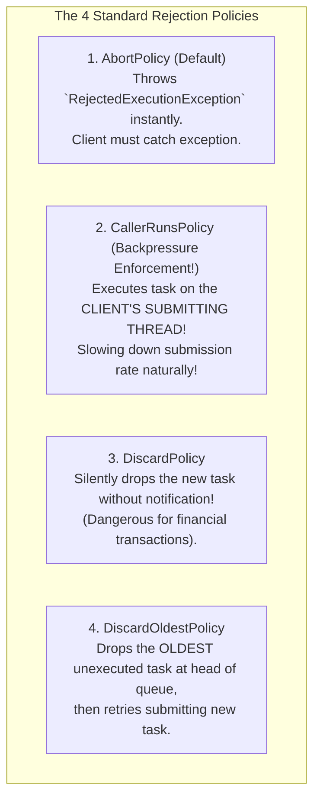
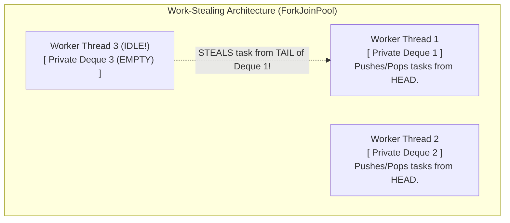

# Thread Pool Pattern — Worker Queues, Task Rejection Policies, Work Stealing

## Mental Model

Think of a **Thread Pool** as a fleet of dedicated taxi cabs waiting outside an airport terminal. 

If every arriving passenger spawned a brand-new taxi factory, manufactured a physical car from raw steel, drove 5 miles, and then crushed the car in a junkyard (**Spawning & Destroying OS Threads per Request**), the airport would collapse under manufacturing costs and CPU overhead. 

Instead, a fixed fleet of 50 pre-manufactured taxis (**Worker Threads**) waits in a designated lane (**Thread Pool**). Arriving passengers line up in a queue (**Worker Queue**). As soon as a taxi completes a trip, it drives back to the airport and picks up the next passenger in line (**Thread Reuse**). If the passenger queue fills up completely, a pre-defined policy determines whether extra temporary taxis are hired or new passengers are turned away (**Task Rejection Policy**).

---

## 1. Intent & Structural Definition

The **Thread Pool Pattern** manages a pool of pre-instantiated worker threads to execute tasks concurrently, eliminating the heavy CPU overhead of thread creation and destruction while bounding resource consumption.

```mermaid
flowchart TD
    subgraph ClientLayer["Client Task Submission"]
        Tasks["Incoming Runnable / Callable Tasks"] -->|submit()| Pool["ThreadPoolExecutor Engine"]
    end

    subgraph PoolCore["Thread Pool Internal Architecture"]
        Pool --> CoreThreads["1. Core Worker Threads (e.g. 10 Threads)\n[Active Workers processing tasks]"]
        
        Pool -->|Core Threads Busy| Queue["2. Task Work Queue\n(Bounded ArrayBlockingQueue capacity = 100)"]
        
        Queue -->|Queue Full!| MaxThreads["3. Maximum Worker Threads (e.g. 50 Threads)\n[Spawn temporary extra workers]"]
        
        MaxThreads -->|Max Threads Busy!| RejectionPolicy["4. Task Rejection Policy\n(Abort / CallerRuns / Discard / DiscardOldest)"]
    end
```

### Why Spawning OS Threads Per Request Fails
1. **Thread Creation Overhead:** Spawning an OS thread requires allocating ~1MB of off-heap stack memory (`-Xss`), calling kernel `pthread_create()`, and setting up OS thread control blocks.
2. **Context-Switching Thrashing:** Spawning 5,000 OS threads on a 16-core CPU causes the CPU to spend 90% of its time context-switching between thread registers rather than executing application code!

---

## 2. Java `ThreadPoolExecutor` Core Parameters

Understanding the exact step-by-step execution algorithm of Java's `ThreadPoolExecutor` is a critical engineering requirement:

```java
public ThreadPoolExecutor(
    int corePoolSize,         // 1. Core threads kept alive even when idle
    int maximumPoolSize,      // 3. Maximum threads allowed under peak burst load
    long keepAliveTime,       // Time non-core idle threads wait before terminating
    TimeUnit unit,
    BlockingQueue<Runnable> workQueue, // 2. Queue holding tasks before execution
    ThreadFactory threadFactory,
    RejectedExecutionHandler handler   // 4. Policy invoked when queue & max threads fill up
)
```

### The 4-Step Thread Pool Dispatch Algorithm

```mermaid
flowchart TD
    Submit["Task Submitted: execute(runnable)"] --> CheckCore{"Active Threads < corePoolSize?"}
    
    CheckCore -->|YES| SpawnCore["Spawn NEW Core Worker Thread to execute task immediately!"]
    CheckCore -->|NO| CheckQueue{"Offer task to Work Queue. Queue full?"}
    
    CheckQueue -->|NO (Accepted)| Enqueue["Enqueue Task into Work Queue for idle workers."]
    CheckQueue -->|YES (Full)| CheckMax{"Active Threads < maximumPoolSize?"}
    
    CheckMax -->|YES| SpawnMax["Spawn NEW Non-Core Worker Thread to execute task!"]
    CheckMax -->|NO (Saturated)| ExecuteReject["Execute Task Rejection Policy!"]
```

---

## 3. The 4 Standard Task Rejection Policies

When both the **Work Queue** is full AND active threads reach `maximumPoolSize`, the pool executes a `RejectedExecutionHandler`:



---

## 4. Advanced Concurrency: Work-Stealing Algorithm (`ForkJoinPool`)

Standard Thread Pools use a single shared central queue. Under heavy concurrency, worker threads experience high mutex contention on the central queue.

The **Work-Stealing Algorithm** (used in Java `ForkJoinPool`, Go Runtime Scheduler, and Rust Tokio) assigns a **private double-ended queue (Deque)** to *every single worker thread*.



### Key Work-Stealing Advantages:
1. **Zero Contention in Common Case:** Worker 1 pushes and pops from the **head** of its own private deque without acquiring any locks.
2. **Dynamic Load Balancing:** If Worker 3 runs out of tasks, it locks the **tail** of Worker 1's deque and **steals** a task from the back, balancing CPU utilization automatically across all cores!

---

## 5. Production Code Implementation: Custom Thread Pool Manager

```java
// Production Custom Thread Pool Configuration
public class ThreadPoolFactory {

    public static ExecutorService createProductionThreadPool(int cpuCores) {
        int corePoolSize = cpuCores;
        int maxPoolSize = cpuCores * 2;
        int queueCapacity = 500;

        return new ThreadPoolExecutor(
            corePoolSize,
            maxPoolSize,
            60L, TimeUnit.SECONDS,
            new ArrayBlockingQueue<>(queueCapacity), // BOUNDED QUEUE (Prevents OOM!)
            new CustomThreadFactory("AppWorker"),
            new ThreadPoolExecutor.CallerRunsPolicy() // BACKPRESSURE REJECTION POLICY
        );
    }

    private static class CustomThreadFactory implements ThreadFactory {
        private final String namePrefix;
        private final AtomicInteger threadNumber = new AtomicInteger(1);

        public CustomThreadFactory(String namePrefix) {
            this.namePrefix = namePrefix;
        }

        @Override
        public Thread newThread(Runnable r) {
            Thread t = new Thread(r, namePrefix + "-thread-" + threadNumber.getAndIncrement());
            t.setDaemon(false);
            t.setPriority(Thread.NORM_PRIORITY);
            return t;
        }
    }
}
```

---

## 6. Sizing Thread Pools: CPU-Bound vs. I/O-Bound Formulas

How many threads should you allocate to a Thread Pool?

$$\text{Optimal Threads} = N_{\text{CPU}} \times U_{\text{CPU}} \times \left( 1 + \frac{W}{C} \right)$$

Where $N_{\text{CPU}}$ is number of CPU cores, $U_{\text{CPU}}$ is target CPU utilization ($0.0 \dots 1.0$), $W$ is Wait Time (I/O block time), and $C$ is Computing Time (CPU time).

### Sizing Heuristics Matrix

| Workload Type | Bottleneck | Recommended Thread Pool Size | Example Workload |
|---|---|---|---|
| **CPU-Bound** | CPU Processing Power | $N_{\text{CPU}} + 1$ | Video encoding, AES cryptography, ML matrix math. |
| **I/O-Bound** | Network / Disk Latency | $N_{\text{CPU}} \times \left(1 + \frac{\text{Wait Time}}{\text{Compute Time}}\right) \approx 50-200$ | REST API calls, SQL database queries, S3 uploads. |

---

## 7. Failure Modes and Trade-offs

1. **Unbounded Queue OOM Crash** — Using `Executors.newFixedThreadPool(10)`. Under the hood, this uses an unbounded `LinkedBlockingQueue` (capacity $= 2^{31}-1$). Under traffic spikes, 5,000,000 requests accumulate in RAM, crashing the server with JVM `OutOfMemoryError`. *Mitigation*: **ALWAYS use explicit `ArrayBlockingQueue` with a bounded capacity!**
2. **Thread Leakage** — Tasks submitted to thread pool throw uncaught `RuntimeException`s without logging or catching, or worker threads block indefinitely on socket calls without timeouts. *Mitigation*: Wrap task bodies in `try-catch` blocks and set socket timeouts.
3. **Deadlock in Nested Task Submissions** — A thread inside a Thread Pool submits a sub-task to the *same* pool and synchronously blocks waiting for the result (`future.get()`). If all pool threads execute parent tasks waiting on sub-tasks, the pool deadlocks! *Mitigation*: Use separate thread pools for parent vs child tasks or use `ForkJoinPool`.

---

## 8. Active-Recall Prompts

1. **Explain the 4-step dispatch algorithm of Java's `ThreadPoolExecutor` (Core Threads $\to$ Queue $\to$ Max Threads $\to$ Rejection Policy).**
2. **Compare the 4 standard Task Rejection Policies (Abort, CallerRuns, Discard, DiscardOldest). Which one enforces natural backpressure?**
3. **How does the Work-Stealing algorithm (`ForkJoinPool`) reduce lock contention compared to a traditional shared central queue?**
4. **Calculate optimal thread pool size for a 16-core CPU running an I/O-bound REST microservice where Wait Time is 90ms and Compute Time is 10ms.**

---

## Related Notes

- [[Producer-Consumer Pattern - Bounded Queues and Condition Variables]]
- [[Active Object Pattern - Decoupling Method Execution from Invocation]]
- [[Reactor and Proactor Patterns - Event-Driven Asynchronous IO Multiplexing]]
- [[Single Responsibility Principle - SRP and Cohesion]]

> **Interview Style Question:** *"You are called to resolve a high-severity production crash where an enterprise backend server ran out of RAM (`OutOfMemoryError: Java heap space`) during a flash sale. Diagnostic dumps show `Executors.newCachedThreadPool()` spawned 14,000 threads. Explain the architectural flaw of cached thread pools, design a custom `ThreadPoolExecutor` with bounded queues and `CallerRunsPolicy` backpressure, and write code demonstrating thread pool shutdown safety (`shutdown()` vs `shutdownNow()`)."*

---
