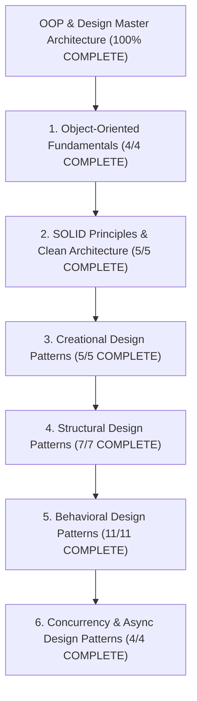

# Object-Oriented Programming & Design Patterns — Map of Content

> [!abstract] Architectural Mission
> This Map of Content organizes the complete **Object-Oriented Programming & Design Patterns** knowledge base, covering OOP core paradigms (Encapsulation, Inheritance, Polymorphism, Abstraction), the SOLID principles, clean code architecture, all 23 Gang of Four (GoF) Creational, Structural, and Behavioral design patterns, and modern concurrency/asynchronous design patterns. Every note provides production-grade code implementations (Java/C++/Python/TypeScript), UML class diagrams, anti-patterns, trade-offs, and system design interview questions.

---

## 1. Object-Oriented Fundamentals (4/4 COMPLETE)

- [x] [[Encapsulation, Data Hiding, and Information Hiding]]
- [x] [[Inheritance, Subtyping, and Composition vs Inheritance]]
- [x] [[Polymorphism - Dynamic Binding, Virtual Method Tables, Method Overloading vs Overriding]]
- [x] [[Abstraction and Interface-Driven Design]]

---

## 2. SOLID Principles & Clean Architecture (5/5 COMPLETE)

- [x] [[Single Responsibility Principle - SRP and Cohesion]]
- [x] [[Open-Closed Principle - OCP and Extensibility]]
- [x] [[Liskov Substitution Principle - LSP and Subtyping Invariants]]
- [x] [[Interface Segregation Principle - ISP and Decoupling]]
- [x] [[Dependency Inversion Principle - DIP and Dependency Injection Containers]]

---

## 3. Creational Design Patterns (5/5 COMPLETE)

- [x] [[Singleton Pattern - Thread-Safe Initialization, Double-Checked Locking, Enum Singleton]]
- [x] [[Factory Method Pattern - Virtual Constructors and Extensible Object Creation]]
- [x] [[Abstract Factory Pattern - Product Families and Platform Decoupling]]
- [x] [[Builder Pattern - Fluent Interfaces, Step Builders, and Immutable Object Construction]]
- [x] [[Prototype Pattern - Deep vs Shallow Copying and Prototype Managers]]

---

## 4. Structural Design Patterns (7/7 COMPLETE)

- [x] [[Adapter Pattern - Class vs Object Adapters and Interface Translation]]
- [x] [[Bridge Pattern - Decoupling Abstraction from Implementation]]
- [x] [[Composite Pattern - Tree Structures, Uniformity vs Type Safety]]
- [x] [[Decorator Pattern - Dynamic Behavior Extension and Wrapper Chaining]]
- [x] [[Facade Pattern - Simplifying Subsystem Interfaces and Boundary Layering]]
- [x] [[Flyweight Pattern - Intrinsic vs Extrinsic State and Memory Optimization]]
- [x] [[Proxy Pattern - Virtual, Remote, Protection, and Smart Proxies]]

---

## 5. Behavioral Design Patterns (11/11 COMPLETE)

- [x] [[Chain of Responsibility Pattern - Handler Chains and Middleware Pipelines]]
- [x] [[Command Pattern - Encapsulating Requests, Undo-Redo, and Macro Commands]]
- [x] [[Interpreter Pattern - Domain-Specific Languages and Abstract Syntax Trees]]
- [x] [[Iterator Pattern - Custom Collections, External vs Internal Iteration]]
- [x] [[Mediator Pattern - Decoupling Peer Communication and Centralized Coordination]]
- [x] [[Memento Pattern - Capturing and Restoring State without Violating Encapsulation]]
- [x] [[Observer Pattern - Event Buses, Publish-Subscribe, and Reactive Streams]]
- [x] [[State Pattern - Finite State Machines and State-Driven Behavior]]
- [x] [[Strategy Pattern - Algorithmic Interchangeability and Policy Objects]]
- [x] [[Template Method Pattern - Inversion of Control and Hook Methods]]
- [x] [[Visitor Pattern - Double Dispatch and Operations over Heterogeneous Trees]]

---

## 6. Concurrency & Async Design Patterns (4/4 COMPLETE)

- [x] [[Producer-Consumer Pattern - Bounded Queues and Condition Variables]]
- [x] [[Active Object Pattern - Decoupling Method Execution from Invocation]]
- [x] [[Thread Pool Pattern - Worker Queues, Task Rejection Policies, Work Stealing]]
- [x] [[Reactor and Proactor Patterns - Event-Driven Asynchronous IO Multiplexing]]

---

*Last updated: 2026-08-18 | Status: COMPLETE (36 Canonical Notes + 1 MOC) | Subject 04 — OOP & Design*
