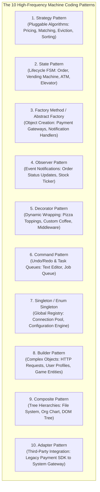
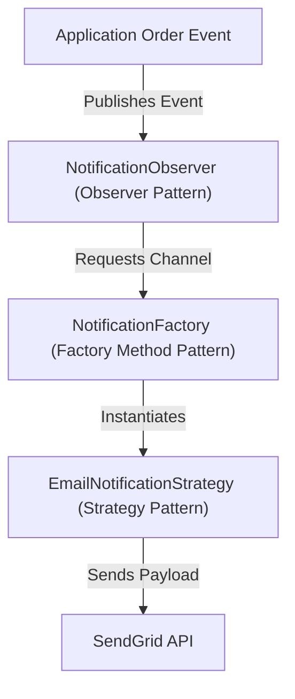
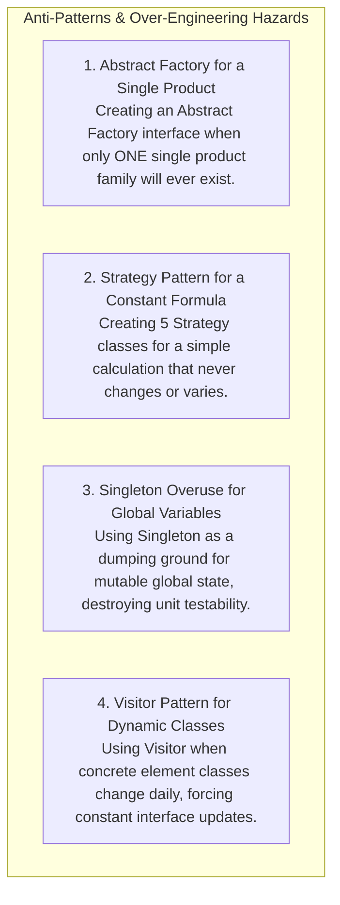
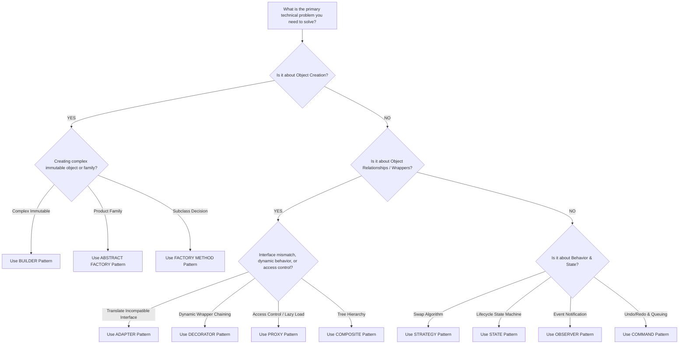

# Design Patterns in LLD — Practical Application Guide

## Mental Model

Think of **Design Patterns in LLD** as a professional master craftsman's specialized toolbelt (a hammer, torque wrench, electrical tester, and soldering iron). 

A novice builder attempts to solve every construction problem using a single sledgehammer (**Monolithic Procedural Code**). They use `if/else` checks for pricing, hardcode thread creation, and tightly couple database queries directly inside UI code. 

A master software engineer selects the exact pattern for the job: applying **Strategy** for dynamic pricing algorithms, **State** for order lifecycles, **Factory** for object creation, **Observer** for event notifications, and **Decorator** for stream processing. Knowing *when*, *why*, and *how* to combine patterns under interview pressure is what separates junior coders from Staff Engineers.

---

## 1. Top 10 Design Patterns for LLD Machine Coding



---

## 2. Comprehensive LLD Problem to Pattern Mapping Matrix

When presented with a specific LLD problem, immediately identify the governing design patterns:

| LLD System Design Problem | Primary Pattern(s) Required | Secondary Pattern(s) | Architectural Purpose |
|---|---|---|---|
| **Parking Lot System** | **Strategy Pattern** | Factory Method, Singleton | Dynamic Spot Allocation (`NearestSpot`, `FCFS`) & Hourly Pricing. |
| **Elevator Control System** | **State Pattern** & **Strategy** | Observer | Elevator States (`IDLE`, `MOVING_UP`, `MOVING_DOWN`) & Dispatching Algorithms (`SCAN`, `LOOK`). |
| **Vending Machine System** | **State Pattern** | Chain of Responsibility | Vending States (`NoCoin`, `HasCoin`, `Sold`, `Dispensing`) & Money Validation. |
| **Automated Teller Machine (ATM)** | **State Pattern** & **Chain of Resp.** | Command | ATM States (`NoCard`, `HasPin`) & Cash Dispensing Chain ($100 \to $50 \to $20 notes). |
| **In-Memory Cache (LRU/LFU)** | **Strategy Pattern** | Proxy, Factory | Pluggable Eviction Policies (`LRUEviction`, `LFUEviction`) & Cache Decorators. |
| **Rate Limiter System** | **Strategy Pattern** | Singleton | Rate Limiting Algorithms (`TokenBucket`, `LeakyBucket`, `SlidingWindow`). |
| **Movie Ticket Booking (BookMyShow)** | **State Pattern** & **Observer** | Strategy, Lock Manager | Seat States (`AVAILABLE`, `BLOCKED`, `BOOKED`) & Event Notifications. |
| **Pizza / Coffee Ordering System** | **Decorator Pattern** | Builder, Factory | Dynamic Topping Wrapping (`BasePizza + CheeseDecorator + MushroomDecorator`). |
| **Notification Gateway** | **Strategy Pattern** & **Factory** | Observer | Multi-channel Routing (`Email`, `SMS`, `Push`) & Vendor Fallback. |
| **Text Editor / Graphics Canvas** | **Command Pattern** & **Memento** | Composite | Undo/Redo Engine, State Snapshots, and Layer Component Trees. |

---

## 3. Practical Code Synergy: Combining Patterns Cleanly

In real-world LLD problems, design patterns do not exist in isolation; they **collaborate synergy-wise**.

### Example: Combining Factory + Strategy + Observer in a Notification Engine



```java
// 1. STRATEGY INTERFACE
public interface NotificationStrategy {
    void sendNotification(String recipient, String message);
}

// 2. CONCRETE STRATEGIES
public class EmailStrategy implements NotificationStrategy {
    @Override public void sendNotification(String recipient, String msg) {
        System.out.println("Email Sent to " + recipient + ": " + msg);
    }
}

public class SmsStrategy implements NotificationStrategy {
    @Override public void sendNotification(String recipient, String msg) {
        System.out.println("SMS Sent to " + recipient + ": " + msg);
    }
}

// 3. FACTORY METHOD (Creates Strategies)
public class NotificationFactory {
    public static NotificationStrategy getStrategy(String channel) {
        if ("EMAIL".equalsIgnoreCase(channel)) return new EmailStrategy();
        if ("SMS".equalsIgnoreCase(channel)) return new SmsStrategy();
        throw new IllegalArgumentException("Unknown channel: " + channel);
    }
}

// 4. OBSERVER (Triggers Notification on Order Event)
public class OrderNotificationObserver {
    public void onOrderPlaced(String email, String phone, double amount) {
        // Factory + Strategy Synergy!
        NotificationStrategy emailSender = NotificationFactory.getStrategy("EMAIL");
        emailSender.sendNotification(email, "Your order of $" + amount + " is confirmed!");

        NotificationStrategy smsSender = NotificationFactory.getStrategy("SMS");
        smsSender.sendNotification(phone, "Order placed successfully!");
    }
}
```

---

## 4. Pattern Anti-Patterns: When NOT to Use Design Patterns

Applying design patterns unnecessarily is a major failure mode in machine coding interviews (**Patternitis / Over-Engineering**).



---

## 5. Architectural Decision Flowchart: Selecting the Right Pattern



---

## 6. Active-Recall Prompts

1. **Which 3 design patterns are most frequently applied when building an Elevator System or Vending Machine?**
2. **What is the difference between how the Strategy Pattern and the State Pattern model class relationships?**
3. **Demonstrate how Factory Method, Strategy, and Observer collaborate cleanly in an enterprise Notification Engine.**
4. **What is "Patternitis", and how do you avoid over-engineering simple machine coding problems?**

---

## Related Notes

- [[Object-Oriented Analysis and Design - Requirement Gathering, Use Cases, and Class Diagrams]]
- [[Machine Coding Interview Framework - 45-Minute Execution Blueprint]]
- [[LLD - Parking Lot System]]
- [[LLD - Elevator Control System]]

> **Interview Style Question:** *"You are designing a high-throughput Ride-Sharing Platform (Uber/Lyft). Map the top 5 design patterns required across Driver Matching, Surge Pricing, Trip Lifecycle State Machine, Location Tracking Event Broadcasting, and Multi-Payment Gateway Integration. Write Java/TypeScript interface skeletons proving how these patterns collaborate cleanly."*

---
