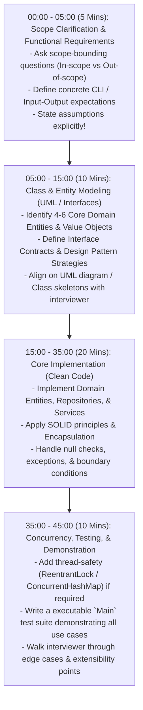
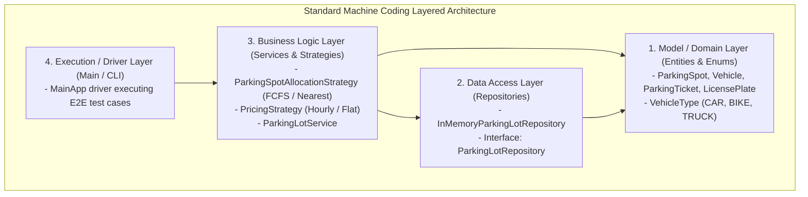

# Machine Coding Interview Framework — 45-Minute Execution Blueprint

## Mental Model

Think of a **45-Minute Machine Coding / LLD Interview** as a timed Formula 1 pit stop. 

If a mechanic starts randomly changing tires without inspecting the car, communicating with the driver, or agreeing on the stop sequence (**Jumping Straight to Coding without Architecture**), the pit stop fails, the car crashes, and the interview ends in rejection. 

A successful candidate follows a disciplined **45-minute execution playbook**: 5 minutes clarifying scope & requirements, 10 minutes designing class diagrams & interfaces, 20 minutes writing modular, clean, working code, and 10 minutes writing unit tests, handling concurrency edge cases, and demonstrating execution.

---

## 1. The 45-Minute Machine Coding Timeline



---

## 2. Phase 1: Clarifying Scope & Bounding Requirements (Mins 0-5)

Never start coding immediately. Interrogate the problem prompt to bound scope.

### The 4 Essential Questions to Ask
1. **Concurrency Scope:** *"Should this system support multi-threaded concurrent access, or can we focus on a single-threaded functional implementation first?"*
2. **Persistence Scope:** *"Is an in-memory collection (Maps/Lists) sufficient for storage, or should I abstract a DB repository interface?"*
3. **Input/Output Mechanism:** *"Would you prefer a programmatic `Main` driver method, interactive CLI scanner, or unit test suite?"*
4. **Extension Expectations:** *"What are the likely future extension points (e.g., dynamic pricing strategies, new spot types)?"*

#### Example Clarification Output (Parking Lot)

```text
AGREED SCOPE:
- In-Scope: Multi-floor parking lot, 3 spot sizes (Compact, Large, Handicapped), 
            First-Come-First-Served (FCFS) spot allocation, Hourly pricing calculator, In-Memory storage.
- Out-of-Scope: Persistence DB, Payment Gateway API integration, UI/Frontend.
```

---

## 3. Phase 2: Entity & Class Diagram Blueprint (Mins 5-15)

Map the domain using clean architectural layers:



---

## 4. Phase 3: Clean Code Implementation Rules (Mins 15-35)

When writing code under interview pressure, adhere strictly to these 5 Clean Code Rules:

### Rule 1: Enforce Strict Encapsulation
Keep fields `private final`. Expose immutable getters; never expose raw mutable collection references (`return Collections.unmodifiableList(items)`).

### Rule 2: Prefer Strategy Pattern over `switch` Blocks
Replace growing `if/else` checks for pricing or allocation algorithms with clean Strategy interfaces.

### Rule 3: Single Responsibility Classes
Keep class sizes small ($<150$ lines). A `ParkingTicket` entity should not calculate its own hourly tax rate; delegate to a `PricingStrategy`.

### Rule 4: Thread Safety by Design
If concurrency is required, use `ConcurrentHashMap`, `AtomicLong`, and `ReentrantLock` around critical section state updates.

### Rule 5: Fail Fast with Meaningful Exceptions
Throw custom domain exceptions (`SpotUnavailableException`, `InvalidTicketException`) rather than returning raw `null`.

---

## 5. Phase 4: Executable Test Suite Blueprint (Mins 35-45)

Demonstrate working functionality using an organized `Main` method that tests all happy paths and edge cases.

```java
public class MainApp {
    public static void main(String[] args) {
        System.out.println("==========================================");
        System.out.println("  PARKING LOT SYSTEM DEMONSTRATION SUITE  ");
        System.out.println("==========================================\n");

        // 1. Setup Architecture
        ParkingLotRepository repo = new InMemoryParkingLotRepository();
        PricingStrategy pricingStrategy = new HourlyPricingStrategy(10.0); // $10/hr
        AllocationStrategy allocationStrategy = new FirstAvailableAllocationStrategy();
        
        ParkingLotService service = new ParkingLotService(repo, pricingStrategy, allocationStrategy);

        // 2. Initialize Parking Lot Capacity
        service.addSpot(new ParkingSpot("SPOT-1", SpotType.COMPACT));
        service.addSpot(new ParkingSpot("SPOT-2", SpotType.LARGE));

        // 3. Test Case 1: Park Vehicle (Happy Path)
        Vehicle car1 = new Vehicle("CAR-9988", VehicleType.CAR);
        ParkingTicket ticket1 = service.parkVehicle(car1);
        System.out.println("SUCCESS: Parked " + car1.getLicensePlate() + " -> Ticket: " + ticket1.getTicketId());

        // 4. Test Case 2: Park when Full (Edge Case)
        Vehicle car2 = new Vehicle("CAR-1122", VehicleType.CAR);
        service.parkVehicle(car2); // Consumes SPOT-2
        
        try {
            Vehicle car3 = new Vehicle("CAR-3344", VehicleType.CAR);
            service.parkVehicle(car3); // Should THROW SpotUnavailableException!
        } catch (SpotUnavailableException e) {
            System.out.println("EXPECTED ERROR: " + e.getMessage());
        }

        // 5. Test Case 3: Process Exit & Payment Calculation
        double fee = service.unparkVehicle(ticket1.getTicketId());
        System.out.println("SUCCESS: Unparked Ticket " + ticket1.getTicketId() + " -> Fee Charged: $" + fee);
    }
}
```

---

## 6. Machine Coding Grading Criteria Matrix

Interviewers grade machine coding rounds across 5 explicit dimensions:

| Dimension | Weight | Target Candidate Demonstration |
|---|---|---|
| **Code Executability & Correctness** | **30%** | Does the code compile, run, and correctly solve all primary use cases? |
| **Object-Oriented Design & Clean Code** | **25%** | Proper domain entity modeling, SOLID principles, zero God classes. |
| **Extensibility & Pattern Selection** | **20%** | Are strategies/factories used to allow adding features without editing existing code? |
| **Concurrency & Edge Cases** | **15%** | Thread safety, race condition prevention, meaningful exception handling. |
| **Code Readability & Naming** | **10%** | Self-documenting variable names, clean folder structures, zero un-handled nulls. |

---

## 7. Active-Recall Prompts

1. **What is the 45-minute time breakdown for a Machine Coding interview (Scope $\to$ Design $\to$ Code $\to$ Test)?**
2. **What 4 scope-bounding questions should you ask the interviewer in the first 5 minutes?**
3. **Why should you use an in-memory Repository interface instead of embedding raw HashMap variables inside your domain Service classes?**
4. **How does using the `CallerRunsPolicy` or bounded blocking queues enforce backpressure during concurrent machine coding implementations?**

---

## Related Notes

- [[Object-Oriented Analysis and Design - Requirement Gathering, Use Cases, and Class Diagrams]]
- [[LLD - Parking Lot System]]
- [[LLD - Elevator Control System]]
- [[LLD - Thread-Safe In-Memory Cache with LRU and LFU Eviction]]

> **Interview Style Question:** *"You are in a 45-minute Machine Coding round for a Senior Staff Engineer role at Uber. The interviewer asks you to 'Design an In-Memory Ride Sharing Dispatch Engine'. Walk through your exact 45-minute execution blueprint: state your 5-minute scope assumptions, sketch the 4-layer architecture, write the core Strategy interfaces for Driver Matching (`NearestDriverStrategy` vs `HighestRatingStrategy`), and demonstrate your executable unit test suite."*

---
