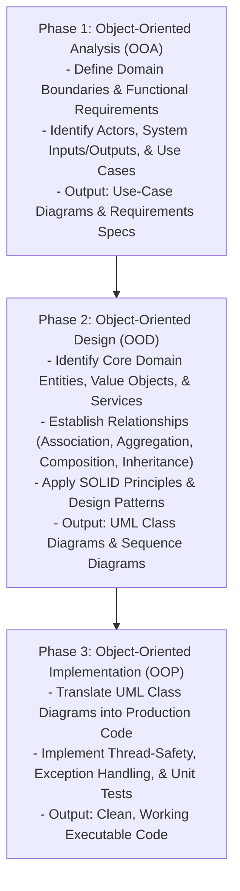
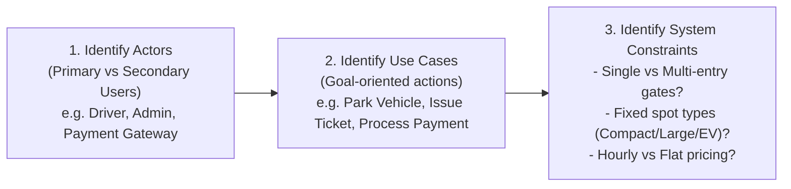
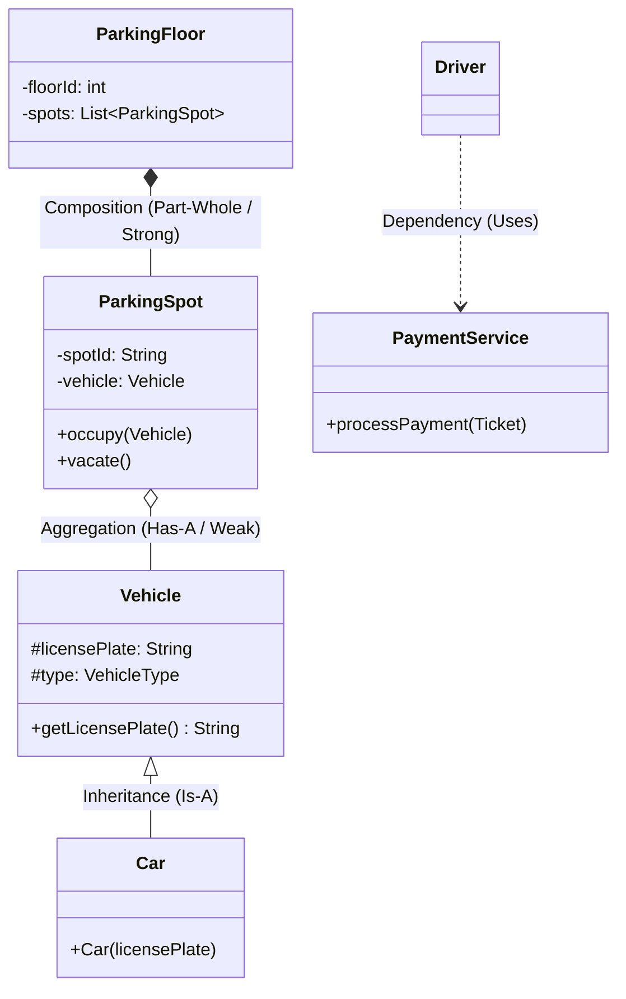
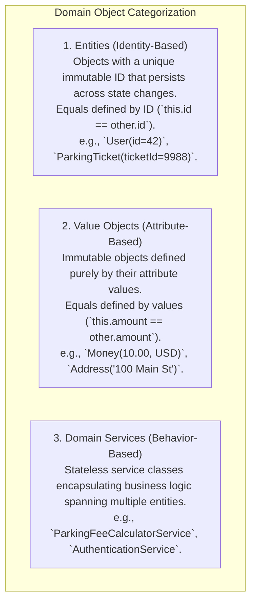

# Object-Oriented Analysis and Design — Requirement Gathering, Use Cases, and Class Diagrams

## Mental Model

Think of **Object-Oriented Analysis and Design (OOAD)** as an architect constructing a skyscraper. 

Before pouring concrete or laying steel beams (**Writing Code**), the architect conducts two distinct phases: First, **Analysis** gathers user requirements, identifies actors, and maps use-case workflows (*"What does the building need to do?"*). Second, **Design** constructs structural blueprints, defines class boundaries, identifies entity relationships (1:1, 1:N, N:M), and establishes design pattern contracts (*"How do software components collaborate cleanly?"*). 

Attempting to write machine coding implementations without OOAD is like erecting steel beams without blueprints—resulting in fragile code, broken edge cases, and architectural refactoring failures under interview pressure.

---

## 1. The 3 Phases of OOAD



---

## 2. Requirement Gathering & Use-Case Analysis

When presented with an ambiguous LLD problem (e.g., *"Design an Elevator System"* or *"Design a Parking Lot"*), use-case analysis converts vague problem statements into unambiguous functional contracts.

### Step-by-Step Use-Case Identification Framework



#### Example Use-Case Specification: Parking Lot System

| Use Case ID | Use Case Name | Primary Actor | Preconditions | Postconditions |
|---|---|---|---|---|
| **UC-1** | Issue Parking Ticket | Driver | Parking lot has available spot matching vehicle size. | Spot marked `OCCUPIED`; Ticket generated with Timestamp & SpotID. |
| **UC-2** | Process Exit & Payment | Driver / Attendant | Valid Ticket presented at exit gate. | Fee calculated based on duration; Spot marked `AVAILABLE`. |
| **UC-3** | Add Spot / Rate Policy | Admin | Admin authenticated. | System capacity or pricing policy updated dynamically. |

---

## 3. UML Class Diagrams & Relationship Taxonomy

The core deliverable of OOAD is the **UML Class Diagram**, which visualizes class structures, visibility, and object relationships.



### The 5 Essential UML Relationship Types

| Relationship | Symbol | UML Notation | Coupling Level | Lifetime Dependency | Example |
|---|---|---|---|---|---|
| **Inheritance (Generalization)** | `Is-A` | `Solid Line + White Triangle` | **Highest** | Child lifecycle bound to Parent. | `Car extends Vehicle` |
| **Realization (Implementation)** | `Can-Do` | `Dashed Line + White Triangle` | Medium | Class fulfills Interface contract. | `PostgresRepo implements Repository` |
| **Composition** | `Part-Whole (Strong)` | `Solid Line + Filled Diamond` | **High** | Child CANNOT exist without Parent. | `Building *-- Room` (Room dies with Building) |
| **Aggregation** | `Has-A (Weak)` | `Solid Line + Empty Diamond` | Medium | Child CAN exist independently of Parent. | `Library o-- Book` (Book survives Library deletion) |
| **Dependency** | `Uses` | `Dashed Line + Arrow` | **Lowest** | Method parameter or transient local use. | `Driver ..> PaymentGateway` |

---

## 4. Class Design Principles: Entities vs. Value Objects vs. Services

In Domain-Driven Design (DDD) and OOAD, domain classes are categorized into three distinct categories:



---

## 5. Production Code Skeleton: Mapping OOAD to Java

```java
// ============================================================================
// 1. VALUE OBJECT (Immutable, Equals based on values)
// ============================================================================
public final class LicensePlate {
    private final String number;
    private final String state;

    public LicensePlate(String number, String state) {
        if (number == null || number.isBlank()) throw new IllegalArgumentException("Invalid plate");
        this.number = number;
        this.state = state != null ? state : "UNKNOWN";
    }

    public String getNumber() { return number; }
    public String getState() { return state; }

    @Override
    public boolean equals(Object o) {
        if (this == o) return true;
        if (!(o instanceof LicensePlate)) return false;
        LicensePlate that = (LicensePlate) o;
        return Objects.equals(number, that.number) && Objects.equals(state, that.state);
    }

    @Override
    public int hashCode() {
        return Objects.hash(number, state);
    }
}

// ============================================================================
// 2. ENTITY (Identity-based, Equals based on ticketId)
// ============================================================================
public class ParkingTicket {
    private final String ticketId; // Immutable Unique Identity
    private final LicensePlate licensePlate; // Value Object
    private final String spotId;
    private final Instant entryTime;
    private Instant exitTime;
    private double feeCharged;

    public ParkingTicket(String ticketId, LicensePlate licensePlate, String spotId, Instant entryTime) {
        this.ticketId = Objects.requireNonNull(ticketId);
        this.licensePlate = Objects.requireNonNull(licensePlate);
        this.spotId = Objects.requireNonNull(spotId);
        this.entryTime = Objects.requireNonNull(entryTime);
    }

    public void markExit(Instant exitTime, double feeCharged) {
        this.exitTime = exitTime;
        this.feeCharged = feeCharged;
    }

    public String getTicketId() { return ticketId; }
    public LicensePlate getLicensePlate() { return licensePlate; }
    public String getSpotId() { return spotId; }
    public Instant getEntryTime() { return entryTime; }

    @Override
    public boolean equals(Object o) {
        if (this == o) return true;
        if (!(o instanceof ParkingTicket)) return false;
        ParkingTicket that = (ParkingTicket) o;
        return Objects.equals(ticketId, that.ticketId); // Identity Comparison!
    }

    @Override
    public int hashCode() {
        return Objects.hash(ticketId);
    }
}
```

---

## 6. Failure Modes and Trade-offs

1. **Confusing Aggregation vs. Composition** — Modeling `ParkingSpot` as Composition inside `Vehicle`. A vehicle does not own the parking spot; the spot exists independently of the vehicle (**Aggregation**). *Mitigation*: Ask *"If parent dies, does child die?"* If no $\to$ Aggregation.
2. **Anemic Domain Model Anti-Pattern** — Creating entities with only public getters/setters and putting all domain logic into service classes. Domain entities become dumb data structs. *Mitigation*: Move state-mutating validation logic directly into domain entities (`ticket.markExit()`).
3. **Over-Modeling Upfront** — Spending 30 minutes drawing 40 class boxes with complex inheritance for a 45-minute coding interview. *Mitigation*: Focus on 4-6 core domain classes first, then refine during code implementation.

---

## 7. Active-Recall Prompts

1. **Differentiate between Object-Oriented Analysis (OOA), Design (OOD), and Implementation (OOP).**
2. **Explain the 5 UML relationship types (Inheritance, Realization, Composition, Aggregation, Dependency) with examples.**
3. **What is the difference between Composition and Aggregation regarding parent-child lifetimes?**
4. **Compare Domain Entities (Identity-based) vs. Value Objects (Attribute-based).**

---

## Related Notes

- [[Machine Coding Interview Framework - 45-Minute Execution Blueprint]]
- [[Single Responsibility Principle - SRP and Cohesion]]
- [[Open-Closed Principle - OCP and Extensibility]]
- [[Encapsulation, Data Hiding, and Information Hiding]]

> **Interview Style Question:** *"Conduct an Object-Oriented Analysis and Design (OOAD) for an Automated Bike-Sharing System (like CitiBike). Identify primary actors, list 4 core use-cases, draw the UML Class Diagram illustrating relationships between `Bike`, `DockingStation`, `User`, and `RideTicket`, differentiate Entities vs. Value Objects, and write Java/TypeScript domain skeletons."*

---
