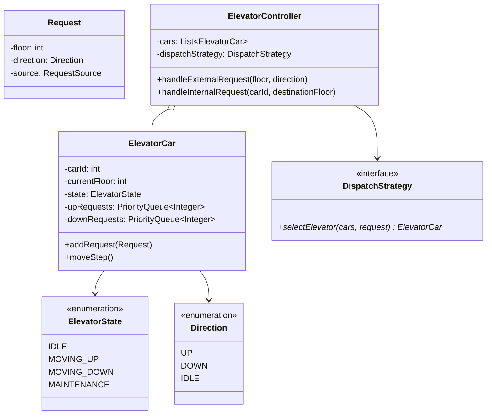

# LLD — Elevator Control System

## Mental Model

Think of an **Elevator Control System** as a coordinated fleet of vertical transit cars governed by an intelligent dispatching brain. 

Passengers request elevators from outside hall panels (**External Request: Floor + Direction**) or inside car panels (**Internal Request: Destination Floor**). 

The central Elevator Dispatcher (**The Strategy Engine**) evaluates the status of all elevator cars—checking their current floor, direction of motion, state (`IDLE`, `MOVING_UP`, `MOVING_DOWN`), and existing request queues—to assign requests using optimal algorithms (**LOOK / SCAN / Elevator Algorithm**). Each elevator car operates as an independent state machine processing its priority queues.

---

## 1. Problem Statement & Functional Requirements

### Functional Requirements
1. **Multi-Car & Multi-Floor Support:** System controls $N$ elevator cars across a building with $M$ floors.
2. **Elevator States:** Each elevator car moves through distinct state transitions: `IDLE`, `MOVING_UP`, `MOVING_DOWN`, and `MAINTENANCE`.
3. **Dual Request Sources:**
   - **External Request:** Generated outside on a floor hall button (`floor`, `direction: UP/DOWN`).
   - **Internal Request:** Generated inside an elevator car (`destinationFloor`).
4. **Elevator Dispatching Strategy:** Pluggable strategy algorithm to select the best car (e.g., `NearestCarStrategy`, `LOOK_SCAN_Strategy`).
5. **LOOK / SCAN Algorithm:** Elevators process requests in the current direction of motion until no higher/lower requests remain, then reverse direction (avoids starvation).
6. **Thread-Safety:** Elevator cars operate concurrently on independent threads.

---

## 2. System Class Diagram (UML)



---

## 3. Production Code Implementation (Java)

```java
package com.lld.elevator;

import java.util.*;
import java.util.concurrent.ConcurrentHashMap;
import java.util.concurrent.PriorityBlockingQueue;
import java.util.concurrent.atomic.AtomicInteger;

// ============================================================================
// 1. ENUMS & REQUEST OBJECTS
// ============================================================================
enum Direction { UP, DOWN, IDLE }

enum ElevatorState { IDLE, MOVING_UP, MOVING_DOWN, MAINTENANCE }

enum RequestSource { INTERNAL, EXTERNAL }

public class Request {
    private final int targetFloor;
    private final Direction direction;
    private final RequestSource source;

    public Request(int targetFloor, Direction direction, RequestSource source) {
        this.targetFloor = targetFloor;
        this.direction = direction;
        this.source = source;
    }

    public int getTargetFloor() { return targetFloor; }
    public Direction getDirection() { return direction; }
    public RequestSource getSource() { return source; }
}

// ============================================================================
// 2. ELEVATOR CAR (State Machine & Priority Queue Processor)
// ============================================================================
public class ElevatorCar {
    private final int carId;
    private final AtomicInteger currentFloor = new AtomicInteger(1);
    private volatile ElevatorState state = ElevatorState.IDLE;
    private volatile Direction direction = Direction.IDLE;

    // LOOK / SCAN Priority Queues:
    // UP requests sorted ascending (1 -> 5 -> 10)
    private final PriorityQueue<Integer> upQueue = new PriorityQueue<>();
    // DOWN requests sorted descending (10 -> 5 -> 1)
    private final PriorityQueue<Integer> downQueue = new PriorityQueue<>(Collections.reverseOrder());

    public ElevatorCar(int carId) {
        this.carId = carId;
    }

    public synchronized void addRequest(Request request) {
        int target = request.getTargetFloor();
        int current = currentFloor.get();

        if (target == current && state == ElevatorState.IDLE) {
            System.out.println("Car " + carId + ": Already at floor " + current + ". Opening doors.");
            return;
        }

        if (target > current) {
            upQueue.offer(target);
        } else {
            downQueue.offer(target);
        }

        // Set initial direction if idle
        if (state == ElevatorState.IDLE) {
            if (!upQueue.isEmpty()) {
                state = ElevatorState.MOVING_UP;
                direction = Direction.UP;
            } else if (!downQueue.isEmpty()) {
                state = ElevatorState.MOVING_DOWN;
                direction = Direction.DOWN;
            }
        }

        System.out.println("Car " + carId + ": Added request for floor " + target + " | Direction: " + direction);
    }

    // Single step iteration of elevator movement
    public synchronized void moveStep() {
        if (state == ElevatorState.MAINTENANCE || state == ElevatorState.IDLE) {
            return;
        }

        if (direction == Direction.UP) {
            if (!upQueue.isEmpty()) {
                int nextFloor = upQueue.peek();
                currentFloor.incrementAndGet();
                System.out.println("Car " + carId + " -> Moving UP to floor " + currentFloor.get());

                if (currentFloor.get() == nextFloor) {
                    upQueue.poll();
                    System.out.println("Car " + carId + " -> ARRIVED at floor " + currentFloor.get() + "! Passengers exit/enter.");
                }
            }

            // Direction reversal check
            if (upQueue.isEmpty()) {
                if (!downQueue.isEmpty()) {
                    direction = Direction.DOWN;
                    state = ElevatorState.MOVING_DOWN;
                    System.out.println("Car " + carId + " -> Reversing direction to DOWN");
                } else {
                    direction = Direction.IDLE;
                    state = ElevatorState.IDLE;
                    System.out.println("Car " + carId + " -> Now IDLE at floor " + currentFloor.get());
                }
            }
        } else if (direction == Direction.DOWN) {
            if (!downQueue.isEmpty()) {
                int nextFloor = downQueue.peek();
                currentFloor.decrementAndGet();
                System.out.println("Car " + carId + " -> Moving DOWN to floor " + currentFloor.get());

                if (currentFloor.get() == nextFloor) {
                    downQueue.poll();
                    System.out.println("Car " + carId + " -> ARRIVED at floor " + currentFloor.get() + "! Passengers exit/enter.");
                }
            }

            // Direction reversal check
            if (downQueue.isEmpty()) {
                if (!upQueue.isEmpty()) {
                    direction = Direction.UP;
                    state = ElevatorState.MOVING_UP;
                    System.out.println("Car " + carId + " -> Reversing direction to UP");
                } else {
                    direction = Direction.IDLE;
                    state = ElevatorState.IDLE;
                    System.out.println("Car " + carId + " -> Now IDLE at floor " + currentFloor.get());
                }
            }
        }
    }

    public int getCarId() { return carId; }
    public int getCurrentFloor() { return currentFloor.get(); }
    public ElevatorState getState() { return state; }
    public Direction getDirection() { return direction; }
}

// ============================================================================
// 3. DISPATCH STRATEGY (Selects Best Car for External Requests)
// ============================================================================
public interface DispatchStrategy {
    ElevatorCar selectElevator(List<ElevatorCar> cars, Request request);
}

public class NearestElevatorStrategy implements DispatchStrategy {
    @Override
    public ElevatorCar selectElevator(List<ElevatorCar> cars, Request request) {
        ElevatorCar bestCar = null;
        int minDistance = Integer.MAX_VALUE;

        for (ElevatorCar car : cars) {
            if (car.getState() == ElevatorState.MAINTENANCE) continue;

            int distance = Math.abs(car.getCurrentFloor() - request.getTargetFloor());

            // Score bonus if car is moving in same direction
            if (car.getDirection() == request.getDirection() || car.getDirection() == Direction.IDLE) {
                distance -= 2; // Priority boost
            }

            if (distance < minDistance) {
                minDistance = distance;
                bestCar = car;
            }
        }

        return bestCar != null ? bestCar : cars.get(0);
    }
}

// ============================================================================
// 4. MAIN ELEVATOR CONTROLLER (Facade & System Coordinator)
// ============================================================================
public class ElevatorController {
    private final List<ElevatorCar> cars;
    private final DispatchStrategy dispatchStrategy;

    public ElevatorController(int numCars, DispatchStrategy dispatchStrategy) {
        this.cars = new ArrayList<>();
        for (int i = 1; i <= numCars; i++) {
            cars.add(new ElevatorCar(i));
        }
        this.dispatchStrategy = dispatchStrategy;
    }

    public void handleExternalRequest(int floor, Direction direction) {
        System.out.println("\n[EXTERNAL BUTTON] Floor " + floor + " requested direction " + direction);
        Request req = new Request(floor, direction, RequestSource.EXTERNAL);
        ElevatorCar selectedCar = dispatchStrategy.selectElevator(cars, req);
        selectedCar.addRequest(req);
    }

    public void handleInternalRequest(int carId, int destinationFloor) {
        System.out.println("\n[INTERNAL BUTTON] Car " + carId + " requested destination floor " + destinationFloor);
        ElevatorCar car = cars.get(carId - 1);
        Direction dir = destinationFloor > car.getCurrentFloor() ? Direction.UP : Direction.DOWN;
        Request req = new Request(destinationFloor, dir, RequestSource.INTERNAL);
        car.addRequest(req);
    }

    // Step simulation across all cars
    public void stepSimulation() {
        for (ElevatorCar car : cars) {
            car.moveStep();
        }
    }

    public List<ElevatorCar> getCars() { return cars; }
}
```

---

## 4. Executable Test Suite (`Main`)

```java
public class Main {
    public static void main(String[] args) {
        DispatchStrategy strategy = new NearestElevatorStrategy();
        ElevatorController controller = new ElevatorController(2, strategy); // 2 Elevator Cars

        // Request 1: Someone at Floor 3 wants to go UP
        controller.handleExternalRequest(3, Direction.UP);

        // Request 2: Someone at Floor 5 wants to go DOWN
        controller.handleExternalRequest(5, Direction.DOWN);

        // Simulate 5 Step Cycles
        System.out.println("\n=== SIMULATION START ===");
        for (int step = 1; step <= 6; step++) {
            System.out.println("\n--- Step Cycle " + step + " ---");
            controller.stepSimulation();
        }

        // Inside Car 1, passenger presses button for Floor 8
        controller.handleInternalRequest(1, 8);

        // Simulate 4 More Cycles
        for (int step = 7; step <= 10; step++) {
            System.out.println("\n--- Step Cycle " + step + " ---");
            controller.stepSimulation();
        }
    }
}
```

---

## 5. Active-Recall Prompts

1. **How does the LOOK / SCAN algorithm prevent elevator starvation compared to simple First-Come-First-Served (FCFS)?**
2. **How does an elevator car use dual Priority Queues (`upQueue` vs `downQueue`) to manage movement steps efficiently?**
3. **What is the difference between an External Request (Hall Button) and an Internal Request (Car Panel)?**
4. **How does the Strategy Pattern allow swapping `NearestElevatorStrategy` for a `ZoneBasedDispatchStrategy` in a 100-story skyscraper?**

---

## Related Notes

- [[LLD - Parking Lot System]]
- [[State Pattern - Finite State Machines and State-Driven Behavior]]
- [[Strategy Pattern - Algorithmic Interchangeability and Policy Objects]]
- [[Observer Pattern - Event Buses, Publish-Subscribe, and Reactive Streams]]

> **Interview Style Question:** *"Design and implement an Elevator Control System for a 50-story commercial building with 4 elevator cars. Implement the LOOK/SCAN algorithm using dual priority queues, write a thread-safe `NearestElevatorStrategy`, support dual external/internal request dispatching, and demonstrate step-by-step state simulation."*

---
