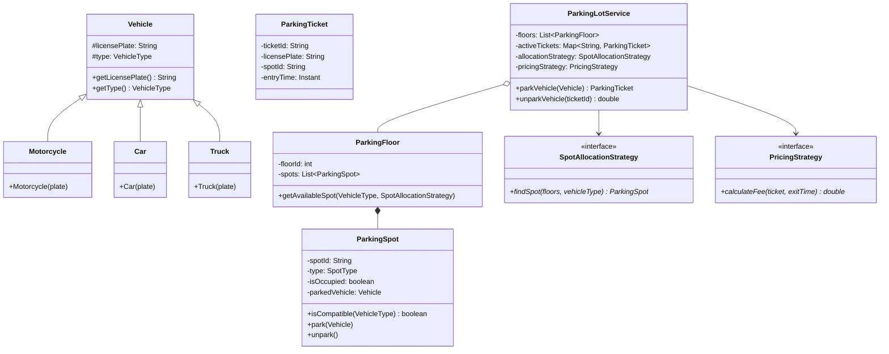

# LLD — Parking Lot System

## Mental Model

Think of a **Multi-Floor Parking Lot System** as an automated physical grid dispatcher. 

Vehicles of various sizes (**Motorcycle, Car, Truck/Bus**) arrive at multiple entry gates. The system evaluates available parking spots across multiple floors (**Spot Allocation Strategy**), assigns the optimal compatible spot, issues a ticket with a entry timestamp, and marks the spot occupied. 

When the vehicle exits via an exit gate, the system calculates the parking fee based on duration and pricing tier (**Pricing Strategy**), processes the payment, frees up the spot, and updates real-time display boards at all entrance gates.

---

## 1. Problem Statement & Functional Requirements

### Functional Requirements
1. **Multi-Floor Support:** The parking lot consists of multiple floors, each containing multiple parking spots of different types: `COMPACT`, `LARGE`, and `MOTORCYCLE`.
2. **Vehicle Compatibility:** 
   - `MOTORCYCLE` can park in any spot (`MOTORCYCLE`, `COMPACT`, or `LARGE`).
   - `CAR` can park in `COMPACT` or `LARGE` spots.
   - `TRUCK` can park ONLY in `LARGE` spots.
3. **Spot Allocation Strategy:** Pluggable strategy algorithm to assign spots (e.g., `FirstAvailable`, `NearestToEntryGate`).
4. **Ticket Issuance & Exit:** Issue a unique `ParkingTicket` upon entry. Calculate parking fee upon exit based on duration and pricing policy (`Hourly`, `FlatRate`).
5. **Real-time Display Board:** Show available spot counts per vehicle type for each floor.
6. **Thread-Safety:** Ensure concurrent entry/exit gates can safely allocate and release spots without race conditions.

---

## 2. System Class Diagram (UML)



---

## 3. Production Code Implementation (Java)

```java
package com.lld.parkinglot;

import java.time.Duration;
import java.time.Instant;
import java.util.*;
import java.util.concurrent.ConcurrentHashMap;
import java.util.concurrent.atomic.AtomicBoolean;
import java.util.concurrent.locks.ReentrantLock;

// ============================================================================
// 1. ENUMS & VALUE OBJECTS
// ============================================================================
enum VehicleType { MOTORCYCLE, CAR, TRUCK }

enum SpotType {
    MOTORCYCLE, COMPACT, LARGE;

    public boolean canFit(VehicleType vehicleType) {
        if (vehicleType == VehicleType.MOTORCYCLE) return true; // Motorcycle fits anywhere!
        if (vehicleType == VehicleType.CAR) return this == COMPACT || this == LARGE;
        if (vehicleType == VehicleType.TRUCK) return this == LARGE;
        return false;
    }
}

public abstract class Vehicle {
    private final String licensePlate;
    private final VehicleType type;

    public Vehicle(String licensePlate, VehicleType type) {
        this.licensePlate = Objects.requireNonNull(licensePlate);
        this.type = Objects.requireNonNull(type);
    }

    public String getLicensePlate() { return licensePlate; }
    public VehicleType getType() { return type; }
}

public class Motorcycle extends Vehicle {
    public Motorcycle(String plate) { super(plate, VehicleType.MOTORCYCLE); }
}

public class Car extends Vehicle {
    public Car(String plate) { super(plate, VehicleType.CAR); }
}

public class Truck extends Vehicle {
    public Truck(String plate) { super(plate, VehicleType.TRUCK); }
}

// ============================================================================
// 2. PARKING SPOT (Thread-Safe Entity)
// ============================================================================
public class ParkingSpot {
    private final String spotId;
    private final SpotType type;
    private final int floorId;
    private final ReentrantLock lock = new ReentrantLock();
    private boolean isOccupied = false;
    private Vehicle parkedVehicle;

    public ParkingSpot(String spotId, SpotType type, int floorId) {
        this.spotId = spotId;
        this.type = type;
        this.floorId = floorId;
    }

    public boolean isCompatible(VehicleType vehicleType) {
        return type.canFit(vehicleType);
    }

    public boolean tryPark(Vehicle vehicle) {
        lock.lock();
        try {
            if (isOccupied || !isCompatible(vehicle.getType())) {
                return false;
            }
            this.parkedVehicle = vehicle;
            this.isOccupied = true;
            return true;
        } finally {
            lock.unlock();
        }
    }

    public Vehicle unpark() {
        lock.lock();
        try {
            if (!isOccupied) return null;
            Vehicle v = this.parkedVehicle;
            this.parkedVehicle = null;
            this.isOccupied = false;
            return v;
        } finally {
            lock.unlock();
        }
    }

    public String getSpotId() { return spotId; }
    public SpotType getType() { return type; }
    public int getFloorId() { return floorId; }
    public boolean isOccupied() { return isOccupied; }
}

// ============================================================================
// 3. PARKING FLOOR
// ============================================================================
public class ParkingFloor {
    private final int floorId;
    private final List<ParkingSpot> spots;

    public ParkingFloor(int floorId, List<ParkingSpot> spots) {
        this.floorId = floorId;
        this.spots = Collections.unmodifiableList(spots);
    }

    public Map<SpotType, Integer> getAvailableSpotCounts() {
        Map<SpotType, Integer> counts = new EnumMap<>(SpotType.class);
        for (SpotType t : SpotType.values()) counts.put(t, 0);
        for (ParkingSpot s : spots) {
            if (!s.isOccupied()) {
                counts.put(s.getType(), counts.get(s.getType()) + 1);
            }
        }
        return counts;
    }

    public int getFloorId() { return floorId; }
    public List<ParkingSpot> getSpots() { return spots; }
}

// ============================================================================
// 4. PARKING TICKET
// ============================================================================
public class ParkingTicket {
    private final String ticketId;
    private final String licensePlate;
    private final String spotId;
    private final Instant entryTime;

    public ParkingTicket(String ticketId, String licensePlate, String spotId, Instant entryTime) {
        this.ticketId = ticketId;
        this.licensePlate = licensePlate;
        this.spotId = spotId;
        this.entryTime = entryTime;
    }

    public String getTicketId() { return ticketId; }
    public String getLicensePlate() { return licensePlate; }
    public String getSpotId() { return spotId; }
    public Instant getEntryTime() { return entryTime; }
}

// ============================================================================
// 5. STRATEGY INTERFACES (Allocation & Pricing)
// ============================================================================
public interface SpotAllocationStrategy {
    Optional<ParkingSpot> findSpot(List<ParkingFloor> floors, VehicleType vehicleType);
}

public class FirstAvailableAllocationStrategy implements SpotAllocationStrategy {
    @Override
    public Optional<ParkingSpot> findSpot(List<ParkingFloor> floors, VehicleType vehicleType) {
        for (ParkingFloor floor : floors) {
            for (ParkingSpot spot : floor.getSpots()) {
                if (!spot.isOccupied() && spot.isCompatible(vehicleType)) {
                    return Optional.of(spot);
                }
            }
        }
        return Optional.empty();
    }
}

public interface PricingStrategy {
    double calculateFee(ParkingTicket ticket, Instant exitTime);
}

public class HourlyPricingStrategy implements PricingStrategy {
    private final Map<VehicleType, Double> hourlyRates;

    public HourlyPricingStrategy(Map<VehicleType, Double> hourlyRates) {
        this.hourlyRates = hourlyRates;
    }

    @Override
    public double calculateFee(ParkingTicket ticket, Instant exitTime) {
        long hours = Math.max(1, Duration.between(ticket.getEntryTime(), exitTime).toHours());
        // For simplicity, default to CAR rate if vehicle type is missing
        return hours * hourlyRates.getOrDefault(VehicleType.CAR, 10.0);
    }
}

// ============================================================================
// 6. MAIN PARKING LOT SERVICE (FACADE & ORCHESTRATOR)
// ============================================================================
public class ParkingLotService {
    private final List<ParkingFloor> floors;
    private final Map<String, ParkingTicket> activeTickets = new ConcurrentHashMap<>();
    private final Map<String, ParkingSpot> spotLookup = new ConcurrentHashMap<>();
    private final SpotAllocationStrategy allocationStrategy;
    private final PricingStrategy pricingStrategy;

    public ParkingLotService(List<ParkingFloor> floors, 
                              SpotAllocationStrategy allocationStrategy, 
                              PricingStrategy pricingStrategy) {
        this.floors = Collections.unmodifiableList(floors);
        this.allocationStrategy = allocationStrategy;
        this.pricingStrategy = pricingStrategy;

        // Index all spots in spotLookup table
        for (ParkingFloor floor : floors) {
            for (ParkingSpot spot : floor.getSpots()) {
                spotLookup.put(spot.getSpotId(), spot);
            }
        }
    }

    public synchronized ParkingTicket parkVehicle(Vehicle vehicle) {
        Optional<ParkingSpot> spotOpt = allocationStrategy.findSpot(floors, vehicle.getType());
        if (spotOpt.isEmpty()) {
            throw new IllegalStateException("No available parking spot for " + vehicle.getType());
        }

        ParkingSpot spot = spotOpt.get();
        if (spot.tryPark(vehicle)) {
            String ticketId = "TCK-" + UUID.randomUUID().toString().substring(0, 8);
            ParkingTicket ticket = new ParkingTicket(ticketId, vehicle.getLicensePlate(), spot.getSpotId(), Instant.now());
            activeTickets.put(ticketId, ticket);
            System.out.println("PARKED: Vehicle [" + vehicle.getLicensePlate() + "] in Spot [" + spot.getSpotId() + "] | Ticket: " + ticketId);
            return ticket;
        }

        throw new IllegalStateException("Race condition error: Spot was occupied during parking!");
    }

    public double unparkVehicle(String ticketId) {
        ParkingTicket ticket = activeTickets.remove(ticketId);
        if (ticket == null) {
            throw new IllegalArgumentException("Invalid or expired ticket ID: " + ticketId);
        }

        ParkingSpot spot = spotLookup.get(ticket.getSpotId());
        Vehicle vehicle = spot.unpark();

        double fee = pricingStrategy.calculateFee(ticket, Instant.now());
        System.out.println("UNPARKED: Vehicle [" + (vehicle != null ? vehicle.getLicensePlate() : "N/A") + 
                           "] from Spot [" + spot.getSpotId() + "] | Fee: $" + fee);
        return fee;
    }

    public void displayStatus() {
        System.out.println("\n===== PARKING LOT DISPLAY BOARD =====");
        for (ParkingFloor floor : floors) {
            System.out.println("Floor " + floor.getFloorId() + " Available Spots: " + floor.getAvailableSpotCounts());
        }
        System.out.println("=====================================\n");
    }
}
```

---

## 4. Executable Test Suite (`Main`)

```java
public class Main {
    public static void main(String[] args) {
        // Build 2 Parking Floors with spots
        List<ParkingSpot> floor1Spots = List.of(
            new ParkingSpot("F1-M1", SpotType.MOTORCYCLE, 1),
            new ParkingSpot("F1-C1", SpotType.COMPACT, 1),
            new ParkingSpot("F1-L1", SpotType.LARGE, 1)
        );

        List<ParkingSpot> floor2Spots = List.of(
            new ParkingSpot("F2-C1", SpotType.COMPACT, 2),
            new ParkingSpot("F2-L1", SpotType.LARGE, 2)
        );

        List<ParkingFloor> floors = List.of(
            new ParkingFloor(1, floor1Spots),
            new ParkingFloor(2, floor2Spots)
        );

        // Configure Strategies
        Map<VehicleType, Double> rates = Map.of(
            VehicleType.MOTORCYCLE, 5.0,
            VehicleType.CAR, 10.0,
            VehicleType.TRUCK, 20.0
        );

        SpotAllocationStrategy allocationStrategy = new FirstAvailableAllocationStrategy();
        PricingStrategy pricingStrategy = new HourlyPricingStrategy(rates);

        ParkingLotService parkingLot = new ParkingLotService(floors, allocationStrategy, pricingStrategy);

        // Display Initial Status
        parkingLot.displayStatus();

        // Park Vehicles
        Vehicle bike = new Motorcycle("MOTO-11");
        Vehicle car1 = new Car("CAR-22");
        Vehicle truck = new Truck("TRUCK-33");

        ParkingTicket t1 = parkingLot.parkVehicle(bike);
        ParkingTicket t2 = parkingLot.parkVehicle(car1);
        ParkingTicket t3 = parkingLot.parkVehicle(truck);

        parkingLot.displayStatus();

        // Unpark Vehicle
        parkingLot.unparkVehicle(t2.getTicketId());

        parkingLot.displayStatus();
    }
}
```

---

## 5. Active-Recall Prompts

1. **How does the Strategy Pattern enable pluggable Spot Allocation (`FirstAvailable` vs `NearestToGate`) in a Parking Lot system?**
2. **What concurrency mechanics (`ReentrantLock`, `tryPark()`) prevent double-booking of a single parking spot when two gate threads attempt to park simultaneously?**
3. **How does the compatibility check `SpotType.canFit(VehicleType)` support hierarchical spot sizes (e.g., Motorcycle fitting in Compact/Large)?**
4. **How would you extend this architecture to support Dynamic Pricing based on peak-hour occupancy rates?**

---

## Related Notes

- [[LLD - Elevator Control System]]
- [[Strategy Pattern - Algorithmic Interchangeability and Policy Objects]]
- [[Factory Method Pattern - Virtual Constructors and Extensible Object Creation]]
- [[Machine Coding Interview Framework - 45-Minute Execution Blueprint]]

> **Interview Style Question:** *"Design and implement a multi-floor Parking Lot System supporting Motorcycles, Cars, and Trucks. Implement thread-safe spot reservation across entry gates, write pluggable `SpotAllocationStrategy` and `PricingStrategy` implementations, demonstrate a real-time display board, and handle full-capacity edge cases."*

---
