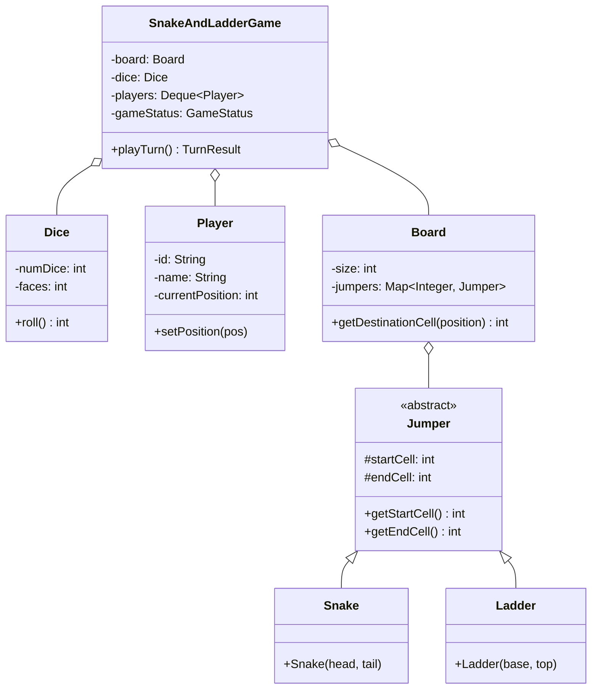

# LLD — Snake and Ladders Game Engine

## Mental Model

Think of a **Snake and Ladders Game Engine** as a stochastic, graph-driven state progression board game. 

The game board consists of $N$ numbered cells ($1 \dots 100$). Certain cells contain **Jumper Elements**: **Snakes** (head at higher cell $H$, tail at lower cell $T$) and **Ladders** (base at lower cell $B$, top at higher cell $U$). 

During each turn, a player rolls one or more $D$-sided dice (**Dice Engine**). The player advances their pawn position by the dice roll total. If the pawn lands on a cell containing a Snake head or Ladder base, the engine automatically teleports the pawn to the target destination cell (**Recursive Jumper Resolution**). The game ends when a player hits cell $N$ with an exact dice roll.

---

## 1. Problem Statement & Functional Requirements

### Functional Requirements
1. **Configurable Board Size:** Support a board of size $N$ (default 100 cells, $1 \dots 100$).
2. **Dynamic Snakes & Ladders Setup:** Allow configuring custom positions for $S$ Snakes and $L$ Ladders.
3. **Pluggable Dice Engine:** Support rolling 1 or more $D$-sided dice (e.g., 6-sided dice) with configurable strategies (`RandomDice`, `CrookedDice` for testing).
4. **Turn-Based Player Queue:** Manage turn rotation across $M$ players using a Queue.
5. **Exact Destination Matching Rule:** A player wins ONLY if their total roll lands EXACTLY on cell $N$. If the roll exceeds $N$, the move is skipped.
6. **Chained Jumper Resolution:** If a ladder teleports a player to a cell containing another ladder/snake, resolve recursively.

---

## 2. System Class Diagram (UML)



---

## 3. Production Code Implementation (Java)

```java
package com.lld.snakeladder;

import java.util.*;
import java.util.concurrent.ThreadLocalRandom;

// ============================================================================
// 1. JUMPER ABSTRACT CLASS & CONCRETE SNAKE / LADDER IMPLEMENTATIONS
// ============================================================================
public abstract class Jumper {
    private final int startCell;
    private final int endCell;

    public Jumper(int startCell, int endCell) {
        this.startCell = startCell;
        this.endCell = endCell;
    }

    public int getStartCell() { return startCell; }
    public int getEndCell() { return endCell; }
}

public class Snake extends Jumper {
    public Snake(int head, int tail) {
        super(head, tail);
        if (head <= tail) throw new IllegalArgumentException("Snake head must be higher than tail!");
    }
}

public class Ladder extends Jumper {
    public Ladder(int base, int top) {
        super(base, top);
        if (base >= top) throw new IllegalArgumentException("Ladder base must be lower than top!");
    }
}

// ============================================================================
// 2. DICE ENGINE (Pluggable Strategy)
// ============================================================================
public class Dice {
    private final int numDice;
    private final int faces;

    public Dice(int numDice, int faces) {
        if (numDice <= 0 || faces <= 0) throw new IllegalArgumentException("Invalid dice configuration");
        this.numDice = numDice;
        this.faces = faces;
    }

    public int roll() {
        int total = 0;
        for (int i = 0; i < numDice; i++) {
            total += ThreadLocalRandom.current().nextInt(1, faces + 1);
        }
        return total;
    }
}

// ============================================================================
// 3. PLAYER ENTITY
// ============================================================================
public class Player {
    private final String id;
    private final String name;
    private int currentPosition = 0; // Starts at 0 (Off-board)

    public Player(String id, String name) {
        this.id = Objects.requireNonNull(id);
        this.name = Objects.requireNonNull(name);
    }

    public String getId() { return id; }
    public String getName() { return name; }
    public int getCurrentPosition() { return currentPosition; }
    public void setCurrentPosition(int currentPosition) { this.currentPosition = currentPosition; }
}

// ============================================================================
// 4. BOARD AGGREGATE
// ============================================================================
public class Board {
    private final int size;
    private final Map<Integer, Jumper> jumpers = new HashMap<>();

    public Board(int size) {
        if (size < 10) throw new IllegalArgumentException("Board size must be >= 10");
        this.size = size;
    }

    public void addJumper(Jumper jumper) {
        if (jumper.getStartCell() < 1 || jumper.getStartCell() >= size) {
            throw new IllegalArgumentException("Jumper start out of bounds");
        }
        jumpers.put(jumper.getStartCell(), jumper);
    }

    // Resolves Snakes and Ladders recursively (or until static cell)
    public int getFinalDestination(int position) {
        Set<Integer> visited = new HashSet<>();
        int current = position;

        while (jumpers.containsKey(current)) {
            if (visited.contains(current)) {
                throw new IllegalStateException("Infinite loop detected in Jumper configuration!");
            }
            visited.add(current);
            Jumper j = jumpers.get(current);
            if (j instanceof Snake) {
                System.out.println("   --> SWALLOWED by Snake at " + j.getStartCell() + "! Sliding down to " + j.getEndCell());
            } else if (j instanceof Ladder) {
                System.out.println("   --> CLIMBED Ladder at " + j.getStartCell() + "! Climbing up to " + j.getEndCell());
            }
            current = j.getEndCell();
        }

        return current;
    }

    public int getSize() { return size; }
}

// ============================================================================
// 5. GAME ENGINE
// ============================================================================
public enum GameStatus { NOT_STARTED, IN_PROGRESS, FINISHED }

public class SnakeAndLadderGame {
    private final Board board;
    private final Dice dice;
    private final Deque<Player> players = new ArrayDeque<>();
    private GameStatus status = GameStatus.NOT_STARTED;
    private Player winner;

    public SnakeAndLadderGame(Board board, Dice dice, List<Player> playerList) {
        this.board = Objects.requireNonNull(board);
        this.dice = Objects.requireNonNull(dice);
        if (playerList == null || playerList.isEmpty()) {
            throw new IllegalArgumentException("At least 1 player required!");
        }
        this.players.addAll(playerList);
    }

    public void start() {
        this.status = GameStatus.IN_PROGRESS;
        System.out.println("==================================================");
        System.out.println("  SNAKE AND LADDER GAME STARTED (Board Size: " + board.getSize() + ")");
        System.out.println("==================================================\n");
    }

    public boolean playTurn() {
        if (status != GameStatus.IN_PROGRESS) {
            throw new IllegalStateException("Game is not in progress!");
        }

        Player currentPlayer = players.pollFirst();
        int roll = dice.roll();
        int oldPos = currentPlayer.getCurrentPosition();
        int newPos = oldPos + roll;

        System.out.println("Player [" + currentPlayer.getName() + "] (At cell " + oldPos + ") rolled a " + roll);

        if (newPos > board.getSize()) {
            System.out.println("   --> Roll exceeds board size (" + newPos + " > " + board.getSize() + "). Turn skipped!");
            players.addLast(currentPlayer); // Re-queue player
            return false;
        }

        // Resolve Snakes & Ladders
        int finalPos = board.getFinalDestination(newPos);
        currentPlayer.setCurrentPosition(finalPos);

        System.out.println("   --> Player [" + currentPlayer.getName() + "] moved to cell " + finalPos);

        // Check Exact Win Condition
        if (finalPos == board.getSize()) {
            this.status = GameStatus.FINISHED;
            this.winner = currentPlayer;
            System.out.println("\n**************************************************");
            System.out.println("  WINNER! Player [" + currentPlayer.getName() + "] reached cell " + board.getSize() + "!");
            System.out.println("**************************************************\n");
            return true;
        }

        players.addLast(currentPlayer); // Re-queue player
        return false;
    }

    public GameStatus getStatus() { return status; }
    public Player getWinner() { return winner; }
}
```

---

## 4. Executable Test Suite (`Main`)

```java
public class Main {
    public static void main(String[] args) {
        // Setup 100-cell Board
        Board board = new Board(100);

        // Add Snakes (Head -> Tail)
        board.addJumper(new Snake(99, 54));
        board.addJumper(new Snake(70, 55));
        board.addJumper(new Snake(52, 29));
        board.addJumper(new Snake(25, 2));

        // Add Ladders (Base -> Top)
        board.addJumper(new Ladder(3, 38));
        board.addJumper(new Ladder(14, 86));
        board.addJumper(new Ladder(31, 75));
        board.addJumper(new Ladder(63, 88));

        // Setup 1 6-sided Dice
        Dice dice = new Dice(1, 6);

        // Setup Players
        List<Player> players = List.of(
            new Player("P1", "Alice"),
            new Player("P2", "Bob")
        );

        SnakeAndLadderGame game = new SnakeAndLadderGame(board, dice, players);
        game.start();

        // Run Game Loop until Winner Emerges
        int maxTurns = 100;
        int turnCount = 0;

        while (game.getStatus() == GameStatus.IN_PROGRESS && turnCount < maxTurns) {
            turnCount++;
            System.out.println("--- Turn " + turnCount + " ---");
            boolean won = game.playTurn();
            if (won) break;
        }
    }
}
```

---

## 5. Active-Recall Prompts

1. **How does the `getFinalDestination()` method use a recursive loop to resolve chained Snakes and Ladders?**
2. **How do you prevent an infinite loop crash if an invalid Snake/Ladder loop configuration (`A -> B -> A`) is added to the board?**
3. **What rule governs exact destination matching on the last cell, and how is it enforced?**
4. **How would you extend this engine to support custom Crooked Dice (even numbers only) for unit testing?**

---

## Related Notes

- [[LLD - Tic-Tac-Toe and N-by-N Board Game Engine]]
- [[LLD - Parking Lot System]]
- [[Strategy Pattern - Algorithmic Interchangeability and Policy Objects]]
- [[Factory Method Pattern - Virtual Constructors and Extensible Object Creation]]

> **Interview Style Question:** *"Design and implement a Snake and Ladders Game Engine supporting $N$ cells, $S$ snakes, $L$ ladders, $M$ players, and multi-dice rolls. Demonstrate how you detect infinite jumper loops using a HashSet, write the exact destination matching logic for cell $N$, implement a pluggable Dice engine, and write an automated driver simulating complete gameplay."*

---
