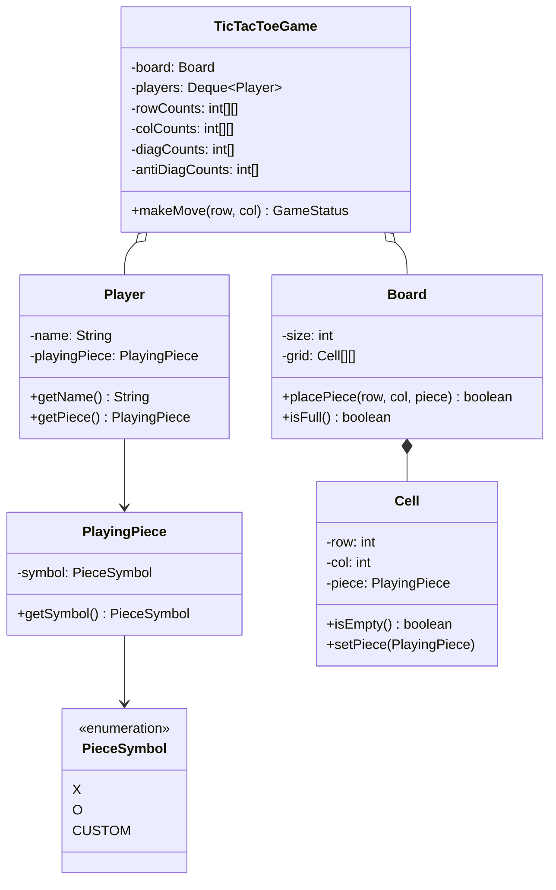

# LLD — Tic-Tac-Toe and N-by-N Board Game Engine

## Mental Model

Think of an **$N \times N$ Board Game Engine (Tic-Tac-Toe / Connect-Four / Gomoku)** as a stateful, turn-based referee system. 

The game board is represented as an $N \times N$ grid matrix of cells. Two or more players (**Player 1 with Symbol X, Player 2 with Symbol O**) take turns placing their symbols into valid empty cells (**Turn-Based Game Loop**). 

After every move, the engine referee evaluates winning condition invariants across rows, columns, main diagonals, and anti-diagonals in $O(1)$ constant time using counter arrays. The system manages move history, validates cell boundaries, detects draws, and declares a winner without scanning the entire board matrix on every turn.

---

## 1. Problem Statement & Functional Requirements

### Functional Requirements
1. **$N \times N$ Generic Board:** Support any board dimension $N \ge 3$ (default $3 \times 3$, customizable to $4 \times 4$ or $10 \times 10$).
2. **Multi-Player & Custom Symbols:** Support 2 or more players, each associated with a unique character symbol (`X`, `O`, `$`, `#`).
3. **Turn-Based Game Loop:** Enforce turn sequence using a Queue data structure (`PlayerQueue`).
4. **$O(1)$ Win Validation Engine:** Evaluate row, column, diagonal, and anti-diagonal win conditions in **$O(1)$ time** using integer counters rather than scanning all $N^2$ cells.
5. **Draw Detection:** Detect when all $N^2$ cells are filled without any player achieving a win condition.
6. **Move Undo Support:** Maintain a move history stack allowing players to undo moves.

---

## 2. System Class Diagram (UML)



---

## 3. $O(1)$ Win Detection Algorithm Math

Instead of scanning all $N$ cells in a row/column after every move ($O(N)$ scan time), the engine maintains 4 counter arrays tracking player symbol counts:

$$\text{rowCounts}[p][r] = \text{number of pieces of player } p \text{ in row } r$$
$$\text{colCounts}[p][c] = \text{number of pieces of player } p \text{ in column } c$$

For Diagonals:
- Main Diagonal ($r == c$): Increment $\text{diagCounts}[p]$
- Anti-Diagonal ($r + c == N - 1$): Increment $\text{antiDiagCounts}[p]$

**Win Condition Invariant:**
A player wins immediately if ANY counter reaches $N$:
$$\text{Win} \iff \text{count} == N$$

---

## 4. Production Code Implementation (Java)

```java
package com.lld.tictactoe;

import java.util.*;

// ============================================================================
// 1. PIECE & PLAYER DOMAIN ENTITIES
// ============================================================================
public enum PieceSymbol { X, O, STAR, HASH }

public class PlayingPiece {
    private final PieceSymbol symbol;

    public PlayingPiece(PieceSymbol symbol) {
        this.symbol = Objects.requireNonNull(symbol);
    }

    public PieceSymbol getSymbol() { return symbol; }
}

public class Player {
    private final String name;
    private final PlayingPiece playingPiece;

    public Player(String name, PlayingPiece playingPiece) {
        this.name = Objects.requireNonNull(name);
        this.playingPiece = Objects.requireNonNull(playingPiece);
    }

    public String getName() { return name; }
    public PlayingPiece getPlayingPiece() { return playingPiece; }
}

// ============================================================================
// 2. CELL & BOARD MATRIX
// ============================================================================
public class Cell {
    private final int row;
    private final int col;
    private PlayingPiece piece;

    public Cell(int row, int col) {
        this.row = row;
        this.col = col;
    }

    public boolean isEmpty() { return piece == null; }
    public void setPiece(PlayingPiece piece) { this.piece = piece; }
    public PlayingPiece getPiece() { return piece; }
    public int getRow() { return row; }
    public int getCol() { return col; }
}

public class Board {
    private final int size;
    private final Cell[][] grid;
    private int filledCells = 0;

    public Board(int size) {
        if (size < 3) throw new IllegalArgumentException("Board size must be >= 3");
        this.size = size;
        this.grid = new Cell[size][size];
        for (int r = 0; r < size; r++) {
            for (int c = 0; c < size; c++) {
                grid[r][c] = new Cell(r, c);
            }
        }
    }

    public boolean placePiece(int row, int col, PlayingPiece piece) {
        if (row < 0 || row >= size || col < 0 || col >= size) {
            throw new IllegalArgumentException("Move out of bounds!");
        }
        if (!grid[row][col].isEmpty()) {
            return false; // Cell already occupied
        }
        grid[row][col].setPiece(piece);
        filledCells++;
        return true;
    }

    public boolean isFull() {
        return filledCells == (size * size);
    }

    public void printBoard() {
        System.out.println("\n--- Current Board ---");
        for (int r = 0; r < size; r++) {
            for (int c = 0; c < size; c++) {
                PlayingPiece p = grid[r][c].getPiece();
                String val = p != null ? p.getSymbol().name() : " ";
                System.out.print(" " + val + " ");
                if (c < size - 1) System.out.print("|");
            }
            System.out.println();
            if (r < size - 1) {
                System.out.println("---+".repeat(size - 1) + "---");
            }
        }
        System.out.println("---------------------\n");
    }

    public int getSize() { return size; }
}

// ============================================================================
// 3. GAME ENGINE & O(1) WIN CHECKER
// ============================================================================
public enum GameStatus { IN_PROGRESS, WIN, DRAW }

public class TicTacToeGame {
    private final Board board;
    private final Deque<Player> players = new ArrayDeque<>();
    private GameStatus status = GameStatus.IN_PROGRESS;
    private Player winner;

    // O(1) Counter Arrays: Map<PlayerIndex, ArrayOfCounts>
    private final Map<Player, int[]> rowCounts = new HashMap<>();
    private final Map<Player, int[]> colCounts = new HashMap<>();
    private final Map<Player, Integer> diagCounts = new HashMap<>();
    private final Map<Player, Integer> antiDiagCounts = new HashMap<>();

    public TicTacToeGame(int boardSize, List<Player> playerList) {
        this.board = new Board(boardSize);
        if (playerList == null || playerList.size() < 2) {
            throw new IllegalArgumentException("At least 2 players required!");
        }
        for (Player p : playerList) {
            this.players.addLast(p);
            rowCounts.put(p, new int[boardSize]);
            colCounts.put(p, new int[boardSize]);
            diagCounts.put(p, 0);
            antiDiagCounts.put(p, 0);
        }
    }

    public GameStatus makeMove(int row, int col) {
        if (status != GameStatus.IN_PROGRESS) {
            throw new IllegalStateException("Game is already finished!");
        }

        Player currentPlayer = players.peekFirst(); // Active player
        boolean placed = board.placePiece(row, col, currentPlayer.getPlayingPiece());

        if (!placed) {
            System.out.println("INVALID MOVE: Cell (" + row + ", " + col + ") is already occupied! Try again.");
            return GameStatus.IN_PROGRESS;
        }

        // Advance turn in queue
        players.removeFirst();
        players.addLast(currentPlayer);

        int N = board.getSize();

        // Update O(1) Win Counters
        int[] rows = rowCounts.get(currentPlayer);
        int[] cols = colCounts.get(currentPlayer);
        rows[row]++;
        cols[col]++;

        if (row == col) {
            diagCounts.put(currentPlayer, diagCounts.get(currentPlayer) + 1);
        }
        if (row + col == N - 1) {
            antiDiagCounts.put(currentPlayer, antiDiagCounts.get(currentPlayer) + 1);
        }

        // Check O(1) Win Condition!
        if (rows[row] == N || cols[col] == N || diagCounts.get(currentPlayer) == N || antiDiagCounts.get(currentPlayer) == N) {
            this.status = GameStatus.WIN;
            this.winner = currentPlayer;
            System.out.println("GAME OVER! Player [" + currentPlayer.getName() + "] WINS!");
            return GameStatus.WIN;
        }

        // Check Draw Condition
        if (board.isFull()) {
            this.status = GameStatus.DRAW;
            System.out.println("GAME OVER! It's a DRAW!");
            return GameStatus.DRAW;
        }

        return GameStatus.IN_PROGRESS;
    }

    public Player getCurrentPlayer() { return players.peekFirst(); }
    public Board getBoard() { return board; }
    public GameStatus getStatus() { return status; }
    public Player getWinner() { return winner; }
}
```

---

## 5. Executable Test Suite (`Main`)

```java
public class Main {
    public static void main(String[] args) {
        Player p1 = new Player("Alice", new PlayingPiece(PieceSymbol.X));
        Player p2 = new Player("Bob", new PlayingPiece(PieceSymbol.O));

        // Create 3x3 Tic-Tac-Toe Game
        TicTacToeGame game = new TicTacToeGame(3, List.of(p1, p2));
        game.getBoard().printBoard();

        // Simulate Moves leading to Alice's Winning Diagonal (0,0 -> 1,1 -> 2,2)
        System.out.println("Turn 1: Alice moves (0, 0)");
        game.makeMove(0, 0);
        game.getBoard().printBoard();

        System.out.println("Turn 2: Bob moves (0, 1)");
        game.makeMove(0, 1);
        game.getBoard().printBoard();

        System.out.println("Turn 3: Alice moves (1, 1)");
        game.makeMove(1, 1);
        game.getBoard().printBoard();

        System.out.println("Turn 4: Bob moves (0, 2)");
        game.makeMove(0, 2);
        game.getBoard().printBoard();

        System.out.println("Turn 5: Alice moves (2, 2) -> WINNING MOVE!");
        game.makeMove(2, 2);
        game.getBoard().printBoard();
    }
}
```

---

## 6. Active-Recall Prompts

1. **How does the $O(1)$ win evaluation algorithm use row, column, and diagonal counter arrays to avoid scanning all $N^2$ cells?**
2. **How does a `Deque<Player>` queue data structure manage turn-based game loops seamlessly?**
3. **What is the difference between a Main Diagonal condition ($r == c$) and an Anti-Diagonal condition ($r + c == N - 1$)?**
4. **How would you extend this engine to support Undo Move functionality using the Command Pattern?**

---

## Related Notes

- [[LLD - Snake and Ladders Game Engine]]
- [[LLD - Parking Lot System]]
- [[Command Pattern - Encapsulating Requests, Undo-Redo, and Macro Commands]]
- [[Strategy Pattern - Algorithmic Interchangeability and Policy Objects]]

> **Interview Style Question:** *"Design and implement an $N \times N$ Tic-Tac-Toe Game Engine supporting $K$ custom players in Java/TypeScript. Prove how your win validation engine achieves $O(1)$ constant time execution per move, implement a turn-based player queue, write a full board printer, and handle draw and out-of-bounds edge cases."*

---
