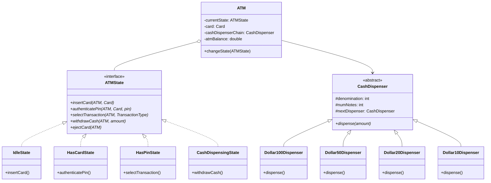

# LLD — Automated Teller Machine (ATM) System

## Mental Model

Think of an **Automated Teller Machine (ATM)** as a high-security hardware-software vault orchestrating two primary design patterns: 

First, a **State Machine (State Pattern)** governs card and PIN authentication (`IdleState -> HasCardState -> HasPinState -> SelectTransactionState -> CashDispensingState`). The machine accepts button inputs or card insertions only when valid for its current state. 

Second, a **Cash Dispenser Handler Chain (Chain of Responsibility Pattern)** handles dispensing cash using physical bill denominations ($100 \to $50 \to $20 \to $10 notes). The request to withdraw $280 is passed down the chain: the $100 Dispenser dispenses 2 notes ($200 remaining), passes $80 to the $50 Dispenser (1 note, $30 remaining), which passes $30 to the $20 Dispenser (1 note, $10 remaining), which passes $10 to the $10 Dispenser (1 note, $0 remaining).

---

## 1. Problem Statement & Functional Requirements

### Functional Requirements
1. **Card Insertion & PIN Verification:** Insert Debit Card, authenticate 4-digit PIN against Banking Core.
2. **Transaction Operations:** Support Balance Inquiry, Cash Deposit, and Cash Withdrawal operations.
3. **State-Driven Workflow:** State transitions: `IdleState`, `HasCardState`, `HasPinState`, `TransactionSelectionState`, `CashDispensingState`.
4. **Denomination-Based Cash Dispensing:** Use Chain of Responsibility to dispense cash using available $100, $50, $20, and $10 note inventory.
5. **Card Ejection & Session Reset:** Safely return card and reset state to `IdleState` on transaction completion, cancel, or invalid PIN.
6. **Thread-Safety:** Ensure hardware state and cash inventory updates are atomic and thread-safe.

---

## 2. System Class Diagram (UML)



---

## 3. Production Code Implementation (Java)

```java
package com.lld.atm;

import java.util.Objects;
import java.util.concurrent.locks.ReentrantLock;

// ============================================================================
// 1. BANK ACCOUNT & DEBIT CARD ENTITIES
// ============================================================================
public class BankAccount {
    private final String accountNumber;
    private double balance;

    public BankAccount(String accountNumber, double initialBalance) {
        this.accountNumber = accountNumber;
        this.balance = initialBalance;
    }

    public synchronized boolean withdraw(double amount) {
        if (amount <= 0 || amount > balance) return false;
        balance -= amount;
        return true;
    }

    public synchronized void deposit(double amount) {
        if (amount > 0) balance += amount;
    }

    public String getAccountNumber() { return accountNumber; }
    public synchronized double getBalance() { return balance; }
}

public class Card {
    private final String cardNumber;
    private final String pinHash;
    private final BankAccount account;

    public Card(String cardNumber, String pin, BankAccount account) {
        this.cardNumber = cardNumber;
        this.pinHash = hashPin(pin);
        this.account = account;
    }

    public boolean validatePin(String pin) {
        return hashPin(pin).equals(this.pinHash);
    }

    private String hashPin(String pin) {
        return "HASH_" + pin; // Simplified hash representation
    }

    public String getCardNumber() { return cardNumber; }
    public BankAccount getAccount() { return account; }
}

// ============================================================================
// 2. CHAIN OF RESPONSIBILITY: CASH DISPENSER
// ============================================================================
public abstract class CashDispenser {
    protected final int denomination;
    protected int numNotes;
    protected CashDispenser nextDispenser;

    public CashDispenser(int denomination, int numNotes) {
        this.denomination = denomination;
        this.numNotes = numNotes;
    }

    public void setNext(CashDispenser nextDispenser) {
        this.nextDispenser = nextDispenser;
    }

    public void dispense(int amount) {
        int notesToDispense = amount / denomination;
        int remainder = amount % denomination;

        if (notesToDispense > 0) {
            int actualNotes = Math.min(notesToDispense, numNotes);
            numNotes -= actualNotes;
            remainder += (notesToDispense - actualNotes) * denomination;
            System.out.println("   --> Dispensed " + actualNotes + " x $" + denomination + " notes");
        }

        if (remainder > 0) {
            if (nextDispenser != null) {
                nextDispenser.dispense(remainder);
            } else {
                throw new IllegalStateException("Cannot dispense remaining amount: $" + remainder + ". Out of exact bill notes!");
            }
        }
    }
}

public class Dollar100Dispenser extends CashDispenser {
    public Dollar100Dispenser(int notes) { super(100, notes); }
}

public class Dollar50Dispenser extends CashDispenser {
    public Dollar50Dispenser(int notes) { super(50, notes); }
}

public class Dollar20Dispenser extends CashDispenser {
    public Dollar20Dispenser(int notes) { super(20, notes); }
}

public class Dollar10Dispenser extends CashDispenser {
    public Dollar10Dispenser(int notes) { super(10, notes); }
}

// ============================================================================
// 3. STATE PATTERN: ATM STATES
// ============================================================================
public interface ATMState {
    void insertCard(ATM atm, Card card);
    void authenticatePin(ATM atm, String pin);
    void withdrawCash(ATM atm, int amount);
    void checkBalance(ATM atm);
    void ejectCard(ATM atm);
}

// State 1: Idle
public class IdleState implements ATMState {
    @Override
    public void insertCard(ATM atm, Card card) {
        System.out.println("ATM: Card inserted: " + card.getCardNumber());
        atm.setCard(card);
        atm.changeState(new HasCardState());
    }

    @Override public void authenticatePin(ATM atm, String pin) { System.out.println("ERROR: Insert card first!"); }
    @Override public void withdrawCash(ATM atm, int amount) { System.out.println("ERROR: Insert card first!"); }
    @Override public void checkBalance(ATM atm) { System.out.println("ERROR: Insert card first!"); }
    @Override public void ejectCard(ATM atm) { System.out.println("ERROR: No card in machine!"); }
}

// State 2: Has Card
public class HasCardState implements ATMState {
    @Override public void insertCard(ATM atm, Card card) { System.out.println("ERROR: Card already inserted!"); }

    @Override
    public void authenticatePin(ATM atm, String pin) {
        if (atm.getCard().validatePin(pin)) {
            System.out.println("ATM: PIN Authenticated Successfully!");
            atm.changeState(new HasPinState());
        } else {
            System.out.println("ATM: Invalid PIN! Ejecting card.");
            ejectCard(atm);
        }
    }

    @Override public void withdrawCash(ATM atm, int amount) { System.out.println("ERROR: Enter PIN first!"); }
    @Override public void checkBalance(ATM atm) { System.out.println("ERROR: Enter PIN first!"); }

    @Override
    public void ejectCard(ATM atm) {
        System.out.println("ATM: Ejecting Card: " + atm.getCard().getCardNumber());
        atm.setCard(null);
        atm.changeState(new IdleState());
    }
}

// State 3: Has PIN (Authenticated)
public class HasPinState implements ATMState {
    @Override public void insertCard(ATM atm, Card card) { System.out.println("ERROR: Session active!"); }
    @Override public void authenticatePin(ATM atm, String pin) { System.out.println("ERROR: Already authenticated!"); }

    @Override
    public void checkBalance(ATM atm) {
        double balance = atm.getCard().getAccount().getBalance();
        System.out.println("ATM: Account Balance = $" + balance);
    }

    @Override
    public void withdrawCash(ATM atm, int amount) {
        if (amount % 10 != 0) {
            System.out.println("ERROR: Withdrawal amount must be a multiple of $10!");
            return;
        }

        BankAccount account = atm.getCard().getAccount();
        if (account.getBalance() < amount) {
            System.out.println("ERROR: Insufficient account balance!");
            return;
        }

        System.out.println("ATM: Dispensing $" + amount + "...");
        try {
            atm.getCashDispenserChain().dispense(amount); // Execute Chain of Responsibility!
            account.withdraw(amount);
            System.out.println("ATM: Cash withdrawal complete. Remaining Account Balance: $" + account.getBalance());
        } catch (Exception e) {
            System.out.println("ATM ERROR: " + e.getMessage());
        }
    }

    @Override
    public void ejectCard(ATM atm) {
        System.out.println("ATM: Transaction complete. Ejecting Card: " + atm.getCard().getCardNumber());
        atm.setCard(null);
        atm.changeState(new IdleState());
    }
}

// ============================================================================
// 4. ATM CONTEXT CLASS
// ============================================================================
public class ATM {
    private ATMState currentState;
    private Card card;
    private CashDispenser cashDispenserChain;

    public ATM() {
        this.currentState = new IdleState();
        setupDispenserChain();
    }

    private void setupDispenserChain() {
        // Create Chain: $100 -> $50 -> $20 -> $10
        CashDispenser d100 = new Dollar100Dispenser(10); // $1000
        CashDispenser d50  = new Dollar50Dispenser(10);  // $500
        CashDispenser d20  = new Dollar20Dispenser(10);  // $200
        CashDispenser d10  = new Dollar10Dispenser(10);  // $100

        d100.setNext(d50);
        d50.setNext(d20);
        d20.setNext(d10);

        this.cashDispenserChain = d100;
    }

    public void changeState(ATMState state) {
        this.currentState = state;
    }

    // Action Wrappers
    public void insertCard(Card card) { currentState.insertCard(this, card); }
    public void authenticatePin(String pin) { currentState.authenticatePin(this, pin); }
    public void withdrawCash(int amount) { currentState.withdrawCash(this, amount); }
    public void checkBalance() { currentState.checkBalance(this); }
    public void ejectCard() { currentState.ejectCard(this); }

    // Getters & Setters
    public Card getCard() { return card; }
    public void setCard(Card card) { this.card = card; }
    public CashDispenser getCashDispenserChain() { return cashDispenserChain; }
}
```

---

## 4. Executable Test Suite (`Main`)

```java
public class Main {
    public static void main(String[] args) {
        BankAccount account = new BankAccount("ACC-998877", 1000.0);
        Card card = new Card("4111-2222-3333-4444", "1234", account);

        ATM atm = new ATM();

        System.out.println("--- Test 1: Insert Card & Check Balance ---");
        atm.insertCard(card);
        atm.authenticatePin("1234");
        atm.checkBalance(); // Output: $1000.0

        System.out.println("\n--- Test 2: Withdraw $280 Cash ---");
        atm.withdrawCash(280); // Dispenses 2x$100, 1x$50, 1x$20, 1x$10

        System.out.println("\n--- Test 3: Check Balance & Eject ---");
        atm.checkBalance(); // Output: $720.0
        atm.ejectCard();
    }
}
```

---

## 5. Active-Recall Prompts

1. **How does the State Pattern isolate PIN authentication and withdrawal logic across `IdleState`, `HasCardState`, and `HasPinState`?**
2. **How does the Chain of Responsibility Pattern handle dispensing cash using $100, $50, $20, and $10 note dispensers?**
3. **What happens if a user requests $285 withdrawal when the minimum bill denomination in the ATM is $10?**
4. **How would you extend this system to support multi-currency withdrawals (USD vs EUR)?**

---

## Related Notes

- [[State Pattern - Finite State Machines and State-Driven Behavior]]
- [[Chain of Responsibility Pattern - Handler Chains and Middleware Pipelines]]
- [[LLD - Vending Machine System]]
- [[Command Pattern - Encapsulating Requests, Undo-Redo, and Macro Commands]]

> **Interview Style Question:** *"Design and implement an Automated Teller Machine (ATM) System in Java/TypeScript. Demonstrate state transitions across `Idle`, `HasCard`, and `HasPin` using the State Pattern, implement a thread-safe Chain of Responsibility for cash denomination dispensing ($100/$50/$20/$10 notes), and write an executable driver suite."*

---
