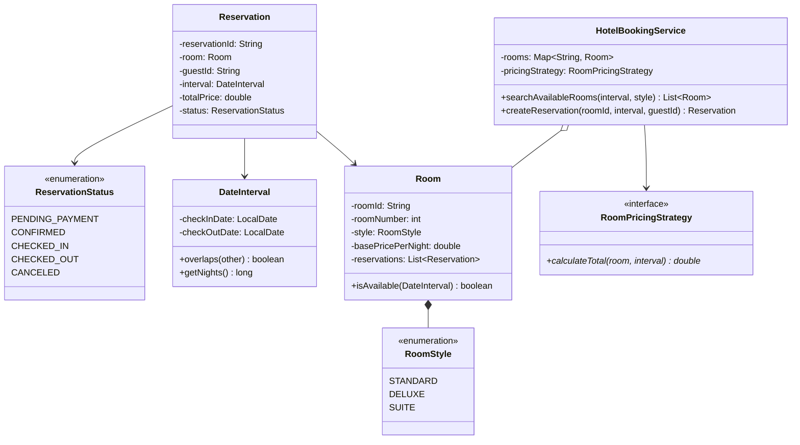

# LLD — Hotel Room Booking System

## Mental Model

Think of a **Hotel Room Booking System** as a date-range calendar reservation grid. 

A Hotel contains multiple **Rooms** across various categories (`DELUXE`, `SUITE`, `PRESIDENTIAL`). Unlike a movie ticket booking where a seat is locked for a single 2-hour show timestamp, a hotel room is reserved across a **Date Interval** (`Check-In Date` to `Check-Out Date`). 

Two reservations for the same room are compatible if and only if their date intervals do **NOT** overlap:

$$\text{Overlap}(\text{Res}_1, \text{Res}_2) \iff (\text{CheckIn}_1 < \text{CheckOut}_2) \land (\text{CheckOut}_1 > \text{CheckIn}_2)$$

The system uses date-interval overlap algorithms and thread-safe room locks to prevent double-booking room dates.

---

## 1. Problem Statement & Functional Requirements

### Functional Requirements
1. **Hotel & Room Inventory:** Manage Hotels $\to$ Rooms of types `STANDARD`, `DELUXE`, `SUITE` with daily base rates.
2. **Date Interval Availability Search:** Search available rooms for a specified `(Check-In Date, Check-Out Date)` interval.
3. **Date Overlap Prevention:** Guarantee that no room is booked for overlapping date ranges.
4. **Dynamic Seasonal Pricing Strategy:** Pluggable Pricing Strategy engine (Base Price + Seasonal Multiplier + Weekend Surge).
5. **Reservation Lifecycle:** Reservation state transitions: `PENDING_PAYMENT`, `CONFIRMED`, `CHECKED_IN`, `CHECKED_OUT`, `CANCELED`.
6. **Thread-Safety:** Ensure concurrent booking attempts for the same room dates are synchronized.

---

## 2. System Class Diagram (UML)



---

## 3. Production Code Implementation (Java)

```java
package com.lld.hotel;

import java.time.LocalDate;
import java.time.temporal.ChronoUnit;
import java.util.*;
import java.util.concurrent.ConcurrentHashMap;
import java.util.concurrent.locks.ReentrantLock;

// ============================================================================
// 1. ENUMS & DATE INTERVAL VALUE OBJECT
// ============================================================================
public enum RoomStyle { STANDARD, DELUXE, SUITE }

public enum ReservationStatus { PENDING_PAYMENT, CONFIRMED, CHECKED_IN, CHECKED_OUT, CANCELED }

public final class DateInterval {
    private final LocalDate checkIn;
    private final LocalDate checkOut;

    public DateInterval(LocalDate checkIn, LocalDate checkOut) {
        if (checkIn == null || checkOut == null || !checkOut.isAfter(checkIn)) {
            throw new IllegalArgumentException("Check-out date must be strictly after check-in date!");
        }
        this.checkIn = checkIn;
        this.checkOut = checkOut;
    }

    // DATE OVERLAP FORMULA: A.start < B.end AND A.end > B.start
    public boolean overlaps(DateInterval other) {
        return this.checkIn.isBefore(other.checkOut) && this.checkOut.isAfter(other.checkIn);
    }

    public long getNights() {
        return ChronoUnit.DAYS.between(checkIn, checkOut);
    }

    public LocalDate getCheckIn() { return checkIn; }
    public LocalDate getCheckOut() { return checkOut; }
}

// ============================================================================
// 2. ROOM & RESERVATION ENTITIES
// ============================================================================
public class Room {
    private final String roomId;
    private final int roomNumber;
    private final RoomStyle style;
    private final double basePricePerNight;
    private final List<Reservation> reservations = new ArrayList<>();
    private final ReentrantLock lock = new ReentrantLock();

    public Room(String roomId, int roomNumber, RoomStyle style, double basePricePerNight) {
        this.roomId = roomId;
        this.roomNumber = roomNumber;
        this.style = style;
        this.basePricePerNight = basePricePerNight;
    }

    public boolean isAvailable(DateInterval interval) {
        lock.lock();
        try {
            for (Reservation res : reservations) {
                if (res.getStatus() == ReservationStatus.CANCELED) continue;
                if (res.getInterval().overlaps(interval)) {
                    return false; // Date Overlap detected!
                }
            }
            return true;
        } finally {
            lock.unlock();
        }
    }

    public boolean addReservation(Reservation res) {
        lock.lock();
        try {
            if (isAvailable(res.getInterval())) {
                reservations.add(res);
                return true;
            }
            return false;
        } finally {
            lock.unlock();
        }
    }

    public String getRoomId() { return roomId; }
    public int getRoomNumber() { return roomNumber; }
    public RoomStyle getStyle() { return style; }
    public double getBasePricePerNight() { return basePricePerNight; }
}

public class Reservation {
    private final String reservationId;
    private final Room room;
    private final String guestId;
    private final DateInterval interval;
    private final double totalPrice;
    private ReservationStatus status;

    public Reservation(String reservationId, Room room, String guestId, DateInterval interval, double totalPrice) {
        this.reservationId = reservationId;
        this.room = room;
        this.guestId = guestId;
        this.interval = interval;
        this.totalPrice = totalPrice;
        this.status = ReservationStatus.CONFIRMED;
    }

    public String getReservationId() { return reservationId; }
    public Room getRoom() { return room; }
    public DateInterval getInterval() { return interval; }
    public double getTotalPrice() { return totalPrice; }
    public ReservationStatus getStatus() { return status; }
}

// ============================================================================
// 3. PRICING STRATEGY
// ============================================================================
public interface RoomPricingStrategy {
    double calculatePrice(Room room, DateInterval interval);
}

public class SeasonalPricingStrategy implements RoomPricingStrategy {
    @Override
    public double calculatePrice(Room room, DateInterval interval) {
        long nights = interval.getNights();
        double base = room.getBasePricePerNight() * nights;
        
        // Apply 20% surge during summer months (June/July/August)
        if (interval.getCheckIn().getMonthValue() >= 6 && interval.getCheckIn().getMonthValue() <= 8) {
            base *= 1.20;
        }

        return base;
    }
}

// ============================================================================
// 4. MAIN HOTEL BOOKING SERVICE
// ============================================================================
public class HotelBookingService {
    private final Map<String, Room> rooms = new ConcurrentHashMap<>();
    private final Map<String, Reservation> reservations = new ConcurrentHashMap<>();
    private final RoomPricingStrategy pricingStrategy;

    public HotelBookingService(RoomPricingStrategy pricingStrategy) {
        this.pricingStrategy = Objects.requireNonNull(pricingStrategy);
    }

    public void addRoom(Room room) {
        rooms.put(room.getRoomId(), room);
    }

    public List<Room> searchAvailableRooms(DateInterval interval, RoomStyle style) {
        List<Room> available = new ArrayList<>();
        for (Room room : rooms.values()) {
            if (room.getStyle() == style && room.isAvailable(interval)) {
                available.add(room);
            }
        }
        return available;
    }

    public Reservation createReservation(String roomId, DateInterval interval, String guestId) {
        Room room = rooms.get(roomId);
        if (room == null) throw new IllegalArgumentException("Room not found: " + roomId);

        double price = pricingStrategy.calculatePrice(room, interval);
        String resId = "RES-" + UUID.randomUUID().toString().substring(0, 8);

        Reservation res = new Reservation(resId, room, guestId, interval, price);

        if (room.addReservation(res)) {
            reservations.put(resId, res);
            System.out.println("RESERVATION SUCCESS: ID [" + resId + "] | Room #" + room.getRoomNumber() + 
                               " | Nights: " + interval.getNights() + " | Total Price: $" + price);
            return res;
        }

        throw new IllegalStateException("Room unavailable for requested dates!");
    }
}
```

---

## 4. Executable Test Suite (`Main`)

```java
public class Main {
    public static void main(String[] args) {
        HotelBookingService hotelService = new HotelBookingService(new SeasonalPricingStrategy());

        Room r101 = new Room("R101", 101, RoomStyle.DELUXE, 150.0);
        Room r102 = new Room("R102", 102, RoomStyle.DELUXE, 150.0);
        hotelService.addRoom(r101);
        hotelService.addRoom(r102);

        DateInterval juneStay = new DateInterval(LocalDate.of(2026, 6, 1), LocalDate.of(2026, 6, 5)); // 4 nights

        // Test 1: Search Available Deluxe Rooms
        System.out.println("--- Test 1: Search Deluxe Rooms for June 1-5 ---");
        List<Room> available = hotelService.searchAvailableRooms(juneStay, RoomStyle.DELUXE);
        System.out.println("Available Deluxe Rooms: " + available.size()); // Output: 2

        // Test 2: Book Room R101
        System.out.println("\n--- Test 2: Book Room R101 ---");
        Reservation res1 = hotelService.createReservation("R101", juneStay, "GUEST-01");

        // Test 3: Try Booking Overlapping Dates for R101 (Fails)
        System.out.println("\n--- Test 3: Overlapping Reservation Attempt on R101 ---");
        DateInterval overlapStay = new DateInterval(LocalDate.of(2026, 6, 3), LocalDate.of(2026, 6, 7));
        try {
            hotelService.createReservation("R101", overlapStay, "GUEST-02");
        } catch (Exception e) {
            System.out.println("EXPECTED ERROR: " + e.getMessage());
        }
    }
}
```

---

## 5. Active-Recall Prompts

1. **How does the date overlap formula `(A.start < B.end) AND (A.end > B.start)` detect double-booking collisions?**
2. **Why is room availability checked against all active reservations in date interval overlap search?**
3. **How does `ReentrantLock` around `room.addReservation()` ensure thread safety during concurrent booking requests?**
4. **How would you extend this system to support Room Upgrades and Cancellation Policy refund calculations?**

---

## Related Notes

- [[LLD - Movie Ticket Booking System (BookMyShow)]]
- [[LLD - Library Management System]]
- [[State Pattern - Finite State Machines and State-Driven Behavior]]
- [[Strategy Pattern - Algorithmic Interchangeability and Policy Objects]]

> **Interview Style Question:** *"Design and implement a Hotel Room Booking System in Java/TypeScript. Demonstrate date interval overlap checking, write a thread-safe reservation engine preventing room double-booking, implement a Seasonal Pricing Strategy, and write an executable driver suite."*

---
