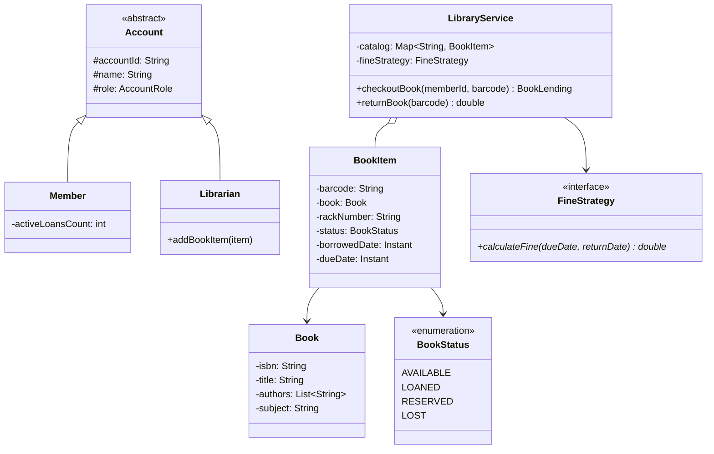

# LLD — Library Management System

## Mental Model

Think of a **Library Management System** as an automated physical inventory tracking and membership lending engine. 

The library manages a vast catalog of **Books**, where each physical copy is identified as a unique **BookItem** (with barcode, rack position, and status: `AVAILABLE`, `LOANED`, `RESERVED`, `LOST`). Members (**Librarians, Students, Faculty**) can search books by title/author/subject (**Search Engine / Indexing**), check out books for up to 14 days (**Lending Rules**), renew loans, reserve checked-out copies, and pay overdue fines (**Fine Strategy**).

---

## 1. Problem Statement & Functional Requirements

### Functional Requirements
1. **Catalog & Search:** Search books by `Title`, `Author`, `Subject`, or `PublicationDate`.
2. **Book & BookItem Distinction:** Distinguish between a conceptual `Book` (ISBN, Title, Author) and physical copies (`BookItem` with barcode & rack location).
3. **Member Management & Roles:** Support `Librarian` (manages inventory & members) and `Member` (borrows books).
4. **Lending Rules & Quotas:** Limit maximum active books borrowed (e.g., max 5 books) and lending duration (14 days).
5. **Overdue Fine Calculation:** Pluggable Strategy engine to calculate overdue fines ($1/day overdue).
6. **Reservation System:** Allow members to reserve a book item currently checked out by another member.

---

## 2. System Class Diagram (UML)



---

## 3. Production Code Implementation (Java)

```java
package com.lld.library;

import java.time.Duration;
import java.time.Instant;
import java.util.*;
import java.util.concurrent.ConcurrentHashMap;

// ============================================================================
// 1. ENUMS & VALUE OBJECTS
// ============================================================================
public enum BookStatus { AVAILABLE, LOANED, RESERVED, LOST }

public enum AccountRole { MEMBER, LIBRARIAN }

public class Book {
    private final String isbn;
    private final String title;
    private final List<String> authors;
    private final String subject;

    public Book(String isbn, String title, List<String> authors, String subject) {
        this.isbn = isbn;
        this.title = title;
        this.authors = Collections.unmodifiableList(authors);
        this.subject = subject;
    }

    public String getIsbn() { return isbn; }
    public String getTitle() { return title; }
    public List<String> getAuthors() { return authors; }
    public String getSubject() { return subject; }
}

public class BookItem {
    private final String barcode;
    private final Book book;
    private final String rackNumber;
    private BookStatus status = BookStatus.AVAILABLE;
    private Instant borrowedDate;
    private Instant dueDate;

    public BookItem(String barcode, Book book, String rackNumber) {
        this.barcode = barcode;
        this.book = book;
        this.rackNumber = rackNumber;
    }

    public synchronized boolean checkout(int durationDays) {
        if (status != BookStatus.AVAILABLE) return false;
        this.status = BookStatus.LOANED;
        this.borrowedDate = Instant.now();
        this.dueDate = borrowedDate.plus(Duration.ofDays(durationDays));
        return true;
    }

    public synchronized void returnBook() {
        this.status = BookStatus.AVAILABLE;
        this.borrowedDate = null;
        this.dueDate = null;
    }

    public String getBarcode() { return barcode; }
    public Book getBook() { return book; }
    public BookStatus getStatus() { return status; }
    public Instant getDueDate() { return dueDate; }
}

// ============================================================================
// 2. ACCOUNT HIERARCHY
// ============================================================================
public abstract class Account {
    private final String accountId;
    private final String name;
    private final AccountRole role;

    public Account(String accountId, String name, AccountRole role) {
        this.accountId = accountId;
        this.name = name;
        this.role = role;
    }

    public String getAccountId() { return accountId; }
    public String getName() { return name; }
    public AccountRole getRole() { return role; }
}

public class Member extends Account {
    private int activeLoans = 0;
    private static final int MAX_LOANS = 5;

    public Member(String id, String name) {
        super(id, name, AccountRole.MEMBER);
    }

    public synchronized boolean canBorrow() { return activeLoans < MAX_LOANS; }
    public synchronized void incrementLoans() { activeLoans++; }
    public synchronized void decrementLoans() { if (activeLoans > 0) activeLoans--; }
    public synchronized int getActiveLoans() { return activeLoans; }
}

// ============================================================================
// 3. FINE CALCULATION STRATEGY
// ============================================================================
public interface FineStrategy {
    double calculateFine(Instant dueDate, Instant returnDate);
}

public class FlatRateFineStrategy implements FineStrategy {
    private final double dailyFineRate;

    public FlatRateFineStrategy(double dailyFineRate) {
        this.dailyFineRate = dailyFineRate;
    }

    @Override
    public double calculateFine(Instant dueDate, Instant returnDate) {
        if (dueDate == null || returnDate.isBefore(dueDate)) return 0.0;
        long overdueDays = Duration.between(dueDate, returnDate).toDays();
        return Math.max(0, overdueDays * dailyFineRate);
    }
}

// ============================================================================
// 4. MAIN LIBRARY SERVICE (Facade & Service Manager)
// ============================================================================
public class LibraryService {
    private final Map<String, BookItem> catalogByBarcode = new ConcurrentHashMap<>();
    private final Map<String, Member> members = new ConcurrentHashMap<>();
    private final FineStrategy fineStrategy;

    public LibraryService(FineStrategy fineStrategy) {
        this.fineStrategy = fineStrategy;
    }

    public void addBookItem(BookItem item) {
        catalogByBarcode.put(item.getBarcode(), item);
    }

    public void registerMember(Member member) {
        members.put(member.getAccountId(), member);
    }

    public synchronized boolean checkoutBook(String memberId, String barcode) {
        Member member = members.get(memberId);
        BookItem item = catalogByBarcode.get(barcode);

        if (member == null || item == null) {
            throw new IllegalArgumentException("Invalid member or barcode!");
        }

        if (!member.canBorrow()) {
            System.out.println("CHECKOUT FAILED: Member " + member.getName() + " reached max limit of 5 books!");
            return false;
        }

        if (item.checkout(14)) { // 14-day checkout
            member.incrementLoans();
            System.out.println("CHECKOUT SUCCESS: " + member.getName() + " borrowed '" + item.getBook().getTitle() + "' [Barcode: " + barcode + "]");
            return true;
        }

        System.out.println("CHECKOUT FAILED: Book item is not available!");
        return false;
    }

    public synchronized double returnBook(String memberId, String barcode, Instant returnDate) {
        Member member = members.get(memberId);
        BookItem item = catalogByBarcode.get(barcode);

        if (member == null || item == null) {
            throw new IllegalArgumentException("Invalid member or barcode!");
        }

        double fine = fineStrategy.calculateFine(item.getDueDate(), returnDate);
        item.returnBook();
        member.decrementLoans();

        System.out.println("RETURN SUCCESS: " + member.getName() + " returned '" + item.getBook().getTitle() + "' | Fine Due: $" + fine);
        return fine;
    }
}
```

---

## 4. Executable Test Suite (`Main`)

```java
public class Main {
    public static void main(String[] args) {
        LibraryService library = new LibraryService(new FlatRateFineStrategy(1.50)); // $1.50/day fine

        // Create Books
        Book b1 = new Book("978-0134685991", "Effective Java", List.of("Joshua Bloch"), "Computer Science");
        BookItem item1 = new BookItem("BC-1001", b1, "RACK-A1");

        library.addBookItem(item1);

        Member member = new Member("M-01", "Alice");
        library.registerMember(member);

        // Test 1: Checkout Book
        System.out.println("--- Test 1: Checkout Book ---");
        library.checkoutBook("M-01", "BC-1001");

        // Test 2: Try Checking Out Same Book (Fails)
        System.out.println("\n--- Test 2: Double Checkout Attempt ---");
        library.checkoutBook("M-01", "BC-1001");

        // Test 3: Return Book 3 Days Overdue
        System.out.println("\n--- Test 3: Return Book Overdue ---");
        Instant overdueReturnDate = Instant.now().plus(Duration.ofDays(17)); // 17 days (3 days late!)
        library.returnBook("M-01", "BC-1001", overdueReturnDate);
    }
}
```

---

## 5. Active-Recall Prompts

1. **Why is it essential to separate `Book` (conceptual identity) from `BookItem` (physical copy with barcode and rack number)?**
2. **How does `Member.canBorrow()` enforce maximum active borrowing quotas (e.g., max 5 books)?**
3. **How does the Strategy Pattern allow swapping `FlatRateFineStrategy` with a `TieredOverdueFineStrategy` without editing library service code?**
4. **How would you implement a Reservation Queue for books that are currently checked out?**

---

## Related Notes

- [[LLD - Hotel Room Booking System]]
- [[LLD - Movie Ticket Booking System (BookMyShow)]]
- [[Strategy Pattern - Algorithmic Interchangeability and Policy Objects]]
- [[Machine Coding Interview Framework - 45-Minute Execution Blueprint]]

> **Interview Style Question:** *"Design and implement a Library Management System in Java/TypeScript. Distinguish between conceptual `Book` and physical `BookItem` objects, enforce max 5-book borrowing quotas per member, implement an overdue fine calculation Strategy engine, and write a full executable driver."*

---
