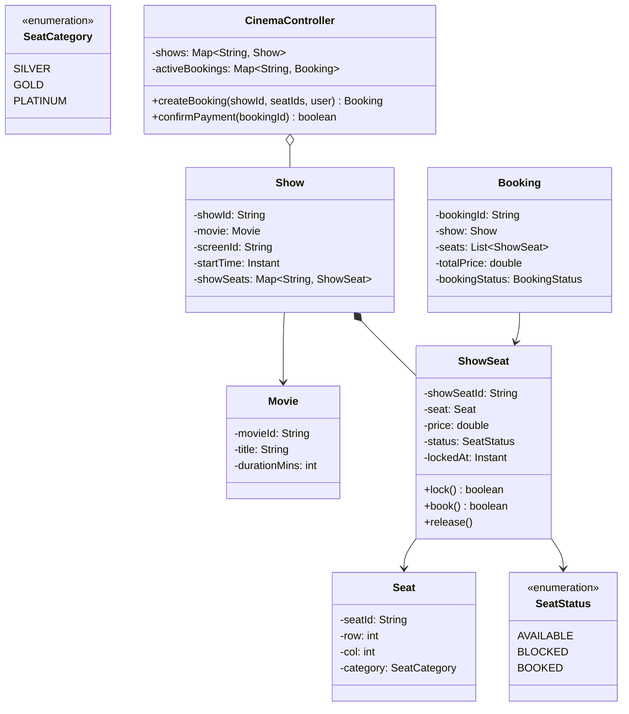

# LLD — Movie Ticket Booking System (BookMyShow)

## Mental Model

Think of a **Movie Ticket Booking System (BookMyShow)** as a real-time concurrent seat reservation grid. 

A Cinema multiplex contains multiple **Theatres / Halls**, each hosting scheduled **Shows** for movies. Each Show has a physical layout grid of **ShowSeats** (`REGULAR`, `PREMIUM`, `VIP`). 

When thousands of users simultaneously attempt to book the exact same 2 popular seats for a blockbuster movie premiere, the system prevents double-booking using **Temporary Seat Blocking Locks (10-minute Lock TTL)**. 

A seat transitions through a strict State Machine: `AVAILABLE` $\to$ `BLOCKED` (10-min reservation window) $\to$ `BOOKED` (upon payment confirmation) or back to `AVAILABLE` (if payment times out or is canceled).

---

## 1. Problem Statement & Functional Requirements

### Functional Requirements
1. **Multiplex & Cinema Catalog:** Manage City $\to$ Cinema / Multiplex $\to$ Hall / Screen $\to$ Movie Shows.
2. **Seat Management & Types:** Support multiple seat tiers (`SILVER`, `GOLD`, `PLATINUM`) with dynamic tier pricing per Show.
3. **Seat State Lifecycle:** Seat state transitions: `AVAILABLE`, `BLOCKED`, `BOOKED`.
4. **Temporary Seat Locking (Concurrency Safety):** Block selected seats for 10 minutes when a user initiates checkout. If payment is completed, state becomes `BOOKED`. If payment times out, state reverts to `AVAILABLE`.
5. **Atomic Multi-Seat Reservation:** Prevent race conditions when two users select overlapping seat sets concurrently.
6. **Payment & Booking Confirmation:** Issue `Booking` entity with unique QR/Ticket ID upon payment success.

---

## 2. System Class Diagram (UML)



---

## 3. Production Code Implementation (Java)

```java
package com.lld.bookmyshow;

import java.time.Duration;
import java.time.Instant;
import java.util.*;
import java.util.concurrent.ConcurrentHashMap;
import java.util.concurrent.atomic.AtomicBoolean;
import java.util.concurrent.locks.ReentrantLock;

// ============================================================================
// 1. ENUMS & VALUE OBJECTS
// ============================================================================
public enum SeatCategory { SILVER, GOLD, PLATINUM }

public enum SeatStatus { AVAILABLE, BLOCKED, BOOKED }

public enum BookingStatus { PENDING_PAYMENT, CONFIRMED, EXPIRED, CANCELED }

public class Movie {
    private final String movieId;
    private final String title;
    private final int durationMins;

    public Movie(String movieId, String title, int durationMins) {
        this.movieId = movieId;
        this.title = title;
        this.durationMins = durationMins;
    }

    public String getMovieId() { return movieId; }
    public String getTitle() { return title; }
}

public class Seat {
    private final String seatId;
    private final int row;
    private final int col;
    private final SeatCategory category;

    public Seat(String seatId, int row, int col, SeatCategory category) {
        this.seatId = seatId;
        this.row = row;
        this.col = col;
        this.category = category;
    }

    public String getSeatId() { return seatId; }
    public SeatCategory getCategory() { return category; }
}

// ============================================================================
// 2. SHOW SEAT (Thread-Safe State Machine & Lock Management)
// ============================================================================
public class ShowSeat {
    private final String showSeatId;
    private final Seat seat;
    private final double price;
    private final ReentrantLock lock = new ReentrantLock();
    
    private SeatStatus status = SeatStatus.AVAILABLE;
    private Instant lockedAt;
    private static final Duration LOCK_TTL = Duration.ofMinutes(10); // 10 Min Timeout

    public ShowSeat(String showSeatId, Seat seat, double price) {
        this.showSeatId = showSeatId;
        this.seat = seat;
        this.price = price;
    }

    public boolean isAvailable() {
        lock.lock();
        try {
            if (status == SeatStatus.BOOKED) return false;
            if (status == SeatStatus.BLOCKED) {
                // Check if Lock TTL expired!
                if (Instant.now().isAfter(lockedAt.plus(LOCK_TTL))) {
                    status = SeatStatus.AVAILABLE; // Auto-revert expired lock!
                    return true;
                }
                return false;
            }
            return true;
        } finally {
            lock.unlock();
        }
    }

    public boolean tryLock() {
        lock.lock();
        try {
            if (isAvailable()) {
                this.status = SeatStatus.BLOCKED;
                this.lockedAt = Instant.now();
                return true;
            }
            return false;
        } finally {
            lock.unlock();
        }
    }

    public boolean confirmBooking() {
        lock.lock();
        try {
            if (status == SeatStatus.BLOCKED) {
                this.status = SeatStatus.BOOKED;
                return true;
            }
            return false;
        } finally {
            lock.unlock();
        }
    }

    public void releaseLock() {
        lock.lock();
        try {
            if (status == SeatStatus.BLOCKED) {
                this.status = SeatStatus.AVAILABLE;
                this.lockedAt = null;
            }
        } finally {
            lock.unlock();
        }
    }

    public String getShowSeatId() { return showSeatId; }
    public Seat getSeat() { return seat; }
    public double getPrice() { return price; }
    public SeatStatus getStatus() { return status; }
}

// ============================================================================
// 3. SHOW ENTITY
// ============================================================================
public class Show {
    private final String showId;
    private final Movie movie;
    private final String screenId;
    private final Instant startTime;
    private final Map<String, ShowSeat> showSeats = new ConcurrentHashMap<>();

    public Show(String showId, Movie movie, String screenId, Instant startTime, List<ShowSeat> seats) {
        this.showId = showId;
        this.movie = movie;
        this.screenId = screenId;
        this.startTime = startTime;
        for (ShowSeat s : seats) {
            showSeats.put(s.getShowSeatId(), s);
        }
    }

    public ShowSeat getShowSeat(String showSeatId) {
        ShowSeat seat = showSeats.get(showSeatId);
        if (seat == null) throw new IllegalArgumentException("Invalid seat ID: " + showSeatId);
        return seat;
    }

    public String getShowId() { return showId; }
    public Movie getMovie() { return movie; }
    public Map<String, ShowSeat> getShowSeats() { return showSeats; }
}

// ============================================================================
// 4. BOOKING ENTITY
// ============================================================================
public class Booking {
    private final String bookingId;
    private final Show show;
    private final List<ShowSeat> bookedSeats;
    private final double totalPrice;
    private BookingStatus status;

    public Booking(String bookingId, Show show, List<ShowSeat> bookedSeats) {
        this.bookingId = bookingId;
        this.show = show;
        this.bookedSeats = Collections.unmodifiableList(bookedSeats);
        this.totalPrice = bookedSeats.stream().mapToDouble(ShowSeat::getPrice).sum();
        this.status = BookingStatus.PENDING_PAYMENT;
    }

    public void confirm() { this.status = BookingStatus.CONFIRMED; }
    public void cancel() { this.status = BookingStatus.CANCELED; }

    public String getBookingId() { return bookingId; }
    public Show getShow() { return show; }
    public List<ShowSeat> getBookedSeats() { return bookedSeats; }
    public double getTotalPrice() { return totalPrice; }
    public BookingStatus getStatus() { return status; }
}

// ============================================================================
// 5. CINEMA CONTROLLER (Service Orchestrator)
// ============================================================================
public class CinemaController {
    private final Map<String, Show> shows = new ConcurrentHashMap<>();
    private final Map<String, Booking> bookings = new ConcurrentHashMap<>();

    public void addShow(Show show) {
        shows.put(show.getShowId(), show);
    }

    // Atomic Multi-Seat Reservation with Lock Sorting to prevent Deadlock!
    public Booking createBooking(String showId, List<String> seatIds, String userId) {
        Show show = shows.get(showId);
        if (show == null) throw new IllegalArgumentException("Show not found: " + showId);

        // Sort seat IDs to prevent Deadlock when two users pick intersecting seat sets!
        List<String> sortedSeatIds = new ArrayList<>(seatIds);
        Collections.sort(sortedSeatIds);

        List<ShowSeat> lockedSeats = new ArrayList<>();
        boolean allLocked = true;

        for (String seatId : sortedSeatIds) {
            ShowSeat seat = show.getShowSeat(seatId);
            if (seat.tryLock()) {
                lockedSeats.add(seat);
            } else {
                allLocked = false;
                break;
            }
        }

        // Rollback if ANY seat lock failed!
        if (!allLocked) {
            for (ShowSeat s : lockedSeats) {
                s.releaseLock(); // Rollback acquired locks!
            }
            throw new IllegalStateException("One or more selected seats are unavailable!");
        }

        String bookingId = "BKG-" + UUID.randomUUID().toString().substring(0, 8);
        Booking booking = new Booking(bookingId, show, lockedSeats);
        bookings.put(bookingId, booking);

        System.out.println("BOOKING CREATED: ID [" + bookingId + "] | Total: $" + booking.getTotalPrice() + " | Seats Locked: " + seatIds);
        return booking;
    }

    public boolean confirmPayment(String bookingId) {
        Booking booking = bookings.get(bookingId);
        if (booking == null || booking.getStatus() != BookingStatus.PENDING_PAYMENT) {
            return false;
        }

        for (ShowSeat seat : booking.getBookedSeats()) {
            seat.confirmBooking(); // Transition BLOCKED -> BOOKED
        }

        booking.confirm();
        System.out.println("PAYMENT CONFIRMED: Booking [" + bookingId + "] is now CONFIRMED!");
        return true;
    }
}
```

---

## 4. Executable Test Suite (`Main`)

```java
public class Main {
    public static void main(String[] args) {
        Movie movie = new Movie("M1", "Inception 2", 150);
        
        // Build Seats
        Seat s1 = new Seat("A1", 1, 1, SeatCategory.GOLD);
        Seat s2 = new Seat("A2", 1, 2, SeatCategory.GOLD);

        ShowSeat ss1 = new ShowSeat("S1-A1", s1, 15.00);
        ShowSeat ss2 = new ShowSeat("S1-A2", s2, 15.00);

        Show show = new Show("SHOW-100", movie, "SCREEN-1", Instant.now(), List.of(ss1, ss2));

        CinemaController controller = new CinemaController();
        controller.addShow(show);

        // Test 1: User 1 Books A1 and A2
        System.out.println("--- Test 1: User 1 Books Seats A1 & A2 ---");
        Booking b1 = controller.createBooking("SHOW-100", List.of("S1-A1", "S1-A2"), "user_1");

        // Test 2: User 2 Tries Booking A1 (Fails because A1 is locked by User 1)
        System.out.println("\n--- Test 2: User 2 Tries Booking Seat A1 ---");
        try {
            controller.createBooking("SHOW-100", List.of("S1-A1"), "user_2");
        } catch (Exception e) {
            System.out.println("EXPECTED ERROR: " + e.getMessage());
        }

        // Test 3: User 1 Confirms Payment
        System.out.println("\n--- Test 3: User 1 Confirms Payment ---");
        controller.confirmPayment(b1.getBookingId());
    }
}
```

---

## 5. Active-Recall Prompts

1. **How does sorting requested seat IDs before acquiring locks prevent deadlock when 2 users attempt to book overlapping seat sets?**
2. **Explain the seat state lifecycle (`AVAILABLE` $\to$ `BLOCKED` $\to$ `BOOKED`) and how TTL lock expiration works.**
3. **What happens if a user's payment fails or times out during the 10-minute reservation window?**
4. **How would you scale this system using Redis Distributed Locks and Kafka event buses for peak flash sales?**

---

## Related Notes

- [[LLD - Hotel Room Booking System]]
- [[State Pattern - Finite State Machines and State-Driven Behavior]]
- [[Strategy Pattern - Algorithmic Interchangeability and Policy Objects]]
- [[Observer Pattern - Event Buses, Publish-Subscribe, and Reactive Streams]]

> **Interview Style Question:** *"Design and implement a Movie Ticket Booking System (BookMyShow) in Java/TypeScript. Demonstrate multi-seat atomic reservation, write lock sorting logic to prevent deadlocks, handle 10-minute seat lock TTL expiration, and write an executable test suite for concurrent booking attempts."*

---
