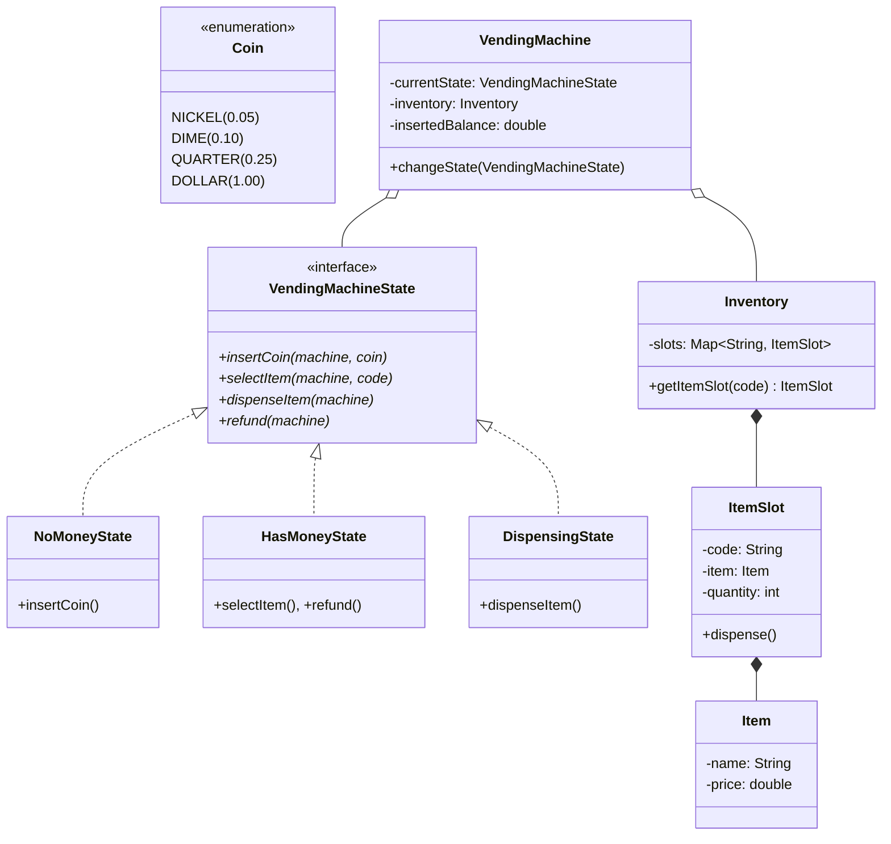

# LLD — Vending Machine System

## Mental Model

Think of a **Vending Machine System** as a stateful, inventory-controlled automated retailer. 

The machine contains physical item racks (**Item Inventory Slots** holding *Coke, Chips, Candy*) and a payment slot (**Coin / Cash Inventory**). The machine operates as a **State Machine (State Pattern)**:

1. `NoMoneyState`: Accepts coin/bill insertions $\to$ Transitions to `HasMoneyState`.
2. `HasMoneyState`: Allows selecting an item code (e.g., `A1`) $\to$ Validates item availability and money $\to$ Transitions to `DispenseState`.
3. `DispenseState`: Physical motor dispenses item, calculates change return, and resets state back to `NoMoneyState`.

---

## 1. Problem Statement & Functional Requirements

### Functional Requirements
1. **Inventory Management:** Manage $N$ product inventory slots (e.g., `A1`, `A2`, `B1`), each storing an item type, price, and current quantity.
2. **Coin / Currency Acceptance:** Accept coins/bills (`NICKEL`, `DIME`, `QUARTER`, `DOLLAR`) and calculate running balance.
3. **State-Driven Workflow:** State transitions: `NoMoneyState`, `HasMoneyState`, `DispensingState`, `SoldOutState`.
4. **Change Calculation & Return:** Calculate exact change return after item price deduction.
5. **Transaction Cancel & Refund:** Allow user to press "Cancel", returning inserted money and resetting to `NoMoneyState`.
6. **Thread-Safety:** Ensure item inventory updates and cash operations are thread-safe.

---

## 2. System Class Diagram (UML)



---

## 3. Production Code Implementation (Java)

```java
package com.lld.vendingmachine;

import java.util.*;
import java.util.concurrent.ConcurrentHashMap;

// ============================================================================
// 1. COIN & ITEM DOMAIN ENTITIES
// ============================================================================
public enum Coin {
    NICKEL(0.05),
    DIME(0.10),
    QUARTER(0.25),
    DOLLAR(1.00);

    private final double value;

    Coin(double value) { this.value = value; }
    public double getValue() { return value; }
}

public class Item {
    private final String name;
    private final double price;

    public Item(String name, double price) {
        this.name = name;
        this.price = price;
    }

    public String getName() { return name; }
    public double getPrice() { return price; }
}

public class ItemSlot {
    private final String code;
    private final Item item;
    private int quantity;

    public ItemSlot(String code, Item item, int quantity) {
        this.code = code;
        this.item = item;
        this.quantity = quantity;
    }

    public synchronized boolean isAvailable() { return quantity > 0; }
    public synchronized void decrementQuantity() { if (quantity > 0) quantity--; }

    public String getCode() { return code; }
    public Item getItem() { return item; }
    public synchronized int getQuantity() { return quantity; }
}

// ============================================================================
// 2. INVENTORY MANAGER
// ============================================================================
public class Inventory {
    private final Map<String, ItemSlot> slots = new ConcurrentHashMap<>();

    public void addSlot(ItemSlot slot) {
        slots.put(slot.getCode(), slot);
    }

    public ItemSlot getSlot(String code) {
        ItemSlot slot = slots.get(code);
        if (slot == null) throw new IllegalArgumentException("Invalid item code: " + code);
        return slot;
    }

    public Map<String, ItemSlot> getSlots() { return slots; }
}

// ============================================================================
// 3. STATE PATTERN: VENDING MACHINE STATES
// ============================================================================
public interface VendingMachineState {
    void insertCoin(VendingMachine machine, Coin coin);
    void selectItem(VendingMachine machine, String code);
    void dispenseItem(VendingMachine machine);
    void refund(VendingMachine machine);
}

// State 1: No Money
public class NoMoneyState implements VendingMachineState {
    @Override
    public void insertCoin(VendingMachine machine, Coin coin) {
        machine.addBalance(coin.getValue());
        System.out.println("VendingMachine: Inserted " + coin + " ($" + coin.getValue() + "). Total balance: $" + machine.getInsertedBalance());
        machine.changeState(new HasMoneyState());
    }

    @Override public void selectItem(VendingMachine m, String code) { System.out.println("ERROR: Insert coin first!"); }
    @Override public void dispenseItem(VendingMachine m) { System.out.println("ERROR: Insert coin first!"); }
    @Override public void refund(VendingMachine m) { System.out.println("ERROR: No money inserted to refund!"); }
}

// State 2: Has Money
public class HasMoneyState implements VendingMachineState {
    @Override
    public void insertCoin(VendingMachine machine, Coin coin) {
        machine.addBalance(coin.getValue());
        System.out.println("VendingMachine: Inserted " + coin + " ($" + coin.getValue() + "). Total balance: $" + machine.getInsertedBalance());
    }

    @Override
    public void selectItem(VendingMachine machine, String code) {
        ItemSlot slot = machine.getInventory().getSlot(code);
        if (!slot.isAvailable()) {
            System.out.println("ERROR: Item " + slot.getItem().getName() + " is SOLD OUT!");
            return;
        }

        double price = slot.getItem().getPrice();
        if (machine.getInsertedBalance() < price) {
            System.out.println("ERROR: Insufficient funds for " + slot.getItem().getName() + " ($" + price + "). Current balance: $" + machine.getInsertedBalance());
            return;
        }

        System.out.println("VendingMachine: Selected " + slot.getItem().getName() + " ($" + price + ")");
        machine.setSelectedSlot(slot);
        machine.changeState(new DispensingState());
        machine.dispenseItem(); // Auto-dispense!
    }

    @Override
    public void refund(VendingMachine machine) {
        double refundAmount = machine.getInsertedBalance();
        System.out.println("VendingMachine: Refunding inserted balance of $" + refundAmount);
        machine.resetBalance();
        machine.changeState(new NoMoneyState());
    }

    @Override public void dispenseItem(VendingMachine m) { System.out.println("ERROR: Select item first!"); }
}

// State 3: Dispensing State
public class DispensingState implements VendingMachineState {
    @Override public void insertCoin(VendingMachine m, Coin c) { System.out.println("ERROR: Currently dispensing!"); }
    @Override public void selectItem(VendingMachine m, String code) { System.out.println("ERROR: Currently dispensing!"); }

    @Override
    public void dispenseItem(VendingMachine machine) {
        ItemSlot slot = machine.getSelectedSlot();
        slot.decrementQuantity();

        double price = slot.getItem().getPrice();
        double change = machine.getInsertedBalance() - price;

        System.out.println("DISPENSED: " + slot.getItem().getName() + "!");
        if (change > 0) {
            System.out.println("CHANGE RETURNED: $" + Math.round(change * 100.0) / 100.0);
        }

        machine.resetBalance();
        machine.setSelectedSlot(null);
        machine.changeState(new NoMoneyState());
    }

    @Override public void refund(VendingMachine m) { System.out.println("ERROR: Cannot refund during dispensing!"); }
}

// ============================================================================
// 4. VENDING MACHINE CONTEXT CLASS
// ============================================================================
public class VendingMachine {
    private VendingMachineState currentState;
    private final Inventory inventory;
    private double insertedBalance = 0.0;
    private ItemSlot selectedSlot;

    public VendingMachine(Inventory inventory) {
        this.inventory = Objects.requireNonNull(inventory);
        this.currentState = new NoMoneyState();
    }

    public void changeState(VendingMachineState state) {
        this.currentState = state;
    }

    public void addBalance(double amount) { this.insertedBalance += amount; }
    public void resetBalance() { this.insertedBalance = 0.0; }

    // Delegates to current active state
    public void insertCoin(Coin coin) { currentState.insertCoin(this, coin); }
    public void selectItem(String code) { currentState.selectItem(this, code); }
    public void dispenseItem() { currentState.dispenseItem(this); }
    public void refund() { currentState.refund(this); }

    // Getters & Setters
    public VendingMachineState getCurrentState() { return currentState; }
    public Inventory getInventory() { return inventory; }
    public double getInsertedBalance() { return insertedBalance; }
    public ItemSlot getSelectedSlot() { return selectedSlot; }
    public void setSelectedSlot(ItemSlot slot) { this.selectedSlot = slot; }
}
```

---

## 4. Executable Test Suite (`Main`)

```java
public class Main {
    public static void main(String[] args) {
        Inventory inventory = new Inventory();
        inventory.addSlot(new ItemSlot("A1", new Item("Coke", 1.50), 2));
        inventory.addSlot(new ItemSlot("A2", new Item("Chips", 1.00), 1));

        VendingMachine machine = new VendingMachine(inventory);

        System.out.println("--- Test 1: Insert $2.00 & Buy Coke ($1.50) ---");
        machine.insertCoin(Coin.DOLLAR);
        machine.insertCoin(Coin.DOLLAR);
        machine.selectItem("A1"); // Dispenses Coke + $0.50 Change!

        System.out.println("\n--- Test 2: Insert $0.50 & Cancel Refund ---");
        machine.insertCoin(Coin.QUARTER);
        machine.insertCoin(Coin.QUARTER);
        machine.refund(); // Returns $0.50!

        System.out.println("\n--- Test 3: Buy Last Chips ($1.00) & Try Buying Again (Sold Out) ---");
        machine.insertCoin(Coin.DOLLAR);
        machine.selectItem("A2"); // Dispenses Chips!

        machine.insertCoin(Coin.DOLLAR);
        machine.selectItem("A2"); // Output: Sold Out Error!
        machine.refund();
    }
}
```

---

## 5. Active-Recall Prompts

1. **How does the State Pattern isolate inventory validation and money dispensing across `NoMoneyState`, `HasMoneyState`, and `DispensingState`?**
2. **What happens when a user attempts to select an item with insufficient inserted balance?**
3. **How does the Vending Machine calculate exact change return after an item is dispensed?**
4. **How would you extend this architecture to support multi-coin physical cash inventory (returning exact coin change using Chain of Responsibility)?**

---

## Related Notes

- [[LLD - Automated Teller Machine (ATM) System]]
- [[State Pattern - Finite State Machines and State-Driven Behavior]]
- [[Chain of Responsibility Pattern - Handler Chains and Middleware Pipelines]]
- [[Machine Coding Interview Framework - 45-Minute Execution Blueprint]]

> **Interview Style Question:** *"Design and implement a Vending Machine System in Java/TypeScript. Demonstrate state transitions across `NoMoney`, `HasMoney`, and `Dispensing` states using the State Pattern, manage item slot inventories, calculate exact change return, and write an executable driver suite."*

---
