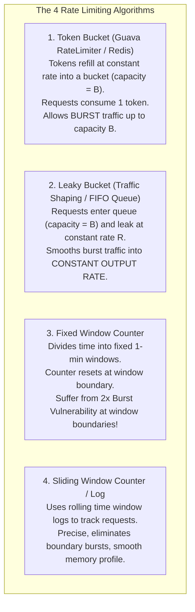

# LLD — Distributed Rate Limiter (Token Bucket, Leaky Bucket, Sliding Window)

## Mental Model

Think of a **Rate Limiter** as a strict security turnstile at a subway station. 

Clients (APIs, IP addresses, User IDs) send HTTP requests to a server. To protect downstream databases and services from Denial of Service (DDoS) traffic spikes (**Resource Exhaustion**), the Rate Limiter evaluates each incoming request against a defined quota rule (e.g., *"Max 100 requests per minute per IP"*). 

If the client is within quota, the turnstile unlocks and the request proceeds (**HTTP 200 OK**). If the client exceeds quota, the turnstile blocks access and returns **HTTP 429 Too Many Requests**.

---

## 1. The 4 Rate Limiting Algorithms Comparison



### Algorithm Comparison Matrix

| Algorithm | Handles Traffic Bursts? | Memory Footprint | Accuracy | Industry Standard Use Case |
|---|---|---|---|---|
| **Token Bucket** | ✅ **Yes (Burst allowed up to bucket capacity)** | $O(1)$ per user | High | **Amazon Web Services (AWS API Gateway), Guava** |
| **Leaky Bucket** | ❌ No (Output rate is fixed & smooth) | $O(B)$ queue size | High | Traffic Shaping, Nginx rate limiting |
| **Fixed Window** | ⚠️ Suffer 2x burst at window edge | $O(1)$ per user | Low | Simple basic rate limiters |
| **Sliding Window** | ✅ **Yes (Accurate rolling window)** | $O(1)$ or $O(N)$ log | **Highest** | **Cloudflare, Redis Rate Limiting** |

---

## 2. Mathematical Foundation of Token Bucket Refill

Instead of running a background thread every millisecond to add 1 token to 1,000,000 active user buckets (**Background Thread CPU Bottleneck**), Token Bucket calculates token refills **lazily on demand** when a request arrives:

$$\text{Tokens to Add} = (\text{currentTime} - \text{lastRefillTime}) \times \text{Refill Rate}$$
$$\text{newTokens} = \min(\text{Capacity}, \text{currentTokens} + \text{Tokens to Add})$$

---

## 3. Production Code Implementation (Java)

```java
package com.lld.ratelimiter;

import java.time.Instant;
import java.util.*;
import java.util.concurrent.ConcurrentHashMap;
import java.util.concurrent.atomic.AtomicLong;
import java.util.concurrent.locks.ReentrantLock;

// ============================================================================
// 1. RATE LIMITER STRATEGY INTERFACE
// ============================================================================
public interface RateLimiterStrategy {
    boolean allowRequest(String clientId);
}

// ============================================================================
// 2. TOKEN BUCKET RATE LIMITER (Lazy Refill Math - $O(1)$ Space & Time)
// ============================================================================
public class TokenBucketRateLimiter implements RateLimiterStrategy {
    private final long capacity;
    private final double refillTokensPerSecond;
    private final Map<String, TokenBucket> buckets = new ConcurrentHashMap<>();

    private static class TokenBucket {
        private final long capacity;
        private final double refillTokensPerSecond;
        private double tokens;
        private long lastRefillTimestamp;
        private final ReentrantLock lock = new ReentrantLock();

        TokenBucket(long capacity, double refillTokensPerSecond) {
            this.capacity = capacity;
            this.refillTokensPerSecond = refillTokensPerSecond;
            this.tokens = capacity; // Start full
            this.lastRefillTimestamp = System.currentTimeMillis();
        }

        boolean tryConsume() {
            lock.lock();
            try {
                refill();
                if (tokens >= 1.0) {
                    tokens -= 1.0;
                    return true; // Request Allowed!
                }
                return false; // Rate Limited (HTTP 429)
            } finally {
                lock.unlock();
            }
        }

        private void refill() {
            long now = System.currentTimeMillis();
            double secondsElapsed = (now - lastRefillTimestamp) / 1000.0;
            if (secondsElapsed > 0) {
                double tokensToAdd = secondsElapsed * refillTokensPerSecond;
                tokens = Math.min(capacity, tokens + tokensToAdd);
                lastRefillTimestamp = now;
            }
        }
    }

    public TokenBucketRateLimiter(long capacity, double refillTokensPerSecond) {
        this.capacity = capacity;
        this.refillTokensPerSecond = refillTokensPerSecond;
    }

    @Override
    public boolean allowRequest(String clientId) {
        TokenBucket bucket = buckets.computeIfAbsent(clientId, k -> new TokenBucket(capacity, refillTokensPerSecond));
        return bucket.tryConsume();
    }
}

// ============================================================================
// 3. SLIDING WINDOW LOG RATE LIMITER (Accurate Rolling Timestamp Window)
// ============================================================================
public class SlidingWindowLogRateLimiter implements RateLimiterStrategy {
    private final int maxRequests;
    private final long windowSizeMillis;
    private final Map<String, Queue<Long>> userLogs = new ConcurrentHashMap<>();

    public SlidingWindowLogRateLimiter(int maxRequests, long windowSizeMillis) {
        this.maxRequests = maxRequests;
        this.windowSizeMillis = windowSizeMillis;
    }

    @Override
    public boolean allowRequest(String clientId) {
        long now = System.currentTimeMillis();
        long windowBoundary = now - windowSizeMillis;

        Queue<Long> log = userLogs.computeIfAbsent(clientId, k -> new LinkedList<>());

        synchronized (log) {
            // Evict outdated timestamps outside current sliding window
            while (!log.isEmpty() && log.peek() <= windowBoundary) {
                log.poll();
            }

            if (log.size() < maxRequests) {
                log.offer(now);
                return true; // Request Allowed!
            }
            return false; // Rate Limited (HTTP 429)
        }
    }
}

// ============================================================================
// 4. RATE LIMITER SERVICE (FACADE)
// ============================================================================
public class RateLimiterService {
    private final RateLimiterStrategy strategy;

    public RateLimiterService(RateLimiterStrategy strategy) {
        this.strategy = Objects.requireNonNull(strategy);
    }

    public boolean handleRequest(String clientId) {
        boolean allowed = strategy.allowRequest(clientId);
        if (allowed) {
            System.out.println("RateLimiter: [200 OK] Request allowed for client: " + clientId);
        } else {
            System.out.println("RateLimiter: [429 TOO MANY REQUESTS] Client rate-limited: " + clientId);
        }
        return allowed;
    }
}
```

---

## 4. Executable Test Suite (`Main`)

```java
public class Main {
    public static void main(String[] args) throws InterruptedException {
        // Token Bucket: Capacity = 3, Refill = 1 token/sec
        RateLimiterStrategy tokenBucket = new TokenBucketRateLimiter(3, 1.0);
        RateLimiterService service = new RateLimiterService(tokenBucket);

        String clientIp = "192.168.1.50";

        System.out.println("--- Burst Request Test (Capacity = 3) ---");
        service.handleRequest(clientIp); // 200 OK (Tokens: 2)
        service.handleRequest(clientIp); // 200 OK (Tokens: 1)
        service.handleRequest(clientIp); // 200 OK (Tokens: 0)
        service.handleRequest(clientIp); // 429 TOO MANY REQUESTS (Bucket Empty!)

        System.out.println("\n--- Sleeping 1.2 Seconds to Refill 1 Token ---");
        Thread.sleep(1200);

        service.handleRequest(clientIp); // 200 OK (Refilled 1 token!)
        service.handleRequest(clientIp); // 429 TOO MANY REQUESTS (Empty again!)
    }
}
```

---

## 5. Active-Recall Prompts

1. **How does lazy mathematical refill `(now - lastRefill) * rate` eliminate background refill threads in Token Bucket?**
2. **Compare Token Bucket vs Leaky Bucket in terms of handling bursty traffic vs traffic shaping.**
3. **Why does Fixed Window Counter suffer from 2x burst traffic vulnerability at window boundaries?**
4. **How would you scale a Rate Limiter across a distributed cluster using Redis Lua scripts (`eval`)?**

---

## Related Notes

- [[LLD - Thread-Safe In-Memory Cache with LRU and LFU Eviction]]
- [[LLD - Task Scheduler and Cron Engine]]
- [[Strategy Pattern - Algorithmic Interchangeability and Policy Objects]]
- [[Producer-Consumer Pattern - Bounded Queues and Condition Variables]]

> **Interview Style Question:** *"Design and implement an API Rate Limiter in Java/TypeScript supporting Token Bucket and Sliding Window algorithms. Demonstrate lazy token refill math, write a thread-safe implementation using ReentrantLock, compare burst handling capabilities, and sketch a distributed Redis Lua script implementation."*

---
