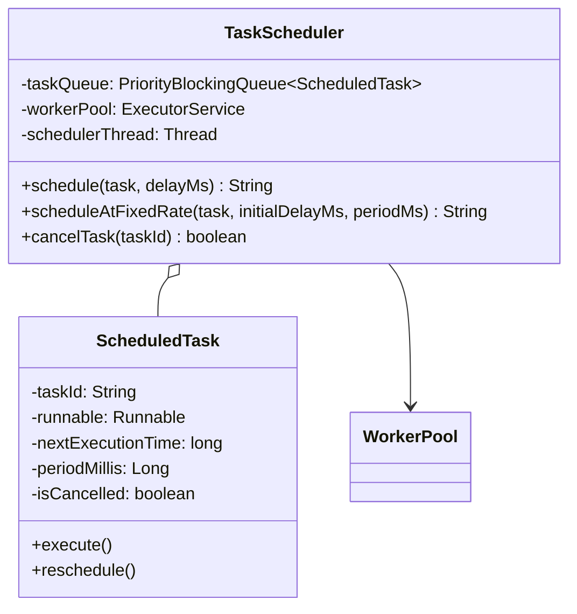

# LLD — Task Scheduler and Cron Engine

## Mental Model

Think of a **Task Scheduler and Cron Engine** as an airport flight control schedule board paired with a worker execution thread pool. 

Tasks are scheduled to run either at a specific future timestamp ($T$), after an initial delay ($\Delta t$), or periodically on a recurring cron interval ($T + k \cdot P$). 

The engine maintains a **Priority Queue (Min-Heap / DelayQueue)** ordered strictly by next execution timestamp ($T_{\text{next}}$). A background Runner thread inspects the root task ($T_{\text{min}}$). If $T_{\text{min}} > \text{currentTime}$, the thread sleeps until $T_{\text{min}}$ (**Condition Variable Wait**). At $T_{\text{min}}$, the thread wakes up, dequeues the task, offloads it to a **Worker Thread Pool** for execution, recalculates the task's next execution time, and re-enqueues recurring tasks back into the Min-Heap.

---

## 1. Problem Statement & Functional Requirements

### Functional Requirements
1. **One-Time Delayed Execution:** Schedule a task to execute once after a delay $\Delta t$ (`schedule(Task, delay)`).
2. **Recurring Periodic Execution:** Schedule a task to run periodically at fixed intervals (`scheduleAtFixedRate(Task, initialDelay, period)`).
3. **Task Cancellation:** Support canceling scheduled tasks by ID.
4. **$O(\log N)$ Priority Scheduling:** Order tasks by next execution timestamp using a Min-Heap Priority Queue.
5. **Thread-Safe Worker Execution:** Execute tasks asynchronously using a Thread Pool so long-running tasks don't block the scheduler thread.
6. **Robust Error Handling:** Prevent task exceptions from crashing worker threads or killing the main scheduler loop.

---

## 2. System Class Diagram (UML)



---

## 3. Production Code Implementation (Java)

```java
package com.lld.scheduler;

import java.util.*;
import java.util.concurrent.*;
import java.util.concurrent.locks.Condition;
import java.util.concurrent.locks.ReentrantLock;

// ============================================================================
// 1. SCHEDULED TASK (Min-Heap Comparable Element)
// ============================================================================
public class ScheduledTask implements Comparable<ScheduledTask> {
    private final String taskId;
    private final Runnable runnable;
    private long nextExecutionTimeMs;
    private final Long periodMs; // Null for one-time tasks
    private volatile boolean cancelled = false;

    public ScheduledTask(String taskId, Runnable runnable, long initialDelayMs, Long periodMs) {
        this.taskId = taskId;
        this.runnable = Objects.requireNonNull(runnable);
        this.nextExecutionTimeMs = System.currentTimeMillis() + initialDelayMs;
        this.periodMs = periodMs;
    }

    public boolean isRecurring() {
        return periodMs != null && periodMs > 0;
    }

    public void updateNextExecutionTime() {
        if (isRecurring()) {
            this.nextExecutionTimeMs = System.currentTimeMillis() + periodMs;
        }
    }

    public void cancel() {
        this.cancelled = true;
    }

    @Override
    public int compareTo(ScheduledTask other) {
        return Long.compare(this.nextExecutionTimeMs, other.nextExecutionTimeMs);
    }

    public String getTaskId() { return taskId; }
    public Runnable getRunnable() { return runnable; }
    public long getNextExecutionTimeMs() { return nextExecutionTimeMs; }
    public boolean isCancelled() { return cancelled; }
}

// ============================================================================
// 2. TASK SCHEDULER ENGINE
// ============================================================================
public class CustomTaskScheduler {
    private final PriorityQueue<ScheduledTask> taskQueue = new PriorityQueue<>();
    private final Map<String, ScheduledTask> taskMap = new ConcurrentHashMap<>();
    private final ExecutorService workerPool;
    private final Thread schedulerThread;
    
    private final ReentrantLock lock = new ReentrantLock();
    private final Condition newTaskOrEarlierTaskSignaled = lock.newCondition();
    private volatile boolean isRunning = true;

    public CustomTaskScheduler(int workerThreads) {
        this.workerPool = Executors.newFixedThreadPool(workerThreads);
        this.schedulerThread = new Thread(this::schedulerLoop, "TaskSchedulerLoop");
        this.schedulerThread.start();
    }

    public String schedule(Runnable runnable, long delayMs) {
        return scheduleAtFixedRate(runnable, delayMs, null);
    }

    public String scheduleAtFixedRate(Runnable runnable, long initialDelayMs, Long periodMs) {
        lock.lock();
        try {
            String taskId = "TASK-" + UUID.randomUUID().toString().substring(0, 8);
            ScheduledTask task = new ScheduledTask(taskId, runnable, initialDelayMs, periodMs);

            taskMap.put(taskId, task);
            taskQueue.offer(task);

            System.out.println("Scheduler: Scheduled Task [" + taskId + "] to run in " + initialDelayMs + "ms");

            // Signal scheduler thread if this new task is at head of queue!
            if (taskQueue.peek() == task) {
                newTaskOrEarlierTaskSignaled.signal();
            }

            return taskId;
        } finally {
            lock.unlock();
        }
    }

    public boolean cancelTask(String taskId) {
        lock.lock();
        try {
            ScheduledTask task = taskMap.remove(taskId);
            if (task != null) {
                task.cancel();
                taskQueue.remove(task); // Remove from Min-Heap
                System.out.println("Scheduler: CANCELED Task [" + taskId + "]");
                return true;
            }
            return false;
        } finally {
            lock.unlock();
        }
    }

    // MAIN SCHEDULER LOOP (Single Thread Polling Min-Heap)
    private void schedulerLoop() {
        while (isRunning) {
            lock.lock();
            try {
                while (taskQueue.isEmpty()) {
                    newTaskOrEarlierTaskSignaled.await(); // Sleep until task arrives
                }

                while (!taskQueue.isEmpty()) {
                    ScheduledTask topTask = taskQueue.peek();

                    if (topTask.isCancelled()) {
                        taskQueue.poll();
                        continue;
                    }

                    long now = System.currentTimeMillis();
                    long sleepTimeMs = topTask.getNextExecutionTimeMs() - now;

                    if (sleepTimeMs <= 0) {
                        // Task is ready for execution!
                        ScheduledTask readyTask = taskQueue.poll();

                        // Offload execution to Worker Thread Pool!
                        workerPool.submit(() -> {
                            try {
                                readyTask.getRunnable().run();
                            } catch (Exception e) {
                                System.err.println("Task Execution Exception: " + e.getMessage());
                            }
                        });

                        // If task is recurring, update next execution time and re-enqueue!
                        if (readyTask.isRecurring() && !readyTask.isCancelled()) {
                            readyTask.updateNextExecutionTime();
                            taskQueue.offer(readyTask);
                        } else {
                            taskMap.remove(readyTask.getTaskId());
                        }

                    } else {
                        // Wait until top task's execution time or new earlier task is signaled
                        newTaskOrEarlierTaskSignaled.await(sleepTimeMs, TimeUnit.MILLISECONDS);
                        break; // Re-evaluate top task after wake up
                    }
                }
            } catch (InterruptedException e) {
                Thread.currentThread().interrupt();
                break;
            } finally {
                lock.unlock();
            }
        }
    }

    public void stop() {
        this.isRunning = false;
        schedulerThread.interrupt();
        workerPool.shutdown();
    }
}
```

---

## 4. Executable Test Suite (`Main`)

```java
public class Main {
    public static void main(String[] args) throws InterruptedException {
        CustomTaskScheduler scheduler = new CustomTaskScheduler(4); // 4 Worker Threads

        System.out.println("--- Test 1: Schedule One-Time Delayed Task (2 Seconds) ---");
        scheduler.schedule(() -> {
            System.out.println(">>> EXECUTE: One-Time Task 1 Fired! (Time: " + System.currentTimeMillis() + ")");
        }, 2000L);

        System.out.println("--- Test 2: Schedule Recurring Task (Initial 1 Sec, Period 1 Sec) ---");
        String recurringTaskId = scheduler.scheduleAtFixedRate(() -> {
            System.out.println(">>> EXECUTE: Recurring Task Fired! (Time: " + System.currentTimeMillis() + ")");
        }, 1000L, 1000L);

        // Let recurring task run for 3.5 seconds
        Thread.sleep(3500);

        System.out.println("\n--- Test 3: Cancel Recurring Task ---");
        scheduler.cancelTask(recurringTaskId);

        // Sleep 2 more seconds to verify no more executions occur
        Thread.sleep(2000);
        scheduler.stop();
    }
}
```

---

## 5. Active-Recall Prompts

1. **How does a Min-Heap Priority Queue order scheduled tasks by next execution timestamp ($O(\log N)$ enqueue/dequeue)?**
2. **Why should task execution be offloaded to a Thread Pool instead of running directly inside the main scheduler loop?**
3. **How does `newTaskOrEarlierTaskSignaled.await(sleepTimeMs)` prevent CPU spinning while waiting for a future task?**
4. **How do you handle rescheduling periodic tasks when task execution duration exceeds the period interval?**

---

## Related Notes

- [[Producer-Consumer Pattern - Bounded Queues and Condition Variables]]
- [[Thread Pool Pattern - Worker Queues, Task Rejection Policies, Work Stealing]]
- [[Active Object Pattern - Decoupling Method Execution from Invocation]]
- [[Command Pattern - Encapsulating Requests, Undo-Redo, and Macro Commands]]

> **Interview Style Question:** *"Design and implement a Task Scheduler and Cron Engine in Java/TypeScript supporting delayed and recurring tasks. Build a thread-safe Min-Heap task queue, use condition variable waiting to eliminate CPU spinning, offload task execution to a worker thread pool, support task cancellation, and write an executable test suite."*

---
