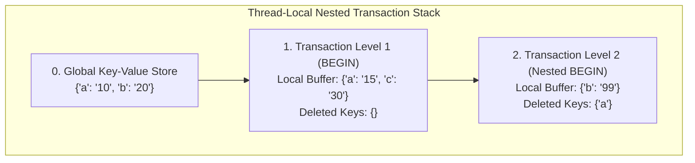

# LLD — Thread-Safe Key-Value Store with Transactions

## Mental Model

Think of a **Thread-Safe Key-Value Store with Transactions** as an in-memory Redis or SQLite engine with interactive transaction block isolation (`BEGIN`, `COMMIT`, `ROLLBACK`). 

Outside a transaction, reads and writes mutate the global key-value store directly. When a thread issues `BEGIN`, the engine spawns an isolated transaction workspace stack (**Nested Transaction Buffer**). Reads inspect the local transaction buffer first before falling back to global storage. Writes alter only the local transaction buffer. 

Executing `COMMIT` flushes all local buffer modifications down to the parent transaction or global store atomically. Executing `ROLLBACK` discards the local transaction buffer without altering global state!

---

## 1. Problem Statement & Functional Requirements

### Functional Requirements
1. **Core Key-Value Operations:** `GET(key)`, `SET(key, value)`, `DELETE(key)`.
2. **Nested Transactions Support:** Support `BEGIN`, `COMMIT`, `ROLLBACK` for nested transaction blocks.
3. **Transaction State Isolation:** Uncommitted writes in an active transaction are isolated to that transaction.
4. **Cascading Rollback:** Rolling back a transaction discards all writes made inside that transaction level.
5. **Atomic Commit:** Committing a nested transaction merges changes into the parent transaction level; committing the root transaction updates global store.
6. **Thread Safety & High Concurrency:** Support multi-threaded execution across independent transactions using thread-local transaction stacks and fine-grained locks.

---

## 2. Nested Transaction Stack Architecture



### Execution Rules
- **`GET(key)` Resolution:** Search from top transaction level down to bottom: `Tx2 Buffer -> Tx1 Buffer -> Global Store`.
- **`SET(key, val)` Resolution:** Write key-value pair to top active transaction buffer.
- **`DELETE(key)` Resolution:** Mark key as `DELETED` in top active transaction buffer.
- **`COMMIT` Resolution:** Pop top buffer and merge all keys into parent buffer or global store.
- **`ROLLBACK` Resolution:** Pop top buffer and discard without merging.

---

## 3. Production Code Implementation (Java)

```java
package com.lld.kvstore;

import java.util.*;
import java.util.concurrent.ConcurrentHashMap;
import java.util.concurrent.locks.ReentrantReadWriteLock;

// ============================================================================
// 1. TRANSACTION BUFFER ENTITY
// ============================================================================
public class TransactionBuffer {
    private final Map<String, String> localStore = new HashMap<>();
    private final Set<String> deletedKeys = new HashSet<>();

    public void set(String key, String value) {
        localStore.put(key, value);
        deletedKeys.remove(key);
    }

    public void delete(String key) {
        localStore.remove(key);
        deletedKeys.add(key);
    }

    public String get(String key) {
        if (deletedKeys.contains(key)) {
            return null; // Marked deleted in this transaction
        }
        return localStore.get(key);
    }

    public boolean isDeleted(String key) {
        return deletedKeys.contains(key);
    }

    public boolean containsKey(String key) {
        return localStore.containsKey(key);
    }

    public Map<String, String> getLocalStore() { return localStore; }
    public Set<String> getDeletedKeys() { return deletedKeys; }
}

// ============================================================================
// 2. TRANSACTIONAL KEY-VALUE STORE ENGINE
// ============================================================================
public class TransactionalKeyValueStore {
    private final Map<String, String> globalStore = new ConcurrentHashMap<>();
    private final ThreadLocal<Deque<TransactionBuffer>> transactionStack = ThreadLocal.withInitial(ArrayDeque::new);
    private final ReentrantReadWriteLock globalLock = new ReentrantReadWriteLock();

    // ============================================================================
    // TRANSACTION CONTROL OPERATIONS
    // ============================================================================
    public void begin() {
        transactionStack.get().push(new TransactionBuffer());
        System.out.println("TX: BEGIN (Nested Level: " + transactionStack.get().size() + ")");
    }

    public void commit() {
        Deque<TransactionBuffer> stack = transactionStack.get();
        if (stack.isEmpty()) {
            throw new IllegalStateException("No active transaction to commit!");
        }

        TransactionBuffer current = stack.pop();

        if (stack.isEmpty()) {
            // Root Transaction Commit -> Apply to Global Store!
            globalLock.writeLock().lock();
            try {
                for (String key : current.getDeletedKeys()) {
                    globalStore.remove(key);
                }
                globalStore.putAll(current.getLocalStore());
                System.out.println("TX: COMMIT Root Transaction -> Merged into Global Store!");
            } finally {
                globalLock.writeLock().unlock();
            }
        } else {
            // Nested Transaction Commit -> Merge into Parent Transaction Buffer!
            TransactionBuffer parent = stack.peek();
            for (String key : current.getDeletedKeys()) {
                parent.delete(key);
            }
            for (Map.Entry<String, String> entry : current.getLocalStore().entrySet()) {
                parent.set(entry.getKey(), entry.getValue());
            }
            System.out.println("TX: COMMIT Nested Transaction -> Merged into Parent Transaction!");
        }
    }

    public void rollback() {
        Deque<TransactionBuffer> stack = transactionStack.get();
        if (stack.isEmpty()) {
            throw new IllegalStateException("No active transaction to rollback!");
        }
        stack.pop(); // Discard top buffer!
        System.out.println("TX: ROLLBACK Transaction -> Discarded local changes!");
    }

    // ============================================================================
    // KEY-VALUE OPERATIONS
    // ============================================================================
    public String get(String key) {
        Deque<TransactionBuffer> stack = transactionStack.get();

        // Search down transaction stack
        for (TransactionBuffer tx : stack) {
            if (tx.isDeleted(key)) {
                return null; // Explicitly deleted in active transaction
            }
            if (tx.containsKey(key)) {
                return tx.get(key);
            }
        }

        // Fallback to Global Store
        globalLock.readLock().lock();
        try {
            return globalStore.get(key);
        } finally {
            globalLock.readLock().unlock();
        }
    }

    public void set(String key, String value) {
        Deque<TransactionBuffer> stack = transactionStack.get();
        if (!stack.isEmpty()) {
            stack.peek().set(key, value); // Write to active transaction buffer
        } else {
            globalLock.writeLock().lock();
            try {
                globalStore.put(key, value); // Auto-commit write to global store
            } finally {
                globalLock.writeLock().unlock();
            }
        }
    }

    public void delete(String key) {
        Deque<TransactionBuffer> stack = transactionStack.get();
        if (!stack.isEmpty()) {
            stack.peek().delete(key); // Mark deleted in active transaction buffer
        } else {
            globalLock.writeLock().lock();
            try {
                globalStore.remove(key); // Auto-commit delete to global store
            } finally {
                globalLock.writeLock().unlock();
            }
        }
    }
}
```

---

## 4. Executable Test Suite (`Main`)

```java
public class Main {
    public static void main(String[] args) {
        TransactionalKeyValueStore kv = new TransactionalKeyValueStore();

        System.out.println("--- Test 1: Global Operations Outside Transaction ---");
        kv.set("a", "10");
        kv.set("b", "20");
        System.out.println("Get a: " + kv.get("a")); // 10
        System.out.println("Get b: " + kv.get("b")); // 20

        System.out.println("\n--- Test 2: Transaction 1 Modification & Rollback ---");
        kv.begin();
        kv.set("a", "100");
        kv.set("c", "300");
        System.out.println("Inside TX1 -> Get a: " + kv.get("a")); // 100
        System.out.println("Inside TX1 -> Get c: " + kv.get("c")); // 300
        kv.rollback(); // Discard TX1!

        System.out.println("After Rollback -> Get a: " + kv.get("a")); // 10 (Restored!)
        System.out.println("After Rollback -> Get c: " + kv.get("c")); // null

        System.out.println("\n--- Test 3: Nested Transactions (TX1 -> TX2 -> COMMIT) ---");
        kv.begin(); // Level 1
        kv.set("a", "50");

        kv.begin(); // Level 2 (Nested)
        kv.set("a", "999");
        System.out.println("Inside TX2 -> Get a: " + kv.get("a")); // 999
        kv.commit(); // Commit TX2 -> Merges into TX1

        System.out.println("Inside TX1 (Post-TX2 Commit) -> Get a: " + kv.get("a")); // 999
        kv.commit(); // Commit TX1 -> Merges into Global Store!

        System.out.println("Global Store -> Get a: " + kv.get("a")); // 999
    }
}
```

---

## 5. Active-Recall Prompts

1. **How does a ThreadLocal stack of transaction buffers support nested `BEGIN`, `COMMIT`, and `ROLLBACK` operations?**
2. **How does `GET(key)` resolve keys by searching top-down from local transaction buffers to global store?**
3. **How does marking keys in a `deletedKeys` set handle `DELETE(key)` inside nested transactions?**
4. **How would you extend this Key-Value store to support Serializable Isolation using Two-Phase Locking (2PL)?**

---

## Related Notes

- [[Transactions and ACID Properties - Atomicity, Consistency, Isolation, Durability]]
- [[Concurrency Control - Two-Phase Locking, Deadlock Detection, Lock Granularity]]
- [[LLD - Thread-Safe In-Memory Cache with LRU and LFU Eviction]]
- [[Command Pattern - Encapsulating Requests, Undo-Redo, and Macro Commands]]

> **Interview Style Question:** *"Design and implement a Thread-Safe In-Memory Key-Value Store with Interactive Transactions (`BEGIN`, `COMMIT`, `ROLLBACK`) in Java/TypeScript. Demonstrate nested transaction buffer resolution, write an atomic commit algorithm that merges child transaction buffers into parent transactions, and write a full test suite testing rollback isolation."*

---
