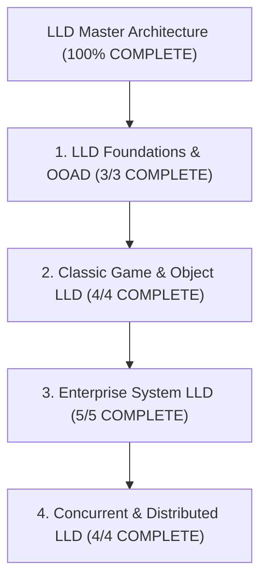

# Low Level Design (LLD / Machine Coding) — Map of Content

> [!abstract] Architectural Mission
> This Map of Content organizes the complete **Low Level Design (LLD) & Machine Coding** knowledge base. It covers Object-Oriented Analysis & Design (OOAD), class diagram modeling, requirement clarification, edge case handling, and full working production-grade code implementations (Java/C++/Python/TypeScript) for classic machine coding interview problems, enterprise LLD problems, and high-concurrency thread-safe data structures.

---

## 1. LLD Foundations & OOAD (3/3 COMPLETE)

- [x] [[Object-Oriented Analysis and Design - Requirement Gathering, Use Cases, and Class Diagrams]]
- [x] [[Machine Coding Interview Framework - 45-Minute Execution Blueprint]]
- [x] [[Design Patterns in LLD - Practical Application Guide]]

---

## 2. Classic Game & Object LLD (4/4 COMPLETE)

- [x] [[LLD - Parking Lot System]]
- [x] [[LLD - Elevator Control System]]
- [x] [[LLD - Tic-Tac-Toe and N-by-N Board Game Engine]]
- [x] [[LLD - Snake and Ladders Game Engine]]

---

## 3. Enterprise System LLD (5/5 COMPLETE)

- [x] [[LLD - Automated Teller Machine (ATM) System]]
- [x] [[LLD - Vending Machine System]]
- [x] [[LLD - Movie Ticket Booking System (BookMyShow)]]
- [x] [[LLD - Library Management System]]
- [x] [[LLD - Hotel Room Booking System]]

---

## 4. Concurrent & Distributed LLD (4/4 COMPLETE)

- [x] [[LLD - Thread-Safe In-Memory Cache with LRU and LFU Eviction]]
- [x] [[LLD - Distributed Rate Limiter (Token Bucket, Leaky Bucket, Sliding Window)]]
- [x] [[LLD - Task Scheduler and Cron Engine]]
- [x] [[LLD - Thread-Safe Key-Value Store with Transactions]]

---

*Last updated: 2026-08-18 | Status: COMPLETE (16 Canonical Notes + 1 MOC) | Subject 05 — Low Level Design*
