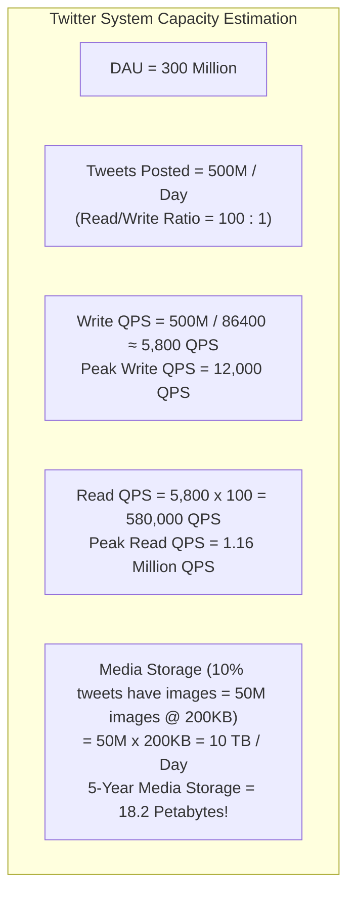

# Back-of-the-Envelope Calculations — Throughput, Storage, and Bandwidth Estimation

## Mental Model

Think of **Back-of-the-Envelope Calculations** as a civil engineer estimating the steel, concrete, and water volume required for a new city bridge before ordering construction materials. 

If you order 100 trucks of cement for a bridge that requires 10,000 trucks (**Off by 100x / System Collapse**), or if you order 1,000,000 servers for a service that needs 10 (**Off by 100x / Bankruptcy**), your project fails. 

Back-of-the-envelope math uses standard powers of 2 ($2^{10} \approx 10^3$) and latency numbers to prove whether an architecture requires 5 servers or 5,000 servers, 100 GB of RAM or 50 TB, and 100 Mbps or 10 Gbps of bandwidth.

---

## 1. The Numbers Every System Architect Must Know

### A. Latency Numbers Every Computer Scientist Should Know (Peter Norvig)

```text
Operation                                         Latency (ns)       Latency (Human Scale)
-------------------------------------------------------------------------------------------
L1 Cache Read                                     0.5 ns             0.5 sec
Branch Mispredict                                 5 ns               5 sec
L2 Cache Read                                     7 ns               7 sec
Mutex Lock / Unlock                               25 ns              25 sec
Main Memory (RAM) Read                            100 ns             1.6 min
Read 1MB Sequentially from RAM                    250,000 ns (250 µs) 2.9 days
Read 1MB Sequentially from NVMe SSD               1,000,000 ns (1 ms) 11.5 days
Read 1MB Sequentially from Spinning Disk (HDD)    20,000,000 ns (20 ms) 7.5 months
Send Packet CA to Netherlands (WAN Latency)       150,000,000 ns (150 ms) 4.7 years
```

> **Architectural Takeaway:** Reading from RAM is **10,000x faster** than reading from spinning disk, and **1,500,000x faster** than fetching over a WAN network!

---

### B. Powers of 2 & Metric System Approximations

| Power of 2 | Exact Value | Metric Prefix | Approximation | Example Application |
|---|---|---|---|---|
| $2^{10}$ | 1,024 | **Kilo (K)** | $10^3$ (Thousand) | KB of text payload |
| $2^{20}$ | 1,048,576 | **Mega (M)** | $10^6$ (Million) | MB of image file |
| $2^{30}$ | 1,073,741,824 | **Giga (G)** | $10^9$ (Billion) | GB of RAM / Movie |
| $2^{40}$ | 1,099,511,627,776 | **Tera (T)** | $10^{12}$ (Trillion) | TB of database storage |
| $2^{50}$ | 1,125,899,906,842,624 | **Peta (P)** | $10^{15}$ | PB of data warehouse |

---

## 2. Standard Capacity Estimation Formulas

### A. Seconds in a Day Conversion Trick
$$\text{Seconds in 1 Day} = 24 \times 60 \times 60 = 86,400 \approx \mathbf{10^5 \text{ Seconds (86,400)}}$$

$$\text{Average QPS} = \frac{\text{Daily Active Requests}}{86,400} \approx \frac{\text{Daily Requests}}{10^5}$$

$$\text{Peak QPS} = \text{Average QPS} \times 2 \quad (\text{Standard 2x Safety Margin})$$

---

### B. Throughput & QPS Calculation Formula

Given:
- Daily Active Users ($\text{DAU}$) = 100 Million ($10^8$)
- Requests per User per Day = 10

$$\text{Total Daily Requests} = 10^8 \times 10 = 10^9 \text{ Requests/Day}$$

$$\text{Average QPS} = \frac{10^9}{86,400} \approx 11,574 \text{ QPS}$$

$$\text{Peak QPS} = 11,574 \times 2 \approx \mathbf{23,000 \text{ QPS}}$$

---

### C. Storage Capacity Calculation Formula

Given:
- Write Requests per Day = 100 Million ($10^8$)
- Size per Payload = $2 \text{ KB} = 2 \times 10^3 \text{ Bytes}$

$$\text{Daily Storage} = 10^8 \times (2 \times 10^3) = 2 \times 10^{11} \text{ Bytes} = \mathbf{200 \text{ GB / Day}}$$

$$\text{5-Year Storage} = 200 \text{ GB/Day} \times 365 \times 5 \approx \mathbf{365 \text{ TB}}$$

---

### D. Bandwidth Estimation Formula

Given:
- Read QPS = 20,000 QPS
- Payload Size per Read = 50 KB

$$\text{Incoming Bandwidth} = 20,000 \times 50 \text{ KB} = 1,000,000 \text{ KB/sec} = 1 \text{ GB/sec}$$

$$\text{Bandwidth in Bits} = 1 \text{ GB/sec} \times 8 = \mathbf{8 \text{ Gbps Network Bandwidth}}$$

---

## 3. Real-World Case Study: Twitter / X Capacity Estimation



---

## 4. Architectural Server Sizing Matrix

How many application servers or database instances do you need?

$$\text{Number of App Servers} = \frac{\text{Peak QPS}}{\text{Single Server QPS Capacity}}$$

| Component Type | Average Single Server Capacity (QPS) | Bottleneck Factor |
|---|---|---|
| **Stateless Web API Server** | $2,000 - 5,000$ QPS | CPU & Network Socket Limits |
| **Redis In-Memory Cache** | $100,000 - 250,000$ QPS | Single-Thread RAM I/O |
| **PostgreSQL SQL Database (Read)** | $5,000 - 10,000$ QPS | NVMe Disk I/O & Buffer Pool |
| **PostgreSQL SQL Database (Write)** | $1,000 - 3,000$ QPS | WAL Disk Synchronization (`fsync`) |

---

## 5. Failure Modes and Trade-offs

1. **Confusing Bytes and Bits** — Forgetting that 1 Byte = 8 bits! Calculating $1 \text{ GB/sec}$ storage bandwidth and assuming it fits on a $1 \text{ Gbps}$ network card. $1 \text{ GB/sec} = 8 \text{ Gbps}$! *Mitigation*: Convert network numbers explicitly to bits ($\text{Gbps}$).
2. **Ignoring Peak Traffic Multipliers** — Designing a system based on average QPS. During flash sales or breaking news events, peak traffic can be 10x average traffic, crashing un-scalable systems. *Mitigation*: Apply a $2\text{x}-10\text{x}$ peak multiplier.
3. **Storage Overhead Underestimation** — Calculating raw payload size without accounting for database indexes, replication overhead ($3\times$ replication factor), and WAL logs. *Mitigation*: Multiply raw storage by $2\text{x}$ to account for indexing and metadata overhead.

---

## 6. Active-Recall Prompts

1. **What is the Norvig latency difference between a RAM Read ($100\text{ns}$) and a Disk Read ($10\text{ms}$)?**
2. **How many seconds are in a day, and what is the approximation shortcut for calculating Average QPS?**
3. **Calculate Peak Read QPS for a system with 500M DAU where users make 20 read requests per day.**
4. **How do you calculate 5-year storage requirements including a $3\times$ database replication factor?**

---

## Related Notes

- [[System Design Interview Framework - 4-Step Blueprint]]
- [[High Availability Architecture - SLAs, SLOs, Fault Tolerance, and High-9s Math]]
- [[Database Scaling - Vertical vs Horizontal, Read Replicas, and Master-Slave]]
- [[Database Sharding - Hash-Based, Range-Based, and Directory-Based Partitioning]]

> **Interview Style Question:** *"Calculate the capacity requirements for a global chat application like WhatsApp (500M DAU, 50 messages/user/day, 5% image messages @ 100KB each). Estimate Write QPS, Peak Read QPS, Daily Storage, 5-Year Storage with 3x replication, Network Bandwidth in Gbps, and calculate how many Redis nodes (64GB RAM each) are needed to cache hot messages for 24 hours."*

---
