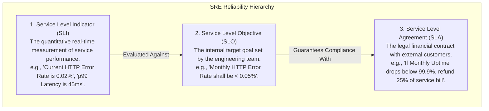
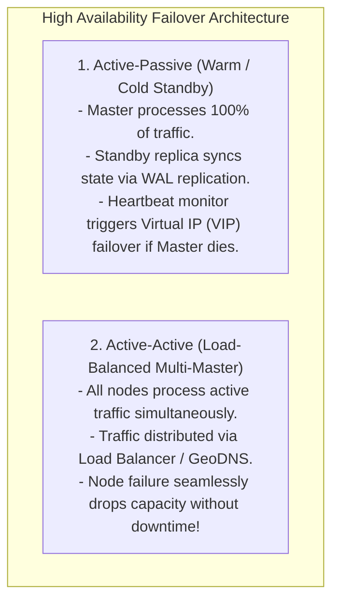

# High Availability Architecture — SLAs, SLOs, Fault Tolerance, and High-9s Math

## Mental Model

Think of **High Availability (HA)** as an aircraft engine reliability system on a transatlantic commercial jet. 

A single-engine plane has a single point of failure (**SPOF**); if that engine fails, the plane crashes. A commercial jet has 2 or 4 redundant engines, isolated fuel lines, and automatic failover systems (**Fault Tolerance**). 

The airline guarantees passengers that flights will arrive on time 99.999% of the time (**Service Level Agreement - SLA**). If an engine fails mid-flight, the control system seamlessly transfers thrust to remaining engines (**Active-Passive / Active-Active Failover**) without passengers ever experiencing a loss of altitude or service disruption.

---

## 1. SLA vs. SLO vs. SLI Metrics

In Site Reliability Engineering (SRE) and System Architecture, reliability is measured using three distinct metrics:



---

## 2. High-9s Availability Math (The Nines Table)

Availability is defined mathematically as the percentage of total operational time that a system remains functional:

$$\text{Availability} = \frac{\text{Uptime}}{\text{Uptime} + \text{Downtime}} = \frac{\text{MTBF}}{\text{MTBF} + \text{MTTR}}$$

Where **MTBF** is Mean Time Between Failures, and **MTTR** is Mean Time To Repair.

### Allowed Downtime per Availability "Nines"

| Availability % | "Nines" Classification | Allowed Downtime per Year | Allowed Downtime per Month | Allowed Downtime per Day |
|---|---|---|---|---|
| **99%** | Two Nines | 3.65 days | 7.31 hours | 14.4 minutes |
| **99.9%** | Three Nines | 8.76 hours | 43.8 minutes | 1.44 minutes |
| **99.99%** | Four Nines | 52.6 minutes | 4.38 minutes | 8.64 seconds |
| **99.999%** | **Five Nines (Gold Standard)** | **5.26 minutes** | **26.3 seconds** | **0.86 seconds** |
| **99.9999%** | Six Nines | 31.5 seconds | 2.63 seconds | 0.086 seconds |

---

## 3. Serial vs. Parallel Availability Math

System availability depends on how components are connected architecturally:

### A. Serial Availability (Single Points of Failure)
If a system consists of $N$ independent components in series, where each component must work for the system to function:

$$\text{Availability}_{\text{Serial}} = A_1 \times A_2 \times A_3 \times \dots \times A_N$$

```text
Serial Pipeline:
Client ---> [ API Gateway (99.9%) ] ---> [ App Server (99.9%) ] ---> [ Database (99.9%) ]

Total System Availability = 0.999 * 0.999 * 0.999 = 0.997 (99.7% Availability!)
Result: 3 "Three Nines" components in series degrade the overall system to TWO NINES (26.3 hours downtime/year)!
```

---

### B. Parallel Availability (Redundant Components)
If a system has $N$ redundant parallel components, where only ONE component needs to work for the system to function:

$$\text{Availability}_{\text{Parallel}} = 1 - (1 - A_1) \times (1 - A_2) \times \dots \times (1 - A_N)$$

```text
Parallel Redundant App Servers:
            ┌---> [ App Server A (99.9%) ] ---┐
Client ---> │                                 ├──-> Database
            └---> [ App Server B (99.9%) ] ---┘

Total App Layer Availability = 1 - (1 - 0.999) * (1 - 0.999) = 1 - (0.001 * 0.001) = 0.999999 (99.9999% Six Nines!)
```

---

## 4. Redundancy & Failover Patterns



---

## 5. Architectural Comparison Matrix

| Pattern | Recovery Time (MTTR) | Data Loss Risk (RPO) | Infrastructure Cost |
|---|---|---|---|
| **Single Node (No HA)** | Hours/Days | High | 1x ($) |
| **Active-Passive (Async Rep)** | 30s - 2 mins | Low (Async lag window) | 2x ($$) |
| **Active-Passive (Sync Rep)** | 10s - 30s | **Zero Data Loss** | 2x ($$) |
| **Active-Active Multi-Region** | **Sub-second (Instant)** | Low (Conflict Resolution) | 3x+ ($$$$) |

---

## 6. Failure Modes and Trade-offs

1. **Split-Brain Syndrome in Active-Passive Failover** — A temporary network partition isolates Master from Standby. Standby assumes Master is dead and promotes itself to Master. Both nodes start accepting writes independently, causing **irrecoverable data corruption**! *Mitigation*: Use odd-numbered quorum consensus clusters (3 or 5 nodes via ZooKeeper / Etcd / Raft).
2. **Cascading Failures in Active-Active Clusters** — In an $N=3$ node Active-Active cluster running at 80% capacity, 1 node dies. The remaining 2 nodes receive 150% of their capacity limit, overheat, and crash sequentially (**Domino Effect**). *Mitigation*: Implement **Circuit Breakers**, Rate Limiting, and maintain max 50% capacity usage ($N+1$ provisioning).
3. **Flapping Health Checks** — A flapping node intermittently fails health checks every 2 seconds, forcing continuous failovers that thrash DNS caches and tear down TCP connection pools. *Mitigation*: Require $K$ consecutive failed health checks before triggering failover.

---

## 7. Active-Recall Prompts

1. **Differentiate between SLI, SLO, and SLA with concrete examples.**
2. **How much downtime per year is allowed under 99.99% (Four Nines) vs. 99.999% (Five Nines)?**
3. **Calculate total system availability for 3 components with 99.9% availability connected in Series vs. Parallel.**
4. **What is Split-Brain Syndrome in Active-Passive failover, and how do Quorum Consensus algorithms prevent it?**

---

## Related Notes

- [[System Design Interview Framework - 4-Step Blueprint]]
- [[Back-of-the-Envelope Calculations - Throughput, Storage, and Bandwidth Estimation]]
- [[Load Balancers - Layer 4 vs Layer 7, Algorithms, and Health Checks]]
- [[Domain Name System in HLD - GeoDNS, Latency-Based Routing, and Failover]]

> **Interview Style Question:** *"Design a 99.999% Five-Nines Available Global Payment Gateway processing 10,000 TPS. Calculate serial vs parallel availability for your Gateway, Application, and Database layers, design an Active-Active Multi-Region architecture with automatic heartbeats, analyze Split-Brain prevention using Raft consensus, and calculate maximum allowed downtime per year."*

---
