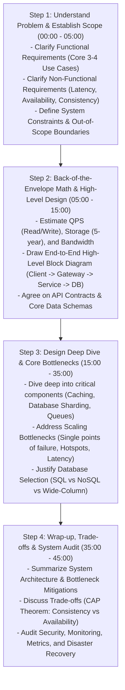
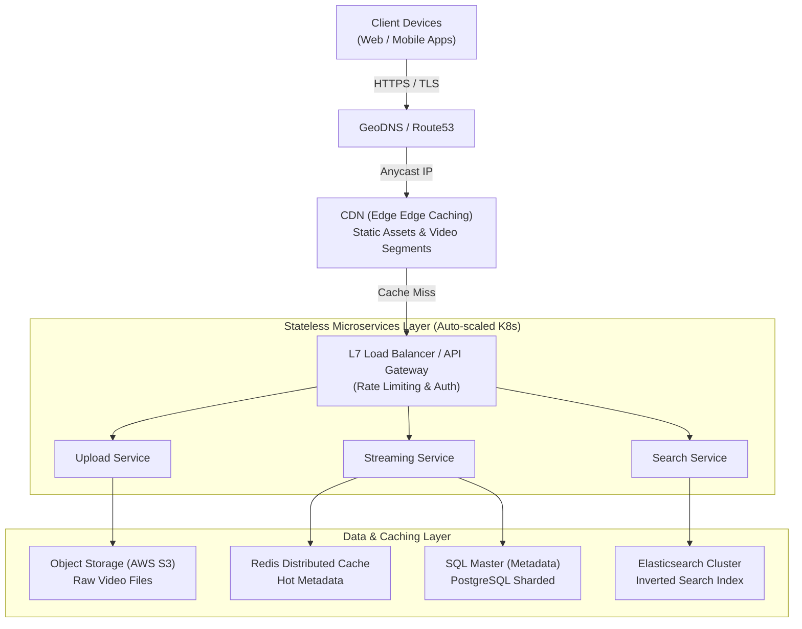
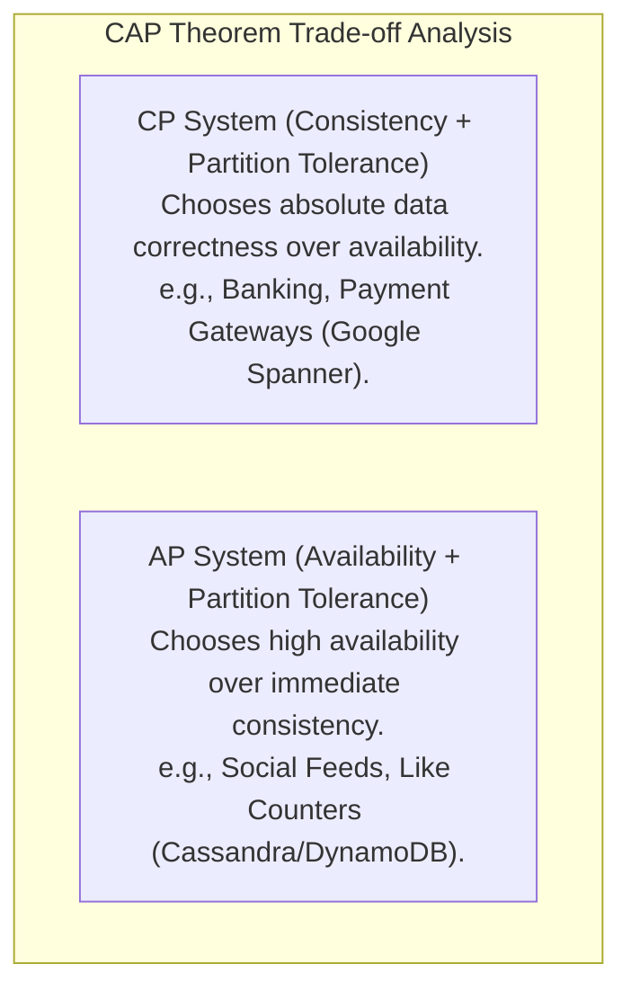

# System Design Interview Framework — 4-Step Blueprint

## Mental Model

Think of a **System Design Interview** as a Chief Software Architect pitching a multi-million dollar distributed cloud architecture proposal to an executive board. 

If you immediately start drawing database schemas or load balancers on a whiteboard before asking who the users are (**Jumping to Solutions prematurely**), the project will fail due to mismatched requirements, ungrounded capacity assumptions, and catastrophic scaling bottlenecks. 

A Principal Architect follows a structured 45-minute blueprint: 
1. **Understand Problem & Establish Scope** (5 mins)
2. **Propose High-Level Architecture & Get Buy-in** (10 mins)
3. **Design Deep Dive & Bottleneck Remediation** (20 mins)
4. **Wrap-up, Trade-offs & Security Audit** (10 mins).

---

## 1. The 4-Step System Design Interview Timeline



---

## 2. Step 1: Clarify Requirements & Scope (Mins 0-5)

Never assume requirements. Always ask clarifying questions to split requirements into **Functional** and **Non-Functional** categories.

### Requirements Clarification Matrix (Example: YouTube System Design)

| Category | Requirement Type | Example Definition |
|---|---|---|
| **Functional** | **Core Use Case 1** | Users can upload videos (1080p, 4K) seamlessly. |
| **Functional** | **Core Use Case 2** | Users can stream/watch videos on mobile/desktop without buffering. |
| **Functional** | **Core Use Case 3** | Users can search videos by title or tags. |
| **Non-Functional** | **High Availability** | $99.99\%$ availability ($52$ minutes downtime/year). |
| **Non-Functional** | **Low Latency** | Video playback start latency $< 200\text{ms}$. |
| **Non-Functional** | **Scalability** | Support 500 million Daily Active Users (DAU). |
| **Non-Functional** | **Consistency** | Eventual consistency for video view counts; strong consistency for billing. |

---

## 3. Step 2: Back-of-the-Envelope Math & High-Level Block Diagram (Mins 5-15)

Conduct quick, accurate capacity estimations to ground component selection:

```text
Capacity Estimation Summary (e.g., Twitter Newsfeed):
- DAU = 300 Million
- Tweets / User / Day = 2 -> Total Tweets = 600 Million / Day
- Read / Write Ratio = 100 : 1 -> Total Read QPS = 600,000 QPS
- Peak Read QPS = 1.2 Million QPS
- Storage / Tweet = 500 Bytes -> Storage / Day = 300 GB / Day -> 5-Year Storage = 547 TB
```

### High-Level Architectural Block Diagram



---

## 4. Step 3: Design Deep Dive (Mins 15-35)

Drive the deep-dive conversation into 2-3 critical architectural challenges:

### Common Deep-Dive Topics:
1. **Handling Traffic Bursts:** CDN edge caching, Kafka queue buffering, API rate limiting.
2. **Database Partitioning & Sharding:** Selecting optimal Shard Keys to prevent hotspot partitions.
3. **Cache Eviction & Invalidation:** Cache-Aside pattern, TTL management, cache warming.
4. **Data Redundancy & Disaster Recovery:** Multi-region master-slave replication.

---

## 5. Step 4: Wrap-up & Trade-off Analysis (Mins 35-45)

Conclude the interview by evaluating CAP theorem trade-offs and failure scenarios.



---

## 6. Failure Modes and Trade-offs

1. **Jumping to Solution Prematurely** — Drawing database tables or microservices before establishing read/write QPS or availability SLAs. *Mitigation*: Strictly complete Step 1 (Requirements) before drawing diagrams.
2. **Designing a Monolithic "Single Point of Failure" (SPOF)** | Placing a single database or single load balancer without standby failover replicas. *Mitigation*: Ensure every architectural layer is redundant ($N+1$ deployment).
3. **Ignoring Back-of-the-Envelope Math** — Recommending an in-memory Redis cache to store 500 TB of raw video files because the candidate didn't calculate storage size. *Mitigation*: Run math estimations to validate storage media (RAM vs NVMe vs Blob S3).

---

## 7. Active-Recall Prompts

1. **What are the 4 steps of the System Design Interview Framework and their time allocations?**
2. **How do you calculate Peak QPS from Daily Active Users (DAU) and Read-to-Write ratios?**
3. **What is the difference between an AP system and a CP system under the CAP Theorem?**
4. **Why should static assets and video segments bypass API gateways and be served directly via CDNs?**

---

## Related Notes

- [[Back-of-the-Envelope Calculations - Throughput, Storage, and Bandwidth Estimation]]
- [[High Availability Architecture - SLAs, SLOs, Fault Tolerance, and High-9s Math]]
- [[Load Balancers - Layer 4 vs Layer 7, Algorithms, and Health Checks]]
- [[Database Sharding - Hash-Based, Range-Based, and Directory-Based Partitioning]]

> **Interview Style Question:** *"You are interviewing for a Principal System Architect role. The interviewer asks you to 'Design a Global Video Streaming Platform like Netflix processing 100M concurrent streams'. Walk through your exact 4-step framework: clarify functional/non-functional requirements, run back-of-the-envelope storage/bandwidth math, draw the high-level block diagram, deep-dive into CDN edge segment streaming, and evaluate CAP theorem trade-offs."*

---
