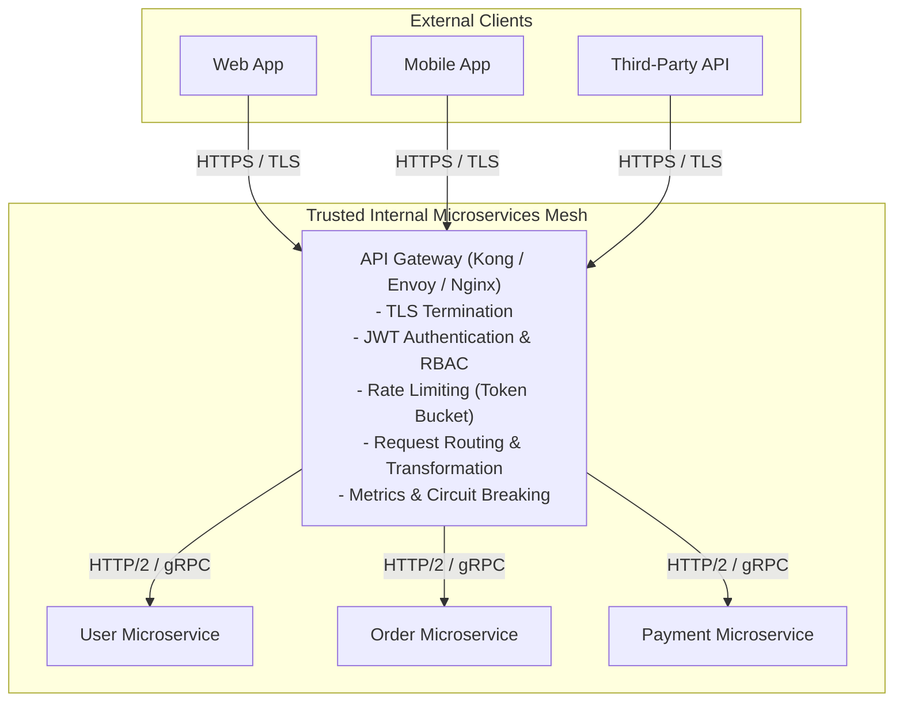
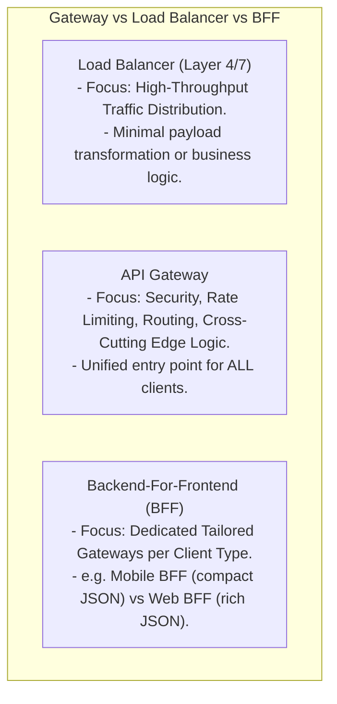
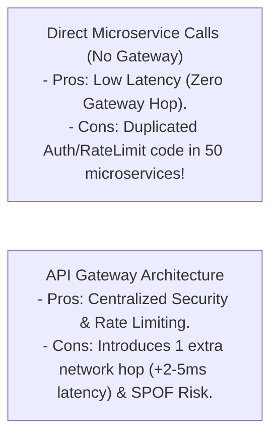

# API Gateway Pattern — Rate Limiting, Authentication, TLS Termination, Request Routing

## Mental Model

Think of an **API Gateway** as the single high-security border control checkpoint entering an international airport terminal. 

Instead of forcing every single flight, store, and gate inside the airport to individually inspect passports, check luggage security, issue boarding passes, and collect customs taxes (**Duplicated Microservice Infrastructure Logic**), all arriving travelers pass through a single, centralized border checkpoint (**The API Gateway**). 

The Border Checkpoint handles Passport Verification (**Authentication / JWT**), Luggage Size Limits (**Rate Limiting**), Currency Conversion (**Protocol Translation**), and directs passengers to their exact departure gates (**Request Routing**). Inside the terminal, microservices operate safely behind a trusted internal network perimeter.

---

## 1. Intent & Architectural Definition

The **API Gateway Pattern** acts as a single, unified reverse-proxy entry point for all external client requests entering a microservices architecture, encapsulating common cross-cutting concerns.



### Key Responsibilities of an API Gateway
1. **Request Routing:** Route incoming URLs (`/api/v1/orders`) to matching downstream microservice clusters.
2. **Authentication & Authorization:** Validate OAuth2 / JWT tokens and API keys at the perimeter.
3. **Rate Limiting & Throttling:** Enforce request quotas per IP / User ID to prevent DDoS attacks.
4. **TLS/SSL Termination:** Decrypt HTTPS traffic at the perimeter, passing unencrypted or mTLS traffic to internal services.
5. **Protocol Translation:** Convert external REST/JSON payloads to internal high-performance gRPC/Protobuf.

---

## 2. API Gateway vs. Load Balancer vs. BFF (Backend-For-Frontend)



### Architectural Comparison Matrix

| Feature | Load Balancer (ALB / Nginx) | API Gateway (Kong / Envoy) | BFF (Backend-For-Frontend) |
|---|---|---|---|
| **Primary Goal** | Traffic Distribution & High Availability. | Edge Security, Rate Limiting, & Routing. | Tailoring API responses per client device type. |
| **Authentication** | Basic / SSL Termination. | **Comprehensive (JWT, OAuth2, Mutual TLS)**. | Application-specific authentication. |
| **Response Aggregation** | ❌ No | ⚠️ Rare | ✅ **Yes (Combines 5 microservice calls into 1 response)**. |
| **Rate Limiting** | Basic IP Rate Limiting. | **Advanced (Token Bucket, Redis-backed)**. | Client-specific rate limiting. |

---

## 3. Production Configuration: Kong / Envoy Gateway Architecture

### Envoy Gateway Route Configuration (YAML)

```yaml
# Envoy Gateway Proxy Configuration Excerpt
static_resources:
  listeners:
  - name: external_api_listener
    address:
      socket_address: { address: 0.0.0.0, port_value: 443 }
    filter_chains:
    - transport_socket:
        name: envoy.transport_sockets.tls
        typed_config:
          "@type": type.googleapis.com/envoy.extensions.transport_sockets.tls.v3.DownstreamTlsContext
          common_tls_context:
            tls_certificates:
            - certificate_chain: { filename: "/etc/envoy/certs/api.crt" }
              private_key: { filename: "/etc/envoy/certs/api.key" }
      filters:
      - name: envoy.filters.network.http_connection_manager
        typed_config:
          "@type": type.googleapis.com/envoy.extensions.filters.network.http_connection_manager.v3.HttpConnectionManager
          stat_prefix: ingress_http
          route_config:
            name: local_route
            virtual_hosts:
            - name: api_service
              domains: ["api.example.com"]
              routes:
              - match: { prefix: "/api/v1/users" }
                route: { cluster: user_microservice_cluster }
              - match: { prefix: "/api/v1/orders" }
                route: { cluster: order_microservice_cluster }
          http_filters:
          - name: envoy.filters.http.jwt_authn # JWT Auth Filter
          - name: envoy.filters.http.ratelimit # Rate Limiter Filter
          - name: envoy.filters.http.router   # Request Router
```

---

## 4. Architectural Trade-offs & Failure Modes



### Failure Modes and Mitigations

1. **API Gateway Single Point of Failure (SPOF)** — If the API Gateway crashes, the entire microservices ecosystem becomes unreachable. *Mitigation*: Deploy a cluster of stateless API Gateways behind a Layer 4 Load Balancer (AWS NLB) auto-scaled across availability zones.
2. **Gateway Latency Bottleneck** — Executing synchronous blocking DB calls or heavy JSON transformations inside the API Gateway worker thread. *Mitigation*: Keep API Gateway strictly non-blocking (built on C++ Envoy, Rust, or Netty) and delegate business logic to downstream microservices.
3. **Monolithic Gateway Coupling** — 20 engineering teams modifying a single monolithic gateway config file, causing merge conflicts and risky deployments. *Mitigation*: Adopt the **BFF (Backend-For-Frontend)** pattern or use GitOps declarative route definitions per team.

---

## 5. Active-Recall Prompts

1. **What is the primary intent of the API Gateway Pattern, and what 4 cross-cutting concerns does it centralize?**
2. **Compare an API Gateway vs. a Layer 7 Load Balancer vs. a Backend-For-Frontend (BFF).**
3. **What is TLS Termination, and why is it performed at the API Gateway boundary?**
4. **How does an API Gateway prevent thundering herd traffic using Token Bucket Rate Limiting?**

---

## Related Notes

- [[Load Balancers - Layer 4 vs Layer 7, Algorithms, and Health Checks]]
- [[Content Delivery Networks - CDN Architecture, Edge Caching, and Anycast Routing]]
- [[LLD - Distributed Rate Limiter (Token Bucket, Leaky Bucket, Sliding Window)]]
- [[Facade Pattern - Simplifying Subsystem Interfaces and Boundary Layering]]

> **Interview Style Question:** *"Design an enterprise API Gateway for an e-commerce platform processing 200,000 requests/sec. Show how the gateway handles TLS Termination, JWT Authentication, Redis-backed Rate Limiting, and Request Routing, compare Kong vs. Envoy, and evaluate the trade-offs of introducing a BFF layer for iOS/Android apps."*

---
