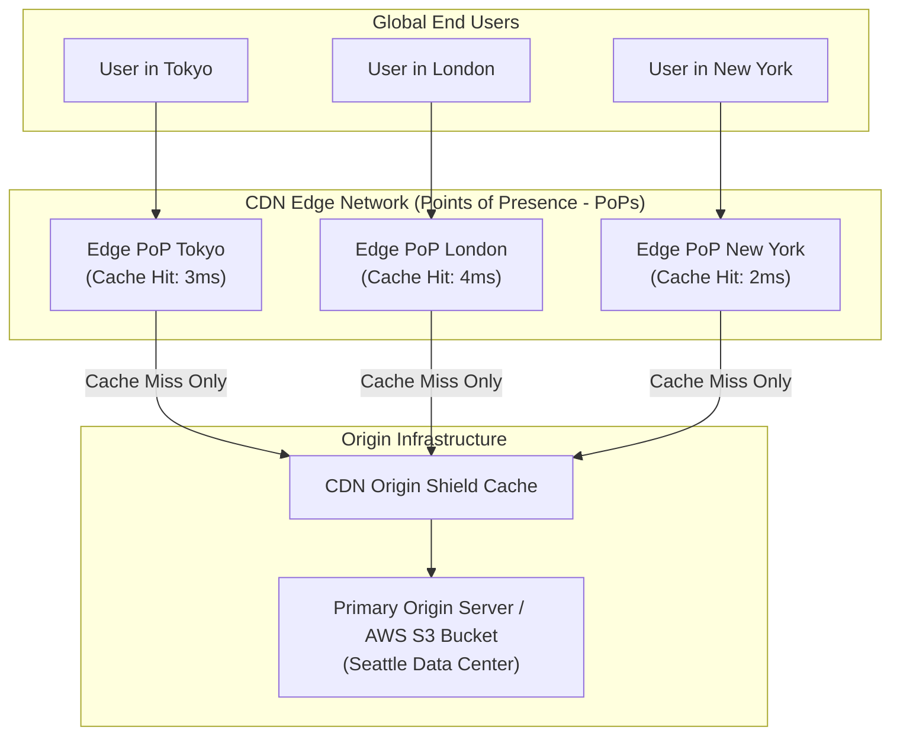
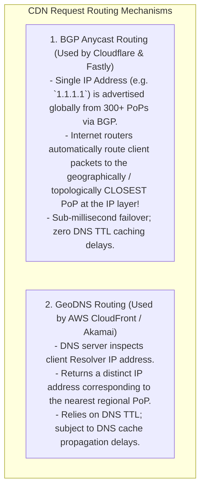
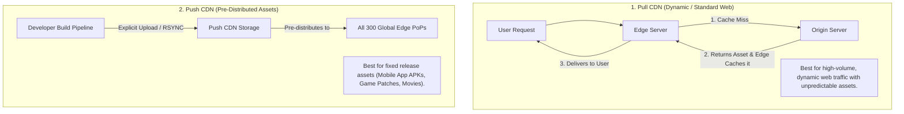

# Content Delivery Networks — CDN Architecture, Edge Caching, and Anycast Routing

## Mental Model

Think of a **Content Delivery Network (CDN)** as a global chain of local convenience stores (7-Eleven) stocking popular products. 

If every customer in Tokyo, London, Sydney, and New York had to order milk and bread directly from a single central warehouse in Seattle (**Single Origin Server / High Network Latency**), shipping takes 5 days (**150ms WAN Latency**), and the central warehouse collapses under global order volume (**Origin Server Crash**). 

Instead, the CDN places mini-warehouses (**Points of Presence - PoPs / Edge Servers**) in every major city. 99% of requests for static assets (images, JS/CSS bundles, video segments) are fulfilled locally from the nearest Edge Server in **2ms** (**Cache Hit**). Only rare missing items trigger a background fetch to the Seattle origin warehouse (**Cache Miss / Origin Shield**).

---

## 1. CDN Architecture & Points of Presence (PoP)

---

## 2. Anycast BGP Routing vs. GeoDNS

How does a client's browser find the closest physical CDN Edge Server?

### Anycast vs. GeoDNS Matrix

| Feature | Anycast BGP Routing | GeoDNS Routing |
|---|---|---|
| **IP Address Strategy** | **Single Global IP Address** for all PoPs. | Multiple distinct IP addresses per region. |
| **Routing Decision Layer** | **Layer 3 (BGP Network Layer)**. | Layer 7 (DNS Resolution Layer). |
| **Failover Time** | **Instant (BGP route withdrawn in seconds)**. | Slower (Delayed by DNS TTL cache expiry). |
| **EDNS-Client-Subnet Required?** | **No** (Direct packet routing). | Yes (Requires client IP in DNS query). |

---

## 3. Pull CDN vs. Push CDN Architecture

---

## 4. Cache Invalidation & Invalidation Strategies

Keeping edge caches synchronized with origin updates is a major operational challenge:

1. **Time-To-Live (TTL / `Cache-Control` Headers):** The origin server sets HTTP response headers:
   `Cache-Control: public, max-age=31536000, immutable`
2. **Purge API (Instant Invalidation):** Issue an API call to CDN (`POST /api/v1/purge?url=...`) to purge cached objects globally across all 300 PoPs within 150ms.
3. **Asset Fingerprinting / Cache Busting (Best Practice):** Append content hashes to filenames (`app.a8f9c2.js`). When code changes, the filename changes, naturally bypassing old edge caches!

---

## 5. Architectural Comparison Matrix

| Metric | Without CDN (Direct Origin) | With CDN (Edge Network) |
|---|---|---|
| **Global Latency (p99)** | $150\text{ms} - 400\text{ms}$ (WAN delays). | **$2\text{ms} - 15\text{ms}$ (Edge Hit)**. |
| **Origin Server Load** | 100% of global requests hit Origin. | **$1\% - 5\%$ hit Origin (95%+ Offload Rate)**. |
| **DDoS Resilience** | Low (Origin bandwidth saturated easily). | **Extremely High (Multi-Tbps Anycast Absorption)**. |
| **Cost Profile** | High bandwidth egress costs at Origin. | Reduced egress costs via CDN peering discounts. |

---

## 6. Failure Modes and Trade-offs

1. **Thundering Herd Origin Collapse (Cache Stampede)** — A popular viral asset (e.g., 4K video segment) expires simultaneously across 300 PoPs. 100,000 concurrent requests miss the edge cache at the exact same millisecond, sending a **Thundering Herd** of 100,000 requests directly to the Origin server, crashing it. *Mitigation*: Enable **Origin Shield** and **Request Collapsing** (Locking edge cache miss requests so only 1 request fetches from origin while 99,999 wait).
2. **Stale Cache Propagation Bug** — Updating an emergency security fix on an asset (`styles.css`), but the asset has a 1-year hardcoded TTL without cache-busting hashes. Millions of users continue executing vulnerable code. *Mitigation*: Always use content-hash filenames (`style.v123.css`).
3. **Cache Key Poisoning** — An attacker sends HTTP headers (`X-Forwarded-Host: evil.com`) that get cached by the edge server, poisoning the cache payload for all subsequent users. *Mitigation*: Restrict cache keys strictly to trusted headers and URI paths.

---

## 7. Active-Recall Prompts

1. **How does BGP Anycast routing allow 300 global CDN PoPs to share a single IP address (`1.1.1.1`) and route users to the closest PoP?**
2. **Compare Pull CDN vs. Push CDN across asset distribution, origin load, and use cases.**
3. **What is a Thundering Herd (Cache Stampede) on an Origin server, and how does Origin Shield / Request Collapsing prevent it?**
4. **Why is Asset Fingerprinting (`app.a8f9c2.js`) preferred over manual CDN Purge API calls for static frontend releases?**

---

## Related Notes

- [[Dynamic Routing of Web Traffic - Anycast, CDN Architecture, Edge Computing]]
- [[Border Gateway Protocol - BGP, AS, BGP Peering, Path Attributes]]
- [[Domain Name System in HLD - GeoDNS, Latency-Based Routing, and Failover]]
- [[API Gateway Pattern - Rate Limiting, Authentication, TLS Termination, Request Routing]]
- [[Distributed Caching Strategies - Cache-Aside, Write-Through, Write-Around, Write-Back]]

> **Interview Style Question:** *"Design a global Content Delivery Network (CDN) for a video streaming platform (like YouTube or Twitch) serving 10M video segments per second. Compare BGP Anycast vs GeoDNS request routing, design the 2-tier Edge/Origin-Shield caching hierarchy, write the cache invalidation & request collapsing strategy to prevent Thundering Herd origin crashes, and calculate 95%+ cache offload rates."*

---
