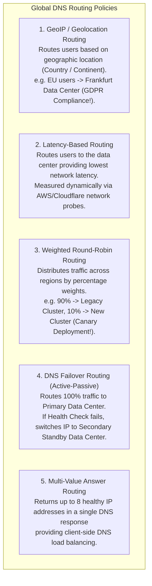
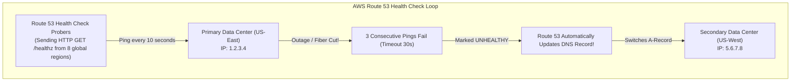

# Domain Name System in HLD — GeoDNS, Latency-Based Routing, and Failover

## Mental Model

Think of **DNS in High Level Design** as the global directory assistance operator for the entire Internet. 

When a user types `app.example.com` into their browser, the browser has no idea where in the world the application servers reside (**IP Address Obfuscation**). 

The Authoritative DNS Name Server acts as an intelligent global routing coordinator. Instead of returning a static, fixed IP address, the DNS server inspects the requesting user's location, network latency profile, and system health status. It dynamically returns the IP address of the closest, healthiest data center (**GeoDNS / Latency Routing**), seamlessly bypassing failed data centers during regional outages (**DNS Health Check Failover**).

---

## 1. High-Level System Architecture: DNS in the Request Flow

```mermaid
flowchart TD
    Client["Client Browser\n(Query: app.example.com)"] -->|1. DNS Lookup| RecursiveResolver["ISP / Recursive DNS Resolver\n(8.8.8.8)"]
    
    RecursiveResolver -->|2. Queries Authoritative DNS| AuthDNS["Authoritative GeoDNS Server\n(AWS Route 53 / NS1)\n- Evaluates Client Subnet IP\n- Evaluates Data Center Health Checks"]
    
    AuthDNS -->|3. Returns IP 1.2.3.4 (US-East)| RecursiveResolver
    RecursiveResolver -->|4. Caches IP for TTL=60s & Returns| Client
    
    Client -->|5. HTTPS Request direct to IP 1.2.3.4| US_East_LB["US-East Data Center Load Balancer"]
```

---

## 2. Global DNS Routing Strategies

Global DNS providers (AWS Route 53, Cloudflare, NS1) support 5 specialized routing policies for enterprise high availability:



---

## 3. DNS Health Checks & Automatic Disaster Recovery Failover

How does DNS detect data center outages and execute global failover?



### The TTL (Time-To-Live) Dilemma in DNS Failover

```text
Low TTL (e.g. TTL = 10s - 60s):
- Pros: Rapid Failover! Clients pick up new healthy IP within 60 seconds of outage.
- Cons: Massive DNS query load on Authoritative DNS servers ($$$ cost).

High TTL (e.g. TTL = 86400s / 24 Hours):
- Pros: Ultra-fast client response (cached locally), low DNS server cost.
- Cons: Disaster! During an outage, clients continue hitting dead IP for 24 hours!
```

---

## 4. Architectural Comparison Matrix

| Routing Strategy | Failover Speed | User Experience | Primary Use Case |
|---|---|---|---|
| **Simple A-Record** | ❌ No Failover | Static | Development / Non-critical apps |
| **GeoIP Routing** | Dependent on TTL | Excellent (Local language / Data sovereignty) | Regional regulatory compliance (GDPR/HIPAA) |
| **Latency-Based Routing** | Dependent on TTL | **Best (Lowest network RTT)** | Global SaaS applications (Slack, Zoom) |
| **DNS Failover (Active-Passive)** | $30\text{s} - 3\text{m}$ (TTL dependent) | Seamless during disaster | Disaster Recovery (DR) Multi-Region Failover |
| **BGP Anycast (Alternative)** | **Instant (2-5 seconds)** | **Best (Layer 3 routing)** | Global CDN Edge Networks (Cloudflare) |

---

## 5. Failure Modes and Trade-offs

1. **DNS Caching Propagation Delay (Stale TTL Failure)** — A primary data center experiences a total power outage. The DNS failover record is updated immediately, but ISPs and client browsers ignore the low TTL and cache the dead IP for 2 hours (**Recursive Resolver RFC Non-Compliance**). *Mitigation*: Combine DNS failover with **BGP Anycast** or Layer 4 BGP Virtual IPs.
2. **EDNS0 Client Subnet Misrouting** — A user in Tokyo uses Google Public DNS (`8.8.8.8`) located in the US. The Authoritative GeoDNS sees the query coming from a US IP address and incorrectly routes the Tokyo user to a US data center (**150ms Latency Penalty**). *Mitigation*: Ensure DNS providers support **edns-client-subnet (ECS)** extension.
3. **Thundering Herd Recovery Surge** — A failed data center comes back online. DNS health checks pass, and 500,000 requests/sec instantly flood the newly restarted data center before its caches are warm, crashing it again. *Mitigation*: Use **Weighted DNS Routing** to ramp traffic up gradually ($10\% \to 25\% \to 50\% \to 100\%$).

---

## 6. Active-Recall Prompts

1. **How does GeoDNS differ from Latency-Based Routing in Authoritative DNS servers?**
2. **What is the DNS TTL Dilemma regarding disaster recovery failover speed vs. DNS query cost?**
3. **How does edns-client-subnet (ECS) prevent GeoDNS from misrouting users who use public recursive resolvers (`8.8.8.8`)?**
4. **Why is BGP Anycast faster at failover than DNS Health Check failover?**

---

## Related Notes

- [[Domain Name System - DNS Hierarchy, Recursive Resolution, EDNS, DNSSEC]]
- [[Content Delivery Networks - CDN Architecture, Edge Caching, and Anycast Routing]]
- [[Load Balancers - Layer 4 vs Layer 7, Algorithms, and Health Checks]]
- [[High Availability Architecture - SLAs, SLOs, Fault Tolerance, and High-9s Math]]
- [[API Gateway Pattern - Rate Limiting, Authentication, TLS Termination, Request Routing]]

> **Interview Style Question:** *"Design a Global Multi-Region High Availability DNS Architecture for a mission-critical banking application operating data centers in US-East, EU-Central, and AP-East. Compare GeoDNS vs Latency-Based Routing vs Active-Passive Failover, explain how AWS Route 53 health checks trigger automated failover, solve the DNS TTL propagation delay problem, and handle thundering herd recovery surges."*

---
