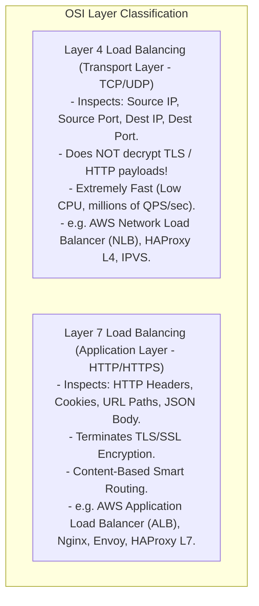
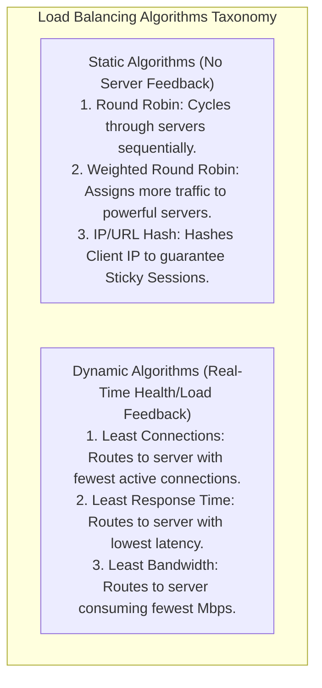
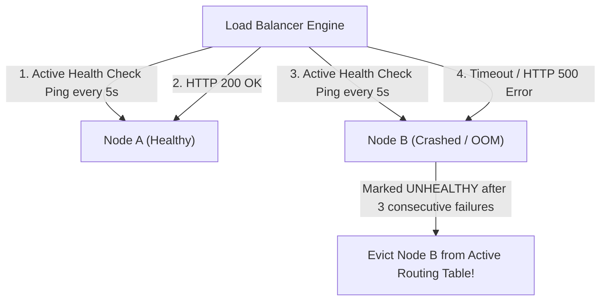

# Load Balancers — Layer 4 vs. Layer 7, Algorithms, and Health Checks

## Mental Model

Think of a **Load Balancer** as a master traffic controller directing cars entering a 20-lane highway toll plaza. 

If all 10,000 cars attempt to enter a single toll booth lane (**Single Server Bottleneck / Crash**), traffic stops for miles. The Load Balancer sits in front of backend server pools (**Toll Booths**), inspecting incoming traffic and distributing requests evenly across healthy worker nodes based on capacity, latency, or content type. 

A **Layer 4 Load Balancer** acts like a fast traffic cop looking *only* at vehicle license plates and port numbers (TCP/IP addresses) without opening car trunks. A **Layer 7 Load Balancer** acts like a security inspector opening car trunks, reading HTTP headers, cookies, and JSON payloads to route video requests to video servers and payment requests to payment servers.

---

## 1. Layer 4 vs. Layer 7 Load Balancing Architecture



### Architectural Comparison Matrix

| Feature | Layer 4 Load Balancer (Transport) | Layer 7 Load Balancer (Application) |
|---|---|---|
| **OSI Layer** | Layer 4 (TCP / UDP Packets). | Layer 7 (HTTP / HTTPS / gRPC / WebSockets). |
| **Payload Inspection** | **No** (Raw IP & Port packets only). | **Yes** (HTTP Headers, Cookies, URL Path, JSON). |
| **TLS/SSL Termination** | No (Passes encrypted TCP bytes through). | **Yes** (Decrypts SSL at Load Balancer). |
| **Throughput & Performance** | **Ultra High** (Millions of QPS, low CPU). | High (100k-500k QPS, higher CPU for SSL/Parsing). |
| **Smart Routing** | Simple IP/Port routing. | **Content-Based:** `/api/video` $\to$ Video Cluster. |
| **Cloud Products** | AWS NLB (Network Load Balancer). | AWS ALB (Application Load Balancer). |

---

## 2. Load Balancing Algorithms

Load balancing algorithms determine how incoming requests are distributed across healthy backend servers.



### Algorithm Evaluation Matrix

| Algorithm Type | Best Use Case | Drawback |
|---|---|---|
| **Round Robin** | Homogeneous servers with identical spec & short requests. | Ignores server CPU load & request complexity. |
| **Weighted Round Robin** | Heterogeneous server pools (e.g., 64-core vs 16-core servers). | Requires manual capacity weight configuration. |
| **Least Connections** | Long-lived persistent connections (WebSockets, Database pools). | Higher CPU overhead to track connection counters. |
| **IP / Consistent Hash** | Sticky Sessions, In-Memory Caching servers. | Hotspot risk if 1 IP produces massive traffic. |

---

## 3. Health Checks & Failover Mechanics

A Load Balancer is useless if it routes traffic to a dead or frozen backend server.



### Active vs. Passive Health Checks
1. **Active Health Checks:** Load Balancer periodically sends probe requests (`GET /healthz`) to all registered backend nodes.
2. **Passive Health Checks:** Load Balancer monitors real production traffic responses. If a node returns HTTP 5xx errors for $X\%$ of requests over 10 seconds, it is automatically removed from rotation.

---

## 4. Production Configuration: Nginx Layer 7 Load Balancer

```nginx
# Nginx Layer 7 Load Balancer Configuration (/etc/nginx/nginx.conf)
http {
    # Define Upstream Backend Server Pool with Weights & Health Checks
    upstream backend_api_cluster {
        least_conn; # Use Least Connections Algorithm!
        
        server api-node-1.internal:8080 weight=3 max_fails=3 fail_timeout=10s;
        server api-node-2.internal:8080 weight=2 max_fails=3 fail_timeout=10s;
        server api-node-3.internal:8080 weight=1 max_fails=3 fail_timeout=10s backup;
    }

    server {
        listen 443 ssl http2;
        server_name api.example.com;

        # TLS Termination at Load Balancer Layer
        ssl_certificate /etc/ssl/certs/api_cert.crt;
        ssl_certificate_key /etc/ssl/private/api_key.key;

        # Smart Content-Based Path Routing (/api/v1/video -> Video Cluster)
        location /api/v1/video/ {
            proxy_pass http://video_cluster;
            proxy_set_header Host $host;
            proxy_set_header X-Real-IP $remote_addr;
        }

        # Default General API Routing
        location / {
            proxy_pass http://backend_api_cluster;
            proxy_set_header Host $host;
            proxy_set_header X-Forwarded-For $proxy_add_x_forwarded_for;
        }
    }
}
```

---

## 5. Failure Modes and Trade-offs

1. **Load Balancer Single Point of Failure (SPOF)** — Deploying a single load balancer instance. If the load balancer crashes, the entire application goes offline! *Mitigation*: Deploy **Active-Passive Load Balancers** using Keepalived with Virtual IP (VIP) failover or GeoDNS.
2. **Sticky Session Memory Imbalance** — Using IP Hash / Cookie-based sticky sessions for a web app. One corporate NAT gateway IP address routes 50,000 employees to a single server instance, crashing it with a hotspot overload. *Mitigation*: Store session state in external **Redis Session Stores** and use stateless Round Robin / Least Connections routing.
3. **Thundering Herd Health Check Failure** — 50 load balancers sending `GET /healthz` pings every 1 second to 1,000 backend nodes, generating 50,000 QPS of pure health check overhead that saturates CPU. *Mitigation*: Increase health check intervals (e.g., 5s-10s) and randomize jitter.

---

## 6. Active-Recall Prompts

1. **Compare Layer 4 vs. Layer 7 Load Balancing across OSI layer, TLS termination, payload inspection, and throughput.**
2. **When should you select Least Connections algorithm over Round Robin?**
3. **What is the difference between Active and Passive Health Checks?**
4. **How do Active-Passive Load Balancer setups with Virtual IPs (VIPs) eliminate the Load Balancer as a Single Point of Failure?**

---

## Related Notes

- [[API Gateway Pattern - Rate Limiting, Authentication, TLS Termination, Request Routing]]
- [[Content Delivery Networks - CDN Architecture, Edge Caching, and Anycast Routing]]
- [[High Availability Architecture - SLAs, SLOs, Fault Tolerance, and High-9s Math]]
- [[Hypertext Transfer Protocol - HTTP 1.0, 1.1, Pipelining, Persistent Connections]]

> **Interview Style Question:** *"Design a high-throughput Load Balancing architecture for a banking platform processing 500,000 QPS. Compare Layer 4 NLB vs. Layer 7 ALB, design a 2-tier load balancing hierarchy (L4 fronting L7), explain how TLS termination occurs, show Nginx Least-Connections configuration, and demonstrate Active-Passive Virtual IP failover."*

---
