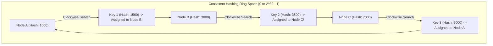
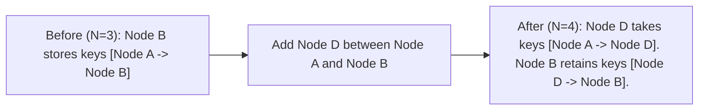
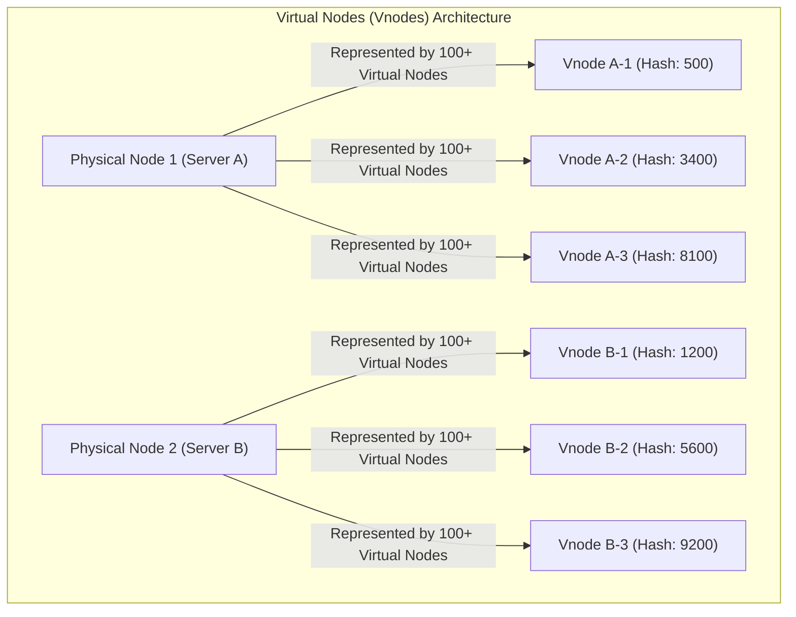

# Consistent Hashing — Hash Rings, Virtual Nodes, and Data Rebalancing

## Mental Model

Think of **Consistent Hashing** as a round circular dinner table with 360 chairs (**The Hash Ring**). 

In traditional Modulo Hashing (`hash(key) % N`), if you have 4 servers ($N=4$) and add a 5th server ($N=5$), **80% of all food plates (data keys)** must immediately be picked up and moved to new table seats (**Massive Data Migration Storm / Cache Invalidated**). 

With **Consistent Hashing**, both servers and data keys are mapped onto a circular $360^\circ$ ring ($0 \dots 2^{32}-1$). A key belongs to the **first server encountered moving clockwise** around the ring. When a 5th server joins the table, it takes over *only* a small fraction of keys from its immediate counter-clockwise neighbor ($\frac{1}{N}$ keys moved). All other $N-1$ servers remain untouched!

---

## 1. The Modulo Hashing Flaw vs. Consistent Hashing

### The Modulo Hashing Problem
Traditional modulo partitioning uses:
$$\text{Server ID} = \text{hash}(\text{key}) \pmod N$$

If $N$ changes from 4 to 5, nearly every key maps to a different server index:

| Key | `hash(key)` | Old Modulo ($N=4$) | New Modulo ($N=5$) | Re-mapped? |
|---|---|---|---|---|
| Key A | 10 | $10 \pmod 4 = \mathbf{2}$ | $10 \pmod 5 = \mathbf{0}$ | ❌ **MOVED** |
| Key B | 21 | $21 \pmod 4 = \mathbf{1}$ | $21 \pmod 5 = \mathbf{1}$ | ✅ Same |
| Key C | 35 | $35 \pmod 4 = \mathbf{3}$ | $35 \pmod 5 = \mathbf{0}$ | ❌ **MOVED** |
| Key D | 44 | $44 \pmod 4 = \mathbf{0}$ | $44 \pmod 5 = \mathbf{4}$ | ❌ **MOVED** |

> **Result:** Adding or removing a server invalidates **$K \cdot \frac{N-1}{N} \approx 80-99\%$** of all cached keys, causing an **Origin Database Thundering Herd Collapse**!

---

## 2. The Consistent Hashing Ring Architecture

Consistent Hashing maps both **Server Nodes** and **Data Keys** to a shared $360^\circ$ circular hash space using a uniform hash function (e.g., MD5 / MurmurHash3 mapping to $[0, 2^{32}-1]$).



### Key Lookup Rule (Clockwise Traversal)
To locate which server stores `Key X`:
1. Calculate $H = \text{hash}(\text{Key X})$.
2. Move **clockwise** around the ring until you encounter the first Server Node whose hash $\ge H$.
3. If $H$ exceeds all server hashes, wrap around to the first server at index $0$.

---

## 3. Node Addition and Removal Mechanics

### A. Adding a New Server Node
When **Node D** is added to the ring between Node A and Node B:
- *Only* keys located between Node A and Node D are re-assigned from Node B to Node D.
- All other keys stored on Node A and Node C remain completely unaffected!

$$\text{Fraction of Keys Moved} = \frac{1}{N_{\text{new}}}$$



---

## 4. The Hotspot Problem & Virtual Nodes (Vnodes)

### The Non-Uniform Ring Problem
Basic consistent hashing has a major flaw: random hashing can place server nodes unevenly around the ring, creating huge gaps (**Hotspot Range**) where 1 server stores 70% of all data while other servers sit idle!



### Benefits of Virtual Nodes (Vnodes):
1. **Uniform Data Distribution:** By assigning 100-250 Virtual Nodes per physical server, data is spread evenly across the entire ring ($\pm 5\%$ variation).
2. **Heterogeneous Capacity Support:** Powerful servers (128GB RAM) can be assigned 200 Vnodes, while smaller servers (32GB RAM) receive 50 Vnodes.
3. **Graceful Rebalancing:** When a physical server fails, its 200 Vnodes disappear from random positions around the ring, distributing its load evenly across *all* remaining servers rather than overloading a single neighbor!

---

## 5. Production Code Implementation (Java)

```java
package com.lld.consistenthashing;

import java.nio.charset.StandardCharsets;
import java.security.MessageDigest;
import java.security.NoSuchAlgorithmException;
import java.util.*;
import java.util.concurrent.ConcurrentSkipListMap;

public class ConsistentHashRing<T> {
    private final int numberOfReplicas; // Number of Virtual Nodes per Physical Node
    private final ConcurrentSkipListMap<Long, T> ring = new ConcurrentSkipListMap<>();

    public ConsistentHashRing(int numberOfReplicas, Collection<T> nodes) {
        this.numberOfReplicas = numberOfReplicas;
        for (T node : nodes) {
            addNode(node);
        }
    }

    // Hash function mapping string to 32-bit unsigned integer (using MD5)
    private long hash(String key) {
        try {
            MessageDigest md = MessageDigest.getInstance("MD5");
            byte[] digest = md.digest(key.getBytes(StandardCharsets.UTF_8));
            // Truncate to 32-bit unsigned long
            return ((long) (digest[3] & 0xFF) << 24) |
                   ((long) (digest[2] & 0xFF) << 16) |
                   ((long) (digest[1] & 0xFF) << 8) |
                   ((long) (digest[0] & 0xFF));
        } catch (NoSuchAlgorithmException e) {
            throw new RuntimeException("MD5 not supported", e);
        }
    }

    public void addNode(T node) {
        for (int i = 0; i < numberOfReplicas; i++) {
            String vnodeKey = node.toString() + "-VNODE-" + i;
            long hash = hash(vnodeKey);
            ring.put(hash, node);
        }
    }

    public void removeNode(T node) {
        for (int i = 0; i < numberOfReplicas; i++) {
            String vnodeKey = node.toString() + "-VNODE-" + i;
            long hash = hash(vnodeKey);
            ring.remove(hash);
        }
    }

    // CLOCKWISE RING TRAVERSAL USING ConcurrentSkipListMap (tailMap)
    public T getNode(String key) {
        if (ring.isEmpty()) return null;
        long hash = hash(key);

        // Find sub-map starting at hash
        SortedMap<Long, T> tailMap = ring.tailMap(hash);
        
        // If tailMap is empty, wrap around to first key in ring!
        long nodeHash = tailMap.isEmpty() ? ring.firstKey() : tailMap.firstKey();
        return ring.get(nodeHash);
    }
}
```

---

## 6. Active-Recall Prompts

1. **Why does traditional Modulo Hashing (`hash(key) % N`) fail during node addition/removal?**
2. **How does Consistent Hashing use clockwise ring traversal to locate which server stores a key?**
3. **What are Virtual Nodes (Vnodes), and what 3 problems do they solve?**
4. **When adding a 10th server to a 9-server Consistent Hash Ring, what fraction of total keys are migrated?**

---

## Related Notes

- [[Database Sharding - Hash-Based, Range-Based, and Directory-Based Partitioning]]
- [[Distributed Caching Strategies - Cache-Aside, Write-Through, Write-Around, Write-Back]]
- [[Database Scaling - Vertical vs Horizontal, Read Replicas, and Master-Slave]]
- [[LLD - Thread-Safe In-Memory Cache with LRU and LFU Eviction]]

> **Interview Style Question:** *"Design a distributed caching tier for a global streaming service (like Netflix) distributing 100M keys across 50 cache nodes. Explain why Modulo Hashing causes cache invalidation storms, design a Consistent Hashing ring using MurmurHash3, demonstrate how 150 Virtual Nodes per physical node eliminate hotspots, and write a complete Java/TypeScript implementation."*

---
