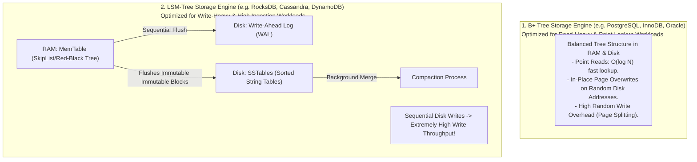
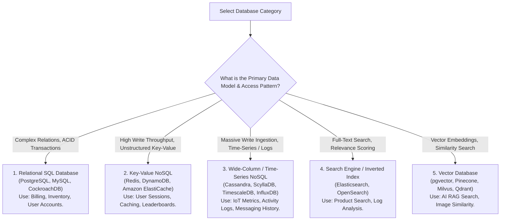
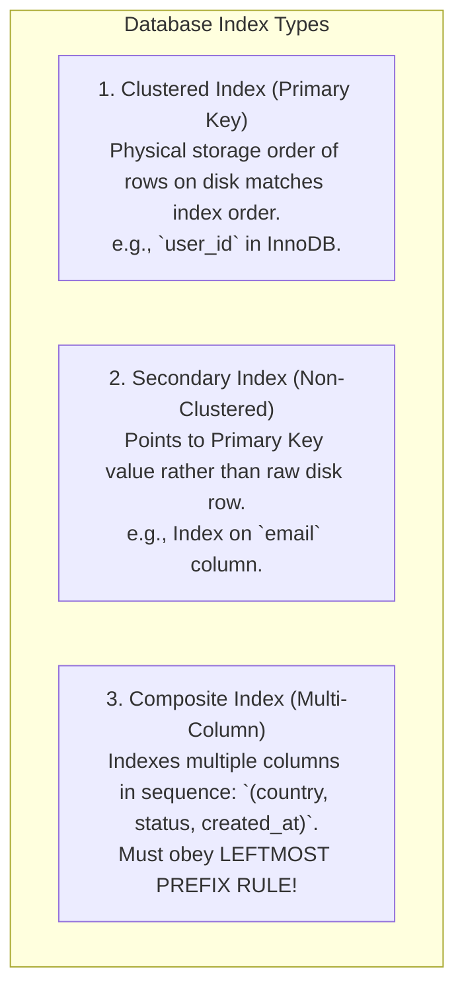

# Database Indexing & Storage Engine Selection for HLD

## Mental Model

Think of **Database Storage Engines** as specialized physical storage facilities optimized for specific work patterns. 

- **B+ Tree Storage Engines (PostgreSQL InnoDB / MySQL):** Like an organized, alphabetized library index card cabinet. Looking up any specific book (`SELECT * WHERE id = 42`) or range of books (`WHERE id BETWEEN 10 AND 20`) is fast ($O(\log N)$ point reads). However, adding new books requires carefully inserting cards into specific alphabetized drawers (**Random Disk Writes / Page Splitting**).
- **LSM Tree Storage Engines (Log-Structured Merge-Tree: RocksDB, Cassandra, LevelDB):** Like an inbox drop-box. New items are appended sequentially to a high-speed log in RAM (**MemTable / Sequential Disk Writes**). Periodically, background workers flush and merge logs down to disk (**SSTables / Compaction**). Writes are blazingly fast ($O(1)$ sequential writes), but reads must inspect multiple disk files (**Read Amplification**).

---

## 1. B+ Tree vs. LSM-Tree Architecture Comparison

### Architectural Comparison Matrix

| Property | B+ Tree Storage Engine (InnoDB, Postgres) | LSM-Tree Storage Engine (RocksDB, Cassandra) |
|---|---|---|
| **Primary Workload Target** | **Read-Heavy** ($R:W \ge 10:1$) & Complex SQL Joins. | **Write-Heavy** ($W:R \ge 1:1$) & High Log Ingestion. |
| **Disk I/O Pattern** | **Random Disk Writes** (In-place page overwrites). | **Sequential Disk Writes** (Append-only logs). |
| **Write Throughput** | Lower (Page splits & random I/O bottlenecks). | **Ultra High** (Limited only by sequential disk bus speed). |
| **Read Throughput** | **Ultra High** ($O(\log N)$ point lookups). | Slower (Requires Bloom Filter + SSTable merging). |
| **Write Amplification** | Higher (Rewriting full 16KB pages for 1-byte edits). | Lower during writes, higher during Compaction. |
| **Space Overhead** | Fragmented pages over time. | Requires spare disk space for Compaction merges. |

---

## 2. Comprehensive Database Selection Matrix for HLD

Selecting the right database category during a System Design interview separates junior candidates from Principal Architects:

### Enterprise Database Technology Matrix

| Database Type | Industry Standard Products | Core Index Structure | Ideal System Design Use Case |
|---|---|---|---|
| **Relational SQL** | PostgreSQL, MySQL, CockroachDB | B+ Tree | Financial Billing, Order Processing, User Profiles. |
| **Key-Value** | Redis, DynamoDB | In-Memory Hash Table / LSM | Rate Limiting, Caching, Session Management. |
| **Wide-Column** | Apache Cassandra, ScyllaDB | LSM-Tree / SSTable | High-write activity feeds, Chat History, IoT Telemetry. |
| **Document NoSQL** | MongoDB, Couchbase | B-Tree | Dynamic Schema Product Catalogs, CMS. |
| **Full-Text Search** | Elasticsearch, OpenSearch | Inverted Index (FST) | Product Search Engine, E-commerce Filtering. |
| **Vector DB** | Pinecone, Milvus, pgvector | HNSW (Hierarchical Navigable Small World) | AI Embeddings, Semantic Search, Recommendation Systems. |

---

## 3. Indexing Strategies in HLD: Primary, Secondary, and Composite Indexes

### The Leftmost Prefix Rule for Composite Indexes
Given a composite index on `(country, status, created_at)`:

- ✅ `WHERE country = 'US' AND status = 'ACTIVE'` $\to$ **USES INDEX**
- ✅ `WHERE country = 'US'` $\to$ **USES INDEX**
- ❌ `WHERE status = 'ACTIVE'` $\to$ **CANNOT USE INDEX** (Violates Leftmost Prefix Rule! Full Table Scan!).

---

## 4. Failure Modes and Trade-offs

1. **Over-Indexing Write-Heavy Tables** — Adding 10 secondary indexes to a high-throughput `logs` table processing 20,000 Writes/sec. Every single `INSERT` must update 11 separate B+ Trees, destroying write performance. *Mitigation*: Drop secondary indexes on write-heavy tables or switch to an **LSM-Tree Storage Engine (Cassandra/RocksDB)**.
2. **Selecting B+ Trees for High Ingestion Logging** — Using PostgreSQL for raw sensor telemetry ($50,000 \text{ writes/sec}$). Random B+ Tree page splits saturate NVMe disk I/O. *Mitigation*: Use LSM-Tree append-only engines (TimescaleDB / Cassandra).
3. **Violating Leftmost Prefix Rule in Composite Indexes** — Creating an index on `(tenant_id, user_id)` and querying `WHERE user_id = 42`. The database drops to a full table scan across millions of rows. *Mitigation*: Order composite index columns by most selective filter first.

---

## 5. Active-Recall Prompts

1. **Compare B+ Tree vs. LSM-Tree storage engines across disk I/O patterns, write throughput, and read latency.**
2. **Which storage engine type (B+ Tree or LSM-Tree) should you select for a high-write IoT telemetry platform vs. a financial accounting database?**
3. **What is the Leftmost Prefix Rule for composite indexes?**
4. **Why does adding secondary indexes degrade write performance on high-throughput database tables?**

---

## Related Notes

- [[Relational Model - Tables, Keys, Functional Dependencies, Normalization]]
- [[Database Scaling - Vertical vs Horizontal, Read Replicas, and Master-Slave]]
- [[Database Sharding - Hash-Based, Range-Based, and Directory-Based Partitioning]]
- [[Search Engines - Elasticsearch, Inverted Index, TF-IDF, BM25, Relevance Scoring]]
- [[Vector Databases - Embeddings, HNSW, ANN Search, pgvector]]

> **Interview Style Question:** *"You are designing the storage layer for a global ride-sharing platform (Uber). Compare B+ Tree (PostgreSQL) vs LSM-Tree (Cassandra/RocksDB) vs Key-Value (Redis) vs Spatial Indexing (Geohash / H3) across Location Tracking (Write-heavy), User Billing (ACID), and Driver Matching. Justify your storage engine selection for each subsystem."*

---
