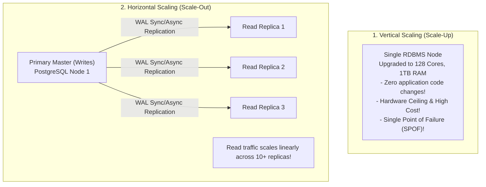
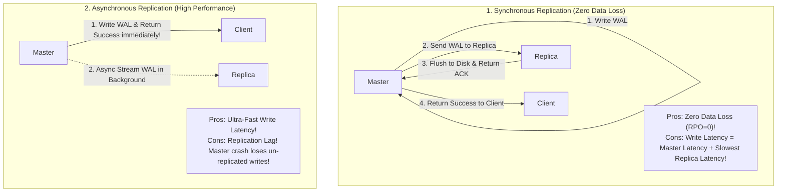

# Database Scaling — Vertical vs. Horizontal, Read Replicas, and Master-Slave

## Mental Model

Think of **Database Scaling** as expanding a freight delivery company's fleet. 

- **Vertical Scaling (Scaling Up):** Replacing a small delivery van with a massive 18-wheeler semi-truck (upgrading a DB server to 128 CPU cores, 1.5 TB RAM, and 10 TB NVMe SSDs). It is simple and requires no code changes, but eventually you hit physical hardware limits (**Hardware Ceiling / Exponential Cost**).
- **Horizontal Scaling (Scaling Out):** Buying a fleet of 50 standard delivery vans operating in parallel (**Master-Slave Read Replicas / Sharding**). Writes are processed by a single master truck (**Primary Leader**), while 49 replica vans handle read deliveries (**Follower Read Replicas**). If read traffic quadruples, you add 50 more vans without altering the business model.

---

## 1. Vertical Scaling (Scale-Up) vs. Horizontal Scaling (Scale-Out)



### Architectural Comparison Matrix

| Property | Vertical Scaling (Scale-Up) | Horizontal Scaling (Scale-Out) |
|---|---|---|
| **Primary Mechanism** | Upgrade CPU, RAM, NVMe disk on 1 machine. | Add commodity database nodes to a cluster. |
| **Application Complexity** | **Zero:** Application code connects to 1 DB URL. | High: App must split Reads vs. Writes & handle replication lag. |
| **Read Scalability Limit** | Bounded by single node RAM/Disk I/O. | **Unlimited:** Add 50 Read Replicas. |
| **Write Scalability Limit** | Bounded by single node Disk Write I/O. | Requires **Database Sharding**. |
| **High Availability** | Low (Single Point of Failure unless paired). | **High:** Automated Master Failover. |
| **Cost Curve** | Exponential (Specialized high-end hardware). | Linear (Commodity cloud VMs / RDS). |

---

## 2. Master-Slave (Single-Leader) Replication Architecture

In read-heavy applications ($R:W \ge 10:1$), offloading read queries to dedicated replica nodes is the first step in scaling database infrastructure.

```mermaid
flowchart TD
    AppWrite["App Write Operations\n(INSERT / UPDATE / DELETE)"] -->|Write Traffic| Master["Master Database (Primary)\nExecutes Transactions & Writes to WAL"]
    
    Master -->|Asynchronous / Synchronous WAL Streaming| Replica1["Read Replica 1"]
    Master -->|Asynchronous / Synchronous WAL Streaming| Replica2["Read Replica 2"]
    
    AppRead["App Read Operations\n(SELECT / Join / Search)"] -->|Read Traffic (Load Balanced)| Replica1 & Replica2
```

---

## 3. Synchronous vs. Asynchronous Replication & Replication Lag

How does the Master transfer committed transactions to Read Replicas?



### The Replication Lag Trap ("Read-Your-Own-Writes" Consistency)
In Asynchronous Replication, a user updates their profile name to `"Alice Smith"` on the Master DB. The browser immediately redirects to the profile page, issuing a `SELECT` query to a Read Replica that is **200ms behind in replication**. The user sees their old name `"Alice"`!

#### Architectural Remedies for Replication Lag:
1. **Read-Your-Own-Writes Consistency:** Route read queries for a user's *own modified data* to the Master DB for 5 seconds after a write; route other users' reads to Replicas.
2. **Monotonic Reads:** Ensure a user's sequential read queries hit the *same* Read Replica (via sticky sessions) so they never see time jump backward.

---

## 4. Master Failover & High Availability (Failover Mechanics)

What happens when the Master node crashes?

```mermaid
flowchart TD
    Heartbeat["Health Monitor / Consensus Engine\n(ZooKeeper / Orchestrator / Patroni)"] -->|1. Heartbeat Ping Fails (Master Dead!)| DeadMaster["Dead Master Node"]
    
    Heartbeat -->|2. Elect Most Up-To-Date Replica| StandbyReplica["Replica 1 (Selected as New Master)"]
    
    StandbyReplica -->|3. Promote to Primary & Enable Writes| NewMaster["NEW MASTER NODE"]
    
    NewMaster -->|4. Reconfigure DNS / VIP / Proxy| App["App Servers (Resume Writes to New Master)"]
```

---

## 5. Failure Modes and Trade-offs

1. **Replication Lag Saturation (Stale Read Explosion)** — A massive batch update on the Master generates 5 GB of WAL logs. Replicas fall 15 minutes behind in applying WAL logs. App servers reading from Replicas receive stale data. *Mitigation*: Monitor `pg_stat_replication` (PostgreSQL) or `Seconds_Behind_Master` (MySQL); temporarily route critical reads to Master.
2. **Master Failover Split-Brain** — Master experiences a temporary 10-second GC pause. Health monitor assumes Master is dead and promotes Replica 1 to Master. The old Master wakes up, creating 2 active Masters accepting writes (**Split-Brain Data Corruption**). *Mitigation*: Use STONITH ("Shoot The Other Node In The Head") or Raft quorum consensus.
3. **Master Write Bottleneck** — Read replicas scale reads to 100,000 QPS, but write volume reaches 15,000 QPS, saturating single-master disk I/O. Read Replicas cannot solve write bottlenecks! *Mitigation*: Transition to **Database Sharding**.

---

## 6. Active-Recall Prompts

1. **Compare Vertical Scaling vs. Horizontal Scaling across complexity, write capacity, and cost.**
2. **Differentiate between Synchronous vs. Asynchronous Replication regarding write latency and data loss risk (RPO).**
3. **What is Replication Lag, and how does "Read-Your-Own-Writes" consistency prevent users from seeing stale updates?**
4. **Why do Read Replicas scale read throughput but fail to scale write throughput?**

---

## Related Notes

- [[Database Replication - Single-Leader, Multi-Leader, Leaderless, Raft Consensus]]
- [[Database Sharding - Hash-Based, Range-Based, and Directory-Based Partitioning]]
- [[Consistent Hashing - Hash Rings, Virtual Nodes, and Data Rebalancing]]
- [[Distributed Caching Strategies - Cache-Aside, Write-Through, Write-Around, Write-Back]]

> **Interview Style Question:** *"Design a scalable database architecture for an e-commerce platform processing 100,000 Read QPS and 5,000 Write QPS. Compare Scale-Up vs. Scale-Out, design a Master-Slave Read Replica architecture with Patroni failover, explain how you solve the Replication Lag 'Read-Your-Own-Writes' consistency problem, and calculate replica memory requirements."*

---
