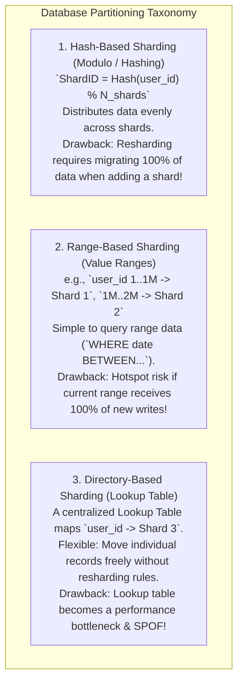
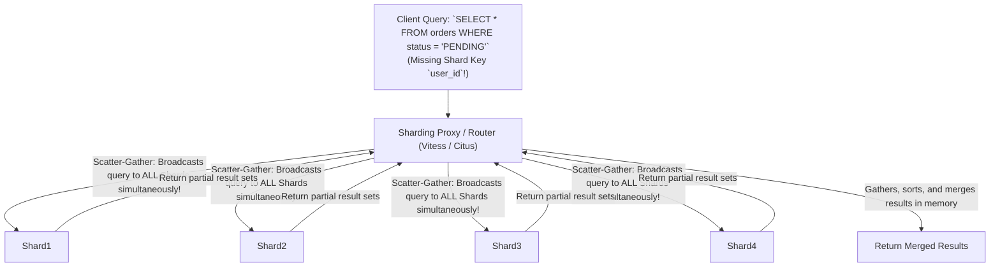
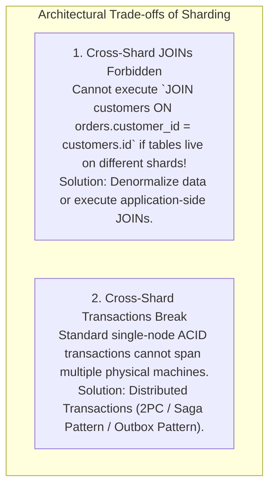

# Database Sharding — Hash-Based, Range-Based, and Directory-Based Partitioning

## Mental Model

Think of **Database Sharding (Horizontal Partitioning)** as a massive public library dividing its 10,000,000 physical books across 10 separate storage buildings (**Shards**). 

If all 10,000,000 books are stored in a single building (**Un-sharded DB**), check-in/check-out queues stall and disk space runs out. By sharding the library across 10 buildings based on a **Shard Key** (e.g., Author Last Name `A-C` in Building 1, `D-F` in Building 2), both read queries and write ingestion scale linearly across 10 independent database instances. 

Selecting an optimal **Shard Key** is the most critical decision: pick a bad key, and 90% of visitors crowd into Building 1 (**Hotspot Shard / Celebrity Problem**), rendering the other 9 buildings useless!

---

## 1. The 3 Primary Database Sharding Strategies



---

## 2. Comprehensive Sharding Strategy Comparison

| Strategy | Data Distribution | Scalability / Resharding | Range Query Support | Hotspot Risk |
|---|---|---|---|---|
| **Hash-Based** | **Excellent (Even distribution)** | ❌ Hard (Adding shard moves all keys unless Consistent Hashing is used). | ❌ Poor (Requires Scatter-Gather query across all shards). | Low |
| **Range-Based** | Clustered by range | ✅ Easy (Add new shard for new range). | ✅ **Excellent** (`WHERE created_at > ...` hits 1 shard). | **High** (Auto-increment IDs hit newest shard). |
| **Directory-Based** | Controlled via lookup table | ✅ **Highest** (Rebalance individual keys dynamically). | ⚠️ Depends on lookup indexing. | Low |

---

## 3. Selecting the Optimal Shard Key (The Core Architecture Challenge)

The **Shard Key** is the immutable column or combination of columns that determines which shard stores a specific row.

```mermaid
flowchart TD
    SelectKey["Select Shard Key Candidates"] --> Eval1{"Does it distribute WRITES evenly?"}
    
    Eval1 -->|NO (e.g. `timestamp`, `status`)| Reject1["REJECT: Causes Hotspot Shard! (100% writes hit today's shard)"]
    Eval1 -->|YES| Eval2{"Does it satisfy 90%+ of READ queries?"}
    
    Eval2 -->|NO (e.g. random `uuid`)| ScatterGather["DANGER: Causes Scatter-Gather Queries! (Must query all 50 shards!)"]
    Eval2 -->|YES| HighCardinality{"Is Cardinality High? (> 1,000,000 unique values)"}
    
    HighCardinality -->|YES| PerfectKey["PERFECT SHARD KEY! (e.g., `user_id`, `account_number`)"]
```

### The 3 Gold Rules for Shard Key Selection:
1. **High Cardinality:** Key must have millions of unique values (`user_id` is great; `gender` or `country` is catastrophic).
2. **Even Write Distribution:** Key must not be monotonically increasing (avoid `auto_increment_id` or `timestamp` as sole key).
3. **Query Isolation:** Key must be present in 90%+ of application `WHERE` clauses to avoid Scatter-Gather queries.

---

## 4. The Scatter-Gather Query Penalty

What happens when a query does **NOT** include the Shard Key?



> **The Scatter-Gather Penalty:** A Scatter-Gather query latency equals the latency of the **slowest single shard** in the cluster. Executing Scatter-Gather queries at high QPS saturates CPU across all database nodes!

---

## 5. Cross-Shard Transactions & Distributed Joins

Sharding breaks two fundamental features of relational SQL databases: **Foreign Key JOINs** and **ACID Transactions**.



---

## 6. Failure Modes and Trade-offs

1. **The Celebrity / Hotspot Shard Problem** — Sharding Twitter by `user_id`. Elon Musk or Justin Bieber (`user_id = 42`) has 150 million followers and generates 10,000x more read/write traffic than average users. Shard 42 collapses under load. *Mitigation*: Isolate celebrity data into dedicated custom shards or use global Redis caches.
2. **Resharding Storms in Modulo Hashing** — Increasing shards from $N=4$ to $N=5$ using simple `hash(key) % N`. 80% of all existing keys evaluate to new shard IDs, forcing a massive, network-saturating data migration storm! *Mitigation*: Always use **Consistent Hashing with Virtual Nodes**.
3. **Shard Key Immutable Trapping** — Selecting a shard key (`zip_code`) that a user updates later. Updating a shard key forces moving the row across physical machines via a `DELETE` on Shard A + `INSERT` on Shard B! *Mitigation*: Ensure Shard Keys are **strictly immutable** (`user_id`, `account_id`).

---

## 7. Active-Recall Prompts

1. **Compare Hash-Based, Range-Based, and Directory-Based Sharding across data distribution, range query support, and hotspot risks.**
2. **What are the 3 Gold Rules for selecting an optimal Shard Key?**
3. **What is a Scatter-Gather query, and why does it degrade database performance?**
4. **How do Cross-Shard JOINs and Cross-Shard ACID Transactions change when transitioning from a monolith to a sharded database?**

---

## Related Notes

- [[Database Scaling - Vertical vs Horizontal, Read Replicas, and Master-Slave]]
- [[Consistent Hashing - Hash Rings, Virtual Nodes, and Data Rebalancing]]
- [[Distributed Transactions - 2PC, Saga Pattern, and Outbox Pattern]]
- [[Relational Model - Tables, Keys, Functional Dependencies, Normalization]]

> **Interview Style Question:** *"Design a horizontal database sharding architecture for an e-commerce platform processing 50,000 Write QPS on `Orders` and `Users` tables. Evaluate `user_id` vs `order_id` vs `created_at` as Shard Key candidates, design a Vitess/Citus proxy routing layer, demonstrate how you resolve Cross-Shard JOINs, and detail your resharding strategy using Consistent Hashing."*

---
