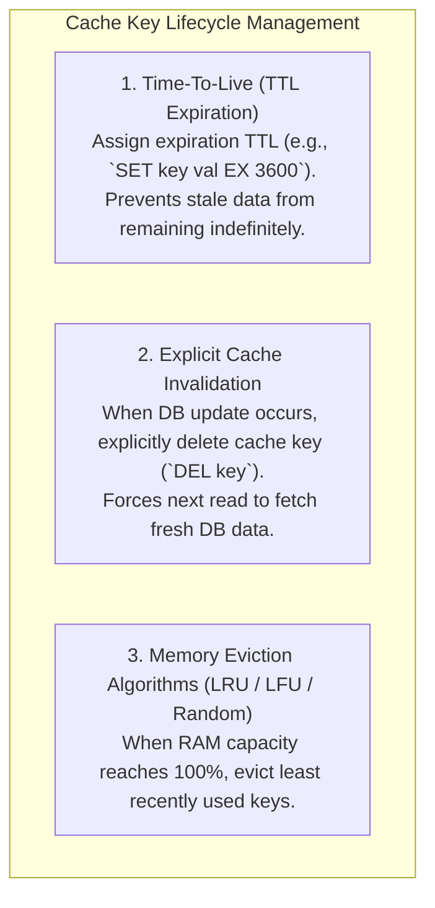

# Distributed Caching Strategies — Cache-Aside, Write-Through, Write-Around, Write-Back

## Mental Model

Think of **Distributed Caching Strategies** as a high-speed executive assistant managing files for a CEO (**The Application Server**). 

The filing cabinet in the basement (**The Database**) stores millions of document folders; fetching a file takes 10 minutes (**100ms DB latency**). The executive assistant maintains a small desktop desk tray (**In-Memory Distributed Cache / Redis**) holding 1,000 active folders; fetching a file takes 2 seconds (**1ms Cache latency**).

How the executive assistant updates and reads files between the desk tray and the basement filing cabinet defines the 4 core caching patterns: **Cache-Aside**, **Write-Through**, **Write-Around**, and **Write-Back (Write-Behind)**.

---

## 1. The 4 Core Distributed Caching Patterns

```mermaid
flowchart TD
    subgraph Pattern1["1. Cache-Aside (Lazy Loading)"]
        App1["App"] -->|1. Get Key| Cache1["Cache"]
        Cache1 -->|2a. Cache Hit (Return)| App1
        Cache1 -.->|2b. Cache Miss| DB1["Database"]
        DB1 -->|3. App reads from DB & writes to Cache| Cache1
    end

    subgraph Pattern2["2. Write-Through (Synchronous Dual Write)"]
        App2["App"] -->|1. Write Data| Cache2["Cache"]
        Cache2 -->|2. Cache synchronously writes to DB| DB2["Database"]
        NoteWT["Cache acts as primary data facade."]
    end

    subgraph Pattern3["3. Write-Around (Bypass Cache)"]
        App3["App"] -->|1. Write Data directly| DB3["Database"]
        App3 -.->|2. Reads trigger Cache-Aside on miss| Cache3["Cache"]
    end

    subgraph Pattern4["4. Write-Back / Write-Behind (Async Batch Write)"]
        App4["App"] -->|1. Write Data| Cache4["Cache (Immediate ACK!)"]
        Cache4 -.->|2. Async background batch write| DB4["Database"]
        NoteWB["Ultra-fast write throughput! Data loss risk on Cache Crash!"]
    end
```

---

## 2. Comprehensive Caching Pattern Comparison

| Pattern | Read Latency | Write Latency | Data Consistency | Crash Risk (Data Loss) | Best Use Case |
|---|---|---|---|---|---|
| **Cache-Aside** | Fast (on Hit), Slow (on Miss). | N/A (App writes to DB). | Risk of stale data (TTL dependent). | **Zero Data Loss** (DB is source of truth). | General Web Apps (Read-heavy, general traffic). |
| **Write-Through** | **Ultra Fast** (Data pre-warmed). | Higher (Sync write to Cache + DB). | **High** (Cache and DB always in sync). | **Zero Data Loss**. | Mission-critical financial/user systems. |
| **Write-Around** | Slow on first read (Cache Miss). | **Fast** (Bypasses Cache overhead). | High. | **Zero Data Loss**. | Apps with low read-after-write ratios (Logs, Analytics). |
| **Write-Back (Write-Behind)** | **Ultra Fast**. | **Ultra Fast** (Instant ACK from RAM). | Risk of temporary inconsistency. | ⚠️ **High Risk** (Un-flushed RAM updates lost if Cache dies). | High-Throughput Ingestion (Like counters, IoT metrics). |

---

## 3. Cache Eviction & Invalidation Strategies

A cache has bounded RAM capacity ($K$). Managing key lifecycles requires explicit eviction and invalidation rules:



---

## 4. Cache Invalidation Best Practice: Delete vs. Update

When a record is modified in the Database, should the application **Update** the cache key value or **Delete** the cache key?

$$\mathbf{\text{Rule: Delete the Cache Key! (Eviction over Mutation)}}$$

```text
WHY DELETE IS BETTER THAN UPDATE:

Scenario: 2 Concurrent Writes (Write A, Write B)
If you UPDATE Cache:
1. Write A updates DB (val = 1)
2. Write B updates DB (val = 2)
3. Write B updates Cache (val = 2)
4. Write A updates Cache (val = 1) -> RACE CONDITION! Cache now holds STALE val=1 while DB holds val=2!

If you DELETE Cache:
1. Write A updates DB (val = 1) & Deletes Cache Key.
2. Write B updates DB (val = 2) & Deletes Cache Key.
3. Next Read fetches fresh val = 2 from DB -> ALWAYS CONSISTENT!
```

---

## 5. Failure Modes and Trade-offs

1. **Cache Penetration (Non-Existent Key Attack)** — An attacker queries millions of non-existent keys (`user_id = -9999`). Every request misses the cache and hits the database directly, crashing the DB! *Mitigation*: Use **Bloom Filters** at the cache boundary or cache null values (`SET key "NULL" EX 60`).
2. **Cache Stampede (Thundering Herd)** — A high-traffic key (`homepage_feed`) expires. 50,000 concurrent requests miss the cache at the exact same millisecond, sending a thundering herd of 50,000 DB queries. *Mitigation*: Use **Mutex Locking (Single-Flight)** or **Probabilistic Early Expiration (XFetch algorithm)**.
3. **Cache Avalanche (Massive Simultaneous TTL Expiration)** — 1,000,000 cache keys are written at midnight with a fixed 24-hour TTL. At midnight tomorrow, all 1,000,000 keys expire simultaneously, flooding the database. *Mitigation*: Add **Random Jitter** to TTLs (`TTL = 86400s + random(0, 300s)`).

---

## 6. Active-Recall Prompts

1. **Compare Cache-Aside vs. Write-Through vs. Write-Back across write latency and data loss risk.**
2. **Why is DELETING a cache key preferred over UPDATING a cache key during database writes?**
3. **What is Cache Penetration, and how does a Bloom Filter prevent non-existent keys from hitting the database?**
4. **How does adding Random Jitter to TTLs prevent Cache Avalanche outages?**

---

## Related Notes

- [[LLD - Thread-Safe In-Memory Cache with LRU and LFU Eviction]]
- [[Consistent Hashing - Hash Rings, Virtual Nodes, and Data Rebalancing]]
- [[Database Scaling - Vertical vs Horizontal, Read Replicas, and Master-Slave]]
- [[Database Sharding - Hash-Based, Range-Based, and Directory-Based Partitioning]]

> **Interview Style Question:** *"Design a distributed caching architecture for a high-traffic social media app (like Instagram) processing 500,000 Read QPS. Evaluate Cache-Aside vs. Write-Through vs. Write-Back, justify why Cache Deletion is used over Cache Mutation, write a Bloom Filter defense against Cache Penetration, and solve Cache Stampede using single-flight mutex locks."*

---
