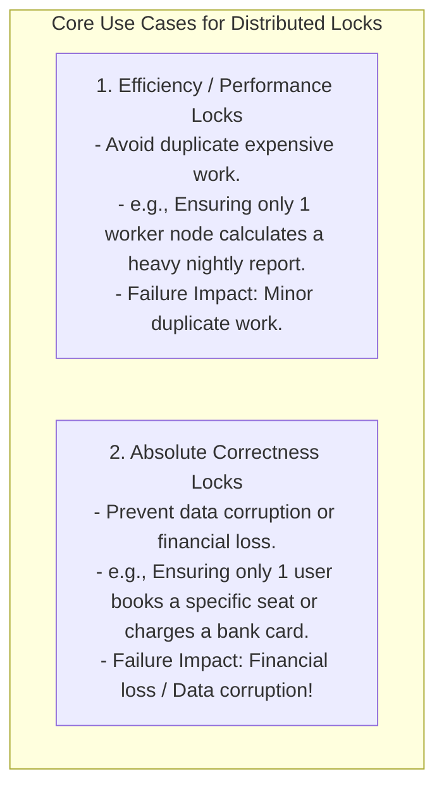
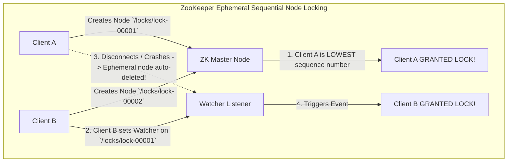
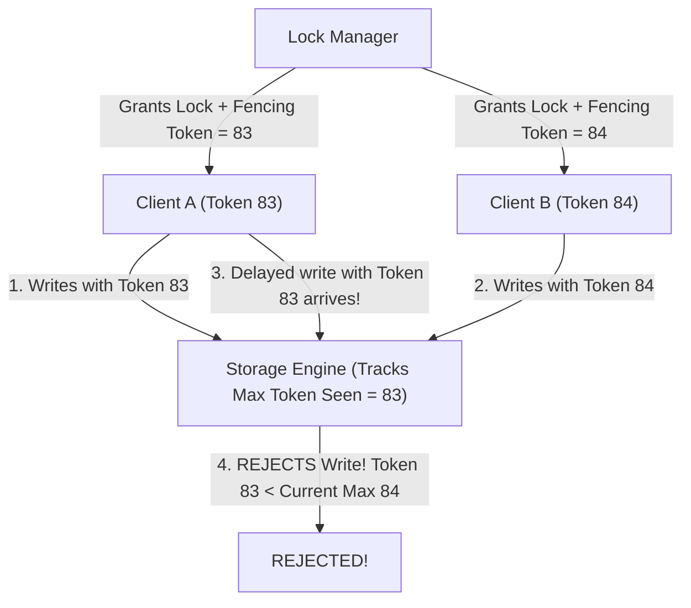

# Distributed Locks — Redis Redlock vs. ZooKeeper or Etcd Consensus

## Mental Model

Think of a **Distributed Lock** as a single physical golden key to an executive conference room shared across 50 international branch offices. 

Only one worker in the entire global enterprise can hold the golden key at any single instant (**Mutual Exclusion**). 

If the worker holding the key falls asleep inside the room (**Process GC Pause / Crash**), the lock must automatically expire after a timeout (**Lock Lease TTL**) so the enterprise doesn't deadlock. 

To guarantee safety, the key provider must ensure that two workers in different cities NEVER receive duplicate copies of the golden key simultaneously (**Fencing Tokens / Consensus Validation**).

---

## 1. Why Single-Machine Locks Fail in Distributed Systems

In a single monolithic process, language primitives like `ReentrantLock` (Java), `pthread_mutex` (C++), or `asyncio.Lock` (Python) enforce mutual exclusion across threads sharing the **same memory space**. 

In a distributed microservices environment spanning 100 Kubernetes pods across multiple data centers, threads do **NOT** share memory! A centralized **Distributed Lock Manager (DLM)** is required.



---

## 2. Redis Distributed Locking: Single Node vs. Redlock Algorithm

### A. Single-Node Redis Lock (`SETNX` with Lease TTL)
Acquire lock:
```bash
SET resource_lock "random_client_id_12345" NX PX 30000
```
- `NX`: Set key ONLY if it does not exist (**Mutual Exclusion**).
- `PX 30000`: Expire key automatically after 30,000 ms (**Prevents Deadlocks on Client Crash**).

Release lock (Lua Script to verify ownership):
```lua
if redis.call("get", KEYS[1]) == ARGV[1] then
    return redis.call("del", KEYS[1])
else
    return 0
end
```

---

### B. Redis Redlock Algorithm (Multi-Node Fault Tolerance)
Designed by Salvatore Sanfilippo (antirez) for distributed fault tolerance across $N=5$ independent Redis masters:

```mermaid
flowchart TD
    Client["Client App"] -->|1. Gets current timestamp T1| Client
    
    Client -->|2. Attempts SETNX on all 5 independent Redis Masters sequentially| R1 & R2 & R3 & R4 & R5
    
    R1 & R2 & R3 -->|3. Responds OK (3 out of 5 ACKs)| Client
    
    Client -->|4. Checks T2 - T1 < Lock TTL AND Acquired Quorum (>=3 ACKs)| Success["LOCK ACQUIRED SUCCESSFULLY!"]
```

---

## 3. ZooKeeper / Etcd Consensus-Based Distributed Locking

While Redis Redlock relies on wall-clock time expiration, **ZooKeeper** and **Etcd** use strong consensus protocols (ZAB / Raft) and ephemeral sequential nodes.



---

## 4. Martin Kleppmann's Redlock Critique & Fencing Tokens

In 2016, distributed systems researcher Martin Kleppmann published a famous critique demonstrating that **Redlock is unsafe for correctness** due to process pauses (Stop-the-World Garbage Collection), network delays, and clock drift!

### The GC Pause Lock Violation Scenario:

```mermaid
flowchart TD
    ClientA["Client A"] -->|1. Acquires Redlock (TTL = 10s)| Redis
    ClientA -->|2. Enters 15-second Stop-The-World GC Pause!| GCPause["STW GC Pause (15s)"]
    
    Redis -->|3. Lock TTL Expires after 10s!| Expired["Lock Released Automatically"]
    
    ClientB["Client B"] -->|4. Acquires Redlock!| Redis
    ClientB -->|5. Writes to Shared Storage| Storage["Shared Storage File"]
    
    GCPause -->|6. Client A Wakes up (Thinks it still holds lock!)| ClientA
    ClientA -->|7. Writes to Shared Storage -> DATA CORRUPTION!| Storage
```

### The Solution: Fencing Tokens
To guarantee safety against GC pauses, the Distributed Lock Manager MUST return a monotonically increasing **Fencing Token** (e.g. `token = 83`) with every lock acquisition:



---

## 5. Architectural Comparison Matrix

| Property | Single-Node Redis | Redis Redlock | ZooKeeper / Etcd |
|---|---|---|---|
| **Consensus Protocol** | None (Single Instance). | Majority Quorum ($3/5$). | **ZAB / Raft (Strong Consensus)**. |
| **Dependency Requirement** | Lightweight. | Requires 5 independent Redis nodes. | Requires ZooKeeper / Etcd cluster. |
| **Lock Expiration Mechanism** | TTL Wall-Clock Timeout. | TTL Wall-Clock Timeout. | **Ephemeral Session Heartbeats**. |
| **Fencing Token Generator** | Manual implementation. | Manual implementation. | **Built-in (zxid / revision number)**. |
| **Best Use Case** | **Efficiency & Performance** (Avoiding duplicate work). | High-speed transient locking. | **Absolute Correctness** (Financial & inventory locks). |

---

## 6. Active-Recall Prompts

1. **Why do language-level mutex locks (`ReentrantLock`) fail in multi-pod distributed systems?**
2. **Explain the single-node Redis lock pattern (`SETNX` with TTL and Lua release script).**
3. **How did Martin Kleppmann prove that Redlock can be unsafe during Stop-the-World GC pauses?**
4. **What is a Fencing Token, and how does a storage engine use it to reject stale write operations?**

---

## Related Notes

- [[LLD - Movie Ticket Booking System (BookMyShow)]]
- [[LLD - Hotel Room Booking System]]
- [[LLD - Thread-Safe In-Memory Cache with LRU and LFU Eviction]]
- [[Distributed Transactions - 2PC, Saga Pattern, and Outbox Pattern]]
- [[Concurrency Control - Two-Phase Locking, Deadlock Detection, Lock Granularity]]

> **Interview Style Question:** *"Design a Distributed Lock Manager for a financial settlement system processing 50,000 concurrent transfers. Compare Redis Redlock vs. ZooKeeper vs. Etcd, analyze Martin Kleppmann's GC pause attack vector, implement Fencing Tokens to guarantee strict mutual exclusion on storage writes, and write a complete Java/TypeScript client."*

---
