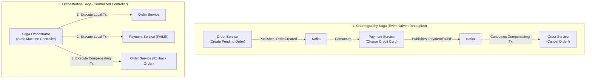

# Distributed Transactions — 2PC, Saga Pattern, and Outbox Pattern

## Mental Model

Think of a **Distributed Transaction** across microservices as booking a vacation package involving 3 independent companies: an Airline, a Hotel, and a Car Rental agency. 

- **Two-Phase Commit (2PC):** A central coordinator holds all 3 companies on the phone line. Phase 1 asks *"Can you reserve this seat/room/car?"* (**Prepare Phase**). If all 3 say YES, Phase 2 executes *"Commit all reservations!"* (**Commit Phase**). If 1 company crashes during the call, all 3 hold resources locked indefinitely (**Blocking Protocol / Low Scalability**).
- **Saga Pattern:** A chain of independent local transactions. The Airline charges your card. Next, the Hotel charges your card. If the Car Rental fails, the system executes **Compensating Transactions** backward (*"Refund Hotel, Refund Airline!"*). No blocking locks are held!
- **Transactional Outbox Pattern:** Ensures a database write and a message queue publication happen atomically without data loss.

---

## 1. Two-Phase Commit (2PC) Architecture

2PC guarantees strict ACID properties across multiple distributed database nodes using a Coordinator.

```mermaid
flowchart TD
    Coordinator["Transaction Coordinator"] -->|1. Phase 1: PREPARE?| DB1["Database Node 1"]
    Coordinator -->|1. Phase 1: PREPARE?| DB2["Database Node 2"]
    
    DB1 -->|2. VOTE_COMMIT (Locks Held!)| Coordinator
    DB2 -->|2. VOTE_COMMIT (Locks Held!)| Coordinator
    
    Coordinator -->|3. Phase 2: GLOBAL_COMMIT!| DB1 & DB2
    DB1 & DB2 -->|4. ACK & Release Locks| Coordinator
```

### The 2PC Flaw:
- **Blocking Protocol:** Database nodes hold exclusive row locks from Phase 1 until Phase 2 completes.
- **Coordinator Single Point of Failure:** If the Coordinator crashes during Phase 2, database nodes hold locks indefinitely, blocking all other transactions!

---

## 2. The Saga Pattern (Choreography vs. Orchestration)

The Saga Pattern breaks a global distributed transaction into a sequence of **Local Transactions**. Each local transaction updates a service's database and publishes an event that triggers the next local transaction.



### Choreography vs. Orchestration Comparison

| Feature | Choreography Saga | Orchestration Saga |
|---|---|---|
| **Coordination Model** | Decentralized (Services listen to Kafka events). | Centralized (Saga Orchestrator State Machine). |
| **Service Coupling** | **Low** (Zero direct dependencies). | Medium (Services depend on Orchestrator). |
| **Cyclic Dependency Risk** | High (Hard to track event flow in 50+ services). | **Zero** (Centralized flow visibility). |
| **Best Use Case** | Simple workflows with 2-4 microservices. | Complex enterprise workflows (5+ services with conditionals). |

---

## 3. The Transactional Outbox Pattern

A common bug in microservices occurs when a service updates its database BUT crashes before publishing an event to Kafka (**Dual-Write Problem**).

$$\mathbf{\text{The Transactional Outbox Pattern solves the Dual-Write Problem!}}$$

```mermaid
flowchart TD
    subgraph OutboxPatternFlow["Transactional Outbox Pattern Workflow"]
        App["Order Service"] -->|1. Single Local DB Transaction| DB[("Database")]
        
        subgraph SingleDBTransaction["Atomic Local DB Transaction"]
            DB -->|Insert Row| OrderTable["`Orders` Table"]
            DB -->|Insert Event Row| OutboxTable["`Outbox` Table"]
        end
        
        CDC["Message Relay / CDC Tool\n(Debezium / Outbox Poller)"] -->|2. Reads Outbox Table / WAL| OutboxTable
        CDC -->|3. Publishes Event to Kafka| Kafka["Kafka Topic"]
        CDC -->|4. Marks Outbox Row Processed| OutboxTable
    end
```

### Why Outbox Pattern Works:
Writing to the `Orders` table AND inserting an event payload row into the `Outbox` table occurs inside a **SINGLE local SQL ACID transaction**. It is guaranteed to either both succeed or both rollback!

---

## 4. Architectural Comparison Matrix

| Pattern | Consistency Model | Performance / Latency | Isolation Level | Implementation Complexity |
|---|---|---|---|---|
| **Two-Phase Commit (2PC)** | **Strong Consistency (ACID)** | Low (Blocking locks). | Serialized / Strict. | Low (Database built-in). |
| **Saga Pattern** | **Eventual Consistency (BASE)** | **High** (Non-blocking). | Lack of Isolation (Dirty reads possible). | High (Requires Compensating Txs). |
| **Transactional Outbox** | **At-Least-Once Delivery** | High. | Local ACID Isolation. | Medium (Requires Debezium / Poller). |

---

## 5. Failure Modes and Trade-offs

1. **Missing Compensating Transactions in Saga** — An Orchestrator triggers `PaymentService.charge()`, which succeeds. Next, `InventoryService.reserve()` fails. But `PaymentService` has no `refund()` compensating method! Money is trapped in limbo. *Mitigation*: Every saga step MUST have a tested, idempotent compensating transaction.
2. **Dual-Write Inconsistency (No Outbox)** — Writing to PostgreSQL DB first, then calling `kafkaProducer.send()`. Network drops before Kafka call completes. Database is updated, but downstream services are never notified! *Mitigation*: Always implement **Transactional Outbox Pattern with Debezium CDC**.
3. **Lack of Isolation in Saga (Pivot Transactions)** — A user initiates checkout. Saga decreases inventory balance. Before payment completes, another user queries inventory and sees 0 stock (**Dirty Read / Lack of Isolation**). *Mitigation*: Use semantic locks (e.g. `PENDING_RESERVATION` status).

---

## 6. Active-Recall Prompts

1. **Why does Two-Phase Commit (2PC) suffer from low scalability and blocking lock problems?**
2. **Compare Choreography Saga vs. Orchestration Saga in microservices.**
3. **What is a Compensating Transaction in the Saga Pattern?**
4. **How does the Transactional Outbox Pattern with Change Data Capture (CDC) solve the Dual-Write problem?**

---

## Related Notes

- [[Event-Driven Architecture - Pub-Sub, Event Sourcing, and CQRS]]
- [[Message Queues vs Event Streams - RabbitMQ vs Apache Kafka]]
- [[Transactions and ACID Properties - Atomicity, Consistency, Isolation, Durability]]
- [[Distributed Locks - Redis Redlock vs ZooKeeper or Etcd Consensus]]

> **Interview Style Question:** *"Design a distributed checkout transaction for an e-commerce platform across Order Service, Payment Gateway, Inventory Service, and Shipping Service. Compare 2PC vs Saga Pattern, write the Saga Orchestrator state machine including all Compensating Transactions, and demonstrate how the Transactional Outbox Pattern with Debezium CDC guarantees event delivery."*

---
