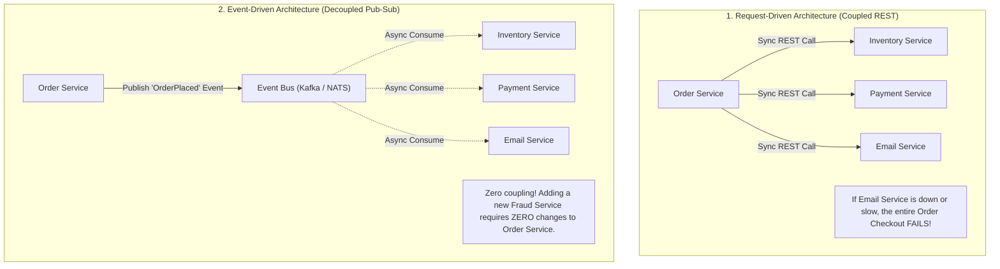
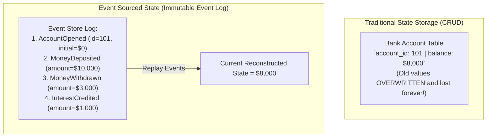
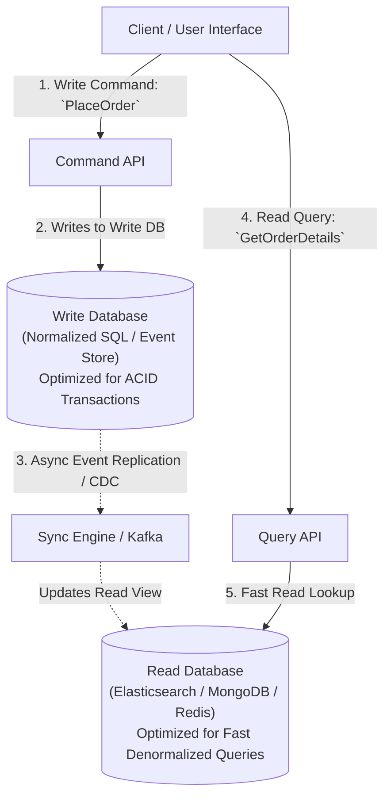

# Event-Driven Architecture — Pub-Sub, Event Sourcing, and CQRS

## Mental Model

Think of **Event-Driven Architecture (EDA)** as an automated stock exchange trading floor. 

When a trader submits a buy order (**Event Published**), the stock exchange does not call 50 individual bank, tax, compliance, and notification databases synchronously (**Coupled Request-Response**). 

Instead, the exchange broadcasts the event to an **Event Bus (Pub-Sub)**. Interested subscribers (**Compliance Service, Billing Service, Push Notification Service, Risk Engine**) consume the event asynchronously at their own speed. 

Furthermore, instead of storing only the final account balance ($10,000), **Event Sourcing** records every single historical transaction event (`+ $5,000`, `- $2,000`, `+ $7,000`) in an immutable log. Replaying this log reconstructs exact account state at any point in history. **CQRS** splits the heavy Write path (**Commands**) from the fast Read path (**Queries**).

---

## 1. Request-Driven vs. Event-Driven Architecture

---

## 2. Event Sourcing Pattern

Instead of storing current state in a relational database table using `UPDATE`, **Event Sourcing** records all state changes as an immutable, append-only sequence of domain events.

### Advantages of Event Sourcing:
1. **Complete Audit Trail & Time-Travel Debugging:** Full historical audit log built-in by design. You can reconstruct system state at any exact past timestamp ($T$).
2. **Zero Update Locks:** High-throughput append-only writes ($O(1)$ sequential log inserts) with zero database row locking.
3. **Event Replay:** Easily spin up new analytical microservices and replay historical events from day 1!

---

## 3. CQRS (Command Query Responsibility Segregation)

CQRS strictly separates the data model for **Commands** (state-mutating operations: Create, Update, Delete) from **Queries** (read-only views).

---

## 4. Architectural Comparison Matrix

| Architectural Pattern | Core Focus | Primary Benefit | Trade-off / Complexity |
|---|---|---|---|
| **Pub-Sub (Publish-Subscribe)** | Decoupled Async Messaging. | High extensibility, zero service coupling. | Eventual consistency, asynchronous debugging. |
| **Event Sourcing** | Immutable Event Log State. | Complete audit trail, time-travel state replay. | Complex schema evolution, requires Snapshots for long event streams. |
| **CQRS** | Segregated Read vs. Write Models. | Independent scaling of Reads vs Writes. | Eventual consistency lag between Write DB and Read DB. |

---

## 5. Failure Modes and Trade-offs

1. **Event Sourcing Infinite Event Replay Latency** — An account has 10,000,000 historical transaction events over 5 years. Reconstructing current account state takes 45 seconds of reading disk events! *Mitigation*: Periodically generate **State Snapshots** (e.g. every 1,000 events); load nearest Snapshot and replay only remaining recent events.
2. **CQRS Read-Side Eventual Consistency Lag** — A user submits an order via Command API. The browser immediately queries Query API, but the async sync worker hasn't updated the Read DB yet. The user sees an empty order history! *Mitigation*: Return newly created event payload directly in the Command response or use WebSocket pushes.
3. **Out-of-Order Event Processing in Event-Driven Systems** — `OrderCancelled` event arrives at Inventory Service BEFORE `OrderPlaced` event due to partition misconfiguration. *Mitigation*: Enforce Partition Keys (`order_id`) in Kafka or include Event Sequence Numbers.

---

## 6. Active-Recall Prompts

1. **How does Event-Driven Architecture (EDA) decouple microservices compared to synchronous REST API chains?**
2. **What is Event Sourcing, and how do State Snapshots prevent long event replay delays?**
3. **Explain CQRS (Command Query Responsibility Segregation) and why it separates Write DBs from Read DBs.**
4. **How do you handle eventual consistency lag when a user reads immediately after issuing a CQRS command?**

---

## Related Notes

- [[Message Queues vs Event Streams - RabbitMQ vs Apache Kafka]]
- [[Distributed Transactions - 2PC, Saga Pattern, and Outbox Pattern]]
- [[Observer Pattern - Event Buses, Publish-Subscribe, and Reactive Streams]]
- [[Command Pattern - Encapsulating Requests, Undo-Redo, and Macro Commands]]

> **Interview Style Question:** *"Design a scalable banking ledger system (like Stripe) using Event-Driven Architecture, Event Sourcing, and CQRS. Show how events are published to Kafka, design the Event Store schema, explain how State Snapshots optimize account balance recalculations, and solve CQRS eventual consistency read lag."*

---
