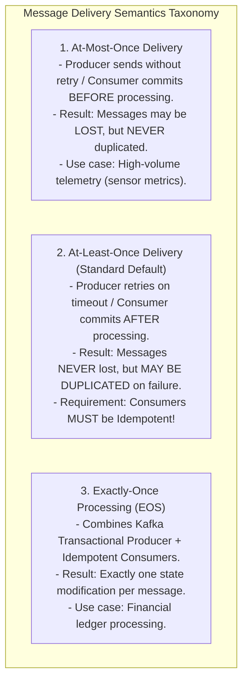

# Message Queues vs. Event Streams — RabbitMQ vs. Apache Kafka

## Mental Model

Think of **Message Queues (RabbitMQ)** as a postal mail system delivering paper letters. 

A sender drops an envelope into a mailbox (**Publisher**). The post office routes the envelope to a specific worker (**Consumer**). Once the worker reads the letter, it is thrown into the paper shredder (**Message Deletion upon ACK**). The letter is gone forever. 

Think of **Event Streams (Apache Kafka)** as an immutable, append-only security camera DVR recording tape log. 

Events (like camera frame timestamps) are appended sequentially to the tape log. Multiple security officers (**Consumer Groups**) can replay the tape backward, pause, or fast-forward at different playback speeds (**Offset Pointers**). The tape is NOT deleted when watched; it is retained for 7 days or forever (**Replayability**).

---

## 1. Message Queue (RabbitMQ) vs. Distributed Log (Kafka) Architecture

```mermaid
flowchart TD
    subgraph RabbitMQArch["1. Message Queue Architecture (RabbitMQ)\nSmart Broker, Dumb Consumer"]
        Publisher1["Producer"] -->|Publishes Message| Exchange["Exchange\n(Direct / Fanout / Topic)"]
        Exchange -->|Routes to| Queue1["AMQP Queue 1"]
        Queue1 -->|Pushes Message & Deletes on ACK!| Consumer1["Consumer Worker"]
        NoteRabbit["Message deleted after consumption. Focus on complex routing & task queues."]
    end

    subgraph KafkaArch["2. Event Stream Architecture (Apache Kafka)\nDumb Broker, Smart Consumer"]
        Producer2["Producer"] -->|Appends Event| Topic["Kafka Topic Partition Log\n[0] -> [1] -> [2] -> [3] -> [4]"]
        
        Topic -->|Consumer A (Offset=4)| GroupA["Consumer Group A (Analytics)"]
        Topic -->|Consumer B (Offset=2)| GroupB["Consumer Group B (Billing)"]
        NoteKafka["Events retained on disk! Consumers track their own Offset pointers."]
    end
```

---

## 2. Architectural Comparison Matrix

| Property | Message Queue (RabbitMQ / ActiveMQ) | Distributed Event Stream (Apache Kafka / Pulsar) |
|---|---|---|
| **Core Abstraction** | Transient Task Queue (AMQP Protocol). | Immutable Distributed Commit Log. |
| **Message Lifetime** | **Deleted immediately** after Consumer ACK. | **Retained on disk** (e.g., 7 days, 30 days, or infinite). |
| **Message Replay** | ❌ Impossible (Once read, message is gone). | ✅ **Supported** (Reset consumer offset back to 0). |
| **Throughput** | Moderate ($10,000 - 50,000$ msg/sec). | **Ultra High** ($1,000,000+$ msg/sec via sequential I/O). |
| **Routing Flexibility** | **Complex Routing** (Headers, Wildcards, Topics). | Simple Partition Key hashing (`hash(key) % P`). |
| **Message Ordering** | Guaranteed per Queue. | Guaranteed **ONLY within a single Partition**. |
| **Consumer Model** | Push Model (Broker pushes to consumer). | **Pull Model** (Consumer polls batch from broker). |

---

## 3. Kafka Topic Partitioning & Ordering Guarantees

How does Kafka achieve horizontal scalability while maintaining message ordering?

```mermaid
flowchart TD
    Producer["Producer (Publishing Order Event)"] -->|Hash(order_id) % 3| Partitioner["Partitioner Engine"]
    
    Partitioner -->|order_id = 99| P0["Topic Partition 0\n[Msg 0] [Msg 1] [Msg 2]"]
    Partitioner -->|order_id = 100| P1["Topic Partition 1\n[Msg 0] [Msg 1]"]
    Partitioner -->|order_id = 101| P2["Topic Partition 2\n[Msg 0] [Msg 1] [Msg 2] [Msg 3]"]
    
    P0 --> ConsumerA["Consumer Worker A (Group 1)"]
    P1 --> ConsumerB["Consumer Worker B (Group 1)"]
    P2 --> ConsumerC["Consumer Worker C (Group 1)"]
```

### Kafka Ordering Golden Rule:
$$\text{Strict Message Ordering is Guaranteed ONLY within a single Partition!}$$

If Order `#99` events (`OrderCreated`, `PaymentProcessed`, `OrderShipped`) are all assigned to **Partition 0** (by setting Partition Key = `order_id`), they are guaranteed to be processed sequentially in exact order!

---

## 4. Delivery Semantics: At-Least-Once vs. At-Most-Once vs. Exactly-Once

How do message brokers handle network failures and retries?



---

## 5. Failure Modes and Trade-offs

1. **Poison Pill Message Crash Loop (RabbitMQ)** — A malformed JSON message (`Poison Pill`) reaches the front of a RabbitMQ queue. Consumer fails to parse it, throws an exception, and rejects the message without ACK. The broker re-queues it at the head of the queue, crashing the consumer in an infinite loop! *Mitigation*: Configure **Dead-Letter Queues (DLQ)** with max retry counters (e.g., move to DLQ after 3 failed retries).
2. **Kafka Partition Rebalance Storm** — A heavy consumer thread takes 30 seconds to process a batch, exceeding `max.poll.interval.ms`. Kafka broker assumes the consumer is dead and triggers a **Group Rebalance**, revoking partitions across all consumers and halting message processing for minutes. *Mitigation*: Increase `max.poll.interval.ms` or reduce `max.poll.records`.
3. **Non-Idempotent Consumer Duplication** — Using At-Least-Once delivery to process credit card payments. A network timeout causes the producer to retry sending `ChargeCard(amount=100)`. The consumer executes the charge twice ($200 charged!). *Mitigation*: Use **Idempotency Keys** (`transaction_id`) stored in a database unique index.

---

## 6. Active-Recall Prompts

1. **Compare RabbitMQ vs. Apache Kafka across message deletion, throughput, routing flexibility, and message replay.**
2. **How does Kafka guarantee strict message ordering using Partition Keys?**
3. **What is the difference between At-Least-Once and Exactly-Once delivery semantics?**
4. **How does a Dead-Letter Queue (DLQ) handle Poison Pill messages?**

---

## Related Notes

- [[Event-Driven Architecture - Pub-Sub, Event Sourcing, and CQRS]]
- [[Distributed Transactions - 2PC, Saga Pattern, and Outbox Pattern]]
- [[Producer-Consumer Pattern - Bounded Queues and Condition Variables]]
- [[HLD - Distributed Notification Service (Email, SMS, Push)]]

> **Interview Style Question:** *"Design an enterprise event-driven architecture for a global payment platform processing 100,000 transactions/sec. Evaluate RabbitMQ vs Apache Kafka, design a Kafka topic partition key strategy guaranteeing in-order ledger processing per account, demonstrate At-Least-Once delivery with Idempotent consumers, and detail your Dead-Letter Queue (DLQ) retry strategy."*

---
