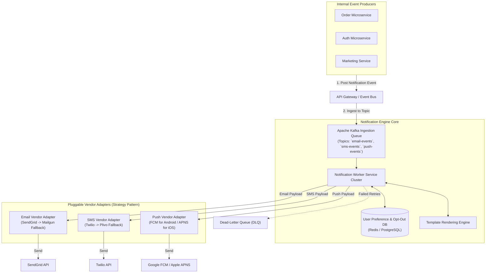
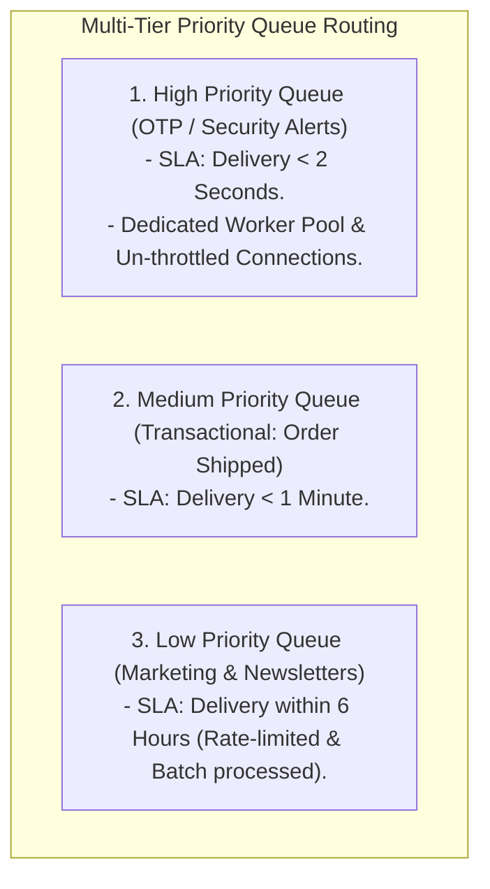

# HLD — Distributed Notification Service (Email, SMS, Push)

## Mental Model

Think of a **Distributed Notification Service** as a multi-channel global post office handling urgent broadcasts. 

Internal microservices (**Order Service, Fraud Engine, Marketing**) publish notification requests (`User 42: Order Shipped`). 

The Notification Service accepts these payloads, validates user delivery preferences (**User Opt-Out & Rate Limits**), formats the payload into specific channel templates (**Email, SMS, iOS/Android Push**), and routes the messages to third-party delivery vendors (**Twilio for SMS, SendGrid for Email, APNS/FCM for Mobile Push**). 

If a primary vendor fails or throttles traffic (**SendGrid Outage**), the system automatically retries using backup vendor routes (**Mailgun Fallback**) without dropping a single notification.

---

## 1. Requirement & Capacity Estimation

### A. Functional & Non-Functional Requirements
1. **Multi-Channel Support:** Send `Email`, `SMS`, `iOS Push (APNS)`, `Android Push (FCM)`, and `Web Push`.
2. **High Throughput:** Support 10 Million notifications per day ($100 \text{ msg/sec}$ average, $1,000 \text{ msg/sec}$ peak).
3. **Template Engine & Personalization:** Dynamically render HTML/Text templates using user metadata (`{{user_name}}`, `{{order_id}}`).
4. **User Preferences & Rate Limiting:** Respect user opt-out settings and cap marketing notifications (max 3/day).
5. **Vendor Fallback & Retry:** Automatic failover across multi-vendor channels (Twilio $\to$ Plivo; SendGrid $\to$ Mailgun).

### B. Capacity Estimation Math
- **Notification Traffic:**
  - 10 Million Notifications / Day
  - Average QPS = $\frac{10,000,000}{86,400} \approx \mathbf{116 \text{ QPS}}$
  - Peak QPS = $116 \times 5 = \mathbf{600 \text{ QPS}}$
- **Storage Math (5-Year Logs):**
  - Payload Size / Notification Log = 1 KB
  - 5-Year Log Storage = $10^7 \times 365 \times 5 \times 1 \text{ KB} = \mathbf{18.25 \text{ Terabytes (TB)}}$

---

## 2. High-Level System Architecture Diagram



---

## 3. Multi-Channel Routing & Priority Queues

Not all notifications are equal! A Password Reset OTP must be delivered in **$< 2$ seconds**, while a Marketing Newsletter can be delayed by 2 hours.



---

## 4. Vendor Fallback & Retries (Strategy Pattern)

To guarantee high availability ($99.99\%$), third-party vendor integrations use the **Strategy Pattern** paired with a **Circuit Breaker**:

```mermaid
flowchart TD
    Worker["Notification Worker"] -->|Try Primary Vendor| Twilio["Twilio SMS Gateway"]
    
    Twilio -->|1. HTTP 500 Error / Timeout| CircuitBreaker{"Circuit Breaker Open?"}
    
    CircuitBreaker -->|YES (Twilio Outage)| Fallback["Switch to Secondary Vendor Adapter"]
    
    Fallback -->|2. Send via Backup| Plivo["Plivo SMS Gateway (Success!)"]
```

---

## 5. Failure Modes and Trade-offs

1. **Duplicate Notification Spam (Non-Idempotent Resends)** — Worker sends SMS via Twilio, but network drops before Twilio's HTTP 200 ACK reaches the worker. Worker retries, sending 5 duplicate SMS messages to the user! *Mitigation*: Generate a unique `idempotency_key` per notification; store delivery status in Redis before retrying.
2. **Third-Party Vendor Outage Black Hole** — Primary email vendor (SendGrid) experiences an outage. Notifications build up in memory and crash worker instances. *Mitigation*: Use **Kafka Priority Queues**, Circuit Breakers, and automatic fallback to backup vendors (Mailgun).
3. **User Opt-Out Law Violations (GDPR / CAN-SPAM)** — Marketing worker sends SMS to a user who unsubscribed 10 minutes ago. *Mitigation*: Check **User Preference Cache (Redis)** synchronously before every vendor payload delivery.

---

## 6. Active-Recall Prompts

1. **Why should transactional notifications (OTP) be isolated from marketing notifications using distinct Priority Queues?**
2. **How does the Strategy Pattern facilitate seamless failover between Twilio and Plivo during SMS vendor outages?**
3. **How do Idempotency Keys prevent users from receiving duplicate SMS or Push notifications during network retries?**
4. **Why is Redis used to cache user opt-out preferences in front of the primary user database?**

---

## Related Notes

- [[Message Queues vs Event Streams - RabbitMQ vs Apache Kafka]]
- [[Event-Driven Architecture - Pub-Sub, Event Sourcing, and CQRS]]
- [[API Gateway Pattern - Rate Limiting, Authentication, TLS Termination, Request Routing]]
- [[Strategy Pattern - Algorithmic Interchangeability and Policy Objects]]

> **Interview Style Question:** *"Design a Distributed Notification Service supporting Email, SMS, and Mobile Push for 100M users. Estimate capacity math, design a multi-tier priority queue architecture (OTP vs Marketing), write vendor fallback strategy code (SendGrid -> Mailgun; Twilio -> Plivo), guarantee At-Least-Once delivery with Idempotent deduping, and enforce CAN-SPAM opt-out preferences."*

---
