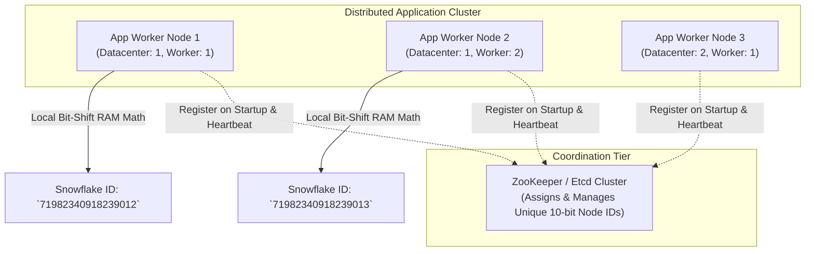

# HLD — Distributed Unique ID Generator (Twitter Snowflake)

## Mental Model

Think of a **Distributed Unique ID Generator (Twitter Snowflake)** as a high-precision automated timestamp clock combined with a worker identification badge stamping machine. 

In a distributed database cluster processing 100,000 requests/sec across 1,000 servers, assigning sequential auto-increment integer IDs (`1, 2, 3...`) using a single central database creates a massive single-point-of-failure write bottleneck (**Database Lock Contention**). Generating 128-bit UUIDs (`f47ac10b-58cc-4372-a567...`) creates huge, non-time-sortable strings that degrade database B+ Tree index performance (**Index Fragmentation**). 

The **Twitter Snowflake Algorithm** generates 64-bit integer IDs that are **globally unique**, **roughly time-sorted**, and **generated locally in RAM** without network calls!

---

## 1. Requirement & Architectural Comparison

### Functional & Non-Functional Requirements
1. **Global Uniqueness:** IDs must be 100% unique across all distributed servers.
2. **Roughly Time-Sorted:** IDs must sort chronologically by generation timestamp.
3. **64-bit Numeric Size:** ID must fit within a standard 64-bit signed integer (`long` in Java/C++) for optimal B+ Tree index efficiency.
4. **High Scalability & Low Latency:** Must generate $> 10,000$ IDs/sec per worker node with sub-millisecond local RAM latency.

### ID Generation Strategy Comparison

| Strategy | Size | Roughly Time-Sorted? | Zero Network Hop? | B+ Tree Index Friendly? | Overall Evaluation |
|---|---|---|---|---|---|
| **Multi-Master MySQL Auto-Inc** | 64-bit | ❌ No | ❌ No (Network DB calls) | ✅ Yes | Hard to scale across data centers. |
| **UUID (v4 Pseudo-Random)** | 128-bit | ❌ No (Random) | ✅ Yes (Local RAM) | ❌ **Poor** (Index fragmentation). | High storage cost, bad index performance. |
| **Ticket Server (Central Redis)** | 64-bit | ✅ Yes | ❌ No (Network Single Point of Failure) | ✅ Yes | Single Point of Failure! |
| **Twitter Snowflake Algorithm** | **64-bit** | ✅ **Yes (Time-ordered)** | ✅ **Yes (Local RAM Generation)** | ✅ **Best** | **Industry Gold Standard!** |

---

## 2. Twitter Snowflake 64-Bit Structure Anatomy

A 64-bit Snowflake ID is partitioned into 4 distinct binary bit fields:

```text
 1 Bit    41 Bits (Timestamp in Milliseconds)     10 Bits (Node ID)    12 Bits (Sequence)
+------+----------------------------------------+--------------------+--------------------+
|  0   | 00000000000000000000000000000000000000 |   00000 00000      |    000000000000    |
+------+----------------------------------------+--------------------+--------------------+
```

### Bit Breakdown & Mathematical Bounds:
1. **1 Bit (Sign Bit):** Reserved, always `0` (ensures integer is positive in Java/C++).
2. **41 Bits (Epoch Timestamp):** Difference in milliseconds from custom epoch (e.g. `2026-01-01 00:00:00 UTC`):
   $$\text{Max Lifespan} = \frac{2^{41} - 1}{1000 \times 60 \times 60 \times 24 \times 365} \approx \mathbf{69.7 \text{ Years!}}$$
3. **10 Bits (Worker Node ID):** Supports up to $2^{10} = \mathbf{1,024 \text{ Worker Nodes}}$ (e.g. 5 bits Datacenter ID + 5 bits Worker ID).
4. **12 Bits (Sequence Number):** Incrementing counter per worker node per millisecond. Supports:
   $$\text{Max IDs per Millisecond per Node} = 2^{12} = \mathbf{4,096 \text{ IDs / ms (4.096 Million IDs/sec/node!)}}$$

---

## 3. System Architecture Diagram



---

## 4. Production Code Implementation (Java)

```java
package com.lld.snowflake;

import java.util.Objects;
import java.util.concurrent.locks.ReentrantLock;

public class SnowflakeIdGenerator {
    // Custom Epoch (2026-01-01 00:00:00 UTC in Milliseconds)
    private static final long CUSTOM_EPOCH = 1767225600000L;

    // Bit lengths
    private static final long WORKER_ID_BITS = 5L;
    private static final long DATACENTER_ID_BITS = 5L;
    private static final long SEQUENCE_BITS = 12L;

    // Max values
    private static final long MAX_WORKER_ID = -1L ^ (-1L << WORKER_ID_BITS); // 31
    private static final long MAX_DATACENTER_ID = -1L ^ (-1L << DATACENTER_ID_BITS); // 31
    private static final long MAX_SEQUENCE = -1L ^ (-1L << SEQUENCE_BITS); // 4095

    // Bit shifts
    private static final long WORKER_ID_SHIFT = SEQUENCE_BITS;
    private static final long DATACENTER_ID_SHIFT = SEQUENCE_BITS + WORKER_ID_BITS;
    private static final long TIMESTAMP_LEFT_SHIFT = SEQUENCE_BITS + WORKER_ID_BITS + DATACENTER_ID_BITS;

    private final long workerId;
    private final long datacenterId;
    private long sequence = 0L;
    private long lastTimestamp = -1L;
    private final ReentrantLock lock = new ReentrantLock();

    public SnowflakeIdGenerator(long workerId, long datacenterId) {
        if (workerId > MAX_WORKER_ID || workerId < 0) {
            throw new IllegalArgumentException("Worker ID out of bounds: " + workerId);
        }
        if (datacenterId > MAX_DATACENTER_ID || datacenterId < 0) {
            throw new IllegalArgumentException("Datacenter ID out of bounds: " + datacenterId);
        }
        this.workerId = workerId;
        this.datacenterId = datacenterId;
    }

    public long nextId() {
        lock.lock();
        try {
            long timestamp = timeGen();

            // Clock Backwards Check (NTP Backward Drift Protection)
            if (timestamp < lastTimestamp) {
                throw new IllegalStateException("Clock moved backwards! Refusing to generate ID for " + (lastTimestamp - timestamp) + "ms");
            }

            if (lastTimestamp == timestamp) {
                // Same millisecond -> Increment sequence
                sequence = (sequence + 1) & MAX_SEQUENCE;
                if (sequence == 0) {
                    // Sequence overflow -> Wait until next millisecond!
                    timestamp = tilNextMillis(lastTimestamp);
                }
            } else {
                // New millisecond -> Reset sequence counter
                sequence = 0L;
            }

            lastTimestamp = timestamp;

            // COMBINE BITS USING BITWISE OR (|) AND SHIFTS (<<)
            return ((timestamp - CUSTOM_EPOCH) << TIMESTAMP_LEFT_SHIFT) |
                   (datacenterId << DATACENTER_ID_SHIFT) |
                   (workerId << WORKER_ID_SHIFT) |
                   sequence;
        } finally {
            lock.unlock();
        }
    }

    private long tilNextMillis(long lastTimestamp) {
        long timestamp = timeGen();
        while (timestamp <= lastTimestamp) {
            timestamp = timeGen();
        }
        return timestamp;
    }

    private long timeGen() {
        return System.currentTimeMillis();
    }
}
```

---

## 5. Failure Modes and Trade-offs

1. **Clock Backward Drift (NTP Clock Resynchronization)** — System clock is adjusted backward by 100ms via Network Time Protocol (NTP). Snowflake generates duplicate IDs because timestamps overlap! *Mitigation*: Throw an exception (`Clock moved backwards`), sleep until the clock catches up, or use a logical sequence fallback.
2. **Sequence Overflow in 1 Millisecond** — A node receives $> 4,096$ requests within a single millisecond. The 12-bit sequence overflows (`sequence & 4095 == 0`). *Mitigation*: Block and wait until the next millisecond (`tilNextMillis()`).
3. **Hardcoded Custom Epoch Expiration** — Setting an old epoch or forgetting that 41 bits expires in 69.7 years. *Mitigation*: Set a recent custom epoch (e.g. 2026) to ensure 70-year longevity.

---

## 6. Active-Recall Prompts

1. **Explain the 4 bit-fields of a 64-bit Twitter Snowflake ID (1 bit sign, 41 bits timestamp, 10 bits node ID, 12 bits sequence).**
2. **Why are 64-bit time-sorted Snowflake IDs superior to 128-bit random UUIDs for database B+ Tree index performance?**
3. **How does Snowflake handle generating more than 4,096 IDs within a single millisecond on a single node?**
4. **What happens if a server's system clock drifts backward via NTP, and how does Snowflake prevent duplicate ID collisions?**

---

## Related Notes

- [[HLD - URL Shortener (TinyURL)]]
- [[Database Scaling - Vertical vs Horizontal, Read Replicas, and Master-Slave]]
- [[Database Sharding - Hash-Based, Range-Based, and Directory-Based Partitioning]]
- [[Back-of-the-Envelope Calculations - Throughput, Storage, and Bandwidth Estimation]]

> **Interview Style Question:** *"Design a Distributed Unique ID Generator (Twitter Snowflake) capable of generating 10,000,000 IDs/second across 10 global data centers. Detail the 64-bit binary layout math, compare Snowflake vs UUID v4, write a thread-safe Java/TypeScript generator using bitwise shifts, and handle NTP clock backward drift."*

---
