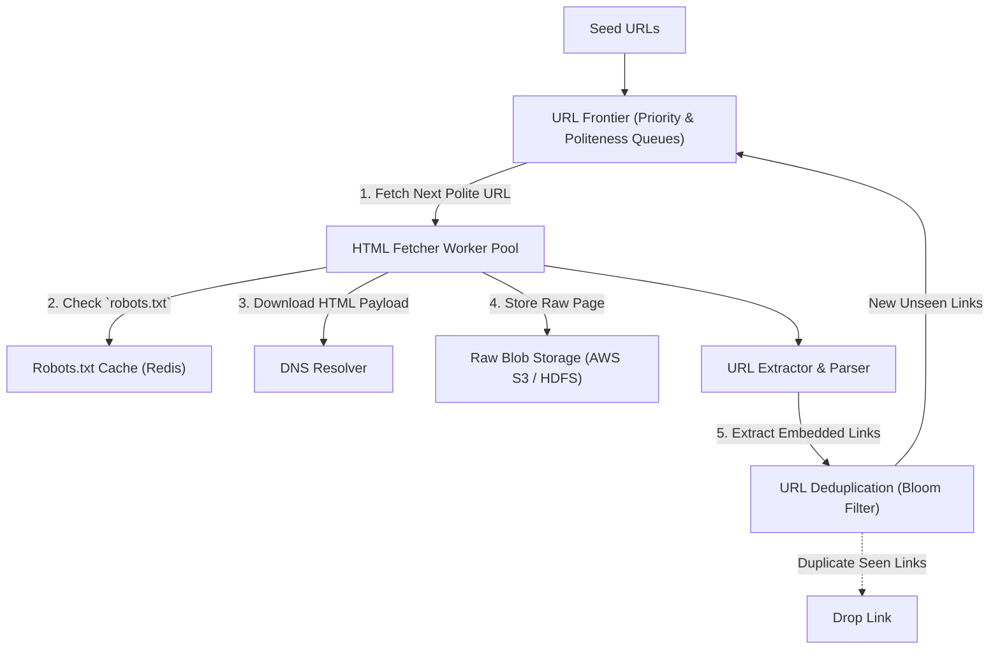
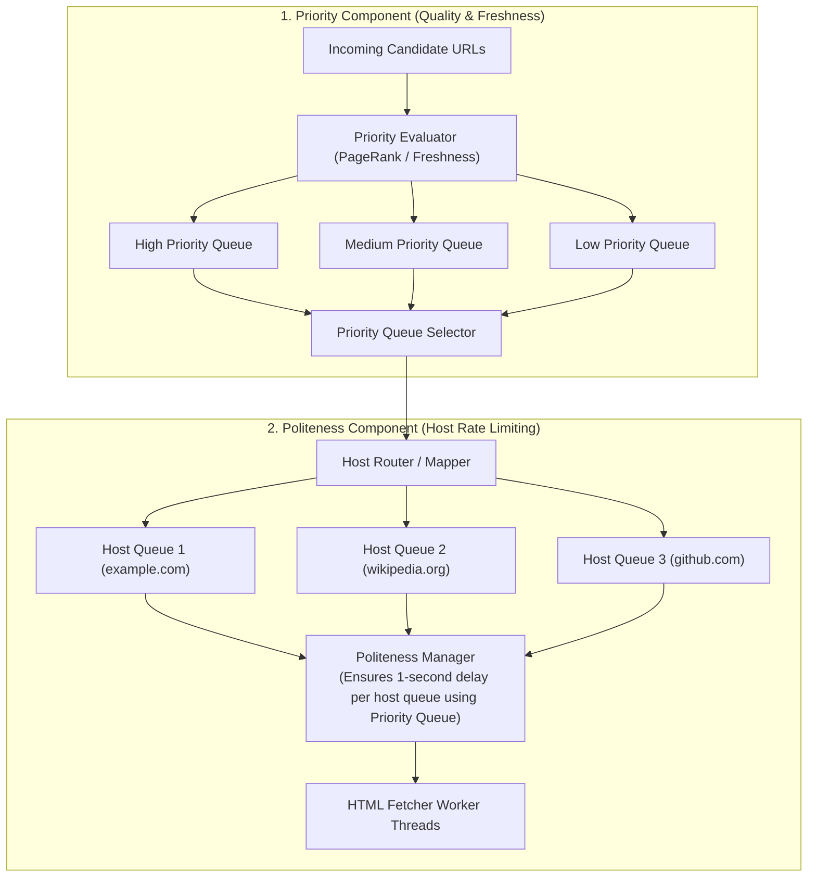
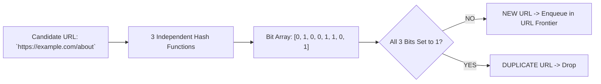

# HLD — Distributed Web Crawler

## Mental Model

Think of a **Distributed Web Crawler** as a massive fleet of automated digital librarians systematically mapping the entire World Wide Web. 

The crawler begins with a set of seed web page links. It fetches a web page (**HTML Downloader**), extracts all hyperlinks embedded on the page (**URL Extractor**), checks whether those links have already been visited (**URL Deduplication Filter / Bloom Filter**), and enqueues unvisited links into a prioritized queue (**URL Frontier**). 

The crawler operates under a strict **Politeness Policy**: it respects `robots.txt` files and never floods a target web server with 1,000 requests/sec (**Host Rate Limiting**).

---

## 1. Requirement & Capacity Estimation

### A. Functional & Non-Functional Requirements
1. **Scalability & Scale:** Crawl 1 Billion web pages per month.
2. **Politeness & robots.txt:** Respect `robots.txt` and rate-limit requests per domain (e.g. max 1 request/sec per host).
3. **URL Deduplication:** Prevent crawling duplicate URLs or cyclic links.
4. **Content Deduplication:** Detect duplicate web pages (e.g. mirror sites) using document fingerprints (SimHash / MurmurHash).
5. **Robustness & Extensibility:** Handle spider traps, infinite redirects, dynamic JavaScript rendering, and malformed HTML.

### B. Capacity Estimation Math
- **Crawling Throughput:**
  - 1 Billion Pages / Month = $\frac{1,000,000,000}{30 \times 86,400} \approx \mathbf{400 \text{ Pages / Second}}$
  - Peak Throughput = $400 \times 2 = \mathbf{800 \text{ Pages / Second}}$

- **Storage & Bandwidth Math:**
  - Average Web Page Size = $500 \text{ KB}$ (HTML + metadata)
  - Monthly Storage = $10^9 \times 500 \text{ KB} = \mathbf{500 \text{ Terabytes (TB) / Month}}$
  - 5-Year Storage = $500 \text{ TB} \times 12 \times 5 = \mathbf{30 \text{ Petabytes (PB)}}$
  - Network Bandwidth = $400 \text{ pages/sec} \times 500 \text{ KB} = 200 \text{ MB/sec} = \mathbf{1.6 \text{ Gbps Network Bandwidth}}$

---

## 2. System Architecture Diagram

---

## 3. The URL Frontier Architecture (Politeness + Priority)

The **URL Frontier** is the core component that manages URL scheduling, guaranteeing **Politeness** (never overloading a single host) and **Priority** (crawling high-quality news sites before obscure blogs).

---

## 4. URL & Content Deduplication

How does the crawler prevent infinite duplicate crawling?

### A. URL Deduplication (Bloom Filter)
Before adding a candidate URL to the URL Frontier, the crawler passes the URL through an in-memory **Bloom Filter**:
- If Bloom Filter returns `FALSE` $\to$ URL is 100% new! Add to URL Frontier and set Bloom Filter bit.
- If Bloom Filter returns `TRUE` $\to$ URL is likely visited. Drop.

---

### B. Content Deduplication (SimHash / Document Fingerprinting)
Websites often serve identical content on different URLs (`http://site.com/item?id=1` vs `http://site.com/print/item?id=1`). 
1. The crawler computes a 64-bit **SimHash fingerprint** for the HTML text body.
2. If two documents have a **Hamming Distance $\le 3$**, they are classified as duplicate content and stored once.

---

## 5. Failure Modes and Trade-offs

1. **Spider Traps & Infinite Dynamic Loops** — Malicious or broken websites generating infinite URL paths (`http://site.com/foo/bar/foo/bar/foo...`). The crawler gets trapped in an infinite loop downloading gigabytes of junk. *Mitigation*: Limit maximum URL path depth (max 10 levels) and enforce maximum URL string length (max 2,048 chars).
2. **DNS Resolver Bottleneck** — Fetching 400 pages/sec requires resolving 400 domain names/sec. Standard synchronous DNS lookups block fetcher threads. *Mitigation*: Maintain a local **DNS Cache Cluster** and use asynchronous non-blocking DNS resolvers (c-ares).
3. **Dynamic JavaScript SPA Rendering** — Modern web pages (React / Vue) render content dynamically via client-side JavaScript (`

`). Traditional HTML parsers extract 0 links. *Mitigation*: Use headless browser renderers (Puppeteer / Playwright) for dynamic domains.

---

## 6. Active-Recall Prompts

1. **Explain the 2 components of the URL Frontier (Priority Selection vs. Politeness Rate Limiting).**
2. **How does a Bloom Filter achieve $O(1)$ space-efficient URL deduplication with zero false negatives?**
3. **What is a Spider Trap, and how do depth limits and URL length bounds mitigate it?**
4. **How does SimHash fingerprinting detect duplicate web page content across different URLs?**

---

## Related Notes

- [[Consistent Hashing - Hash Rings, Virtual Nodes, and Data Rebalancing]]
- [[Distributed Caching Strategies - Cache-Aside, Write-Through, Write-Around, Write-Back]]
- [[Search Engines - Elasticsearch, Inverted Index, TF-IDF, BM25, Relevance Scoring]]
- [[System Design Interview Framework - 4-Step Blueprint]]

> **Interview Style Question:** *"Design a Distributed Web Crawler to index 1 Billion web pages per month. Calculate storage math (30 PB 5-year), design a polite URL Frontier architecture with per-host queues, demonstrate Bloom Filter URL deduplication, detect spider traps, and handle dynamic JavaScript rendering."*

---
