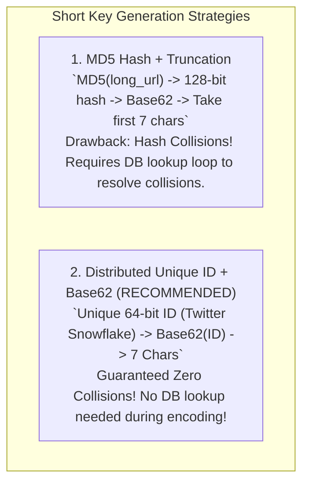

# HLD — URL Shortener (TinyURL)

## Mental Model

Think of a **URL Shortener (TinyURL)** as an automated high-speed coat check at an international airport. 

A long, unwieldy destination address (`https://www.example.com/products/electronics/2026/item-998877665544332211`) is handed to the system. The system issues a compact 7-character token coat check ticket (`http://tiny.url/j7K9xQ2`). 

When a traveler presents the 7-character ticket, the system looks up the original long address in an ultra-fast in-memory cache / key-value store and issues an immediate HTTP 301 / 302 redirect (**Redirection Engine**).

---

## 1. Requirement & Capacity Estimation

### A. Functional Requirements
1. **URL Shortening:** Generate a unique 7-character short URL from a long URL.
2. **Redirection:** Redirect short URL requests (`http://tiny.url/j7K9xQ2`) to original long URLs.
3. **Custom Short Links (Optional):** Allow users to specify custom aliases (e.g. `tiny.url/my-sale`).
4. **Analytics & TTL:** Track click count analytics and support custom expiration timestamps.

### B. Capacity Estimation Math
- **Traffic Assumptions:**
  - New Shortened URLs / Month = 100 Million
  - Read / Write Ratio = 100 : 1 (Read heavy!)
  - New URLs / Second (Write QPS) = $\frac{100,000,000}{30 \times 86,400} \approx \mathbf{40 \text{ Writes/sec}}$
  - Read QPS = $40 \times 100 = \mathbf{4,000 \text{ Reads/sec}}$ (Peak Read QPS = $8,000 \text{ QPS}$)

- **Storage Math (5-Year Horizon):**
  - Payload Size / Record = 500 Bytes (`short_url` 7B + `long_url` 450B + `created_at` 8B + `user_id` 16B)
  - 5-Year Records = $100\text{M} \times 12 \times 5 = \mathbf{6 \text{ Billion Records}}$
  - 5-Year Storage = $6 \times 10^9 \times 500 \text{ Bytes} = \mathbf{3 \text{ Terabytes (TB)}}$

---

## 2. Short Code Generation: Base62 Encoding vs. MD5 Hashing

How do we convert a long URL or integer ID into a unique 7-character string?

Using **Base62 Encoding** (`[0-9]`, `[a-z]`, `[A-Z]`):
$$\text{Total 7-Character Combinations} = 62^7 = \mathbf{3.52 \times 10^{12} \text{ (3.52 Trillion Unique URLs!)}}$$

$3.52 \text{ Trillion}$ combinations easily accommodates our 5-year requirement of $6 \text{ Billion}$ records!



---

## 3. System Architecture Diagram

```mermaid
flowchart TD
    Client["Client Device (Browser / Mobile)"] -->|1. Short URL Request `http://tiny.url/j7K9xQ2`| DNS["GeoDNS / Route 53"]
    DNS --> LB["Layer 7 Load Balancer (Nginx / ALB)"]
    
    LB --> API["Shortener API Microservice Cluster"]
    
    subgraph CachingLayer["High-Speed Caching Tier (Redis)"]
        API -->|2. Check Cache| Redis["Redis Cluster (LRU Eviction)\nCaches Top 20% Hot Short URLs"]
    end
    
    subgraph StorageLayer["Data & ID Storage Tier"]
        API -.->|3. Cache Miss| NoSQL["NoSQL Key-Value Store / PostgreSQL\nPrimary Key: `short_key`"]
        API -->|4. Get Next Unique ID| IDGen["Distributed ID Generator\n(Snowflake / Range Key Counter)"]
    end

    Redis -->|2a. Cache Hit (HTTP 301/302 Redirect)| Client
    NoSQL -->|3a. Return Long URL & Warm Cache| Client
```

---

## 4. HTTP 301 vs. HTTP 302 Redirection Decision

| Redirect Code | HTTP Status | Browser Behavior | Server Impact | System Design Recommendation |
|---|---|---|---|---|
| **HTTP 301** | Moved Permanently | Browser **caches redirect locally** forever. Subsequent clicks bypass server completely! | Reduces server load to near ZERO. | Use when **Analytics are NOT required**. |
| **HTTP 302** | Found (Temporary) | Browser **always hits server** on every click. | Allows tracking click count & IP analytics. | **Use when Click Analytics ARE required**. |

---

## 5. Failure Modes and Trade-offs

1. **Hash Collision Storm in MD5 Truncation** — Taking the first 7 characters of MD5 hash. Multiple long URLs collide onto the exact same 7-character string. System must execute fallback queries `WHERE short_url = ... AND long_url != ...`, degrading write latency. *Mitigation*: Use **Distributed Unique ID (Snowflake) + Base62 conversion** (Guaranteed collision-free!).
2. **Database Read Exhaustion on Hot Links** — A celebrity tweets a shortened link (`tiny.url/superbowl`). 50,000 Reads/sec hit the un-cached database. *Mitigation*: Cache hot URLs in **Redis** with Pareto 80/20 rule (caching 20% of links handles 80% of traffic).
3. **Database Write Bottleneck on ID Generation** — Multiple API instances requesting unique auto-increment IDs from a single MySQL DB, creating lock contention. *Mitigation*: Pre-allocate ranges of IDs to each API instance (e.g. Node 1 gets IDs `1..1,000,000`, Node 2 gets `1,000,001..2,000,000`).

---

## 6. Active-Recall Prompts

1. **Why does $62^7$ Base62 encoding yield 3.52 Trillion unique short URL combinations?**
2. **Compare HTTP 301 (Permanent) vs. HTTP 302 (Temporary) redirects regarding browser caching and click analytics.**
3. **Why is Base62 conversion of a Distributed Unique ID superior to MD5 hashing with truncation?**
4. **How do pre-allocated ID ranges eliminate central database lock contention during URL creation?**

---

## Related Notes

- [[HLD - Distributed Unique ID Generator (Twitter Snowflake)]]
- [[Distributed Caching Strategies - Cache-Aside, Write-Through, Write-Around, Write-Back]]
- [[HLD - URL Shortener (TinyURL)]]
- [[System Design Interview Framework - 4-Step Blueprint]]

> **Interview Style Question:** *"Design a scalable URL Shortener (TinyURL) supporting 100M new URLs/month and 8,000 Read QPS. Estimate 5-year storage math, compare HTTP 301 vs 302 redirection, demonstrate Base62 encoding over Twitter Snowflake IDs, write a Redis LRU caching layer, and prevent DB hot-key crashes during viral link events."*

---
