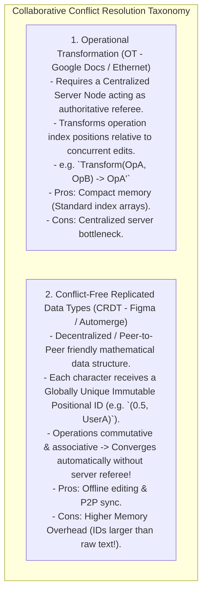
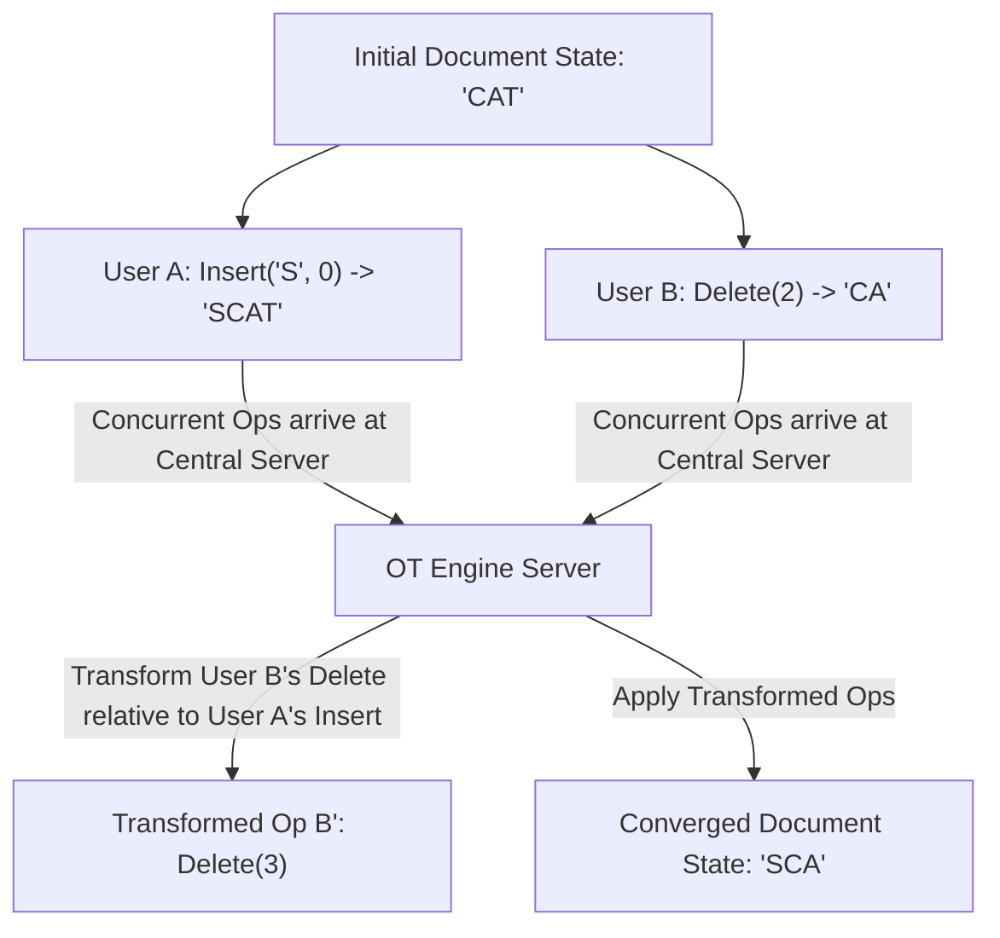
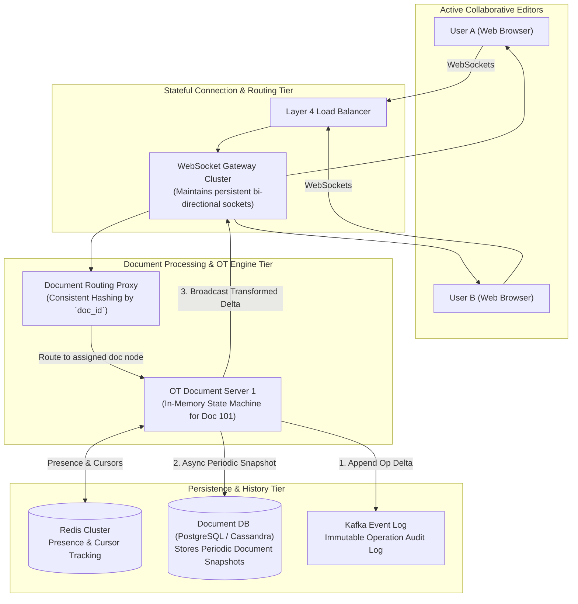

# HLD — Collaborative Document Editor (Google Docs / Figma)

## Mental Model

Think of a **Real-Time Collaborative Document Editor (Google Docs / Figma)** as a group of musicians improvising on a shared piano keyboard. 

When User A types `"cat"` and User B types `"dog"` at the exact same millisecond at character position 5 (**Concurrent Concurrent Mutations**), the system cannot simply overwrite text based on arrival order (**Data Corruption**). 

The system resolves concurrent edits using either **Operational Transformation (OT)** (a central server referee transforms character index positions so both users end up with identical text `"catdog"`) or **Conflict-Free Replicated Data Types (CRDTs)** (each character receives a unique immutable fractional index ID, allowing peer-to-peer convergence without a central referee).

---

## 1. Requirement & Capacity Estimation

### A. Functional & Non-Functional Requirements
1. **Real-Time Multi-User Editing:** Multiple users can simultaneously edit the same document/canvas with $< 50\text{ms}$ propagation latency.
2. **Concurrent Conflict Resolution:** Automatically resolve concurrent conflicting edits using OT or CRDT algorithms.
3. **Presence & Caret Tracking:** Display real-time user cursor positions and selection highlights.
4. **Version History & Revision Snapshots:** Maintain complete audit trail of document revisions with undo/redo support.
5. **High Scale:** Support 50 Million Daily Active Users (DAU) with 1,000 concurrent editors per document.

### B. Capacity Estimation Math
- **Operation Traffic Math:**
  - Active Concurrent Editors = 5 Million Users
  - Typing Speed = 3 Keystrokes / Second
  - Operation QPS = $5 \times 10^6 \times 3 = \mathbf{15,000,000 \text{ Operations / Second (15M QPS)!}}$
  - Note: Requires WebSocket connections and compact binary delta payloads (`20 Bytes/op`).
- **Memory & Bandwidth Math:**
  - Incoming Bandwidth = $15\text{M ops/sec} \times 20 \text{ Bytes} = \mathbf{300 \text{ MB/sec} = 2.4 \text{ Gbps}}$

---

## 2. Operational Transformation (OT) vs. CRDT (Conflict-Free Replicated Data Types)

---

## 3. Operational Transformation (OT) Execution Example

Suppose document text starts as `"CAT"`. User A inserts `"S"` at index 0 (`Insert('S', 0)`). Simultaneously, User B deletes `"T"` at index 2 (`Delete(2)`).

---

## 4. High-Level System Architecture Diagram

---

## 5. Failure Modes and Trade-offs

1. **Memory Explosion in CRDT Character Identifiers** — Storing a 100-byte metadata struct (vector clock, GUID, site ID) for every single 1-byte text character typed. A 1 MB text document consumes 100 MB of RAM! *Mitigation*: Group consecutive keystrokes into contiguous string blocks (RGA / LSEQ tree structures).
2. **OT Server Failure during Active Editing Session** — The single OT server node hosting Document `#101` in memory crashes mid-session. *Mitigation*: Reconstruct state instantly by fetching the latest **Document Snapshot** from DB and replaying un-committed operation deltas from **Kafka Log**.
3. **High Latency Offline Re-Connection Storm** — A user goes offline on a flight, edits 500 characters locally, and re-connects. Blending 500 offline edits into a live active document with 50 current editors. *Mitigation*: Use **CRDT Vector Clocks** for offline merge resolution.

---

## 6. Active-Recall Prompts

1. **Compare Operational Transformation (OT) vs. Conflict-Free Replicated Data Types (CRDTs) across server requirements, memory footprint, and P2P offline editing.**
2. **Demonstrate how Operational Transformation transforms character index positions when two users edit concurrently.**
3. **Why are active collaborative document sessions pinned to a single OT server node using Consistent Hashing (`doc_id`)?**
4. **How do periodic Document Snapshots combined with Kafka Operation Logs provide fast crash recovery for active editing sessions?**

---

## Related Notes

- [[HLD - Real-Time Chat Application (WhatsApp or Slack)]]
- [[Command Pattern - Encapsulating Requests, Undo-Redo, and Macro Commands]]
- [[Composite Pattern - Tree Structures, Uniformity vs Type Safety]]
- [[Message Queues vs Event Streams - RabbitMQ vs Apache Kafka]]

> **Interview Style Question:** *"Design a Real-Time Collaborative Document Editor (Google Docs / Figma) supporting 50M DAU and 1,000 concurrent editors per document. Calculate operation QPS (15M QPS), compare Operational Transformation (OT) vs CRDTs, design the stateful WebSocket OT server architecture pinned by Consistent Hashing, solve offline re-connection merges, and build periodic Snapshot recovery."*

---
